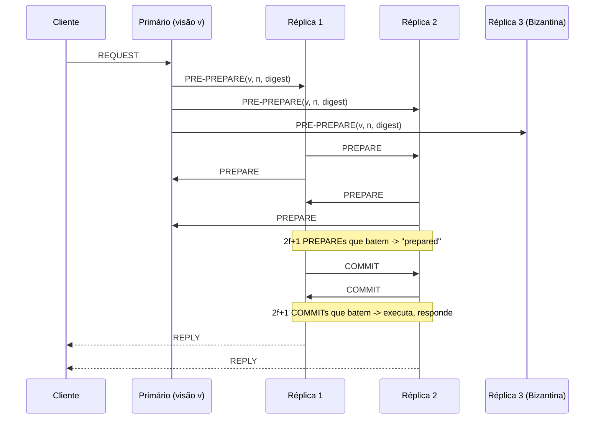

## Objetivos de Aprendizagem

- Enunciar o limite de tolerância a falhas do PBFT (n = 3f + 1 réplicas toleram f réplicas bizantinas) e conectá-lo explicitamente ao próprio limite n ≥ 3m + 1 do Problema dos Generais Bizantinos.
- Percorrer as três fases de mensagem do caso normal, pre-prepare, prepare e commit, e explicar com precisão contra o que o tamanho de quórum (2f + 1) de cada fase protege que a fase anterior sozinha não poderia.
- Explicar o papel do subprotocolo de troca de visão: o que o dispara, e por que ele é o que torna o PBFT um protocolo que preserva a vivacidade em vez de um que simplesmente para quando um primário se comporta mal.
- Explicar por que a estrutura do protocolo do PBFT, um primário designado propondo uma ordem que um quórum tem de ratificar, espelha a replicação guiada por líder do Raft estruturalmente, enquanto o tamanho e o significado dos seus quóruns não.

## Contexto e Motivação

`the-byzantine-generals-problem` provou um limite, n ≥ 3m + 1 generais toleram m traidores, e deu um algoritmo, mas OM(m) é uma construção teórica: a sua complexidade de mensagens cresce exponencialmente com o número de traidores tolerados, inútil para um serviço replicado real que trata requisições de clientes a qualquer taxa significativa. O artigo de Castro e Liskov de 1999 fecha essa lacuna de dezessete anos entre teoria e prática, mantendo o exato mesmo limite de tolerância a falhas (o seu n = 3f + 1 é o limite dos Generais Bizantinos vestindo nomes de variável diferentes) enquanto substitui a recursão exponencial de OM(m) por um protocolo fixo de três fases cujo custo escala com o número de réplicas, não com a profundidade de um repasse recursivo. Este conceito é deliberadamente delimitado exatamente como `crash-faults-vs-byzantine-faults` prometeu: o protocolo de replicação tolerante a falhas bizantinas real e prático, no nível das suas fases e quóruns de fato, complementando em vez de rederivar o tratamento mais amplo de `byzantine-faults-and-system-models` (`system-design-concepts`) sobre testes e filosofia de modelo de sistema em torno do mesmo artigo.

## Teoria Central

### A configuração: n = 3f + 1, e por que esse número específico

Um cluster PBFT de n réplicas tolera até f réplicas bizantinas (comportamento arbitrário, incluindo conluio) sempre que n ≥ 3f + 1. Esse não é um limite novo inventado para o PBFT; é o limite dos Generais Bizantinos aplicado à replicação de máquina de estado (o Acordo e a Ordem de `the-replicated-state-machine-approach`, agora sob falhas adversariais em vez de por crash): com f possíveis traidores, um quórum de quaisquer 2f + 1 réplicas tem garantia de se sobrepor a qualquer outro quórum de 2f + 1 réplicas em pelo menos f + 1 réplicas, o que por si só garante que a sobreposição inclui pelo menos uma réplica honesta (já que no máximo f de quaisquer 2f + 1 réplicas podem ser bizantinas). Esse único argumento de a-sobreposição-garante-uma-testemunha-honesta é aquilo sobre o que toda fase abaixo se apoia.

### Fase 1: pre-prepare

Uma réplica é o **primário** da visão atual (uma época numerada monotonicamente, diretamente análoga ao termo do Raft). Quando uma requisição de cliente chega, o primário lhe atribui o próximo número de sequência e transmite uma mensagem **pre-prepare** (número de visão, número de sequência, digest da requisição, assinatura do primário) a toda réplica de backup. Esta fase sozinha propõe uma ordem; ela ainda não estabelece acordo, um primário bizantino poderia enviar atribuições de número de sequência diferentes a backups diferentes, exatamente o tipo de mentira que o comandante do Problema dos Generais Bizantinos poderia contar.

### Fase 2: prepare

Todo backup que aceita o pre-prepare (a visão e o número de sequência fazem sentido, e ele ainda não aceitou uma requisição diferente para esse mesmo número de sequência) transmite uma mensagem **prepare** a toda outra réplica. Uma réplica passa para o estado "prepared" para aquela requisição só uma vez que coletou 2f + 1 mensagens prepare que batem (incluindo a sua própria). Como qualquer quórum de 2f + 1 se sobrepõe a qualquer outro quórum de 2f + 1 em pelo menos uma réplica honesta, nenhumas duas réplicas honestas podem ficar prepared com uma requisição diferente atribuída ao mesmo número de sequência na mesma visão, essa é exatamente a propriedade que pega um primário bizantino mentindo de forma diferente a backups diferentes na fase 1.

### Fase 3: commit

Estar "prepared" só garante o acordo dentro da visão atual; ainda não garante que uma futura troca de visão preservará esse acordo. Cada réplica que fica prepared transmite uma mensagem **commit**; uma vez que uma réplica coleta 2f + 1 commits que batem, ela está "committed-local" e executa a requisição, respondendo ao cliente. A sobreposição de quórum da fase de commit é o que carrega uma decisão com segurança por uma troca de visão subsequente, um primário futuro não pode propor uma ordem conflitante para um número de sequência já com commit, porque fazê-lo exigiria ignorar a réplica honesta que qualquer sobreposição de 2f + 1 tem garantia de incluir.



### Trocas de visão: o que mantém o protocolo vivo, não só seguro

As três fases acima provam a segurança (nenhumas duas réplicas honestas jamais discordam), mas nada dizem sobre a vivacidade se o próprio primário é a réplica bizantina e simplesmente se recusa a propor qualquer coisa. Todo backup roda um temporizador em cada requisição pendente; se ele expira sem progresso, o backup transmite uma mensagem **view-change** e para de aceitar outras mensagens na visão antiga. Uma vez que uma réplica coleta 2f + 1 mensagens de view-change (ou reconhecimentos de view-change), a próxima réplica numa rotação fixa e determinística se torna o novo primário e retoma a operação do caso normal, carregando adiante qualquer requisição que um quórum já tinha preparado ou com commit na visão antiga, para que a segurança estabelecida nas fases 1 a 3 nunca se perca na transição.

## Exemplos Resolvidos

### Exemplo 1: o caso normal, rastreado com números concretos, f=1, n=4

```text
n=4, f=1 (n = 3f+1 = 4, exatamente o mínimo).
Réplicas: P (primário, visão 0), R1, R2, R3.

1. O cliente envia REQUEST "SET x=1" para P.
2. P atribui o número de sequência 42, transmite
   PRE-PREPARE(visão=0, seq=42, digest=d) para R1, R2, R3.
3. R1, R2, R3 cada um transmite PREPARE(visão=0, seq=42, digest=d).
4. R1 coleta PREPARE de R2, R3, mais o seu próprio = 3 prepares
   que batem. Quórum necessário: 2f+1 = 3. R1 agora está "prepared".
   (R2 e R3 alcançam a mesma conclusão simetricamente.)
5. R1, R2, R3 cada um transmite COMMIT(visão=0, seq=42, digest=d).
6. R1 coleta COMMIT de R2, R3, mais o seu próprio = 3 commits
   que batem (2f+1=3 necessários). R1 executa "SET x=1", responde ao
   cliente. O mesmo para R2, R3: todas as três réplicas honestas executam
   a requisição idêntica na ordem idêntica.
```

### Exemplo 2: um primário bizantino mentindo no pre-prepare, pego na fase de prepare

```text
n=4, f=1. P é a réplica bizantina.

1. O cliente envia REQUEST "SET x=1".
2. P (mentindo) envia PRE-PREPARE(seq=42, digest=d1="SET x=1")
   para R1, mas PRE-PREPARE(seq=42, digest=d2="SET x=2") para R2.
3. R1 transmite PREPARE(seq=42, d1). R2 transmite
   PREPARE(seq=42, d2). R3, recebendo ambos os pre-prepares de P
   (impossível sob um primário honesto único, mas P é
   bizantino e pode equivocar para R3 também) detecta o
   conflito diretamente.
4. R1 precisa de 2f+1=3 PREPAREs que batem para d1. Ele tem o seu próprio,
   mas o PREPARE de R2 é para d2, não d1: nenhuma réplica honesta consegue
   montar 3 prepares que batem para QUALQUER dos digests, já que R1 e
   R2 discordam e R3 não vai atestar um digest que um primário
   bizantino inventou sem uma maioria honesta por trás dele.
5. Nem R1 nem R2 jamais alcança "prepared" para este número de
   sequência. Os temporizadores expiram -> VIEW-CHANGE disparado (ver abaixo).
   Nenhumas duas réplicas honestas executam requisições conflitantes: a segurança
   se mantém mesmo que o primário tenha mentido ativamente.
```

### Exemplo 3: um primário travado disparando uma troca de visão

```text
n=4, f=1. P é bizantino e simplesmente para de responder a uma nova
requisição de cliente (um ataque de vivacidade, não de segurança).

1. R1, R2, R3 cada um começa um temporizador ao receber a requisição
   do cliente encaminhada a eles diretamente (os clientes PBFT transmitem
   a todas as réplicas precisamente para se precaver contra isso).
2. Os temporizadores expiram sem PRE-PREPARE de P. R1, R2, R3 cada um
   transmite VIEW-CHANGE(visão=1, ...).
3. Uma vez que qualquer réplica coleta 2f+1=3 mensagens de view-change, a
   rotação determinística seleciona a próxima réplica (R1, digamos) como
   o novo primário da visão 1.
4. R1 transmite NEW-VIEW(visão=1), e a operação normal
   (pre-prepare / prepare / commit) retoma sob R1 como primário:
   o P travado é simplesmente contornado, sem nenhuma requisição de cliente
   jamais perdida, porque qualquer requisição que um quórum já tinha preparado
   na visão 0 é carregada adiante para a visão 1 por construção.
```

## Equívocos Comuns e Armadilhas

- **"As três fases do PBFT são só a replicação guiada por líder do Raft com um passo extra."** Estruturalmente, um proponente designado e um quórum de seguidores, o formato rima com `raft-leader-election` e `raft-log-replication-and-commitment`, mas a substância é diferente: o quórum do Raft (qualquer maioria, n/2+1) só precisa superar em número as réplicas com crash, enquanto o quórum do PBFT (2f+1 de 3f+1) é dimensionado especificamente para que quaisquer dois quóruns tenham garantia de compartilhar uma réplica honesta mesmo quando até f réplicas mentem ativamente, uma garantia que o argumento de simples voto por maioria do Raft não fornece contra réplicas adversariais.
- **"Estar 'prepared' já significa que a requisição está com commit de forma segura."** O Exemplo 2 mostra que prepared é só uma garantia dentro da visão; o quórum separado de 2f+1 da fase de commit é o que especificamente sobrevive a uma troca de visão. Um protocolo que pulasse a fase de commit e executasse diretamente em "prepared" poderia ter uma requisição perdida ou reordenada por uma troca de visão de formas que a sobreposição de quórum da fase de commit deste conceito é especificamente construída para prevenir.
- **"Uma troca de visão significa que o protocolo falhou."** O Exemplo 3 mostra o oposto: o subprotocolo de troca de visão é o que torna o PBFT um sistema genuinamente tolerante a falhas e vivo, em vez de um que simplesmente para no momento em que um primário se comporta mal, exatamente análogo a como uma eleição Raft, não um sintoma de falha, é o mecanismo que mantém um cluster Raft disponível após uma falha de líder.

## Resumo

O PBFT transforma o limite teórico n ≥ 3m + 1 do Problema dos Generais Bizantinos num protocolo de replicação prático, n = 3f + 1 réplicas rodam três fases de mensagem por requisição de cliente: pre-prepare (o primário propõe uma ordem), prepare (um quórum de 2f+1 concorda sobre aquela ordem dentro da visão, pegando um primário mentiroso) e commit (um segundo quórum de 2f+1 faz esse acordo sobreviver a qualquer futura troca de visão). Um subprotocolo de troca de visão, disparado por um timeout, substitui um primário travado ou ativamente malicioso sem perder qualquer requisição que um quórum já tinha preparado, entregando tanto a segurança que o Problema dos Generais Bizantinos exige quanto a vivacidade de que um serviço real e continuamente operante precisa. O próximo conceito se volta a uma forma genuinamente diferente de alcançar o acordo tolerante a falhas bizantinas, uma que desiste inteiramente dos membros fixos e conhecidos do PBFT.

## Documentation Links

- [Castro and Liskov: Practical Byzantine Fault Tolerance (OSDI, 1999)](https://www.usenix.org/legacy/publications/library/proceedings/osdi99/full_papers/castro/castro_html/castro.html): o artigo-fonte do limite n=3f+1, do protocolo de três fases pre-prepare/prepare/commit e do subprotocolo de troca de visão que este conceito desenvolve em detalhe.
- [Lamport, Shostak, and Pease: The Byzantine Generals Problem (ACM TOPLAS, 1982)](https://lamport.azurewebsites.net/pubs/byz.pdf): o limite teórico original (n ≥ 3m+1) que o limiar de tolerância a falhas do PBFT herda diretamente, citado aqui para tornar essa herança explícita em vez de tratar o limite do PBFT como um número novo e não relacionado.
