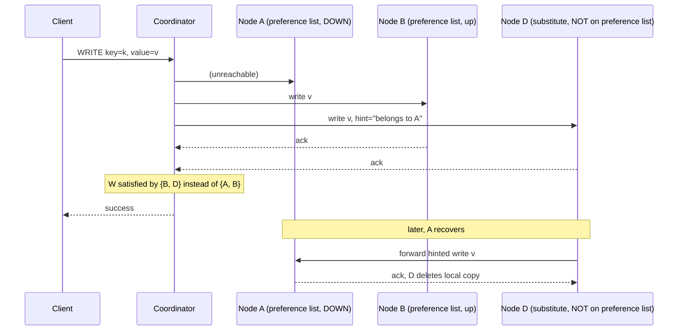

## Learning Objectives

- State precisely what a sloppy quorum changes about `dynamo-style-leaderless-replication-and-quorum-intersection`'s W acknowledgments: they may come from nodes that are not on the key's actual preference list.
- Explain hinted handoff's mechanism: a substitute node stores a write with a hint identifying its true owner, and relays it once that owner recovers.
- Explain precisely why a sloppy quorum breaks the R + W > N intersection guarantee the previous concept proved, and for how long, until the hint is delivered.
- Connect this mechanism explicitly to `the-cap-theorem-a-precise-statement`'s Consistency-versus-Availability choice: name exactly which side of that choice a sloppy quorum takes, and what it costs to take it.

## Context & Motivation

`dynamo-style-leaderless-replication-and-quorum-intersection` proved R + W > N guarantees a read quorum and write quorum overlap, but that proof has a quiet assumption baked into its very statement: the write quorum's W acknowledgments come from the key's actual preference-list nodes, the specific N nodes the consistent-hashing ring assigns to that key. What happens when some of those specific nodes are unreachable, a network partition, a temporary outage? A strictly quorum-based system, per `the-cap-theorem-a-precise-statement`'s proof, has exactly two choices during that partition: refuse the write (Consistency) or accept it anyway from the wrong nodes (Availability). Dynamo makes that second choice deliberately and explicitly, and this concept names the real mechanism, sloppy quorums and hinted handoff, that makes it work.

## Core Theory

### The sloppy quorum: substituting healthy nodes for unreachable ones

When a coordinator cannot reach enough of a key's true preference-list nodes to satisfy W, instead of refusing the write, it walks further along the consistent-hashing ring to the next healthy nodes past the preference list and asks them to hold the write instead. The write still counts toward W, from the client's perspective, the write succeeds exactly as before, `dynamo-style-leaderless-replication-and-quorum-intersection`'s W acknowledgments are satisfied, only now by nodes that were never meant to be permanent homes for this key.

### Hinted handoff: how the substitute nodes give the data back

Each substitute node stores the write together with a **hint**, metadata recording which node the write actually belongs to. Once that original node recovers and rejoins, the substitute node detects this (via the same cluster membership mechanism that detected the outage) and forwards the hinted write to it, then deletes its own local copy, restoring the data to its intended preference-list home with no further coordination needed from the client or the coordinator.



### Why this breaks R + W > N's guarantee, honestly, and for how long

The previous concept's pigeonhole proof depends on both the write quorum and the read quorum being drawn from the same N-node preference list. A sloppy quorum write, satisfied by {B, D} instead of {A, B}, is not drawn from that same set at all, D is not one of the N preference-list nodes a subsequent read will query. A read querying the true preference list {A, B, C} during this window sees only B's copy (A is still down, C never received the write), and if that read's R nodes happen to exclude B, it can miss the write entirely, R + W > N no longer guarantees an overlap, because the write's actual physical location temporarily lies outside the N-node set the guarantee was proven over. This is a real, honest cost, not a flaw hidden from the reader: the guarantee is restored only once hinted handoff completes and the write physically returns to a true preference-list node.

### The CAP trade-off, made concrete rather than abstract

This is exactly `the-cap-theorem-a-precise-statement`'s Consistency-versus-Availability choice, with a name and a mechanism attached: a sloppy-quorum write always succeeds during a partition (Availability, chosen explicitly), at the honest cost that the quorum-intersection guarantee, and therefore freshness, is not guaranteed again until hinted handoff completes. `pacelc-the-latency-consistency-trade-off-beyond-cap`'s PA classification for Dynamo-style stores is precisely this mechanism in action during the P (partitioned) branch.

## Worked Examples

### Example 1: a write during a partition, traced node by node

```text
Key "session-77", preference list [A, B, C] (N=3), W=2 required.
A network partition isolates A from the rest of the cluster.

1. Coordinator attempts write to A, B, C.
2. A is unreachable (timeout).
3. Coordinator needs W=2, has only B so far -> walks the ring
   past C to the next healthy node, D (not on the preference
   list), and writes to D with hint="belongs to A".
4. B acks, D acks -> W=2 satisfied by {B, D}.
5. Client receives SUCCESS. The write was never refused, despite
   A being completely unreachable: Availability, chosen.
```

### Example 2: a read during the same window, missing the write

```text
Continuing Example 1, immediately after the write, still
  partitioned. A read for "session-77" queries R=2 nodes from
  the TRUE preference list [A, B, C]: say it queries A and C
  (a legal choice: any R of the N preference-list nodes).

A: unreachable (still partitioned) -> no response, or a stale
   cached value if the coordinator tolerates fewer than R
   responses in a degraded mode.
C: never received the write at all (it wasn't part of the
   sloppy quorum {B, D}) -> returns its OLD value.

The read never touches B (which DOES have the new write) or D
  (which is not even a candidate for a normal preference-list
  read). R+W>N's guarantee does not hold here, exactly as this
  concept's Core Theory section names honestly: this is a
  real, structural staleness window, not a bug.
```

### Example 3: hinted handoff completing, guarantee restored

```text
Continuing Example 2. The partition heals; A rejoins the
  cluster.

1. D detects (via gossip-based membership) that A is back.
2. D forwards its hinted write (session-77's new value) to A.
3. A stores it, acks. D deletes its local copy of the hint.

Now a read querying [A, B, C] with R=2 (say A and C) sees A's
  now-current value directly: the write has returned to the
  TRUE preference list, and R+W>N's guarantee, proven over
  that set, is valid again. Any residual staleness at C is
  now exactly what anti-entropy (next concept) exists to fix
  via background read-repair, not hinted handoff's job.
```

## Common Misconceptions & Pitfalls

- **"Hinted handoff is a form of replication, giving the key an extra, permanent copy."** Example 3 shows the substitute node's copy is explicitly temporary, deleted the moment the hint is successfully forwarded to the true owner; it is a durability and availability bridge across an outage, not a permanent addition to the replica set.
- **"A sloppy quorum write still satisfies R+W>N, just with different specific nodes."** Example 2 shows exactly why this is false: the guarantee's proof depends on the write and read quorums being drawn from the same fixed N-node set, and a sloppy-quorum write, by construction, is not.
- **"Choosing availability here means the write is unsafe or likely to be lost."** The write is durably stored (on D, with a hint) the entire time, what is temporarily lost is only the read-side guarantee of seeing it promptly from the true preference list, a staleness window, not a durability gap, and one anti-entropy (next) exists specifically to close for any write hinted handoff has not yet resolved.

## Summary

A sloppy quorum lets a Dynamo-style write succeed by substituting healthy, non-preference-list nodes for unreachable ones during a partition, satisfying W without ever refusing the client, and hinted handoff is the mechanism that returns that data to its true preference-list home once the outage ends. This is `the-cap-theorem-a-precise-statement`'s Consistency-versus-Availability choice made concrete: Availability is chosen explicitly, at the honest, bounded cost that `dynamo-style-leaderless-replication-and-quorum-intersection`'s R+W>N guarantee does not hold again until the hinted write is delivered back to the preference list. The next concept covers the second half of how Dynamo-style systems recover from exactly this kind of divergence, anti-entropy via read repair and Merkle-tree comparison, for whatever staleness persists even after hinted handoff completes.

## Documentation Links

- [DeCandia et al.: Dynamo: Amazon's Highly Available Key-value Store (SOSP, 2007)](https://www.allthingsdistributed.com/files/amazon-dynamo-sosp2007.pdf): the source paper for the sloppy quorum and hinted handoff mechanism this concept builds through, including the paper's own discussion of when a coordinator falls back to substitute nodes past the preference list.
- [MIT 6.5840 (Distributed Systems): Lecture Schedule](https://pdos.csail.mit.edu/6.824/schedule.html): the course whose lecture on Dynamo covers this exact sloppy-quorum, hinted-handoff mechanism as one of the paper's key, practical availability techniques.
