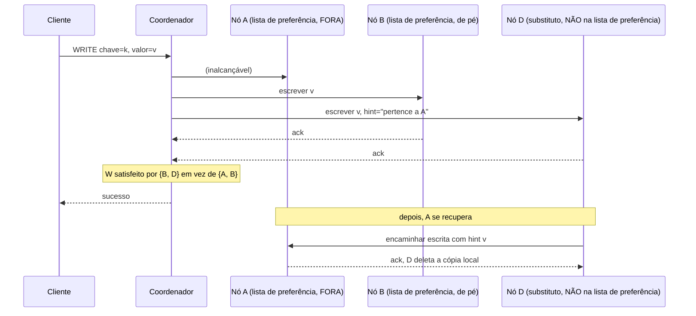

## Objetivos de Aprendizagem

- Enunciar com precisão o que um quórum relaxado muda sobre os W reconhecimentos de `dynamo-style-leaderless-replication-and-quorum-intersection`: eles podem vir de nós que não estão na lista de preferência de fato da chave.
- Explicar o mecanismo do hinted handoff: um nó substituto armazena uma escrita com um hint identificando o seu verdadeiro dono, e a retransmite uma vez que esse dono se recupera.
- Explicar com precisão por que um quórum relaxado quebra a garantia de interseção R + W > N que o conceito anterior provou, e por quanto tempo, até o hint ser entregue.
- Conectar este mecanismo explicitamente à escolha de Consistência versus Disponibilidade de `the-cap-theorem-a-precise-statement`: nomear exatamente de qual lado dessa escolha um quórum relaxado fica, e o que custa fazê-lo.

## Contexto e Motivação

`dynamo-style-leaderless-replication-and-quorum-intersection` provou que R + W > N garante que um quórum de leitura e um quórum de escrita se sobrepõem, mas essa prova tem uma suposição silenciosa embutida na sua própria afirmação: os W reconhecimentos do quórum de escrita vêm dos nós de fato da lista de preferência da chave, os N nós específicos que o anel de hashing consistente atribui àquela chave. O que acontece quando alguns desses nós específicos estão inalcançáveis, uma partição de rede, uma interrupção temporária? Um sistema estritamente baseado em quórum, pela prova de `the-cap-theorem-a-precise-statement`, tem exatamente duas escolhas durante essa partição: recusar a escrita (Consistência) ou aceitá-la mesmo assim dos nós errados (Disponibilidade). O Dynamo faz essa segunda escolha deliberada e explicitamente, e este conceito nomeia o mecanismo real, quóruns relaxados e hinted handoff, que a faz funcionar.

## Teoria Central

### O quórum relaxado: substituir nós inalcançáveis por saudáveis

Quando um coordenador não consegue alcançar nós suficientes da verdadeira lista de preferência de uma chave para satisfazer W, em vez de recusar a escrita, ele caminha mais ao longo do anel de hashing consistente até os próximos nós saudáveis depois da lista de preferência e lhes pede para segurar a escrita em vez disso. A escrita ainda conta para W, da perspectiva do cliente, a escrita tem sucesso exatamente como antes, os W reconhecimentos de `dynamo-style-leaderless-replication-and-quorum-intersection` são satisfeitos, só que agora por nós que nunca foram destinados a ser lares permanentes desta chave.

### Hinted handoff: como os nós substitutos devolvem os dados

Cada nó substituto armazena a escrita junto de um **hint**, metadados registrando a qual nó a escrita de fato pertence. Uma vez que esse nó original se recupera e se rejunta, o nó substituto detecta isso (pelo mesmo mecanismo de membros do cluster que detectou a interrupção) e encaminha a escrita com hint a ele, depois deleta a sua própria cópia local, restaurando os dados ao seu lar pretendido na lista de preferência sem nenhuma coordenação adicional necessária do cliente ou do coordenador.



### Por que isto quebra a garantia de R + W > N, honestamente, e por quanto tempo

A prova da casa dos pombos do conceito anterior depende de tanto o quórum de escrita quanto o quórum de leitura serem extraídos da mesma lista de preferência de N nós. Uma escrita de quórum relaxado, satisfeita por {B, D} em vez de {A, B}, não é extraída desse mesmo conjunto de forma alguma, D não é um dos N nós da lista de preferência que uma leitura subsequente vai consultar. Uma leitura consultando a verdadeira lista de preferência {A, B, C} durante essa janela vê só a cópia de B (A ainda está fora, C nunca recebeu a escrita), e se os R nós dessa leitura por acaso excluem B, ela pode perder a escrita inteiramente, R + W > N não mais garante uma sobreposição, porque a localização física de fato da escrita temporariamente fica fora do conjunto de N nós sobre o qual a garantia foi provada. Esse é um custo real e honesto, não uma falha escondida do leitor: a garantia é restaurada só uma vez que o hinted handoff se completa e a escrita fisicamente retorna a um verdadeiro nó da lista de preferência.

### O trade-off do CAP, tornado concreto em vez de abstrato

Essa é exatamente a escolha de Consistência versus Disponibilidade de `the-cap-theorem-a-precise-statement`, com um nome e um mecanismo anexados: uma escrita de quórum relaxado sempre tem sucesso durante uma partição (Disponibilidade, escolhida explicitamente), ao custo honesto de que a garantia de interseção de quóruns, e, portanto, o frescor, não é garantida de novo até o hinted handoff se completar. A classificação PA de `pacelc-the-latency-consistency-trade-off-beyond-cap` para as stores no estilo Dynamo é precisamente este mecanismo em ação durante o ramo P (particionado).

## Exemplos Resolvidos

### Exemplo 1: uma escrita durante uma partição, rastreada nó por nó

```text
Chave "session-77", lista de preferência [A, B, C] (N=3), W=2 necessário.
Uma partição de rede isola A do resto do cluster.

1. O coordenador tenta a escrita em A, B, C.
2. A está inalcançável (timeout).
3. O coordenador precisa de W=2, tem só B até agora -> caminha o anel
   passando por C até o próximo nó saudável, D (não na lista de
   preferência), e escreve em D com hint="pertence a A".
4. B reconhece, D reconhece -> W=2 satisfeito por {B, D}.
5. O cliente recebe SUCESSO. A escrita nunca foi recusada, apesar de
   A estar completamente inalcançável: Disponibilidade, escolhida.
```

### Exemplo 2: uma leitura durante a mesma janela, perdendo a escrita

```text
Continuando o Exemplo 1, imediatamente após a escrita, ainda
  particionado. Uma leitura para "session-77" consulta R=2 nós da
  VERDADEIRA lista de preferência [A, B, C]: digamos que consulta A e C
  (uma escolha legal: quaisquer R dos N nós da lista de preferência).

A: inalcançável (ainda particionado) -> nenhuma resposta, ou um valor
   obsoleto em cache se o coordenador tolera menos de R
   respostas num modo degradado.
C: nunca recebeu a escrita de forma alguma (não foi parte do
   quórum relaxado {B, D}) -> retorna o seu valor ANTIGO.

A leitura nunca toca B (que DE FATO tem a nova escrita) nem D
  (que não é sequer um candidato a uma leitura normal da lista de preferência).
  A garantia de R+W>N não se mantém aqui, exatamente como a seção de
  Teoria Central deste conceito nomeia honestamente: essa é uma
  janela de obsolescência real e estrutural, não um bug.
```

### Exemplo 3: hinted handoff se completando, garantia restaurada

```text
Continuando o Exemplo 2. A partição cura; A se rejunta ao
  cluster.

1. D detecta (via membros baseados em gossip) que A está de volta.
2. D encaminha a sua escrita com hint (o novo valor de session-77) a A.
3. A a armazena, reconhece. D deleta a sua cópia local do hint.

Agora uma leitura consultando [A, B, C] com R=2 (digamos A e C) vê o
  valor agora atual de A diretamente: a escrita retornou à
  VERDADEIRA lista de preferência, e a garantia de R+W>N, provada sobre
  esse conjunto, é válida de novo. Qualquer obsolescência residual em C é
  agora exatamente o que a anti-entropia (conceito seguinte) existe para consertar
  por read-repair em segundo plano, não o trabalho do hinted handoff.
```

## Equívocos Comuns e Armadilhas

- **"O hinted handoff é uma forma de replicação, dando à chave uma cópia extra e permanente."** O Exemplo 3 mostra que a cópia do nó substituto é explicitamente temporária, deletada no momento em que o hint é encaminhado com sucesso ao verdadeiro dono; é uma ponte de durabilidade e disponibilidade por uma interrupção, não uma adição permanente ao conjunto de réplicas.
- **"Uma escrita de quórum relaxado ainda satisfaz R+W>N, só com nós específicos diferentes."** O Exemplo 2 mostra exatamente por que isso é falso: a prova da garantia depende de os quóruns de escrita e leitura serem extraídos do mesmo conjunto fixo de N nós, e uma escrita de quórum relaxado, por construção, não é.
- **"Escolher disponibilidade aqui significa que a escrita é insegura ou provável de ser perdida."** A escrita é armazenada de forma durável (em D, com um hint) o tempo todo, o que é temporariamente perdido é só a garantia do lado da leitura de vê-la prontamente a partir da verdadeira lista de preferência, uma janela de obsolescência, não uma lacuna de durabilidade, e uma que a anti-entropia (a seguir) existe especificamente para fechar para qualquer escrita que o hinted handoff ainda não resolveu.

## Resumo

Um quórum relaxado deixa uma escrita no estilo Dynamo ter sucesso substituindo nós saudáveis fora da lista de preferência por inalcançáveis durante uma partição, satisfazendo W sem jamais recusar o cliente, e o hinted handoff é o mecanismo que devolve esses dados ao seu verdadeiro lar na lista de preferência uma vez que a interrupção termina. Essa é a escolha de Consistência versus Disponibilidade de `the-cap-theorem-a-precise-statement` tornada concreta: a Disponibilidade é escolhida explicitamente, ao custo honesto e limitado de que a garantia de R+W>N de `dynamo-style-leaderless-replication-and-quorum-intersection` não se mantém de novo até a escrita com hint ser entregue de volta à lista de preferência. O próximo conceito cobre a segunda metade de como os sistemas no estilo Dynamo se recuperam exatamente desse tipo de divergência, a anti-entropia por read repair e comparação por árvore de Merkle, para qualquer obsolescência que persiste mesmo depois de o hinted handoff se completar.

## Documentation Links

- [DeCandia et al.: Dynamo: Amazon's Highly Available Key-value Store (SOSP, 2007)](https://www.allthingsdistributed.com/files/amazon-dynamo-sosp2007.pdf): o artigo-fonte do mecanismo de quórum relaxado e hinted handoff que este conceito desenvolve, incluindo a própria discussão do artigo sobre quando um coordenador recorre a nós substitutos passando a lista de preferência.
- [MIT 6.5840 (Distributed Systems): Lecture Schedule](https://pdos.csail.mit.edu/6.824/schedule.html): o curso cuja aula sobre o Dynamo cobre este exato mecanismo de quórum relaxado e hinted handoff como uma das técnicas de disponibilidade práticas e principais do artigo.
