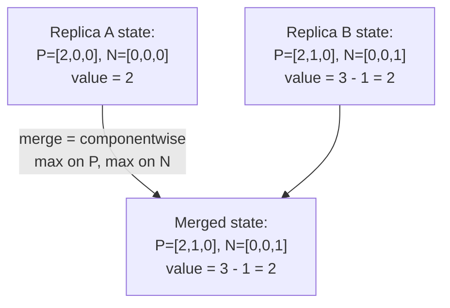

## Learning Objectives

- State Strong Eventual Consistency (SEC) precisely: any two replicas that have delivered the same set of updates are in the same state immediately, with no separate reconciliation step, and contrast this explicitly with `eventual-consistency-and-its-real-guarantees`'s weaker, unproven-convergence promise.
- Define a join-semilattice precisely (a partial order with a least-upper-bound merge operation that is commutative, associative, and idempotent) and explain why a state-based CRDT's states forming one guarantees SEC by construction.
- Work through the G-Counter and PN-Counter CRDTs at the level of their exact state representation and merge function, and prove each one's merge is commutative, associative, and idempotent.
- Explain precisely what SEC does and does not guarantee, convergence to a consistent state, not that the converged value matches any single user's real-time expectation.

## Context & Motivation

`eventual-consistency-and-its-real-guarantees` stated a real but weak promise: "if no new writes arrive, all replicas will eventually converge," with gossip and anti-entropy (this discipline's own `anti-entropy-read-repair-and-merkle-tree-synchronization` made that concrete) as the mechanism that usually gets there, with no proof that it always must, and no guarantee about what happens the instant two replicas compare states mid-convergence. Shapiro, Preguica, Baquero, and Zawirski's 2011 paper closes that gap with an actual proof: if a replicated data type's states are structured a specific, checkable way, convergence is not a hope, it is a mathematical guarantee, immediate the moment two replicas have seen the same updates, no separate conflict-resolution step required at all. This concept builds that proof and its two simplest concrete instances; `dynamo-style-leaderless-replication-and-quorum-intersection`'s comparison-based reconciliation mentioned CRDTs as one conflict-resolution option in passing, this concept is where that option is actually built and proven correct.

## Core Theory

### Strong Eventual Consistency, stated precisely

A replicated object provides **Strong Eventual Consistency (SEC)** if it satisfies: (1) **Eventual Delivery**, every update eventually reaches every replica (a network-layer property, assumed here, not proven, gossip or reliable broadcast providing it); and (2) **Strong Convergence**, any two replicas that have delivered the same set of updates, in any order, are in the same state, with no waiting and no explicit merge step required. The second clause is the genuinely stronger claim compared to plain eventual consistency: it is not "will eventually agree," it is "are already, provably, in the same state the instant the same updates have arrived," a guarantee about the state comparison itself, not about time passing.

### The join-semilattice: the structure that makes Strong Convergence provable

A set S with a partial order ≤ forms a **join-semilattice** if every pair of elements a, b in S has a unique least upper bound, a⊔b (their "join"), such that a⊔b is itself in S, is ≥ both a and b, and is the smallest element with that property. A **state-based CRDT (CvRDT)** represents its entire state as one element of such a semilattice, and defines merging two replicas' states as exactly the join operation, and every local update as moving a replica's state strictly upward in the partial order (never sideways or down).

Because a join-semilattice's join operation is provably commutative (a⊔b = b⊔a), associative ((a⊔b)⊔c = a⊔(b⊔c)), and idempotent (a⊔a = a), merging replica states in **any order**, any number of times, including redundantly, always produces the identical result, exactly Strong Convergence, proven from the algebraic structure alone, not assumed or hoped for.

### The G-Counter: the simplest CvRDT, worked in full

A **G-Counter** (grow-only counter) represents its state as a vector, one non-negative integer slot per replica, exactly the shape `vector-clocks-and-detecting-concurrent-writes`'s vector clock already uses. An increment at replica i increments only slot i. The merge of two G-Counter states is the componentwise maximum of their vectors (the same operation `vector-clocks-and-detecting-concurrent-writes` already defined for merging vector clocks on message receipt), and the counter's current value is the sum of all slots.

**Proof this forms a join-semilattice:** define a ≤ b as "every slot of a is ≤ the corresponding slot of b." Componentwise maximum is exactly the least upper bound under this order (it is the smallest vector that is ≥ both inputs in every slot), commutative (max(x,y)=max(y,x)), associative (max(max(x,y),z)=max(x,max(y,z))), and idempotent (max(x,x)=x). Every local increment only ever increases one slot, moving the state strictly upward. All three CvRDT conditions hold.

### The PN-Counter: composing two G-Counters

A **PN-Counter** (positive-negative counter) supports both increment and decrement by pairing two independent G-Counters, P (tracking increments) and N (tracking decrements), and reporting the counter's value as P's total minus N's total. Merging a PN-Counter is simply merging its P and N components independently, each still a valid G-Counter merge, so the composed structure is itself a join-semilattice (a product of two join-semilattices is always a join-semilattice), inheriting Strong Convergence with no new proof needed.



## Worked Examples

### Example 1: G-Counter merges commuting regardless of order

```text
3 replicas: A, B, C. Each increments locally, independently:
  A increments: A's state = [1,0,0]
  B increments twice: B's state = [0,2,0]
  C increments: C's state = [0,0,1]

Merge order 1: (A merge B) merge C
  A merge B = componentwise max([1,0,0],[0,2,0]) = [1,2,0]
  ([1,2,0]) merge C = max([1,2,0],[0,0,1]) = [1,2,1]

Merge order 2: A merge (B merge C)
  B merge C = max([0,2,0],[0,0,1]) = [0,2,1]
  A merge (that) = max([1,0,0],[0,2,1]) = [1,2,1]

IDENTICAL result, [1,2,1], value = 1+2+1 = 4, regardless of
  merge order: Strong Convergence proven directly by
  associativity and commutativity of componentwise max, exactly
  as the join-semilattice argument guarantees.
```

### Example 2: PN-Counter tracking a real increment/decrement sequence

```text
2 replicas: X, Y. Both start P=[0,0], N=[0,0] (value 0).

X increments twice: X's P becomes [2,0]. (value = 2 - 0 = 2)
Y decrements once: Y's N becomes [0,1]. (value = 0 - 1 = -1)

X and Y gossip and merge:
  Merged P = max([2,0],[0,0]) = [2,0]
  Merged N = max([0,0],[0,1]) = [0,1]
  Merged value = (2+0) - (0+1) = 2 - 1 = 1

Both replicas, after merging, independently compute value = 1:
  the SAME value, with no separate "who wins" comparison step
  at all, unlike a plain overwritable register where X's and
  Y's updates would need an explicit conflict-resolution rule.
```

### Example 3: merging redundantly (idempotence) changes nothing

```text
Replica A's state: P=[3,1], N=[0,2] (value = 4-2 = 2)
Replica A receives a GOSSIP MESSAGE containing its OWN state
  again (a duplicate, or a retransmission after a dropped ack)
  and merges it with itself:

  Merged P = max([3,1],[3,1]) = [3,1]  (UNCHANGED)
  Merged N = max([0,2],[0,2]) = [0,2]  (UNCHANGED)

A's state, and therefore its reported value, is completely
  unaffected by merging with a duplicate of itself: exactly
  the idempotence property the join-semilattice proof
  guarantees, and exactly why a CvRDT tolerates a gossip
  protocol's at-least-once delivery (duplicate messages) with
  zero special-case handling required.
```

## Common Misconceptions & Pitfalls

- **"SEC just means the same thing as `eventual-consistency-and-its-real-guarantees`'s eventual consistency, with a stronger-sounding name."** They are genuinely different guarantees: plain eventual consistency only promises convergence will HAPPEN, with no proof and no bound; SEC, via the join-semilattice structure, PROVES two replicas that have seen the same updates are ALREADY in the same state, the instant that fact is true, with no separate wait or reconciliation logic, as Example 1's order-independent merge demonstrates directly.
- **"A CRDT guarantees the converged value is whatever the application or user actually wanted."** SEC only guarantees the mathematical fact of convergence to A well-defined state; `operation-based-crdts-and-practical-data-types`'s Common Misconceptions section, next, states explicitly that a converged value (e.g. an LWW-Register silently discarding a real concurrent write) can still be a poor fit for what a user actually intended.
- **"Any counter-like data structure can be turned into a CRDT just by merging with max or with addition."** A merge operation must actually satisfy the join-semilattice's three algebraic properties to guarantee convergence; a naive counter that simply SUMS both replicas' raw increment counts, rather than tracking per-replica slots and taking componentwise max, would double-count a value already merged once, violating idempotence, exactly the property Example 3 shows the G-Counter/PN-Counter design deliberately preserves.

## Summary

Strong Eventual Consistency strengthens `eventual-consistency-and-its-real-guarantees`'s hope-based convergence into a provable guarantee: any two replicas that have delivered the same updates are, immediately, in the same state, with no separate reconciliation step. A state-based CRDT (CvRDT) achieves this whenever its states form a join-semilattice, a partial order with a commutative, associative, idempotent least-upper-bound merge, and every update moves a replica strictly upward in that order; the G-Counter (componentwise-max merge over per-replica increment counts) and the PN-Counter (two independent G-Counters, value is their difference) are the two simplest, fully-worked instances of this proof. The next concept covers the second CRDT model, operation-based CRDTs, and the two concrete, practically important data types (OR-Set, LWW-Register) that a Dynamo-style store actually ships in production.

## Documentation Links

- [Shapiro, Preguica, Baquero, and Zawirski: Conflict-Free Replicated Data Types (INRIA / SSS, 2011)](https://inria.hal.science/inria-00609399): the source paper for the Strong Eventual Consistency definition, the join-semilattice proof that a CvRDT's structure guarantees Strong Convergence, and the G-Counter and PN-Counter data types this concept builds through in full.
