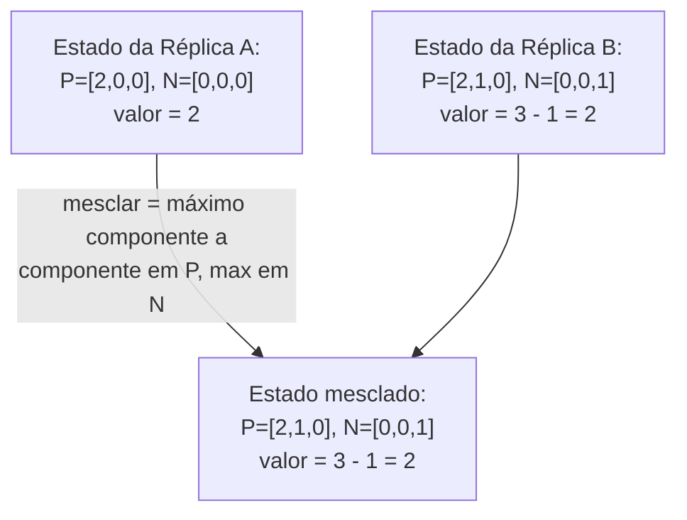

## Objetivos de Aprendizagem

- Enunciar a Consistência Eventual Forte (SEC) com precisão: quaisquer duas réplicas que entregaram o mesmo conjunto de atualizações estão no mesmo estado imediatamente, sem nenhum passo de reconciliação separado, e contrastar isso explicitamente com a promessa mais fraca e de convergência não provada de `eventual-consistency-and-its-real-guarantees`.
- Definir um semirretículo de junção com precisão (uma ordem parcial com uma operação de mesclagem de menor-cota-superior que é comutativa, associativa e idempotente) e explicar por que os estados de um CRDT baseado em estado formando um garante SEC por construção.
- Trabalhar os CRDTs G-Counter e PN-Counter no nível da sua representação de estado exata e função de mesclagem, e provar que a mesclagem de cada um é comutativa, associativa e idempotente.
- Explicar com precisão o que a SEC garante e não garante, a convergência para um estado consistente, não que o valor convergido bate com a expectativa de tempo real de qualquer usuário individual.

## Contexto e Motivação

`eventual-consistency-and-its-real-guarantees` enunciou uma promessa real, mas fraca: "se nenhuma nova escrita chega, todas as réplicas vão eventualmente convergir", com o gossip e a anti-entropia (o próprio `anti-entropy-read-repair-and-merkle-tree-synchronization` desta disciplina tornou isso concreto) como o mecanismo que normalmente chega lá, sem prova de que ele sempre tenha de, e sem garantia sobre o que acontece no instante em que duas réplicas comparam estados no meio da convergência. O artigo de 2011 de Shapiro, Preguica, Baquero e Zawirski fecha essa lacuna com uma prova de fato: se os estados de um tipo de dados replicado são estruturados de uma forma específica e conferível, a convergência não é uma esperança, é uma garantia matemática, imediata no momento em que duas réplicas viram as mesmas atualizações, sem nenhum passo de resolução de conflito separado de forma alguma. Este conceito constrói essa prova e as suas duas instâncias concretas mais simples; a reconciliação baseada em comparação de `dynamo-style-leaderless-replication-and-quorum-intersection` mencionou os CRDTs como uma opção de resolução de conflito de passagem, este conceito é onde essa opção é de fato construída e provada correta.

## Teoria Central

### Consistência Eventual Forte, enunciada com precisão

Um objeto replicado fornece **Consistência Eventual Forte (SEC)** se satisfaz: (1) **Entrega Eventual**, toda atualização eventualmente alcança toda réplica (uma propriedade da camada de rede, assumida aqui, não provada, com o gossip ou a difusão confiável fornecendo-a); e (2) **Convergência Forte**, quaisquer duas réplicas que entregaram o mesmo conjunto de atualizações, em qualquer ordem, estão no mesmo estado, sem espera e sem passo de mesclagem explícito necessário. A segunda cláusula é a afirmação genuinamente mais forte em comparação com a consistência eventual simples: não é "vão eventualmente concordar", é "já estão, comprovadamente, no mesmo estado no instante em que as mesmas atualizações chegaram", uma garantia sobre a própria comparação de estados, não sobre a passagem do tempo.

### O semirretículo de junção: a estrutura que torna a Convergência Forte provável

Um conjunto S com uma ordem parcial ≤ forma um **semirretículo de junção** se todo par de elementos a, b em S tem uma menor cota superior única, a⊔b (a sua "junção"), tal que a⊔b está ela mesma em S, é ≥ tanto a quanto b, e é o menor elemento com essa propriedade. Um **CRDT baseado em estado (CvRDT)** representa o seu estado inteiro como um elemento de tal semirretículo, e define mesclar os estados de duas réplicas como exatamente a operação de junção, e toda atualização local como mover o estado de uma réplica estritamente para cima na ordem parcial (nunca de lado nem para baixo).

Como a operação de junção de um semirretículo de junção é comprovadamente comutativa (a⊔b = b⊔a), associativa ((a⊔b)⊔c = a⊔(b⊔c)) e idempotente (a⊔a = a), mesclar estados de réplica em **qualquer ordem**, qualquer número de vezes, inclusive de forma redundante, sempre produz o resultado idêntico, exatamente a Convergência Forte, provada só a partir da estrutura algébrica, não assumida ou esperada.

### O G-Counter: o CvRDT mais simples, trabalhado por completo

Um **G-Counter** (contador só de crescimento) representa o seu estado como um vetor, um slot de inteiro não negativo por réplica, exatamente o formato que o relógio vetorial de `vector-clocks-and-detecting-concurrent-writes` já usa. Um incremento na réplica i incrementa só o slot i. A mesclagem de dois estados de G-Counter é o máximo componente a componente dos seus vetores (a mesma operação que `vector-clocks-and-detecting-concurrent-writes` já definiu para mesclar relógios vetoriais no recebimento de mensagem), e o valor atual do contador é a soma de todos os slots.

**Prova de que isto forma um semirretículo de junção:** defina a ≤ b como "todo slot de a é ≤ o slot correspondente de b". O máximo componente a componente é exatamente a menor cota superior sob essa ordem (é o menor vetor que é ≥ ambas as entradas em todo slot), comutativo (max(x,y)=max(y,x)), associativo (max(max(x,y),z)=max(x,max(y,z))) e idempotente (max(x,x)=x). Todo incremento local só aumenta um slot, movendo o estado estritamente para cima. Todas as três condições de CvRDT se mantêm.

### O PN-Counter: compor dois G-Counters

Um **PN-Counter** (contador positivo-negativo) suporta tanto incremento quanto decremento pareando dois G-Counters independentes, P (rastreando incrementos) e N (rastreando decrementos), e reportando o valor do contador como o total de P menos o total de N. Mesclar um PN-Counter é simplesmente mesclar os seus componentes P e N independentemente, cada um ainda uma mesclagem válida de G-Counter, então a estrutura composta é, ela mesma, um semirretículo de junção (um produto de dois semirretículos de junção é sempre um semirretículo de junção), herdando a Convergência Forte sem nenhuma prova nova necessária.



## Exemplos Resolvidos

### Exemplo 1: mesclagens de G-Counter comutando independentemente da ordem

```text
3 réplicas: A, B, C. Cada uma incrementa localmente, independentemente:
  A incrementa: estado de A = [1,0,0]
  B incrementa duas vezes: estado de B = [0,2,0]
  C incrementa: estado de C = [0,0,1]

Ordem de mesclagem 1: (A mescla B) mescla C
  A mescla B = max componente a componente([1,0,0],[0,2,0]) = [1,2,0]
  ([1,2,0]) mescla C = max([1,2,0],[0,0,1]) = [1,2,1]

Ordem de mesclagem 2: A mescla (B mescla C)
  B mescla C = max([0,2,0],[0,0,1]) = [0,2,1]
  A mescla (isso) = max([1,0,0],[0,2,1]) = [1,2,1]

Resultado IDÊNTICO, [1,2,1], valor = 1+2+1 = 4, independentemente da
  ordem de mesclagem: Convergência Forte provada diretamente pela
  associatividade e comutatividade do max componente a componente, exatamente
  como o argumento do semirretículo de junção garante.
```

### Exemplo 2: PN-Counter rastreando uma sequência real de incremento/decremento

```text
2 réplicas: X, Y. Ambas começam P=[0,0], N=[0,0] (valor 0).

X incrementa duas vezes: o P de X vira [2,0]. (valor = 2 - 0 = 2)
Y decrementa uma vez: o N de Y vira [0,1]. (valor = 0 - 1 = -1)

X e Y fazem gossip e mesclam:
  P mesclado = max([2,0],[0,0]) = [2,0]
  N mesclado = max([0,0],[0,1]) = [0,1]
  Valor mesclado = (2+0) - (0+1) = 2 - 1 = 1

Ambas as réplicas, após mesclar, independentemente computam valor = 1:
  o MESMO valor, sem nenhum passo de comparação de "quem vence"
  separado de forma alguma, diferentemente de um registro sobrescrevível simples onde as
  atualizações de X e Y precisariam de uma regra explícita de resolução de conflito.
```

### Exemplo 3: mesclar de forma redundante (idempotência) não muda nada

```text
Estado da Réplica A: P=[3,1], N=[0,2] (valor = 4-2 = 2)
A Réplica A recebe uma MENSAGEM DE GOSSIP contendo o SEU PRÓPRIO estado
  de novo (uma duplicata, ou uma retransmissão após um ack perdido)
  e a mescla consigo mesma:

  P mesclado = max([3,1],[3,1]) = [3,1]  (INALTERADO)
  N mesclado = max([0,2],[0,2]) = [0,2]  (INALTERADO)

O estado de A, e, portanto, o seu valor reportado, fica completamente
  inafetado por mesclar com uma duplicata de si mesmo: exatamente
  a propriedade de idempotência que a prova do semirretículo de junção
  garante, e exatamente por que um CvRDT tolera a entrega ao-menos-uma-vez
  (mensagens duplicadas) de um protocolo de gossip com
  zero tratamento de caso especial necessário.
```

## Equívocos Comuns e Armadilhas

- **"SEC só significa a mesma coisa que a consistência eventual de `eventual-consistency-and-its-real-guarantees`, com um nome de som mais forte."** Elas são garantias genuinamente diferentes: a consistência eventual simples só promete que a convergência VAI ACONTECER, sem prova e sem limite; a SEC, via a estrutura do semirretículo de junção, PROVA que duas réplicas que viram as mesmas atualizações JÁ estão no mesmo estado, no instante em que esse fato é verdadeiro, sem nenhuma espera ou lógica de reconciliação separada, como a mesclagem independente da ordem do Exemplo 1 demonstra diretamente.
- **"Um CRDT garante que o valor convergido é o que quer que a aplicação ou o usuário de fato quis."** A SEC só garante o fato matemático da convergência para UM estado bem definido; a seção de Equívocos Comuns de `operation-based-crdts-and-practical-data-types`, a seguir, enuncia explicitamente que um valor convergido (ex.: um LWW-Register silenciosamente descartando uma escrita concorrente real) ainda pode ser um ajuste ruim para o que um usuário de fato pretendeu.
- **"Qualquer estrutura de dados do tipo contador pode ser transformada num CRDT só mesclando com max ou com adição."** Uma operação de mesclagem tem de de fato satisfazer as três propriedades algébricas do semirretículo de junção para garantir a convergência; um contador ingênuo que simplesmente SOMA as contagens brutas de incremento de ambas as réplicas, em vez de rastrear slots por réplica e tomar o máximo componente a componente, contaria em dobro um valor já mesclado uma vez, violando a idempotência, exatamente a propriedade que o Exemplo 3 mostra que o design do G-Counter/PN-Counter deliberadamente preserva.

## Resumo

A Consistência Eventual Forte fortalece a convergência baseada em esperança de `eventual-consistency-and-its-real-guarantees` numa garantia provável: quaisquer duas réplicas que entregaram as mesmas atualizações estão, imediatamente, no mesmo estado, sem nenhum passo de reconciliação separado. Um CRDT baseado em estado (CvRDT) alcança isso sempre que os seus estados formam um semirretículo de junção, uma ordem parcial com uma mesclagem de menor-cota-superior comutativa, associativa e idempotente, e toda atualização move uma réplica estritamente para cima nessa ordem; o G-Counter (mesclagem por max componente a componente sobre contagens de incremento por réplica) e o PN-Counter (dois G-Counters independentes, o valor é a diferença deles) são as duas instâncias mais simples e totalmente trabalhadas dessa prova. O próximo conceito cobre o segundo modelo de CRDT, os CRDTs baseados em operação, e os dois tipos de dados concretos e praticamente importantes (OR-Set, LWW-Register) que uma store no estilo Dynamo de fato entrega em produção.

## Documentation Links

- [Shapiro, Preguica, Baquero, and Zawirski: Conflict-Free Replicated Data Types (INRIA / SSS, 2011)](https://inria.hal.science/inria-00609399): o artigo-fonte da definição de Consistência Eventual Forte, da prova do semirretículo de junção de que a estrutura de um CvRDT garante a Convergência Forte, e dos tipos de dados G-Counter e PN-Counter que este conceito desenvolve por completo.
