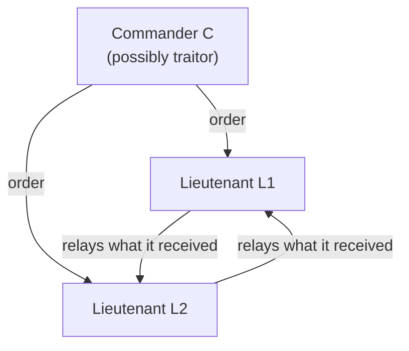

## Learning Objectives

- State the Byzantine Generals Problem precisely: generals who can communicate only by messenger must agree on a single plan (attack or retreat), some generals may be traitors who send arbitrary, inconsistent messages, and any correct solution must guarantee both IC1 (all loyal lieutenants obey the same order) and IC2 (if the commanding general is loyal, every loyal lieutenant obeys the order he sends).
- Reproduce the concrete three-general, one-traitor argument showing that no solution using unsigned (oral) messages exists when the number of generals is not strictly greater than three times the number of traitors.
- Explain, at the level of its recursive structure, how the Oral Message algorithm OM(m) meets that exact bound for any m.
- Explain precisely why this is a strictly harder problem than the crash-fault consensus `distributed-systems-i` already solved with Paxos and Raft, and why majority-based quorums stop being sufficient once a "failed" process can actively lie.

## Context & Motivation

`crash-faults-vs-byzantine-faults`, the concept that closed `distributed-systems-i`, drew the line this discipline now crosses: every protocol proved correct there, FLP, Paxos, Raft, assumes a faulty process simply stops. It never sends a corrupted, contradictory, or actively misleading message. That concept named the Byzantine fault model as the strictly harder alternative and stopped there, on purpose, promising that "the applied protocol-level treatment... already exists in `system-design-concepts`." `byzantine-faults-and-system-models` (`system-design-concepts`) delivers exactly that applied treatment, quorum-based truth, safety versus liveness, and how Jepsen and TLA+ test fault-tolerant algorithms for credibility, citing Lamport, Shostak, and Pease's original paper along the way without re-deriving its actual impossibility result or its algorithm. This concept is the missing rigorous middle: it builds the 1982 problem itself, precisely, generals instead of processes, messengers instead of RPCs, from the ground up, the formal foundation the rest of this discipline's Byzantine-tolerant material depends on.

## Core Theory

### The problem, stated precisely

A commanding general must send an order, attack or retreat, to n-1 lieutenant generals, communicating only through messengers (there is no shared memory, no trusted third party, exactly the partial-failure, no-shared-state setting `why-distributed-systems-are-hard-partial-failure-and-no-shared-state` opened this whole track with). Some generals, possibly including the commander, are traitors. A traitor may send any message it likes, different lies to different recipients, or no message at all. A correct algorithm run by every loyal general must guarantee two conditions simultaneously:

- **IC1 (Agreement):** all loyal lieutenants decide on the same order.
- **IC2 (Validity):** if the commanding general is loyal, every loyal lieutenant decides on the order that general actually sent.

Notice how closely this mirrors `the-consensus-problem-agreement-validity-and-termination`'s Agreement and Validity conditions, and how the crash-fault model made those two conditions comparatively easy to reason about: a crashed process simply stops contributing, it never actively works to make loyal processes disagree.

### Why three generals and one traitor already breaks oral-message solutions

The paper's own argument is a concrete, checkable scenario, not an abstract counting exercise. With 3 generals (a commander C and two lieutenants L1, L2) and 1 traitor, two symmetric cases must both be handled correctly by the same algorithm, because a loyal lieutenant cannot tell which case it is in:

**Case 1: the commander is the traitor.** C sends "attack" to L1 and "retreat" to L2. Both L1 and L2 are loyal, so IC2 does not constrain them (it only binds when the commander is loyal), but IC1 still requires them to agree. Each lieutenant, on relaying what it received to the other, reports what it saw: L1 tells L2 "I was told attack", L2 tells L1 "I was told retreat."

**Case 2: a lieutenant is the traitor.** C is loyal and sends "attack" to both L1 and L2. L2 is the traitor and lies to L1, claiming "the commander told me retreat." L1 now holds exactly the same information as in Case 1: a direct order of "attack" from C, and a report of "retreat" relayed from L2.

L1 cannot distinguish Case 1 from Case 2 by the messages it has received, they are bit-for-bit identical. Whatever decision rule L1 uses must therefore produce the same output in both cases. But IC2 requires L1 to decide "attack" in Case 2 (the commander is loyal there), and IC1 requires L1 and L2 to agree in Case 1. Working through both constraints together shows no consistent rule for L1 can satisfy both simultaneously with only 3 generals and 1 traitor. This is the base case of a general theorem the paper proves by reduction: **any solution using only oral (unsigned, forgeable) messages requires strictly more than 3m generals to tolerate m traitors** (equivalently, n ≥ 3m + 1).



### The Oral Message algorithm, OM(m)

The paper does not just prove a lower bound, it gives an algorithm, OM(m), that meets the 3m+1 bound exactly, defined recursively:

- **OM(0):** the commander sends its order directly to every lieutenant; each lieutenant uses the order it received (or "retreat" as a default if none arrives).
- **OM(m), m > 0:** the commander sends its order to every lieutenant, as in OM(0). Then, acting as a new "commander," each lieutenant runs OM(m-1) to relay what it received to every other lieutenant. Each lieutenant now holds n-2 relayed values (one per other lieutenant) plus its own direct value from the real commander, and takes the **majority value** among all of them as its final decision.

The recursion is what defends against a traitor lying differently to different recipients: at each level, a lie only ever affects one relayed value out of the many a loyal lieutenant collects, and with n ≥ 3m + 1 the paper proves the loyal values always outvote the traitors' at every level of the recursion.

## Worked Examples

### Example 1: the 3-general, 1-traitor deadlock, worked with concrete messages

```text
n = 3, m = 1 (violates n >= 3m+1 = 4)

Case 1: C is the traitor.
  C -> L1: "attack"
  C -> L2: "retreat"
  L1 -> L2: "C told me attack"
  L2 -> L1: "C told me retreat"
  L1 now holds: {direct: attack, relayed-from-L2: retreat}
  L2 now holds: {direct: retreat, relayed-from-L1: attack}

Case 2: L2 is the traitor, C is loyal.
  C -> L1: "attack"
  C -> L2: "attack"
  L2 -> L1: "C told me retreat"  (a lie)
  L1 now holds: {direct: attack, relayed-from-L2: retreat}
             -- BIT-FOR-BIT IDENTICAL to L1's view in Case 1.

L1 must decide the same way in both cases (it cannot see which
case it is actually in). IC2 demands "attack" in Case 2 (C is
loyal). IC1 demands L1 and L2 agree in Case 1. No fixed
decision rule for L1 satisfies both: this is the impossibility,
made concrete rather than asserted.
```

### Example 2: OM(1) succeeding with 4 generals, 1 traitor (n = 4 >= 3(1)+1)

```text
n = 4, m = 1. C (loyal) commands L1, L2, L3. L3 is the traitor.

Level OM(0): C -> L1: "attack", C -> L2: "attack", C -> L3: "attack"

Level OM(0) run BY each lieutenant (relaying, m-1=0):
  L1 -> L2: "attack", L1 -> L3: "attack"
  L2 -> L1: "attack", L2 -> L3: "attack"
  L3 (traitor) -> L1: "retreat" (a lie), L3 -> L2: "retreat" (a lie)

L1's collected values: direct=attack, from-L2=attack, from-L3=retreat
  -> majority = attack (2 attack vs 1 retreat)
L2's collected values: direct=attack, from-L1=attack, from-L3=retreat
  -> majority = attack (2 attack vs 1 retreat)

Both loyal lieutenants decide "attack" (IC1 satisfied, and IC2
satisfied since C is loyal and sent "attack"): the single
traitor's lie is outvoted at every loyal lieutenant, exactly
because n=4 >= 3m+1=4 gave enough loyal votes to win the majority.
```

### Example 3: why n = 3m exactly (not 3m+1) still fails with 2 traitors

```text
n = 6, m = 2 (n = 3m = 6, violates n >= 3m+1 = 7)

With 2 traitors among 6, an adversary can arrange, by the same
recursive argument OM(m) relies on, for a loyal lieutenant to
receive an equal 2-2 split of relayed values between two
candidate orders at some level of the recursion, with the
majority rule then having no way to break the tie correctly in
every possible traitor arrangement. This is exactly why the
bound is strict (n > 3m, i.e. n >= 3m+1): one fewer general than
that, and some traitor arrangement always exists that defeats
any oral-message algorithm, not just OM(m) specifically.
```

## Common Misconceptions & Pitfalls

- **"This is just consensus with a bigger fault tolerance requirement."** `the-consensus-problem-agreement-validity-and-termination` requires only that non-faulty processes agree; a crashed process contributes nothing and cannot actively mislead. A Byzantine general can send a different, carefully crafted lie to every single recipient specifically to make loyal generals disagree, which is why the fault-tolerance bound jumps from "any majority" (crash faults, in Paxos and Raft) to "strictly more than three times the traitors" (Byzantine faults, here).
- **"Adding more generals always makes Byzantine agreement easier."** Example 3 shows the bound is a hard structural requirement, not a matter of degree: n = 3m generals with m traitors is provably impossible for any m, no amount of "extra" generals below the 3m+1 threshold helps, and the moment the ratio crosses that threshold, OM(m) provably succeeds.
- **"Signed messages would not change this bound."** They do, dramatically, if a message must carry the original commander's unforgeable signature (a fact the paper also proves and system models like PBFT, next, exploit), a traitor can no longer put words in a loyal general's mouth, and n ≥ m + 2 suffices instead of n ≥ 3m + 1. This concept and the next intentionally build on the harder, unsigned-message model first, since it is the one crash-fault consensus never had to confront at all.

## Summary

The Byzantine Generals Problem formalizes what `crash-faults-vs-byzantine-faults` only named: a fault model where a faulty participant can lie arbitrarily and differently to different recipients, not merely stop. Lamport, Shostak, and Pease prove, with a concrete three-general argument, that no algorithm using unsigned messages can guarantee both Agreement (IC1) and Validity (IC2) unless the total number of generals strictly exceeds three times the number of traitors (n ≥ 3m + 1), and their recursive Oral Message algorithm OM(m) meets that bound exactly by having every lieutenant collect relayed values from every other lieutenant and take a majority vote at each level of recursion. This is the formal floor the rest of this discipline's Byzantine-tolerant protocols build on top of, starting with PBFT, next, which turns this theoretical bound into a practical, three-phase replication protocol.

## Documentation Links

- [Lamport, Shostak, and Pease: The Byzantine Generals Problem (ACM TOPLAS, 1982)](https://lamport.azurewebsites.net/pubs/byz.pdf): the source paper for the problem statement, the 3-general impossibility argument, the general n ≥ 3m+1 lower bound, and the recursive Oral Message algorithm OM(m) this concept builds from the ground up.
- [MIT 6.5840 (Distributed Systems): Course Overview](https://pdos.csail.mit.edu/6.824/index.html): the course this discipline's sibling `distributed-systems-i` already drew its consensus material from, whose broader syllabus situates Byzantine fault tolerance as the harder fault model beyond the crash-fault Paxos and Raft labs.
