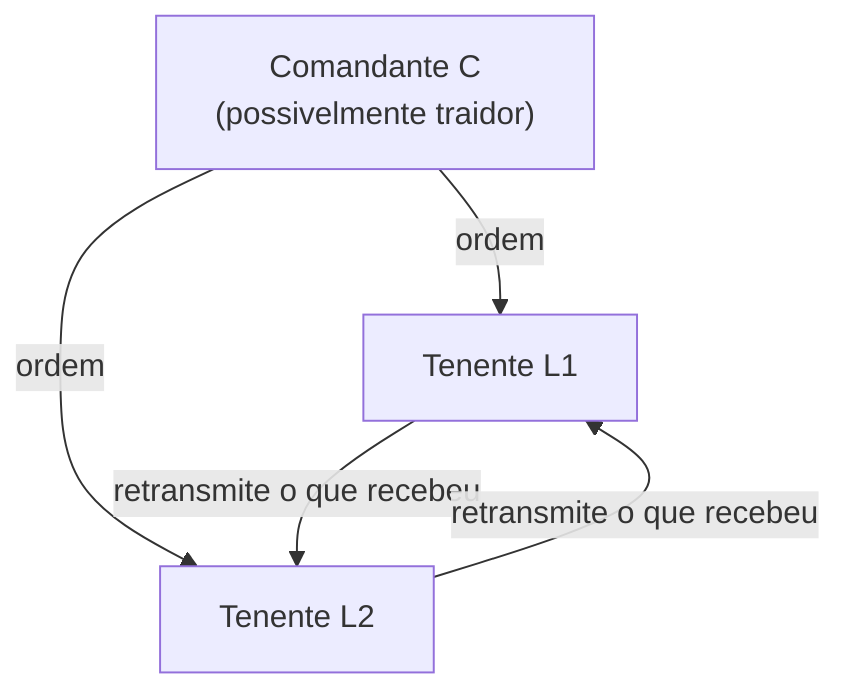

## Objetivos de Aprendizagem

- Enunciar o Problema dos Generais Bizantinos com precisão: generais que só podem se comunicar por mensageiro têm de concordar sobre um único plano (atacar ou recuar), alguns generais podem ser traidores que enviam mensagens arbitrárias e inconsistentes, e qualquer solução correta tem de garantir tanto IC1 (todos os tenentes leais obedecem à mesma ordem) quanto IC2 (se o general comandante é leal, todo tenente leal obedece à ordem que ele envia).
- Reproduzir o argumento concreto de três generais e um traidor mostrando que nenhuma solução usando mensagens não assinadas (orais) existe quando o número de generais não é estritamente maior do que três vezes o número de traidores.
- Explicar, no nível da sua estrutura recursiva, como o algoritmo de Mensagem Oral OM(m) atinge esse limite exato para qualquer m.
- Explicar com precisão por que este é um problema estritamente mais difícil do que o consenso de falha por crash que `distributed-systems-i` já resolveu com Paxos e Raft, e por que os quóruns baseados em maioria param de ser suficientes uma vez que um processo "falho" pode mentir ativamente.

## Contexto e Motivação

`crash-faults-vs-byzantine-faults`, o conceito que encerrou `distributed-systems-i`, traçou a linha que esta disciplina agora cruza: todo protocolo provado correto ali, FLP, Paxos, Raft, assume que um processo falho simplesmente para. Ele nunca envia uma mensagem corrompida, contraditória ou ativamente enganosa. Aquele conceito nomeou o modelo de falha bizantina como a alternativa estritamente mais difícil e parou ali, de propósito, prometendo que "o tratamento aplicado em nível de protocolo... já existe em `system-design-concepts`". `byzantine-faults-and-system-models` (`system-design-concepts`) entrega exatamente esse tratamento aplicado, verdade baseada em quórum, segurança versus vivacidade, e como Jepsen e TLA+ testam algoritmos tolerantes a falhas quanto à credibilidade, citando o artigo original de Lamport, Shostak e Pease pelo caminho sem rederivar o seu resultado de impossibilidade de fato ou o seu algoritmo. Este conceito é o meio rigoroso que faltava: ele constrói o problema de 1982 em si, com precisão, generais em vez de processos, mensageiros em vez de RPCs, do zero, a fundação formal da qual o resto do material tolerante a falhas bizantinas desta disciplina depende.

## Teoria Central

### O problema, enunciado com precisão

Um general comandante tem de enviar uma ordem, atacar ou recuar, a n-1 generais tenentes, comunicando-se só por mensageiros (não há memória compartilhada, nem terceiro de confiança, exatamente o cenário de falha parcial e sem estado compartilhado com que `why-distributed-systems-are-hard-partial-failure-and-no-shared-state` abriu todo este fio). Alguns generais, possivelmente incluindo o comandante, são traidores. Um traidor pode enviar qualquer mensagem que queira, mentiras diferentes a destinatários diferentes, ou nenhuma mensagem. Um algoritmo correto rodado por todo general leal tem de garantir duas condições simultaneamente:

- **IC1 (Acordo):** todos os tenentes leais decidem a mesma ordem.
- **IC2 (Validade):** se o general comandante é leal, todo tenente leal decide a ordem que aquele general de fato enviou.

Note o quão de perto isto espelha as condições de Acordo e Validade de `the-consensus-problem-agreement-validity-and-termination`, e como o modelo de falha por crash tornou essas duas condições comparativamente fáceis de raciocinar: um processo com crash simplesmente para de contribuir, ele nunca trabalha ativamente para fazer processos leais discordarem.

### Por que três generais e um traidor já quebram soluções de mensagem oral

O próprio argumento do artigo é um cenário concreto e conferível, não um exercício abstrato de contagem. Com 3 generais (um comandante C e dois tenentes L1, L2) e 1 traidor, dois casos simétricos têm ambos de ser tratados corretamente pelo mesmo algoritmo, porque um tenente leal não consegue dizer em qual caso está:

**Caso 1: o comandante é o traidor.** C envia "atacar" a L1 e "recuar" a L2. Tanto L1 quanto L2 são leais, então IC2 não os restringe (ele só vincula quando o comandante é leal), mas IC1 ainda exige que concordem. Cada tenente, ao retransmitir o que recebeu ao outro, reporta o que viu: L1 conta a L2 "me disseram atacar", L2 conta a L1 "me disseram recuar".

**Caso 2: um tenente é o traidor.** C é leal e envia "atacar" tanto a L1 quanto a L2. L2 é o traidor e mente a L1, alegando "o comandante me disse recuar". L1 agora segura exatamente a mesma informação que no Caso 1: uma ordem direta de "atacar" de C, e um relato de "recuar" retransmitido de L2.

L1 não consegue distinguir o Caso 1 do Caso 2 pelas mensagens que recebeu, elas são bit a bit idênticas. Qualquer regra de decisão que L1 use tem, portanto, de produzir a mesma saída em ambos os casos. Mas IC2 exige que L1 decida "atacar" no Caso 2 (o comandante é leal ali), e IC1 exige que L1 e L2 concordem no Caso 1. Trabalhar ambas as restrições juntas mostra que nenhuma regra consistente para L1 consegue satisfazer ambas simultaneamente com só 3 generais e 1 traidor. Esse é o caso base de um teorema geral que o artigo prova por redução: **qualquer solução usando só mensagens orais (não assinadas, forjáveis) exige estritamente mais do que 3m generais para tolerar m traidores** (equivalentemente, n ≥ 3m + 1).



### O algoritmo de Mensagem Oral, OM(m)

O artigo não só prova um limite inferior, ele dá um algoritmo, OM(m), que atinge o limite 3m+1 exatamente, definido recursivamente:

- **OM(0):** o comandante envia a sua ordem diretamente a todo tenente; cada tenente usa a ordem que recebeu (ou "recuar" como padrão se nenhuma chega).
- **OM(m), m > 0:** o comandante envia a sua ordem a todo tenente, como em OM(0). Então, agindo como um novo "comandante", cada tenente roda OM(m-1) para retransmitir o que recebeu a todo outro tenente. Cada tenente agora segura n-2 valores retransmitidos (um por outro tenente) mais o seu próprio valor direto do comandante real, e toma o **valor da maioria** entre todos eles como a sua decisão final.

A recursão é o que se defende contra um traidor mentindo de forma diferente a destinatários diferentes: em cada nível, uma mentira só afeta um valor retransmitido dos muitos que um tenente leal coleta, e com n ≥ 3m + 1 o artigo prova que os valores leais sempre superam em votos os dos traidores em todo nível da recursão.

## Exemplos Resolvidos

### Exemplo 1: o impasse de 3 generais e 1 traidor, trabalhado com mensagens concretas

```text
n = 3, m = 1 (viola n >= 3m+1 = 4)

Caso 1: C é o traidor.
  C -> L1: "atacar"
  C -> L2: "recuar"
  L1 -> L2: "C me disse atacar"
  L2 -> L1: "C me disse recuar"
  L1 agora segura: {direto: atacar, retransmitido-de-L2: recuar}
  L2 agora segura: {direto: recuar, retransmitido-de-L1: atacar}

Caso 2: L2 é o traidor, C é leal.
  C -> L1: "atacar"
  C -> L2: "atacar"
  L2 -> L1: "C me disse recuar"  (uma mentira)
  L1 agora segura: {direto: atacar, retransmitido-de-L2: recuar}
             -- BIT A BIT IDÊNTICO à visão de L1 no Caso 1.

L1 tem de decidir da mesma forma em ambos os casos (ele não consegue ver em qual
caso de fato está). IC2 exige "atacar" no Caso 2 (C é
leal). IC1 exige que L1 e L2 concordem no Caso 1. Nenhuma regra de
decisão fixa para L1 satisfaz ambas: essa é a impossibilidade,
tornada concreta em vez de asserida.
```

### Exemplo 2: OM(1) tendo sucesso com 4 generais, 1 traidor (n = 4 >= 3(1)+1)

```text
n = 4, m = 1. C (leal) comanda L1, L2, L3. L3 é o traidor.

Nível OM(0): C -> L1: "atacar", C -> L2: "atacar", C -> L3: "atacar"

Nível OM(0) rodado POR cada tenente (retransmitindo, m-1=0):
  L1 -> L2: "atacar", L1 -> L3: "atacar"
  L2 -> L1: "atacar", L2 -> L3: "atacar"
  L3 (traidor) -> L1: "recuar" (mentira), L3 -> L2: "recuar" (mentira)

Valores coletados de L1: direto=atacar, de-L2=atacar, de-L3=recuar
  -> maioria = atacar (2 atacar vs 1 recuar)
Valores coletados de L2: direto=atacar, de-L1=atacar, de-L3=recuar
  -> maioria = atacar (2 atacar vs 1 recuar)

Ambos os tenentes leais decidem "atacar" (IC1 satisfeito, e IC2
satisfeito já que C é leal e enviou "atacar"): a mentira do único
traidor é superada em votos em cada tenente leal, exatamente
porque n=4 >= 3m+1=4 deu votos leais suficientes para vencer a maioria.
```

### Exemplo 3: por que n = 3m exatamente (não 3m+1) ainda falha com 2 traidores

```text
n = 6, m = 2 (n = 3m = 6, viola n >= 3m+1 = 7)

Com 2 traidores entre 6, um adversário pode arranjar, pelo mesmo
argumento recursivo do qual OM(m) depende, para que um tenente leal
receba uma divisão igual de 2-2 de valores retransmitidos entre duas
ordens candidatas em algum nível da recursão, com a regra da
maioria então sem forma de desempatar corretamente em
toda disposição possível de traidores. É exatamente por isso que o
limite é estrito (n > 3m, isto é, n >= 3m+1): um general a menos do
que isso, e alguma disposição de traidores sempre existe que derrota
qualquer algoritmo de mensagem oral, não só OM(m) especificamente.
```

## Equívocos Comuns e Armadilhas

- **"Isto é só consenso com um requisito de tolerância a falhas maior."** `the-consensus-problem-agreement-validity-and-termination` exige só que os processos não falhos concordem; um processo com crash não contribui nada e não consegue enganar ativamente. Um general bizantino pode enviar uma mentira diferente e cuidadosamente elaborada a cada único destinatário especificamente para fazer generais leais discordarem, que é por que o limite de tolerância a falhas salta de "qualquer maioria" (falhas por crash, em Paxos e Raft) para "estritamente mais do que três vezes os traidores" (falhas bizantinas, aqui).
- **"Adicionar mais generais sempre torna o acordo bizantino mais fácil."** O Exemplo 3 mostra que o limite é um requisito estrutural duro, não uma questão de grau: n = 3m generais com m traidores é comprovadamente impossível para qualquer m, nenhuma quantidade de generais "extras" abaixo do limiar 3m+1 ajuda, e no momento em que a razão cruza esse limiar, OM(m) comprovadamente tem sucesso.
- **"Mensagens assinadas não mudariam esse limite."** Elas mudam, dramaticamente, se uma mensagem tem de carregar a assinatura inforjável do comandante original (um fato que o artigo também prova e que modelos de sistema como o PBFT, a seguir, exploram), um traidor não pode mais pôr palavras na boca de um general leal, e n ≥ m + 2 basta em vez de n ≥ 3m + 1. Este conceito e o próximo intencionalmente constroem sobre o modelo de mensagem não assinada, mais difícil, primeiro, já que é o que o consenso de falha por crash nunca teve de enfrentar de forma alguma.

## Resumo

O Problema dos Generais Bizantinos formaliza o que `crash-faults-vs-byzantine-faults` só nomeou: um modelo de falha onde um participante falho pode mentir arbitrariamente e de forma diferente a destinatários diferentes, não meramente parar. Lamport, Shostak e Pease provam, com um argumento concreto de três generais, que nenhum algoritmo usando mensagens não assinadas consegue garantir tanto o Acordo (IC1) quanto a Validade (IC2) a menos que o número total de generais exceda estritamente três vezes o número de traidores (n ≥ 3m + 1), e o seu algoritmo recursivo de Mensagem Oral OM(m) atinge esse limite exatamente fazendo todo tenente coletar valores retransmitidos de todo outro tenente e tomar um voto de maioria em cada nível de recursão. Esse é o piso formal sobre o qual o resto dos protocolos tolerantes a falhas bizantinas desta disciplina se constrói, começando com o PBFT, a seguir, que transforma esse limite teórico num protocolo de replicação prático de três fases.

## Documentation Links

- [Lamport, Shostak, and Pease: The Byzantine Generals Problem (ACM TOPLAS, 1982)](https://lamport.azurewebsites.net/pubs/byz.pdf): o artigo-fonte do enunciado do problema, do argumento de impossibilidade de 3 generais, do limite inferior geral n ≥ 3m+1 e do algoritmo recursivo de Mensagem Oral OM(m) que este conceito constrói do zero.
- [MIT 6.5840 (Distributed Systems): Course Overview](https://pdos.csail.mit.edu/6.824/index.html): o curso de onde o irmão `distributed-systems-i` desta disciplina já extraiu o seu material de consenso, cujo programa mais amplo situa a tolerância a falhas bizantinas como o modelo de falha mais difícil além dos labs de Paxos e Raft de falha por crash.
