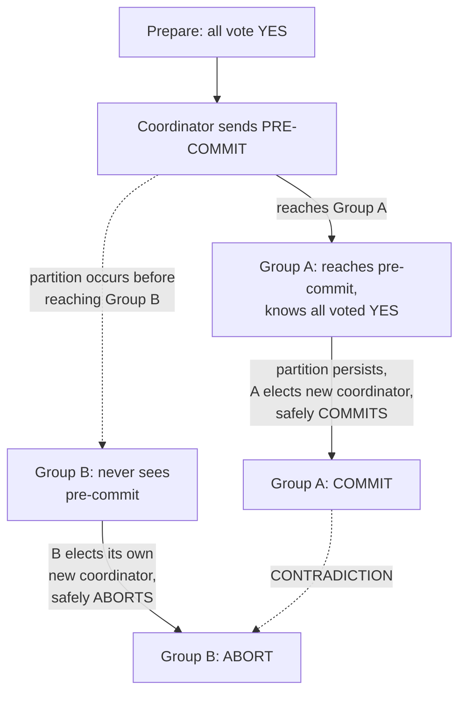

## Learning Objectives

- Describe the extra phase 3PC inserts between voting and committing (pre-commit) and explain precisely what new information it gives a stalled participant that 2PC's prepared state does not.
- Explain why that extra information lets a newly elected coordinator safely resolve a stuck participant without waiting for the original coordinator to recover, under 3PC's stated assumptions.
- Identify exactly which assumption 3PC depends on, bounded message delay, and reproduce a concrete network-partition scenario where that assumption fails and two participant groups reach contradictory decisions.
- State the honest, real-world verdict on 3PC precisely: it removes 2PC's blocking case under synchrony, but does not remove it under the asynchronous, partition-prone model this discipline otherwise assumes throughout, which is why it saw little real adoption.

## Context & Motivation

`two-phase-commit-and-the-blocking-problem` proved a real, specific failure: a participant that has voted YES and is waiting for the coordinator's final decision cannot safely guess, because it cannot tell whether the coordinator already decided COMMIT (in which case guessing ABORT is wrong) or crashed before deciding at all (in which case guessing COMMIT is wrong). Skeen's 1981 three-phase commit protocol is a real, serious, historical attempt to close exactly that gap by giving participants one more piece of information before they can be stuck, and this concept works through both why that attempt succeeds under the assumption it makes, and why that assumption is precisely the one this entire discipline has, since `why-distributed-systems-are-hard-partial-failure-and-no-shared-state`, refused to grant real networks.

## Core Theory

### The extra phase: pre-commit, inserted between voting and committing

3PC keeps 2PC's prepare (voting) phase unchanged, then inserts a new phase before the final commit:

1. **Prepare** (unchanged from 2PC): coordinator asks, participants vote YES/NO, locks held.
2. **Pre-commit** (new): if every participant voted YES, the coordinator broadcasts PRE-COMMIT (not yet the final commit) and waits for every participant to acknowledge receiving it.
3. **Commit**: once every participant has acknowledged pre-commit, the coordinator broadcasts the final COMMIT.

The key new fact a participant learns on reaching the pre-commit state is precisely what 2PC's plain "prepared" state never told it: **every other participant also voted YES.** In 2PC, being prepared only means "I voted yes"; a prepared 2PC participant has no idea what any other participant voted. In 3PC, reaching pre-commit means "everyone voted yes, including me", which is exactly the piece of certainty a stuck participant in the blocking scenario was missing.

### Why that extra fact removes the blocking case, under 3PC's assumption

If the coordinator now crashes after some participants reach pre-commit but before the final commit reaches everyone, a **newly elected coordinator** (chosen among the surviving participants) can safely resolve the transaction without waiting for the original coordinator: it queries the surviving participants' states, and if any participant has reached pre-commit, the new coordinator knows, from that fact alone, that all participants voted YES, and can safely instruct everyone to COMMIT, no guessing involved, unlike 2PC's stuck participant. This works, but only because it assumes the new coordinator can correctly and completely determine every surviving participant's state within a **bounded** amount of time, effectively assuming a synchronous system, message delay and processing time are both bounded and known.

### Why that assumption fails under an actual network partition

A **partition**, not merely a slow or crashed coordinator, splits the participant set into two groups that can each reach each other internally but not across the partition. This concept works through the real, concrete failure this produces: suppose the pre-commit message reached one side of an eventual partition but not the other, before the partition occurs. Once partitioned, each side can independently elect its own new coordinator (each side believes the other is simply unreachable, exactly the ambiguity `why-distributed-systems-are-hard-partial-failure-and-no-shared-state` named as unresolvable from either side alone) and each side, following the protocol correctly and in good faith, can reach a different, contradictory conclusion: the side that saw pre-commit safely commits; the side that never saw it safely aborts (per its own local rule, since it cannot confirm every participant voted yes). Both sides believe they resolved the transaction correctly. Both cannot be right at once, a real Atomicity violation the bounded-delay assumption was hiding.



### The honest verdict

3PC genuinely, provably solves 2PC's blocking problem under a synchronous system model (bounded message delay, no partitions). It does not solve it under the asynchronous, partition-prone model this entire discipline has assumed since its first concept, and real production networks do experience partitions, not just bounded slowness. This is precisely why 3PC saw little real-world adoption despite being a real, serious, published fix to a real, provable problem, it fixes the problem it was designed for, and that problem's own stated assumption (bounded delay) does not hold in the environments distributed systems actually run in.

## Worked Examples

### Example 1: 3PC succeeding exactly as designed, coordinator crash, no partition

```text
Coordinator sends PRE-COMMIT to Shard1 and Shard2. Shard1
  and Shard2 BOTH receive and acknowledge it. Coordinator then
  crashes before sending the final COMMIT.

Shard1 and Shard2 can still communicate with each other (no
  partition, just a crashed coordinator). They elect Shard1 as
  the new coordinator. Shard1 queries Shard2: both are at
  PRE-COMMIT, meaning both know every participant voted YES.
  Shard1 safely broadcasts COMMIT to itself and Shard2: no
  blocking, unlike the 2PC scenario with the identical
  coordinator-crash timing. This is 3PC's genuine improvement,
  demonstrated under the assumption it depends on.
```

### Example 2: the partition scenario, reproduced with concrete groups

```text
4 participants: P1, P2, P3, P4. All vote YES. Coordinator
  broadcasts PRE-COMMIT: it reaches P1, P2 before a network
  partition isolates {P1, P2} from {P3, P4}. P3, P4 never
  receive PRE-COMMIT before the partition.

{P1, P2} elect P1 as new coordinator. P1 confirms P2 is also at
  PRE-COMMIT -> both know all 4 originally voted YES -> P1
  broadcasts COMMIT within its group. {P1, P2}: COMMITTED.

{P3, P4} elect P3 as new coordinator. P3 queries P4: neither
  has seen PRE-COMMIT (they genuinely have no way to know
  whether the ORIGINAL coordinator ever sent it, or to whom).
  Following the protocol's own safety rule for this exact
  situation, they conclude they cannot safely commit and ABORT.
  {P3, P4}: ABORTED.

Same transaction: committed on one side of the partition,
  aborted on the other: a real, concrete contradiction.
```

### Example 3: comparing 2PC's and 3PC's failure exactly

```text
2PC, coordinator crash after all-YES votes: EVERY participant
  blocks, holding locks, until the coordinator recovers. No
  contradiction ever occurs, because nobody proceeds without
  the coordinator: the cost is availability (blocking), not
  correctness.

3PC, coordinator crash WITH a partition (Example 2): NEITHER
  side blocks: both sides proceed, using the protocol exactly
  as designed: but they reach OPPOSITE decisions. The cost is
  correctness (a genuine Atomicity violation), not availability.

This is the honest trade 3PC makes: it exchanges 2PC's
  well-understood availability cost (blocking, safe) for a
  worse, less obvious kind of failure (proceeding anyway,
  unsafe) the moment its bounded-delay assumption is violated
  by a real partition rather than a mere crash.
```

## Common Misconceptions & Pitfalls

- **"3PC is strictly better than 2PC since it adds a safety-improving phase."** Example 3 shows this is exactly backwards under a partition: 2PC's blocking failure mode is safe (no contradiction, only unavailability); 3PC's extra phase, under a partition, trades that safe failure for an unsafe one (a real, silent contradiction), which is precisely why "more phases" did not mean "strictly safer" here.
- **"3PC's problem is just that it's slower (three phases instead of two), not that it's less correct."** Example 2 shows the actual issue is not the extra round trip's latency cost, it is a genuine Atomicity violation under partition, a correctness failure, not merely a performance one.
- **"A real network's 'occasional slowness' is close enough to 3PC's bounded-delay assumption to make this a minor, rare edge case."** `why-distributed-systems-are-hard-partial-failure-and-no-shared-state`, at the very start of this discipline's sibling, established the opposite as this whole field's founding fact: a network cannot distinguish "slow" from "partitioned" from the inside, which is exactly why an assumption that quietly requires telling them apart is not a minor edge case, it is the central hard problem 3PC's fix does not actually solve.

## Summary

Three-Phase Commit inserts a pre-commit phase that gives a stuck participant real, useful information 2PC never provides, confirmation every participant voted YES, letting a newly elected coordinator safely resolve a stalled transaction without the original coordinator's recovery, genuinely solving 2PC's blocking problem under a synchronous, bounded-message-delay assumption. That same assumption fails under a real network partition, where two disjoint participant groups can each follow the protocol correctly and in good faith and still reach opposite, contradictory decisions, a real Atomicity violation, not a hypothetical one. The honest verdict, borne out by 3PC's own limited real-world adoption, is that it fixes exactly the failure mode it assumes and no more, which is why the next concept turns to a genuinely different fix, one built on a mechanism this discipline already proved correct under the asynchronous model 3PC's fix cannot survive.

## Documentation Links

- [Wikipedia: Three-Phase Commit Protocol](https://en.wikipedia.org/wiki/Three-phase_commit_protocol): a precise, freely-verifiable summary of 3PC's three phases and its explicit bounded-delay assumption, used here for the protocol's mechanical description this concept builds its worked examples on.
- [Gray and Lamport: Consensus on Transaction Commit (ACM Transactions on Database Systems, 2006)](https://www.microsoft.com/en-us/research/publication/consensus-on-transaction-commit/): cited again here for the paper's own framing of why blocking-avoidance protocols under a synchrony assumption are an incomplete answer, directly motivating the consensus-based fix the next concept builds from the same source.
