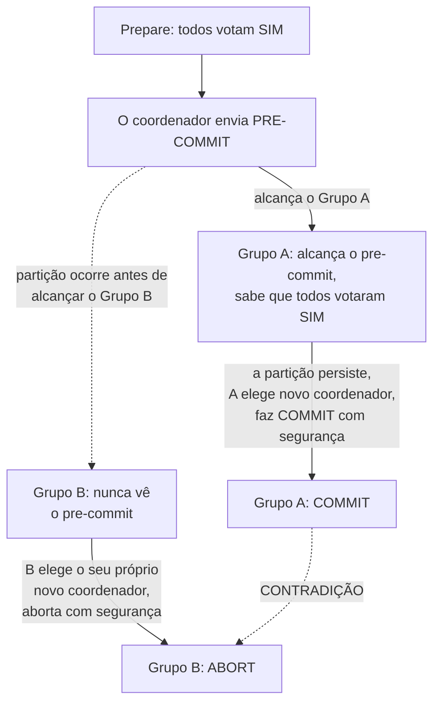

## Objetivos de Aprendizagem

- Descrever a fase extra que o 3PC insere entre votar e fazer commit (pre-commit) e explicar com precisão que nova informação ela dá a um participante travado que o estado prepared do 2PC não dá.
- Explicar por que essa informação extra deixa um coordenador recém-eleito resolver com segurança um participante travado sem esperar o coordenador original se recuperar, sob as suposições enunciadas do 3PC.
- Identificar exatamente de qual suposição o 3PC depende, atraso de mensagem limitado, e reproduzir um cenário concreto de partição de rede onde essa suposição falha e dois grupos de participantes alcançam decisões contraditórias.
- Enunciar o veredito honesto e de mundo real sobre o 3PC com precisão: ele remove o caso de bloqueio do 2PC sob sincronia, mas não o remove sob o modelo assíncrono e propenso a partições que esta disciplina de resto assume por toda parte, que é por que ele viu pouca adoção real.

## Contexto e Motivação

`two-phase-commit-and-the-blocking-problem` provou uma falha real e específica: um participante que votou SIM e está esperando a decisão final do coordenador não consegue chutar com segurança, porque não consegue dizer se o coordenador já decidiu COMMIT (caso em que chutar ABORT está errado) ou falhou antes de decidir de todo (caso em que chutar COMMIT está errado). O protocolo de commit em três fases de Skeen de 1981 é uma tentativa real, séria e histórica de fechar exatamente essa lacuna dando aos participantes mais um pedaço de informação antes de poderem ficar travados, e este conceito trabalha tanto por que essa tentativa tem sucesso sob a suposição que ela faz, quanto por que essa suposição é precisamente aquela que toda esta disciplina, desde `why-distributed-systems-are-hard-partial-failure-and-no-shared-state`, se recusou a conceder a redes reais.

## Teoria Central

### A fase extra: pre-commit, inserida entre votar e fazer commit

O 3PC mantém a fase de prepare (votação) do 2PC inalterada, depois insere uma nova fase antes do commit final:

1. **Prepare** (inalterado do 2PC): o coordenador pergunta, os participantes votam SIM/NÃO, travas seguradas.
2. **Pre-commit** (novo): se todo participante votou SIM, o coordenador transmite PRE-COMMIT (ainda não o commit final) e espera todo participante reconhecer que o recebeu.
3. **Commit**: uma vez que todo participante reconheceu o pre-commit, o coordenador transmite o COMMIT final.

O novo fato-chave que um participante aprende ao alcançar o estado de pre-commit é precisamente o que o estado "prepared" simples do 2PC nunca lhe contou: **todo outro participante também votou SIM.** No 2PC, estar prepared só significa "eu votei sim"; um participante prepared do 2PC não tem ideia do que qualquer outro participante votou. No 3PC, alcançar o pre-commit significa "todos votaram sim, inclusive eu", que é exatamente o pedaço de certeza que faltava a um participante travado no cenário de bloqueio.

### Por que esse fato extra remove o caso de bloqueio, sob a suposição do 3PC

Se o coordenador agora falha depois de alguns participantes alcançarem o pre-commit, mas antes de o commit final alcançar todos, um **coordenador recém-eleito** (escolhido entre os participantes sobreviventes) pode resolver a transação com segurança sem esperar o coordenador original: ele consulta os estados dos participantes sobreviventes, e se qualquer participante alcançou o pre-commit, o novo coordenador sabe, só por esse fato, que todos os participantes votaram SIM, e pode com segurança instruir todos a fazer COMMIT, sem chute envolvido, diferentemente do participante travado do 2PC. Isso funciona, mas só porque assume que o novo coordenador consegue correta e completamente determinar o estado de todo participante sobrevivente dentro de uma quantidade **limitada** de tempo, efetivamente assumindo um sistema síncrono, o atraso de mensagem e o tempo de processamento são ambos limitados e conhecidos.

### Por que essa suposição falha sob uma partição de rede de fato

Uma **partição**, não meramente um coordenador lento ou com crash, divide o conjunto de participantes em dois grupos que cada um consegue se alcançar internamente, mas não através da partição. Este conceito trabalha a falha real e concreta que isso produz: suponha que a mensagem de pre-commit alcançou um lado de uma eventual partição, mas não o outro, antes de a partição ocorrer. Uma vez particionado, cada lado pode eleger independentemente o seu próprio novo coordenador (cada lado acredita que o outro é simplesmente inalcançável, exatamente a ambiguidade que `why-distributed-systems-are-hard-partial-failure-and-no-shared-state` nomeou como irresolúvel só de qualquer lado) e cada lado, seguindo o protocolo corretamente e de boa-fé, pode alcançar uma conclusão diferente e contraditória: o lado que viu o pre-commit faz commit com segurança; o lado que nunca o viu aborta com segurança (pela sua própria regra local, já que não consegue confirmar que todo participante votou sim). Ambos os lados acreditam que resolveram a transação corretamente. Ambos não podem estar certos ao mesmo tempo, uma violação real de Atomicidade que a suposição de atraso limitado estava escondendo.



### O veredito honesto

O 3PC genuína e comprovadamente resolve o problema de bloqueio do 2PC sob um modelo de sistema síncrono (atraso de mensagem limitado, sem partições). Ele não o resolve sob o modelo assíncrono e propenso a partições que toda esta disciplina assumiu desde o seu primeiro conceito, e as redes de produção reais de fato experimentam partições, não só lentidão limitada. É precisamente por isso que o 3PC viu pouca adoção de mundo real apesar de ser um conserto real, sério e publicado para um problema real e comprovável, ele conserta o problema para o qual foi projetado, e a própria suposição enunciada desse problema (atraso limitado) não se mantém nos ambientes em que os sistemas distribuídos de fato rodam.

## Exemplos Resolvidos

### Exemplo 1: 3PC tendo sucesso exatamente como projetado, falha de coordenador, sem partição

```text
O coordenador envia PRE-COMMIT para Shard1 e Shard2. Shard1
  e Shard2 AMBOS o recebem e reconhecem. O coordenador então
  falha antes de enviar o COMMIT final.

Shard1 e Shard2 ainda conseguem se comunicar um com o outro (sem
  partição, só um coordenador com crash). Eles elegem Shard1 como
  o novo coordenador. Shard1 consulta Shard2: ambos estão em
  PRE-COMMIT, significando que ambos sabem que todo participante votou SIM.
  Shard1 transmite COMMIT com segurança a si mesmo e a Shard2: sem
  bloqueio, diferentemente do cenário do 2PC com o timing idêntico
  de falha de coordenador. Essa é a melhoria genuína do 3PC,
  demonstrada sob a suposição da qual ele depende.
```

### Exemplo 2: o cenário de partição, reproduzido com grupos concretos

```text
4 participantes: P1, P2, P3, P4. Todos votam SIM. O coordenador
  transmite PRE-COMMIT: ele alcança P1, P2 antes de uma partição
  de rede isolar {P1, P2} de {P3, P4}. P3, P4 nunca
  recebem PRE-COMMIT antes da partição.

{P1, P2} elegem P1 como novo coordenador. P1 confirma que P2 também está em
  PRE-COMMIT -> ambos sabem que todos os 4 originalmente votaram SIM -> P1
  transmite COMMIT dentro do seu grupo. {P1, P2}: COM COMMIT.

{P3, P4} elegem P3 como novo coordenador. P3 consulta P4: nenhum
  viu PRE-COMMIT (eles genuinamente não têm como saber
  se o coordenador ORIGINAL jamais o enviou, ou a quem).
  Seguindo a própria regra de segurança do protocolo para esta exata
  situação, eles concluem que não podem fazer commit com segurança e ABORTAM.
  {P3, P4}: ABORTADO.

Mesma transação: com commit num lado da partição,
  abortada no outro: uma contradição real e concreta.
```

### Exemplo 3: comparar a falha do 2PC e do 3PC exatamente

```text
2PC, falha de coordenador depois de votos todos-SIM: TODO participante
  bloqueia, segurando travas, até o coordenador se recuperar. Nenhuma
  contradição jamais ocorre, porque ninguém prossegue sem
  o coordenador: o custo é disponibilidade (bloqueio), não
  correção.

3PC, falha de coordenador COM uma partição (Exemplo 2): NENHUM
  lado bloqueia: ambos os lados prosseguem, usando o protocolo exatamente
  como projetado: mas eles alcançam decisões OPOSTAS. O custo é
  correção (uma violação genuína de Atomicidade), não disponibilidade.

Essa é a troca honesta que o 3PC faz: ele troca o custo de disponibilidade
  bem entendido do 2PC (bloqueio, seguro) por um
  tipo de falha pior e menos óbvio (prosseguir mesmo assim,
  inseguro) no momento em que a sua suposição de atraso limitado é violada
  por uma partição real em vez de um mero crash.
```

## Equívocos Comuns e Armadilhas

- **"O 3PC é estritamente melhor do que o 2PC já que adiciona uma fase que melhora a segurança."** O Exemplo 3 mostra que isso é exatamente o contrário sob uma partição: o modo de falha de bloqueio do 2PC é seguro (sem contradição, só indisponibilidade); a fase extra do 3PC, sob uma partição, troca essa falha segura por uma insegura (uma contradição real e silenciosa), que é precisamente por que "mais fases" não significou "estritamente mais seguro" aqui.
- **"O problema do 3PC é só que ele é mais lento (três fases em vez de duas), não que seja menos correto."** O Exemplo 2 mostra que o problema de fato não é o custo de latência da ida e volta extra, é uma violação genuína de Atomicidade sob partição, uma falha de correção, não meramente de desempenho.
- **"A 'lentidão ocasional' de uma rede real é perto o bastante da suposição de atraso limitado do 3PC para tornar isto um caso de borda menor e raro."** `why-distributed-systems-are-hard-partial-failure-and-no-shared-state`, no comecinho do irmão desta disciplina, estabeleceu o oposto como o fato fundador de todo este campo: uma rede não consegue distinguir "lento" de "particionado" de dentro, que é exatamente por que uma suposição que silenciosamente exige distingui-los não é um caso de borda menor, é o problema difícil central que o conserto do 3PC de fato não resolve.

## Resumo

O Commit em Três Fases insere uma fase de pre-commit que dá a um participante travado informação real e útil que o 2PC nunca fornece, a confirmação de que todo participante votou SIM, deixando um coordenador recém-eleito resolver com segurança uma transação travada sem a recuperação do coordenador original, resolvendo genuinamente o problema de bloqueio do 2PC sob uma suposição síncrona de atraso de mensagem limitado. Essa mesma suposição falha sob uma partição de rede real, onde dois grupos disjuntos de participantes podem cada um seguir o protocolo corretamente e de boa-fé e ainda alcançar decisões opostas e contraditórias, uma violação real de Atomicidade, não hipotética. O veredito honesto, confirmado pela própria adoção de mundo real limitada do 3PC, é que ele conserta exatamente o modo de falha que assume e nada mais, que é por que o próximo conceito se volta a um conserto genuinamente diferente, um construído sobre um mecanismo que esta disciplina já provou correto sob o modelo assíncrono que o conserto do 3PC não consegue sobreviver.

## Documentation Links

- [Wikipedia: Three-Phase Commit Protocol](https://en.wikipedia.org/wiki/Three-phase_commit_protocol): um resumo preciso e livremente verificável das três fases do 3PC e da sua suposição explícita de atraso limitado, usado aqui para a descrição mecânica do protocolo sobre a qual este conceito constrói os seus exemplos resolvidos.
- [Gray and Lamport: Consensus on Transaction Commit (ACM Transactions on Database Systems, 2006)](https://www.microsoft.com/en-us/research/publication/consensus-on-transaction-commit/): citado de novo aqui pelo próprio enquadramento do artigo de por que os protocolos de evitação de bloqueio sob uma suposição de sincronia são uma resposta incompleta, motivando diretamente o conserto baseado em consenso que o próximo conceito constrói a partir da mesma fonte.
