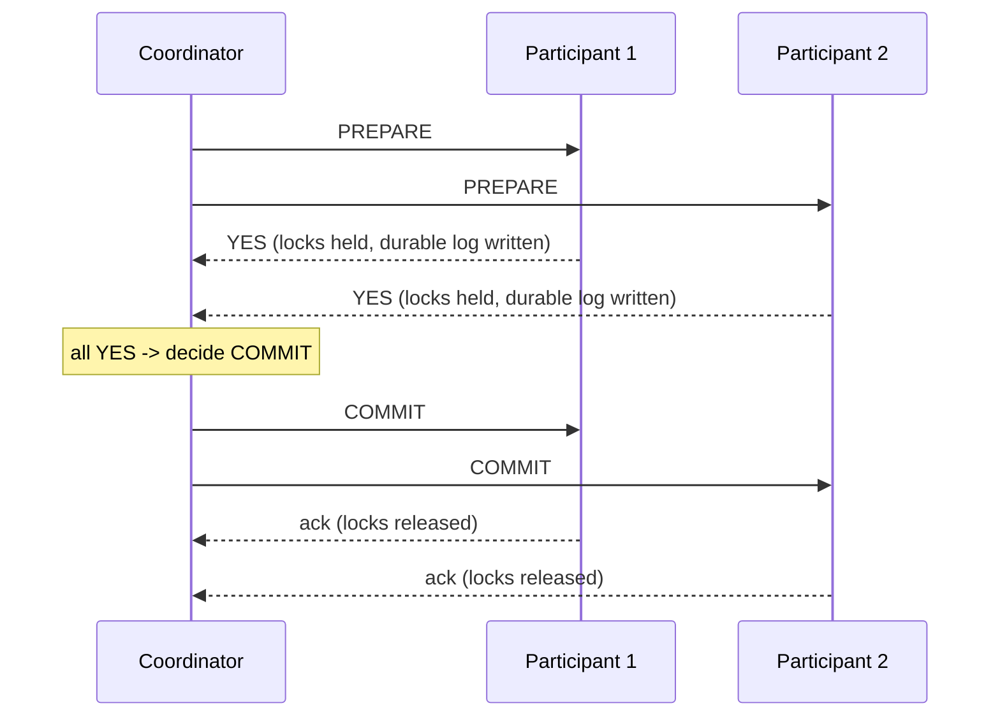

## Learning Objectives

- Describe the Two-Phase Commit (2PC) protocol precisely: a prepare phase where every participant votes yes or no after locking its rows, and a commit phase where the coordinator broadcasts the collective decision.
- Explain exactly how 2PC extends `acid-properties-precisely-defined`'s single-node Atomicity guarantee across multiple nodes.
- Reproduce the precise failure scenario that constitutes 2PC's blocking problem, a coordinator crash after collecting all-yes votes but before broadcasting the decision, and explain exactly why a prepared participant cannot safely resolve it alone.
- Explain why `two-phase-locking-and-conflict-serializability`'s locks are held for the entire duration of this uncertainty window, and what that costs a system under a coordinator failure.

## Context & Motivation

Every concept in this discipline's Distributed Databases topic replicated a single key across nodes. This concept turns to a different, harder problem: an operation that must atomically touch multiple distinct keys, possibly on different nodes, an order that debits an inventory count on one shard and creates a payment record on another, where either both changes happen or neither does, with no partial outcome ever visible. `acid-properties-precisely-defined` and `two-phase-locking-and-conflict-serializability` (`database-systems`) already proved exactly this all-or-nothing guarantee, Atomicity, for a transaction confined to one node's lock manager and log; this concept extends that same guarantee across a coordinator and multiple participant nodes, and, honestly, finds the real limit of the most direct way to do it.

## Core Theory

### The protocol: two phases, exactly as named

A transaction coordinator manages the commit decision for a set of participant nodes, each of which has already executed the transaction's local operations (acquiring the same 2PL locks `two-phase-locking-and-conflict-serializability` already covers, one participant per node) but has not yet made them durable or visible.

**Phase 1, prepare:** the coordinator sends a PREPARE message to every participant. Each participant, having already applied its local operations under lock, checks whether it can guarantee durability of a commit (writing its intended changes to a durable log, but not yet applying them visibly) and replies YES or NO. A participant that replies YES has made an unconditional promise, it must be able to commit if told to, no matter what happens afterward, which is exactly why it keeps its locks held through this entire phase, per `two-phase-locking-and-conflict-serializability`'s own strict-2PL discipline.

**Phase 2, commit:** if every participant replied YES, the coordinator decides COMMIT and broadcasts that decision to all participants, each of which then makes its changes durable and visible, releases its locks, and acknowledges. If any participant replied NO (or timed out), the coordinator decides ABORT instead, and every participant rolls back and releases its locks.



### The blocking problem: the exact failure that has no safe local resolution

Suppose every participant replies YES, entering what the protocol calls the **uncertainty period**, prepared, locks held, waiting for phase 2, and the coordinator crashes before broadcasting COMMIT or ABORT to anyone. A prepared participant is now stuck with a genuine, provable dilemma: it cannot unilaterally commit, because the coordinator might have received a NO from some other participant it never heard about, and it cannot unilaterally abort, because the coordinator might already have decided COMMIT and simply not reached this participant yet before crashing. Either unilateral choice risks disagreeing with a decision the coordinator may already have made and communicated to other participants, violating Agreement across the transaction. The only safe action is to keep waiting, holding its locks, until the coordinator recovers (or a human intervenes), a real, provable blocking condition, not a design oversight; Gray and Lamport's 2006 paper states this precisely as 2PC's central limitation.

### The cost of blocking: locks held, indefinitely

Every lock a blocked, prepared participant holds is unavailable to any other transaction for as long as the block lasts, per `two-phase-locking-and-conflict-serializability`'s own strict-2PL rule of holding locks until the transaction's outcome is known. A coordinator crash that takes minutes, or hours, to recover from does not merely delay the one stuck transaction, it can stall every other transaction contending for the same locked rows, a real, cascading availability cost this concept names as the honest reason the next two concepts exist.

## Worked Examples

### Example 1: the happy path, traced with concrete participants

```text
Transaction T: debit $50 from Account A (shard 1), credit $50
  to Account B (shard 2).

1. Coordinator sends PREPARE to Shard1 and Shard2.
2. Shard1: locks A's row, writes "A -= 50" to its durable log,
   replies YES. (Locks still held.)
3. Shard2: locks B's row, writes "B += 50" to its durable log,
   replies YES. (Locks still held.)
4. Coordinator: both YES -> decides COMMIT, logs this decision
   durably itself, broadcasts COMMIT to both shards.
5. Shard1: applies "A -= 50" visibly, releases A's lock, acks.
6. Shard2: applies "B += 50" visibly, releases B's lock, acks.
   Transaction complete, Atomicity held across both shards.
```

### Example 2: the blocking scenario, traced precisely

```text
Same transaction T. Steps 1-3 identical (both shards reply
  YES, both are now in the uncertainty period, locks held).

4. Coordinator decides COMMIT internally, logs it durably, but
   CRASHES immediately after, before sending COMMIT to EITHER
   shard.

Shard1's state: prepared, YES sent, locks on A held, NO message
  from the coordinator since. Shard1 genuinely cannot tell
  whether the coordinator crashed BEFORE deciding (in which
  case ABORT might be safe) or AFTER deciding COMMIT (in which
  case unilaterally aborting would violate Atomicity against
  whatever Shard2 eventually does). Shard1 MUST wait: A's row
  stays locked, blocking every other transaction that touches
  Account A, until the coordinator recovers and tells it the
  real decision.
```

### Example 3: why a participant-side timeout cannot safely resolve this alone

```text
Attempted fix: "Shard1 waits 30 seconds with no coordinator
  response, then just aborts unilaterally."

Counter-scenario: the coordinator did NOT crash: it was only
  slow (a long GC pause, a network delay), and it successfully
  told Shard2 to COMMIT half a second after Shard1's 30-second
  timeout fired and Shard1 aborted on its own.

Result: Shard2 commits "B += 50", Shard1 aborts "A -= 50":
  $50 was credited to B with NO corresponding debit from A,
  a real, silent Atomicity violation caused directly by the
  timeout-based "fix." This is exactly why the protocol's only
  SAFE choice, without additional information, is to keep
  waiting: not a missing feature, a genuine limit of what 2PC
  alone can guarantee, which the next two concepts address.
```

## Common Misconceptions & Pitfalls

- **"2PC's blocking problem only happens if a participant crashes."** Example 2 shows the blocking participants (the prepared shards) never crash at all, they are alive, healthy, and simply waiting, correctly, because the COORDINATOR crashed. The blocking condition is specifically about coordinator failure during the uncertainty window, not about participant failure.
- **"A participant can safely resolve the uncertainty by just picking the 'more likely' outcome."** Example 3 shows precisely why guessing, even based on a reasonable heuristic like a timeout, can produce a genuine, silent correctness violation, not just a delay; the only provably safe action during genuine uncertainty is to wait for authoritative information.
- **"This is the same kind of unavailability `primary-backup-vs-quorum-based-replication`'s primary-backup replication has when its primary is unreachable."** It is structurally similar (a single point of coordination stalling everything), but the fix that concept pointed to, quorum-based replication needing only a majority, is exactly the fix `consensus-backed-commit-paxos-commit-and-distributed-sql`, two concepts from now, applies directly to this exact blocking problem.

## Summary

Two-Phase Commit extends `acid-properties-precisely-defined`'s single-node Atomicity guarantee across multiple nodes with a prepare phase (every participant locks its rows and votes yes or no) followed by a commit phase (the coordinator broadcasts the collective decision). Its real, provable limitation is the blocking problem: if the coordinator crashes after collecting all-yes votes but before broadcasting the decision, every prepared participant must keep its locks held indefinitely, unable to safely guess commit or abort without risking a real Atomicity violation, a genuine availability cost, not a design oversight, stated precisely in Gray and Lamport's 2006 paper. The next concept covers a real, historical attempt to remove exactly this blocking condition, and why it only partly succeeds.

## Documentation Links

- [Gray and Lamport: Consensus on Transaction Commit (ACM Transactions on Database Systems, 2006)](https://www.microsoft.com/en-us/research/publication/consensus-on-transaction-commit/): the source this concept's precise statement of 2PC's blocking problem follows, including the paper's own framing of the uncertainty period a prepared participant is stuck in.
- [Martin Kleppmann: Designing Data-Intensive Applications, 2nd Edition (O'Reilly), Chapter 8, "Distributed Transactions"](https://www.oreilly.com/library/view/designing-data-intensive-applications/9781098119058/): a second source for the 2PC protocol's phases and its blocking failure mode, cross-checked against Gray and Lamport's own account for consistency.
