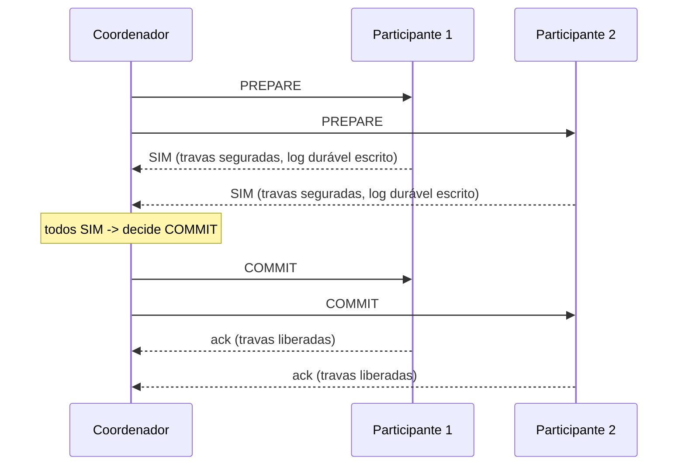

## Objetivos de Aprendizagem

- Descrever o protocolo de Commit em Duas Fases (2PC) com precisão: uma fase de prepare onde todo participante vota sim ou não depois de travar as suas linhas, e uma fase de commit onde o coordenador transmite a decisão coletiva.
- Explicar exatamente como o 2PC estende a garantia de Atomicidade de nó único de `acid-properties-precisely-defined` por entre múltiplos nós.
- Reproduzir o cenário de falha preciso que constitui o problema de bloqueio do 2PC, uma falha de coordenador depois de coletar votos todos-sim, mas antes de transmitir a decisão, e explicar exatamente por que um participante preparado não consegue resolvê-lo com segurança sozinho.
- Explicar por que as travas de `two-phase-locking-and-conflict-serializability` são seguradas durante toda a duração desta janela de incerteza, e o que isso custa a um sistema sob uma falha de coordenador.

## Contexto e Motivação

Todo conceito no tópico de Bancos de Dados Distribuídos desta disciplina replicou uma única chave por entre nós. Este conceito se volta a um problema diferente e mais difícil: uma operação que tem de tocar atomicamente múltiplas chaves distintas, possivelmente em nós diferentes, um pedido que debita uma contagem de inventário num shard e cria um registro de pagamento noutro, onde ou ambas as mudanças acontecem ou nenhuma, com nenhum desfecho parcial jamais visível. `acid-properties-precisely-defined` e `two-phase-locking-and-conflict-serializability` (`database-systems`) já provaram exatamente essa garantia de tudo-ou-nada, a Atomicidade, para uma transação confinada ao gerenciador de travas e ao log de um nó; este conceito estende essa mesma garantia por entre um coordenador e múltiplos nós participantes, e, honestamente, encontra o limite real da forma mais direta de fazê-lo.

## Teoria Central

### O protocolo: duas fases, exatamente como nomeado

Um coordenador de transação gerencia a decisão de commit para um conjunto de nós participantes, cada um dos quais já executou as operações locais da transação (adquirindo as mesmas travas de 2PL que `two-phase-locking-and-conflict-serializability` já cobre, um participante por nó), mas ainda não as tornou duráveis ou visíveis.

**Fase 1, prepare:** o coordenador envia uma mensagem PREPARE a todo participante. Cada participante, tendo já aplicado as suas operações locais sob trava, checa se consegue garantir a durabilidade de um commit (escrevendo as suas mudanças pretendidas num log durável, mas ainda não aplicando-as visivelmente) e responde SIM ou NÃO. Um participante que responde SIM fez uma promessa incondicional, ele tem de conseguir fazer commit se for mandado, não importa o que aconteça depois, que é exatamente por que ele mantém as suas travas seguradas durante toda esta fase, pela própria disciplina de strict-2PL de `two-phase-locking-and-conflict-serializability`.

**Fase 2, commit:** se todo participante respondeu SIM, o coordenador decide COMMIT e transmite essa decisão a todos os participantes, cada um dos quais então torna as suas mudanças duráveis e visíveis, libera as suas travas e reconhece. Se qualquer participante respondeu NÃO (ou deu timeout), o coordenador decide ABORT em vez disso, e todo participante faz rollback e libera as suas travas.



### O problema de bloqueio: a falha exata que não tem resolução local segura

Suponha que todo participante responde SIM, entrando no que o protocolo chama de **período de incerteza**, preparado, travas seguradas, esperando a fase 2, e o coordenador falha antes de transmitir COMMIT ou ABORT a qualquer um. Um participante preparado está agora travado com um dilema genuíno e comprovável: ele não consegue fazer commit unilateralmente, porque o coordenador pode ter recebido um NÃO de algum outro participante de que ele nunca soube, e não consegue abortar unilateralmente, porque o coordenador pode já ter decidido COMMIT e simplesmente não ter alcançado este participante ainda antes de falhar. Qualquer escolha unilateral arrisca discordar de uma decisão que o coordenador pode já ter tomado e comunicado a outros participantes, violando o Acordo por entre a transação. A única ação segura é continuar esperando, segurando as suas travas, até o coordenador se recuperar (ou um humano intervir), uma condição de bloqueio real e comprovável, não um descuido de design; o artigo de 2006 de Gray e Lamport enuncia isto com precisão como a limitação central do 2PC.

### O custo do bloqueio: travas seguradas, indefinidamente

Toda trava que um participante preparado e bloqueado segura fica indisponível a qualquer outra transação por tanto tempo quanto o bloqueio dura, pela própria regra de strict-2PL de `two-phase-locking-and-conflict-serializability` de segurar travas até o desfecho da transação ser conhecido. Uma falha de coordenador que leva minutos, ou horas, para se recuperar não só atrasa a única transação travada, ela pode estagnar toda outra transação disputando as mesmas linhas travadas, um custo de disponibilidade real e em cascata que este conceito nomeia como a razão honesta pela qual os próximos dois conceitos existem.

## Exemplos Resolvidos

### Exemplo 1: o caminho feliz, rastreado com participantes concretos

```text
Transação T: debitar $50 da Conta A (shard 1), creditar $50
  à Conta B (shard 2).

1. O coordenador envia PREPARE para Shard1 e Shard2.
2. Shard1: trava a linha de A, escreve "A -= 50" no seu log durável,
   responde SIM. (Travas ainda seguradas.)
3. Shard2: trava a linha de B, escreve "B += 50" no seu log durável,
   responde SIM. (Travas ainda seguradas.)
4. Coordenador: ambos SIM -> decide COMMIT, loga esta decisão
   de forma durável ele mesmo, transmite COMMIT para ambos os shards.
5. Shard1: aplica "A -= 50" visivelmente, libera a trava de A, reconhece.
6. Shard2: aplica "B += 50" visivelmente, libera a trava de B, reconhece.
   Transação completa, Atomicidade mantida por entre ambos os shards.
```

### Exemplo 2: o cenário de bloqueio, rastreado com precisão

```text
Mesma transação T. Passos 1-3 idênticos (ambos os shards respondem
  SIM, ambos estão agora no período de incerteza, travas seguradas).

4. O coordenador decide COMMIT internamente, loga de forma durável, mas
   FALHA imediatamente depois, antes de enviar COMMIT a QUALQUER
   shard.

Estado de Shard1: preparado, SIM enviado, travas em A seguradas, NENHUMA mensagem
  do coordenador desde então. Shard1 genuinamente não consegue dizer
  se o coordenador falhou ANTES de decidir (caso em
  que ABORT pode ser seguro) ou DEPOIS de decidir COMMIT (caso em
  que abortar unilateralmente violaria a Atomicidade contra
  o que quer que Shard2 eventualmente faça). Shard1 TEM de esperar: a linha de A
  fica travada, bloqueando toda outra transação que toca
  a Conta A, até o coordenador se recuperar e lhe contar a
  decisão real.
```

### Exemplo 3: por que um timeout do lado do participante não consegue resolver isto com segurança sozinho

```text
Conserto tentado: "Shard1 espera 30 segundos sem resposta do
  coordenador, depois simplesmente aborta unilateralmente."

Contracenário: o coordenador NÃO falhou: ele estava só
  lento (uma longa pausa de GC, um atraso de rede), e ele
  disse com sucesso a Shard2 para fazer COMMIT meio segundo depois do timeout
  de 30 segundos de Shard1 disparar e Shard1 abortar por conta própria.

Resultado: Shard2 faz commit de "B += 50", Shard1 aborta "A -= 50":
  $50 foi creditado a B sem NENHUM débito correspondente de A,
  uma violação real e silenciosa de Atomicidade causada diretamente pelo
  "conserto" baseado em timeout. É exatamente por isso que a única escolha
  SEGURA do protocolo, sem informação adicional, é continuar
  esperando: não uma funcionalidade faltando, um limite genuíno do que o 2PC
  sozinho consegue garantir, que os próximos dois conceitos abordam.
```

## Equívocos Comuns e Armadilhas

- **"O problema de bloqueio do 2PC só acontece se um participante falha."** O Exemplo 2 mostra que os participantes que bloqueiam (os shards preparados) nunca falham de forma alguma, eles estão vivos, saudáveis e simplesmente esperando, corretamente, porque o COORDENADOR falhou. A condição de bloqueio é especificamente sobre a falha do coordenador durante a janela de incerteza, não sobre a falha de um participante.
- **"Um participante pode resolver a incerteza com segurança só escolhendo o desfecho 'mais provável'."** O Exemplo 3 mostra precisamente por que chutar, mesmo baseado numa heurística razoável como um timeout, pode produzir uma violação de correção genuína e silenciosa, não só um atraso; a única ação comprovadamente segura durante incerteza genuína é esperar por informação autoritativa.
- **"Essa é o mesmo tipo de indisponibilidade que a replicação primary-backup de `primary-backup-vs-quorum-based-replication` tem quando o seu primário está inalcançável."** É estruturalmente semelhante (um único ponto de coordenação estagnando tudo), mas o conserto para o qual aquele conceito apontou, a replicação baseada em quórum precisando só de uma maioria, é exatamente o conserto que `consensus-backed-commit-paxos-commit-and-distributed-sql`, dois conceitos a partir de agora, aplica diretamente a este exato problema de bloqueio.

## Resumo

O Commit em Duas Fases estende a garantia de Atomicidade de nó único de `acid-properties-precisely-defined` por entre múltiplos nós com uma fase de prepare (todo participante trava as suas linhas e vota sim ou não) seguida de uma fase de commit (o coordenador transmite a decisão coletiva). A sua limitação real e comprovável é o problema de bloqueio: se o coordenador falha depois de coletar votos todos-sim, mas antes de transmitir a decisão, todo participante preparado tem de manter as suas travas seguradas indefinidamente, incapaz de chutar com segurança commit ou abort sem arriscar uma violação real de Atomicidade, um custo de disponibilidade genuíno, não um descuido de design, enunciado com precisão no artigo de 2006 de Gray e Lamport. O próximo conceito cobre uma tentativa real e histórica de remover exatamente esta condição de bloqueio, e por que ela só parcialmente tem sucesso.

## Documentation Links

- [Gray and Lamport: Consensus on Transaction Commit (ACM Transactions on Database Systems, 2006)](https://www.microsoft.com/en-us/research/publication/consensus-on-transaction-commit/): a fonte que o enunciado preciso deste conceito sobre o problema de bloqueio do 2PC segue, incluindo o próprio enquadramento do artigo sobre o período de incerteza no qual um participante preparado fica travado.
- [Martin Kleppmann: Designing Data-Intensive Applications, 2nd Edition (O'Reilly), Chapter 8, "Distributed Transactions"](https://www.oreilly.com/library/view/designing-data-intensive-applications/9781098119058/): uma segunda fonte para as fases do protocolo 2PC e o seu modo de falha de bloqueio, cruzada com o próprio relato de Gray e Lamport para consistência.
