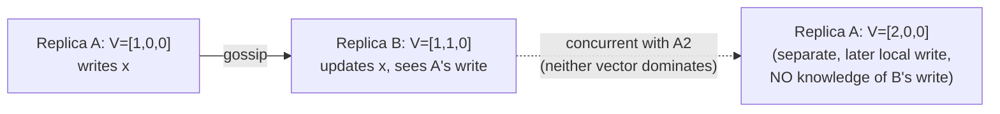

## Learning Objectives

- State exactly what a Lamport (scalar) clock cannot distinguish, two events with unrelated causal histories can still receive comparable timestamps, and explain why a system that accepts writes on multiple replicas needs to make that distinction reliably.
- Define the vector clock algorithm precisely: one counter per replica, incremented on that replica's own event, merged by componentwise maximum on message receipt.
- Given two vector clocks, determine correctly whether one causally dominates the other or whether they are concurrent, and state the exact comparison rule used.
- Explain the real, documented cost of this technique in a system like Dynamo, unbounded vector growth as more replicas write to the same key, and the honest trade-off pruning makes to bound it.

## Context & Motivation

`lamport-logical-clocks-and-the-happens-before-relation` gave every event a single integer timestamp satisfying the Clock Condition (a→b implies C(a)<C(b)), and noted explicitly that ties can be broken with process IDs to produce a total order whenever one is needed. `pacelc-the-latency-consistency-trade-off-beyond-cap` just established why a system choosing Latency over Consistency accepts writes on multiple replicas without coordinating first, exactly the setting where two writes can be genuinely concurrent, neither one happened-before the other, and a system built only on Lamport's scalar counters cannot tell that apart from the case where one write really did happen after the other. This concept builds the tool that actually recovers that distinction, a direct generalization of the same happened-before relation, needed by name in every one of this discipline's remaining Distributed Databases concepts.

## Core Theory

### What a scalar clock loses

Lamport's Clock Condition is one-directional: a→b implies C(a)<C(b), but C(a)<C(b) does not imply a→b. Two events on different replicas that never causally influenced each other (no message chain connects them) can still end up with, say, C(a)=3 and C(b)=5 purely from independent local activity, and nothing about those two numbers alone reveals whether b genuinely depends on a or is entirely unrelated to it. A system merging two writes needs exactly that missing information: is this new write an update TO the value I already have (safe to just overwrite), or a write that happened with no knowledge of my current value at all (a genuine conflict that must be kept, not silently discarded)?

### The vector clock algorithm

Each of n replicas maintains a vector of n counters, V = [c1, c2, ..., cn], one slot per replica. The algorithm has exactly two rules:

- **On a local event at replica i:** increment only Vi[i] by 1.
- **On receiving a message carrying vector clock Vmsg:** set Vi[j] = max(Vi[j], Vmsg[j]) for every slot j, then apply the local-event rule (increment Vi[i] by 1).

This recovers the full causal history each event depends on, not just a single number summarizing it: Vi[j] specifically records the number of events at replica j that replica i's current state is known to causally depend on.

### The comparison rule: dominance versus concurrency

Given two vector clocks V1 and V2:

- **V1 happened-before V2** (V1 < V2) if V1[k] ≤ V2[k] for every slot k, and V1[k] < V2[k] for at least one slot k.
- **V1 and V2 are concurrent** (V1 || V2) if neither V1 < V2 nor V2 < V1 holds, that is, V1 has a strictly larger value in at least one slot and V2 has a strictly larger value in at least one other slot.

This is exactly the partial order `lamport-logical-clocks-and-the-happens-before-relation` already introduced conceptually, made computable: a Lamport clock only ever gives a total order (with ties broken arbitrarily), while a vector clock preserves the genuine incomparability that a partial order allows, which is precisely what lets a leaderless store detect a real conflict instead of guessing.



### The real, documented cost: vector growth

In a system like Dynamo, a vector clock's slots correspond to the coordinators that have handled a write for a given key, not to a fixed, small cluster size, so a popular key touched by many different coordinator nodes over time can accumulate a vector with many more entries than the system's actual replication factor N would suggest. Left unbounded, this vector's storage and transmission cost grows without limit. Dynamo's own paper reports this exact, honest problem and its practical (imperfect) fix, truncating a vector's oldest entries once it exceeds a size threshold, trading a small, bounded risk of failing to detect a very old conflict for a bounded storage cost.

## Worked Examples

### Example 1: building vector clocks event by event

```text
3 replicas: A, B, C. All start at V=[0,0,0].

1. A writes locally: A's V becomes [1,0,0].
2. A gossips to B (sends its V=[1,0,0]).
   B merges: componentwise max([0,0,0],[1,0,0]) = [1,0,0],
   then increments its own slot: B's V becomes [1,1,0].
3. Independently (no message from B), C writes locally:
   C's V becomes [0,0,1].

Current state: A=[1,0,0], B=[1,1,0], C=[0,0,1]
```

### Example 2: detecting a genuine conflict via vector comparison

```text
Continuing from Example 1. Now:

4. A writes AGAIN locally (no knowledge of B's write in step 2):
   A's V becomes [2,0,0].

Compare A's new vector [2,0,0] against B's vector [1,1,0]:
  Is [2,0,0] <= [1,1,0] in every slot? NO (2 > 1 in slot 1).
  Is [1,1,0] <= [2,0,0] in every slot? NO (1 > 0 in slot 2).
  Neither dominates -> A's write and B's write are CONCURRENT.

This is a real, detected conflict: A's second write happened
with no knowledge that B had already updated the value. A
system relying only on a Lamport scalar clock, by contrast,
might assign A's second write a strictly higher scalar
timestamp than B's write purely by coincidence of local
activity, and silently treat it as "later, so it wins": hiding
a conflict a vector clock correctly surfaces instead.
```

### Example 3: correctly recognizing a non-conflict (dominance)

```text
Replica D writes: V=[0,0,0,1] (slot 4 is D's own).
D gossips to E. E merges: max([0,0,0,0],[0,0,0,1])=[0,0,0,1],
  increments its own slot: E's V becomes [0,0,0,1] with slot 5
  incremented too if E has its own slot: say E's V becomes
  [0,0,0,1,1] in a 5-replica vector.
E now writes AGAIN, informed by D's write it already received:
  E's V becomes [0,0,0,1,2].

Compare D's [0,0,0,1,0] against E's [0,0,0,1,2]:
  Is [0,0,0,1,0] <= [0,0,0,1,2] in every slot? YES.
  Is any slot strictly smaller? YES (slot 5: 0 < 2).
  D's vector happened-before E's vector: E's write is a real,
  informed UPDATE to D's value, not a conflict, and it is safe
  to simply keep E's value and discard D's older one.
```

## Common Misconceptions & Pitfalls

- **"A vector clock is just a Lamport clock with more numbers, doing the same job better."** It is a genuinely different tool for a genuinely different question: Lamport clocks answer "give me some total order," vector clocks answer "tell me precisely which events are causally related and which are truly independent," which Example 2 shows a scalar clock cannot reliably answer at all.
- **"If neither vector dominates the other, one of them must still be 'more recent.'** Concurrency, as defined here, is not a tie to be broken by looking harder, it is a real, structural fact: two writes made with no knowledge of each other. `operation-based-crdts-and-practical-data-types`, later in this discipline, shows exactly why this matters, an OR-Set specifically preserves both concurrent writes rather than picking one, precisely because vector-clock concurrency proves neither write is stale.
- **"Vector clocks scale perfectly to any number of replicas."** Example 3's setup already hints at the real cost this concept names honestly: the vector's size grows with the number of distinct coordinators that have touched a key, not with a fixed cluster size, and Dynamo's own reported fix (bounded truncation) is a real, imperfect trade-off, not a solved problem.

## Summary

A vector clock generalizes Lamport's scalar counter into one counter per replica, incremented locally and merged by componentwise maximum on message receipt, recovering the genuine partial order `lamport-logical-clocks-and-the-happens-before-relation` introduced conceptually but a scalar clock cannot compute precisely: given two vector clocks, one dominates the other exactly when every slot is less-than-or-equal and at least one is strictly less, and otherwise the two events are provably concurrent, a real conflict, not a coincidence of timing. Real systems like Dynamo depend on exactly this comparison to decide whether an incoming write safely supersedes what a replica already has or must be kept alongside it as a genuine, unresolved conflict, at the honest, documented cost of unbounded vector growth that production systems must actively bound. The next concept puts this exact tool to work, comparing vector clocks across replicas to make Dynamo-style leaderless replication's read and write quorums correct.

## Documentation Links

- [Martin Kleppmann: Designing Data-Intensive Applications, 2nd Edition (O'Reilly), Chapter 5, "Detecting Concurrent Writes"](https://www.oreilly.com/library/view/designing-data-intensive-applications/9781098119058/): the source this concept's dominance-versus-concurrency comparison rule and its worked examples follow, covering version vectors as the generalization of a single per-key version number to a per-replica one.
- [DeCandia et al.: Dynamo: Amazon's Highly Available Key-value Store (SOSP, 2007)](https://www.allthingsdistributed.com/files/amazon-dynamo-sosp2007.pdf): the source for the real, deployed use of vector clocks for conflict detection and the honest, documented vector-growth problem and truncation-based mitigation this concept names in its final Core Theory subsection.
