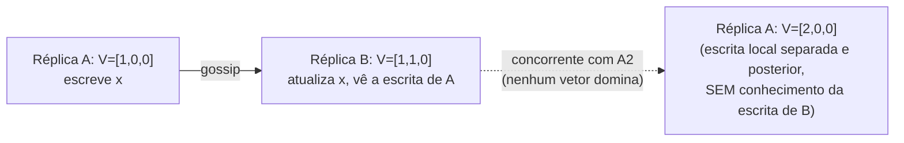

## Objetivos de Aprendizagem

- Enunciar exatamente o que um relógio de Lamport (escalar) não consegue distinguir, dois eventos com histórias causais não relacionadas ainda podem receber timestamps comparáveis, e explicar por que um sistema que aceita escritas em múltiplas réplicas precisa fazer essa distinção de forma confiável.
- Definir o algoritmo de relógio vetorial com precisão: um contador por réplica, incrementado no próprio evento daquela réplica, mesclado por máximo componente a componente no recebimento de mensagem.
- Dados dois relógios vetoriais, determinar corretamente se um domina causalmente o outro ou se eles são concorrentes, e enunciar a regra de comparação exata usada.
- Explicar o custo real e documentado desta técnica num sistema como o Dynamo, o crescimento ilimitado do vetor conforme mais réplicas escrevem na mesma chave, e o trade-off honesto que a poda faz para limitá-lo.

## Contexto e Motivação

`lamport-logical-clocks-and-the-happens-before-relation` deu a todo evento um único timestamp inteiro satisfazendo a Condição de Relógio (a→b implica C(a)<C(b)), e notou explicitamente que empates podem ser desfeitos com IDs de processo para produzir uma ordem total sempre que uma for necessária. `pacelc-the-latency-consistency-trade-off-beyond-cap` acabou de estabelecer por que um sistema escolhendo Latência em vez de Consistência aceita escritas em múltiplas réplicas sem coordenar primeiro, exatamente o cenário onde duas escritas podem ser genuinamente concorrentes, nenhuma aconteceu-antes da outra, e um sistema construído só sobre os contadores escalares de Lamport não consegue distinguir isso do caso onde uma escrita de fato aconteceu depois da outra. Este conceito constrói a ferramenta que de fato recupera essa distinção, uma generalização direta da mesma relação aconteceu-antes, necessária por nome em cada um dos conceitos restantes de Bancos de Dados Distribuídos desta disciplina.

## Teoria Central

### O que um relógio escalar perde

A Condição de Relógio de Lamport é unidirecional: a→b implica C(a)<C(b), mas C(a)<C(b) não implica a→b. Dois eventos em réplicas diferentes que nunca influenciaram causalmente um ao outro (nenhuma cadeia de mensagens os conecta) ainda podem acabar com, digamos, C(a)=3 e C(b)=5 puramente de atividade local independente, e nada sobre esses dois números sozinhos revela se b genuinamente depende de a ou é inteiramente não relacionado a ele. Um sistema mesclando duas escritas precisa exatamente dessa informação faltante: esta nova escrita é uma atualização PARA o valor que já tenho (seguro de só sobrescrever), ou uma escrita que aconteceu sem conhecimento do meu valor atual de forma alguma (um conflito genuíno que tem de ser mantido, não silenciosamente descartado)?

### O algoritmo de relógio vetorial

Cada uma de n réplicas mantém um vetor de n contadores, V = [c1, c2, ..., cn], um slot por réplica. O algoritmo tem exatamente duas regras:

- **Num evento local na réplica i:** incrementar só Vi[i] de 1.
- **No recebimento de uma mensagem carregando o relógio vetorial Vmsg:** fazer Vi[j] = max(Vi[j], Vmsg[j]) para todo slot j, depois aplicar a regra de evento local (incrementar Vi[i] de 1).

Isso recupera a história causal completa da qual cada evento depende, não só um único número que a resume: Vi[j] especificamente registra o número de eventos na réplica j dos quais se sabe que o estado atual da réplica i causalmente depende.

### A regra de comparação: dominância versus concorrência

Dados dois relógios vetoriais V1 e V2:

- **V1 aconteceu-antes de V2** (V1 < V2) se V1[k] ≤ V2[k] para todo slot k, e V1[k] < V2[k] para pelo menos um slot k.
- **V1 e V2 são concorrentes** (V1 || V2) se nem V1 < V2 nem V2 < V1 se mantém, isto é, V1 tem um valor estritamente maior em pelo menos um slot e V2 tem um valor estritamente maior em pelo menos um outro slot.

Essa é exatamente a ordem parcial que `lamport-logical-clocks-and-the-happens-before-relation` já introduziu conceitualmente, tornada computável: um relógio de Lamport só dá uma ordem total (com empates desfeitos arbitrariamente), enquanto um relógio vetorial preserva a incomparabilidade genuína que uma ordem parcial permite, que é precisamente o que deixa uma store sem líder detectar um conflito real em vez de chutar.



### O custo real e documentado: crescimento do vetor

Num sistema como o Dynamo, os slots de um relógio vetorial correspondem aos coordenadores que trataram uma escrita para uma dada chave, não a um tamanho de cluster fixo e pequeno, então uma chave popular tocada por muitos nós coordenadores diferentes ao longo do tempo pode acumular um vetor com muito mais entradas do que o fator de replicação N de fato do sistema sugeriria. Deixado ilimitado, o custo de armazenamento e transmissão deste vetor cresce sem limite. O próprio artigo do Dynamo relata este exato problema honesto e o seu conserto prático (imperfeito), truncar as entradas mais antigas de um vetor uma vez que ele excede um limiar de tamanho, trocando um risco pequeno e limitado de deixar de detectar um conflito muito antigo por um custo de armazenamento limitado.

## Exemplos Resolvidos

### Exemplo 1: construir relógios vetoriais evento por evento

```text
3 réplicas: A, B, C. Todas começam em V=[0,0,0].

1. A escreve localmente: o V de A vira [1,0,0].
2. A faz gossip para B (envia o seu V=[1,0,0]).
   B mescla: max componente a componente([0,0,0],[1,0,0]) = [1,0,0],
   depois incrementa o seu próprio slot: o V de B vira [1,1,0].
3. Independentemente (nenhuma mensagem de B), C escreve localmente:
   o V de C vira [0,0,1].

Estado atual: A=[1,0,0], B=[1,1,0], C=[0,0,1]
```

### Exemplo 2: detectar um conflito genuíno por comparação de vetores

```text
Continuando do Exemplo 1. Agora:

4. A escreve DE NOVO localmente (sem conhecimento da escrita de B no passo 2):
   o V de A vira [2,0,0].

Comparar o novo vetor de A [2,0,0] contra o vetor de B [1,1,0]:
  [2,0,0] <= [1,1,0] em todo slot? NÃO (2 > 1 no slot 1).
  [1,1,0] <= [2,0,0] em todo slot? NÃO (1 > 0 no slot 2).
  Nenhum domina -> a escrita de A e a escrita de B são CONCORRENTES.

Esse é um conflito real e detectado: a segunda escrita de A aconteceu
sem conhecimento de que B já tinha atualizado o valor. Um
sistema dependendo só de um relógio escalar de Lamport, em contraste,
poderia atribuir à segunda escrita de A um timestamp escalar
estritamente mais alto do que o da escrita de B puramente por coincidência de
atividade local, e silenciosamente tratá-la como "mais tarde, então vence": escondendo
um conflito que um relógio vetorial corretamente traz à tona em vez disso.
```

### Exemplo 3: reconhecer corretamente um não conflito (dominância)

```text
A Réplica D escreve: V=[0,0,0,1] (o slot 4 é o próprio de D).
D faz gossip para E. E mescla: max([0,0,0,0],[0,0,0,1])=[0,0,0,1],
  incrementa o seu próprio slot: o V de E vira [0,0,0,1] com o slot 5
  incrementado também se E tem o seu próprio slot: digamos que o V de E vire
  [0,0,0,1,1] num vetor de 5 réplicas.
E agora escreve DE NOVO, informado pela escrita de D que já recebeu:
  o V de E vira [0,0,0,1,2].

Comparar o [0,0,0,1,0] de D contra o [0,0,0,1,2] de E:
  [0,0,0,1,0] <= [0,0,0,1,2] em todo slot? SIM.
  Algum slot estritamente menor? SIM (slot 5: 0 < 2).
  O vetor de D aconteceu-antes do vetor de E: a escrita de E é uma
  ATUALIZAÇÃO real e informada ao valor de D, não um conflito, e é seguro
  simplesmente manter o valor de E e descartar o de D, mais antigo.
```

## Equívocos Comuns e Armadilhas

- **"Um relógio vetorial é só um relógio de Lamport com mais números, fazendo o mesmo trabalho melhor."** É uma ferramenta genuinamente diferente para uma pergunta genuinamente diferente: os relógios de Lamport respondem "me dê alguma ordem total", os relógios vetoriais respondem "me diga precisamente quais eventos são causalmente relacionados e quais são verdadeiramente independentes", que o Exemplo 2 mostra que um relógio escalar não consegue responder de forma confiável de forma alguma.
- **"Se nenhum vetor domina o outro, um deles ainda tem de ser 'mais recente'."** A concorrência, como definida aqui, não é um empate a ser desfeito olhando com mais atenção, é um fato real e estrutural: duas escritas feitas sem conhecimento uma da outra. `operation-based-crdts-and-practical-data-types`, mais adiante nesta disciplina, mostra exatamente por que isso importa, um OR-Set especificamente preserva ambas as escritas concorrentes em vez de escolher uma, precisamente porque a concorrência de relógio vetorial prova que nenhuma escrita está obsoleta.
- **"Os relógios vetoriais escalam perfeitamente para qualquer número de réplicas."** A configuração do Exemplo 3 já insinua o custo real que este conceito nomeia honestamente: o tamanho do vetor cresce com o número de coordenadores distintos que tocaram uma chave, não com um tamanho de cluster fixo, e o próprio conserto relatado do Dynamo (truncamento limitado) é um trade-off real e imperfeito, não um problema resolvido.

## Resumo

Um relógio vetorial generaliza o contador escalar de Lamport num contador por réplica, incrementado localmente e mesclado por máximo componente a componente no recebimento de mensagem, recuperando a ordem parcial genuína que `lamport-logical-clocks-and-the-happens-before-relation` introduziu conceitualmente, mas que um relógio escalar não consegue computar com precisão: dados dois relógios vetoriais, um domina o outro exatamente quando todo slot é menor-ou-igual e pelo menos um é estritamente menor, e caso contrário os dois eventos são comprovadamente concorrentes, um conflito real, não uma coincidência de timing. Sistemas reais como o Dynamo dependem exatamente desta comparação para decidir se uma escrita que chega suplanta com segurança o que uma réplica já tem ou tem de ser mantida ao seu lado como um conflito genuíno e não resolvido, ao custo honesto e documentado do crescimento ilimitado do vetor que os sistemas de produção têm de ativamente limitar. O próximo conceito põe exatamente esta ferramenta para trabalhar, comparando relógios vetoriais por entre réplicas para tornar corretos os quóruns de leitura e escrita da replicação sem líder no estilo Dynamo.

## Documentation Links

- [Martin Kleppmann: Designing Data-Intensive Applications, 2nd Edition (O'Reilly), Chapter 5, "Detecting Concurrent Writes"](https://www.oreilly.com/library/view/designing-data-intensive-applications/9781098119058/): a fonte que a regra de comparação dominância-versus-concorrência deste conceito e os seus exemplos resolvidos seguem, cobrindo os vetores de versão como a generalização de um único número de versão por chave para um por réplica.
- [DeCandia et al.: Dynamo: Amazon's Highly Available Key-value Store (SOSP, 2007)](https://www.allthingsdistributed.com/files/amazon-dynamo-sosp2007.pdf): a fonte do uso real e implantado de relógios vetoriais para detecção de conflitos e do problema honesto e documentado de crescimento de vetor e da mitigação baseada em truncamento que este conceito nomeia na sua subseção final de Teoria Central.
