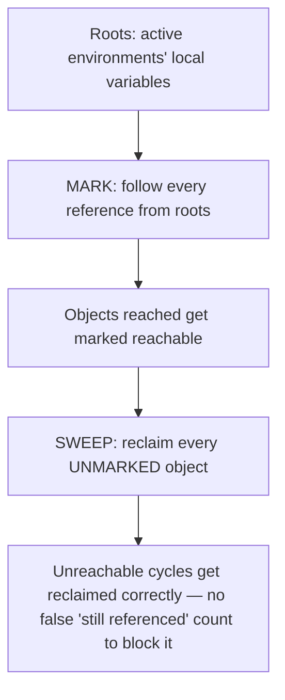

## Learning Objectives

- Explain, in terms of the memory bugs already covered in `c-and-assembly` (leaks and dangling pointers), exactly what problem automatic memory management is designed to eliminate structurally.
- Implement reference counting: increment a count when a reference is created, decrement when it's discarded, reclaim when the count hits zero — and trace this on a concrete example.
- Explain reference counting's one structural blind spot: a reference cycle that keeps two objects' counts above zero forever, even when nothing outside the cycle can reach either.
- Describe tracing garbage collection (mark-and-sweep) at a conceptual level: start from known-reachable roots, mark everything reachable, reclaim everything unmarked — and explain why this correctly handles cycles where reference counting cannot.
- State the real cost tracing GC pays for solving the cycle problem, and connect the whole runtime-systems tradeoff back to the environments this discipline's interpreter already builds.

## Context & Motivation

`c-and-assembly` already showed, in concrete and often painful detail, what happens when memory management is entirely manual: a `common-memory-bugs-leaks-and-dangling-pointers` concept demonstrated a MEMORY LEAK (allocated memory whose pointer is lost, so it can never be freed, silently accumulating until a program runs out of memory) and a DANGLING POINTER (memory freed while something still holds a reference to it, so a later access reads or writes memory that's since been repurposed for something else entirely). Both bugs share the same root cause: a human programmer is responsible for calling `free` at EXACTLY the right moment — not too early (dangling pointer), not never (leak) — and getting this exactly right, by hand, across a large program, is genuinely hard.

Automatic memory management exists specifically to make this entire bug CLASS structurally impossible: instead of a programmer deciding when to free memory, the LANGUAGE RUNTIME itself tracks which allocated objects are still reachable and reclaims exactly the ones that aren't, with no manual `free` call required (or, in most such languages, even available) at all. This is the direct runtime-systems payoff of everything this discipline built earlier: the environments already constructed for this discipline's interpreter (chains of `Environment` objects, closures holding references to captured environments) are themselves exactly the kind of heap-allocated, reference-linked data that a real language runtime's garbage collector has to manage correctly.

## Core Theory

### Reference counting: the simplest automatic scheme

Attach a counter to every heap-allocated object, tracking how many references currently point to it:

```text
When a new reference to an object is created (assigned to a variable, stored in
  a data structure, captured by a closure): increment its count.
When a reference is discarded (a variable goes out of scope, is reassigned, a
  containing structure is itself freed): decrement its count.
When a count reaches zero: no reference anywhere in the program can reach this
  object any longer — reclaim it immediately, and recursively decrement the
  counts of anything IT referenced (since those references are now gone too).
```

This directly and completely eliminates both bugs already seen: a leak is impossible (an object with count zero is reclaimed immediately, automatically, the moment it becomes unreachable — there's no way for a programmer to simply "forget" to free it, since no explicit free call exists at all); a dangling pointer is impossible (an object is never reclaimed while ANY reference to it still exists, since that reference would be keeping its count above zero).

### The one structural blind spot: reference cycles

Reference counting has exactly one real, well-known failure mode: a CYCLE. If object A holds a reference to object B, and B holds a reference BACK to A, each keeps the other's count at least 1 — even if NOTHING outside this pair can reach either one any longer. Neither count ever reaches zero, so neither is ever reclaimed, despite both being genuinely unreachable garbage from the rest of the program's point of view. This is a real, structural leak that reference counting alone cannot fix, no matter how carefully the counting itself is implemented.


### Tracing garbage collection: mark-and-sweep

Tracing GC solves the cycle problem by abandoning per-object counters entirely and instead periodically walking the ENTIRE graph of references starting from a fixed set of known ROOTS (global variables, and every currently-active environment/call-frame's local variables — precisely the same kind of environment chains this discipline's interpreter has been building all along):

```text
MARK phase:  starting from every root, follow every reference reachable from it,
             marking each object visited as "reachable." This naturally
             includes objects that are part of a cycle, AS LONG AS the cycle
             itself is reachable from some root — but correctly EXCLUDES a
             cycle that isn't reachable from anything outside it.

SWEEP phase: walk every allocated object; anything NOT marked "reachable" is
             garbage — genuinely unreachable from any root, cycle or no cycle
             — and gets reclaimed.
```

Because mark-and-sweep never relies on a per-object COUNT, it correctly reclaims the A/B cycle from the previous section: neither A nor B is reachable from any root, so neither gets marked during the mark phase, so both get correctly swept as garbage — exactly the case reference counting structurally cannot handle.



## Worked Examples

### Example 1: Reference counting correctly reclaiming a simple, acyclic case

```text
env = Environment(parent=None)      # ref count of this Environment: 1 (referenced by "env")
closure = Closure(params=[], body=..., env=env)   # env's count: 2 (now also referenced by closure)

env = None                          # env's count: 1 (the "env" variable no longer references it,
                                     #   but closure.env still does)
closure = None                      # env's count: 0 (nothing references it anymore) 
                                     #   → reclaimed immediately, correctly, no leak
```

This is exactly the correct, automatic behavior a manual `c-and-assembly`-style implementation would have needed an EXPLICIT, carefully-placed `free` call to achieve — here it happens with no code written for it at all.

### Example 2: A cycle reference counting genuinely cannot reclaim

```text
class Node:
    def __init__(self):
        self.next = None

a = Node()   # a's count: 1 (referenced by variable "a")
b = Node()   # b's count: 1 (referenced by variable "b")
a.next = b   # b's count: 2 (also referenced by a.next)
b.next = a   # a's count: 2 (also referenced by b.next)

a = None     # a's count: 1 (still referenced by b.next)
b = None     # b's count: 1 (still referenced by a.next)

# Neither a nor b is reachable from anywhere in the program anymore — but neither
# count is zero, since each still holds a reference to the other. Under pure
# reference counting, THIS IS A LEAK — both objects sit unreclaimed forever,
# despite being genuinely garbage.
```

### Example 3: The same cycle, correctly reclaimed under mark-and-sweep

```text
Roots at this point in the program: (whatever the currently active environment's
  local variables are — critically, NEITHER "a" NOR "b" is among them anymore,
  since both were set to None).

MARK phase: start from roots, follow references — since no root points to
  either Node, NEITHER gets marked, DESPITE the fact that they still point to
  each other.

SWEEP phase: both Nodes are unmarked → both reclaimed correctly.
```

The exact same cyclic structure that defeated reference counting in Example 2 is reclaimed correctly here — because mark-and-sweep's correctness never depended on counting references AT ALL, only on reachability FROM the roots, which a cycle isolated from the rest of the program genuinely lacks.

## Common Misconceptions & Pitfalls

- **"Automatic memory management is 'free' — it has no runtime cost compared to manual management."** It has a real, honest cost: reference counting pays a small overhead on every single reference creation and destruction (an increment or decrement); tracing GC pays periodic, sometimes noticeable pauses while it walks the entire reachable object graph. Manual management (`c-and-assembly`'s `malloc`/`free`) has zero such overhead but shifts the entire correctness burden onto the programmer — a genuine tradeoff, not a free upgrade.
- **"Reference counting and tracing GC are two names for the same technique."** They are structurally different algorithms with a genuinely different failure mode: reference counting reclaims incrementally, the instant a count hits zero, but cannot handle cycles at all; tracing GC reclaims periodically, in a batch, but correctly handles cycles because it never relies on counting in the first place.
- **"A language with garbage collection can never leak memory."** A LOGICAL leak is still possible — an object that's technically still REACHABLE (perhaps accidentally left in a global cache or a list that's never cleared) will never be reclaimed by either scheme, since both only reclaim what's genuinely UNREACHABLE. Garbage collection eliminates the `c-and-assembly`-style leak (lost pointer, unreachable, never freed) but not this different, logic-level kind.
- **"The roots for tracing GC are some special, separate set of variables the garbage collector maintains on its own."** The roots are exactly the currently-active environments' local variables — precisely the same `Environment` chain structure this discipline's interpreter has been building and threading through `eval` calls all along; there's no separate bookkeeping structure needed beyond what the interpreter already has.

## Summary

Automatic memory management eliminates the leak and dangling-pointer bugs already demonstrated in `c-and-assembly`'s manual-heap-management material by having the language runtime, not the programmer, decide when to reclaim memory. Reference counting (increment on reference creation, decrement on destruction, reclaim at zero) is simple and reclaims immediately, but has one real structural blind spot: a cycle of mutually-referencing objects that's unreachable from the rest of the program still keeps every count above zero forever. Tracing garbage collection (mark-and-sweep: mark everything reachable from known roots, sweep everything unmarked) correctly handles cycles, since it never relies on per-object counts — at the cost of periodic, batch-style collection passes rather than reference counting's immediate, incremental reclamation. The roots for tracing GC are exactly the active `Environment` chains this discipline's interpreter already builds — the same structure used throughout for variable lookup now doing double duty as the starting point for reachability analysis. This closes the runtime-systems arc of this discipline; the final concept assembles every piece — scanner, parser, AST, environment, closures, type checker — into one complete, working interpreter.

## Documentation Links

- [ACM/IEEE CS2013 — Programming Languages Knowledge Area](https://csed.acm.org/knowledge-areas-programming-languages-pl-cs2013-version/) — lists Runtime Systems, including memory management, as elective material this discipline covers.
- [Nystrom — Crafting Interpreters, Ch. 26 (Garbage Collection)](https://craftinginterpreters.com/garbage-collection.html) — a complete, real mark-and-sweep implementation following this exact structure.
