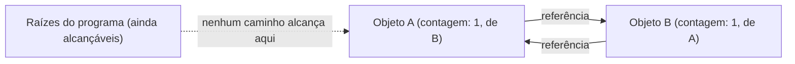
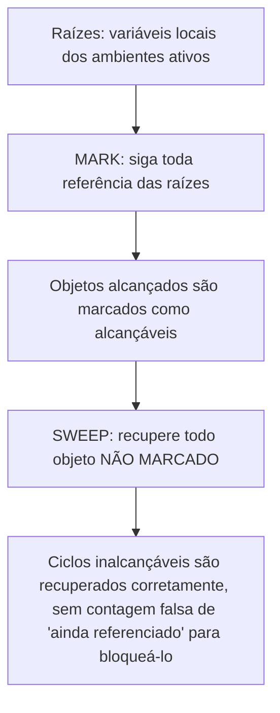

## Objetivos de Aprendizagem

- Explicar, em termos dos bugs de memória já cobertos em `c-and-assembly` (vazamentos e ponteiros pendurados), exatamente que problema o gerenciamento automático de memória é projetado para eliminar estruturalmente.
- Implementar a contagem de referências: incrementar uma contagem quando uma referência é criada, decrementar quando é descartada, recuperar quando a contagem chega a zero, e rastrear isso num exemplo concreto.
- Explicar o único ponto cego estrutural da contagem de referências: um ciclo de referências que mantém as contagens de dois objetos acima de zero para sempre, mesmo quando nada fora do ciclo consegue alcançar qualquer um deles.
- Descrever a coleta de lixo por rastreamento (mark-and-sweep) num nível conceitual: começar das raízes sabidamente alcançáveis, marcar tudo o que é alcançável, recuperar tudo o que não foi marcado, e explicar por que isso lida corretamente com ciclos onde a contagem de referências não consegue.
- Enunciar o custo real que o GC por rastreamento paga por resolver o problema dos ciclos, e conectar o trade-off inteiro de sistemas de runtime de volta aos ambientes que o interpretador desta disciplina já constrói.

## Contexto e Motivação

`c-and-assembly` já mostrou, em detalhe concreto e muitas vezes doloroso, o que acontece quando o gerenciamento de memória é inteiramente manual: um conceito `common-memory-bugs-leaks-and-dangling-pointers` demonstrou um VAZAMENTO DE MEMÓRIA (memória alocada cujo ponteiro é perdido, então ela nunca pode ser liberada, silenciosamente se acumulando até um programa ficar sem memória) e um PONTEIRO PENDURADO (memória liberada enquanto algo ainda segura uma referência a ela, então um acesso posterior lê ou escreve memória que desde então foi reaproveitada para algo inteiramente diferente). Ambos os bugs compartilham a mesma causa-raiz: um programador humano é responsável por chamar `free` no momento EXATAMENTE certo, nem cedo demais (ponteiro pendurado), nem nunca (vazamento), e acertar isso exatamente, à mão, por um programa grande, é genuinamente difícil.

O gerenciamento automático de memória existe especificamente para tornar essa CLASSE inteira de bug estruturalmente impossível: em vez de um programador decidir quando liberar memória, a própria RUNTIME DA LINGUAGEM rastreia quais objetos alocados ainda são alcançáveis e recupera exatamente os que não são, sem nenhuma chamada manual de `free` necessária (ou, na maioria dessas linguagens, sequer disponível) de forma alguma. Esse é o retorno direto em sistemas de runtime de tudo o que esta disciplina construiu antes: os ambientes já construídos para o interpretador desta disciplina (cadeias de objetos `Environment`, closures segurando referências a ambientes capturados) são, eles mesmos, exatamente o tipo de dado alocado no heap e ligado por referências que o coletor de lixo de uma runtime de linguagem real tem de gerenciar corretamente.

## Teoria Central

### Contagem de referências: o esquema automático mais simples

Anexe um contador a todo objeto alocado no heap, rastreando quantas referências atualmente apontam para ele:

```text
Quando uma nova referência a um objeto é criada (atribuída a uma variável, armazenada numa
  estrutura de dados, capturada por uma closure): incremente a sua contagem.
Quando uma referência é descartada (uma variável sai de escopo, é reatribuída, uma
  estrutura contentora é ela mesma liberada): decremente a sua contagem.
Quando uma contagem chega a zero: nenhuma referência em lugar nenhum do programa consegue alcançar este
  objeto por mais tempo, recupere-o imediatamente, e recursivamente decremente as
  contagens de qualquer coisa que ELE referenciou (já que essas referências agora também sumiram).
```

Isso elimina direta e completamente ambos os bugs já vistos: um vazamento é impossível (um objeto com contagem zero é recuperado imediata e automaticamente, no momento em que se torna inalcançável, não há como um programador simplesmente "esquecer" de liberá-lo, já que nenhuma chamada explícita de free existe de forma alguma); um ponteiro pendurado é impossível (um objeto nunca é recuperado enquanto QUALQUER referência a ele ainda existe, já que essa referência manteria a sua contagem acima de zero).

### O único ponto cego estrutural: ciclos de referências

A contagem de referências tem exatamente um modo de falha real e bem conhecido: um CICLO. Se o objeto A segura uma referência ao objeto B, e B segura uma referência DE VOLTA a A, cada um mantém a contagem do outro em pelo menos 1, mesmo que NADA fora desse par consiga alcançar qualquer um deles por mais tempo. Nenhuma contagem jamais chega a zero, então nenhum é jamais recuperado, apesar de ambos serem genuinamente lixo inalcançável do ponto de vista do resto do programa. Esse é um vazamento real e estrutural que a contagem de referências sozinha não consegue consertar, não importa quão cuidadosamente a própria contagem seja implementada.



### Coleta de lixo por rastreamento: mark-and-sweep

O GC por rastreamento resolve o problema dos ciclos abandonando os contadores por objeto inteiramente e, em vez disso, percorrendo periodicamente o grafo INTEIRO de referências começando de um conjunto fixo de RAÍZES conhecidas (variáveis globais, e as variáveis locais de todo ambiente/quadro-de-chamada atualmente ativo, precisamente o mesmo tipo de cadeias de ambiente que o interpretador desta disciplina vem construindo o tempo todo):

```text
Fase MARK:   começando de toda raiz, siga toda referência alcançável a partir dela,
             marcando cada objeto visitado como "alcançável". Isso naturalmente
             inclui objetos que são parte de um ciclo, DESDE QUE o próprio ciclo
             seja alcançável a partir de alguma raiz, mas corretamente EXCLUI um
             ciclo que não é alcançável de nada fora dele.

Fase SWEEP:  percorra todo objeto alocado; qualquer coisa NÃO marcada como "alcançável" é
             lixo, genuinamente inalcançável de qualquer raiz, ciclo ou não,
             e é recuperada.
```

Como o mark-and-sweep nunca depende de uma CONTAGEM por objeto, ele corretamente recupera o ciclo A/B da seção anterior: nem A nem B é alcançável de qualquer raiz, então nenhum é marcado durante a fase de marcação, então ambos são corretamente varridos como lixo, exatamente o caso que a contagem de referências estruturalmente não consegue tratar.



## Exemplos Resolvidos

### Exemplo 1: Contagem de referências recuperando corretamente um caso simples e acíclico

```text
env = Environment(parent=None)      # contagem de ref deste Environment: 1 (referenciado por "env")
closure = Closure(params=[], body=..., env=env)   # contagem de env: 2 (agora também referenciado por closure)

env = None                          # contagem de env: 1 (a variável "env" não mais o referencia,
                                     #   mas closure.env ainda o faz)
closure = None                      # contagem de env: 0 (nada o referencia mais) 
                                     #   → recuperado imediatamente, corretamente, sem vazamento
```

Esse é exatamente o comportamento correto e automático que uma implementação manual no estilo `c-and-assembly` teria precisado de uma chamada `free` EXPLÍCITA e cuidadosamente posicionada para alcançar, aqui ele acontece sem nenhum código escrito para ele de forma alguma.

### Exemplo 2: Um ciclo que a contagem de referências genuinamente não consegue recuperar

```text
class Node:
    def __init__(self):
        self.next = None

a = Node()   # contagem de a: 1 (referenciado pela variável "a")
b = Node()   # contagem de b: 1 (referenciado pela variável "b")
a.next = b   # contagem de b: 2 (também referenciado por a.next)
b.next = a   # contagem de a: 2 (também referenciado por b.next)

a = None     # contagem de a: 1 (ainda referenciado por b.next)
b = None     # contagem de b: 1 (ainda referenciado por a.next)

# Nem a nem b é alcançável de lugar nenhum do programa mais, mas nenhuma
# contagem é zero, já que cada um ainda segura uma referência ao outro. Sob a
# contagem de referências pura, ISTO É UM VAZAMENTO, ambos os objetos ficam não recuperados para sempre,
# apesar de serem genuinamente lixo.
```

### Exemplo 3: O mesmo ciclo, recuperado corretamente sob mark-and-sweep

```text
Raízes neste ponto do programa: (quaisquer que sejam as variáveis locais do ambiente
  atualmente ativo, criticamente, NEM "a" NEM "b" está entre elas mais,
  já que ambos foram postos em None).

Fase MARK: começa das raízes, segue referências, já que nenhuma raiz aponta para
  qualquer Node, NENHUM é marcado, APESAR do fato de eles ainda apontarem um
  para o outro.

Fase SWEEP: ambos os Nodes estão não marcados → ambos recuperados corretamente.
```

A exata mesma estrutura cíclica que derrotou a contagem de referências no Exemplo 2 é recuperada corretamente aqui, porque a correção do mark-and-sweep nunca dependeu de contar referências DE FORMA ALGUMA, só da alcançabilidade A PARTIR das raízes, que um ciclo isolado do resto do programa genuinamente não tem.

## Equívocos Comuns e Armadilhas

- **"O gerenciamento automático de memória é 'gratuito', ele não tem custo em tempo de execução em comparação com o gerenciamento manual."** Ele tem um custo real e honesto: a contagem de referências paga uma pequena sobrecarga em cada única criação e destruição de referência (um incremento ou decremento); o GC por rastreamento paga pausas periódicas e às vezes perceptíveis enquanto percorre o grafo inteiro de objetos alcançáveis. O gerenciamento manual (`malloc`/`free` de `c-and-assembly`) tem zero dessa sobrecarga, mas transfere o ônus inteiro de correção para o programador, um trade-off genuíno, não uma melhoria gratuita.
- **"Contagem de referências e GC por rastreamento são dois nomes para a mesma técnica."** São algoritmos estruturalmente diferentes com um modo de falha genuinamente diferente: a contagem de referências recupera incrementalmente, no instante em que uma contagem chega a zero, mas não consegue tratar ciclos de forma alguma; o GC por rastreamento recupera periodicamente, em lote, mas trata ciclos corretamente porque nunca depende de contagem em primeiro lugar.
- **"Uma linguagem com coleta de lixo nunca pode vazar memória."** Um vazamento LÓGICO ainda é possível, um objeto que ainda é tecnicamente ALCANÇÁVEL (talvez deixado acidentalmente num cache global ou numa lista que nunca é limpa) nunca será recuperado por nenhum esquema, já que ambos só recuperam o que é genuinamente INALCANÇÁVEL. A coleta de lixo elimina o vazamento no estilo `c-and-assembly` (ponteiro perdido, inalcançável, nunca liberado), mas não este tipo diferente, de nível de lógica.
- **"As raízes para o GC por rastreamento são algum conjunto especial e separado de variáveis que o coletor de lixo mantém por conta própria."** As raízes são exatamente as variáveis locais dos ambientes atualmente ativos, precisamente a mesma estrutura de cadeia de `Environment` que o interpretador desta disciplina vem construindo e passando pelas chamadas de `eval` o tempo todo; não há nenhuma estrutura de contabilidade separada necessária além do que o interpretador já tem.

## Resumo

O gerenciamento automático de memória elimina os bugs de vazamento e de ponteiro pendurado já demonstrados no material de gerenciamento manual de heap de `c-and-assembly` fazendo com que a runtime da linguagem, não o programador, decida quando recuperar memória. A contagem de referências (incrementar na criação de referência, decrementar na destruição, recuperar em zero) é simples e recupera imediatamente, mas tem um ponto cego estrutural real: um ciclo de objetos que se referenciam mutuamente e que é inalcançável do resto do programa ainda mantém toda contagem acima de zero para sempre. A coleta de lixo por rastreamento (mark-and-sweep: marcar tudo o que é alcançável a partir das raízes conhecidas, varrer tudo o que não foi marcado) trata ciclos corretamente, já que nunca depende de contagens por objeto, ao custo de passagens de coleta periódicas e em lote em vez da recuperação imediata e incremental da contagem de referências. As raízes para o GC por rastreamento são exatamente as cadeias de `Environment` ativas que o interpretador desta disciplina já constrói, a mesma estrutura usada por toda parte para a consulta de variáveis agora fazendo dupla função como ponto de partida para a análise de alcançabilidade. Isso fecha o arco de sistemas de runtime desta disciplina; o conceito final monta cada peça, scanner, parser, AST, ambiente, closures, verificador de tipos, num interpretador completo e funcional.

## Documentation Links

- [ACM/IEEE CS2013 — Programming Languages Knowledge Area](https://csed.acm.org/knowledge-areas-programming-languages-pl-cs2013-version/): lista os Sistemas de Runtime, incluindo o gerenciamento de memória, como material eletivo que esta disciplina cobre.
- [Nystrom — Crafting Interpreters, Ch. 26 (Garbage Collection)](https://craftinginterpreters.com/garbage-collection.html): uma implementação completa e real de mark-and-sweep seguindo esta exata estrutura.
