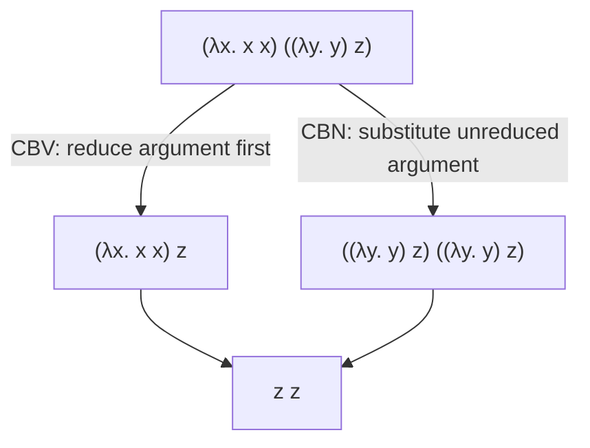

## Learning Objectives

- State the beta-reduction rule precisely: `(λx. t1) t2 → t1[x := t2]`, and explain substitution informally as "replace every free occurrence of x in t1 with t2."
- Explain variable capture — the specific way naive substitution can go wrong — and why bound variables sometimes need renaming to avoid it.
- Distinguish call-by-value (reduce the argument to a value before substituting) from call-by-name (substitute the unreduced argument directly), and trace both strategies on the same term where they behave differently.
- State the Church-Rosser (confluence) property informally: if a term can reduce two different ways, both paths eventually reach the same normal form — and explain why this justifies calling the lambda calculus's computation deterministic in its final answer, even though intermediate reduction ORDER is not.
- Connect evaluation strategy directly to a real, everyday language design decision: which real languages default to call-by-value and which support call-by-name-like laziness.

## Context & Motivation

The previous concept gave the lambda calculus its grammar — variable, abstraction, application — but a grammar alone says nothing about computation. Beta reduction is the lambda calculus's one and only computation rule: it is quite literally the "function call" mechanism, the single rule that turns a static piece of syntax into something that actually computes a result. Every evaluation that happens in the lambda calculus, no matter how large the term, ultimately bottoms out in repeated applications of this one rule.

But beta reduction alone under-specifies evaluation, in exactly the sense the previous concept's small-step framework flagged: given a term with MULTIPLE places a reduction could happen, which one happens first? This is not a minor implementation detail — it is a real, consequential design decision every actual programming language makes, whether or not its designers ever call it by name. Call-by-value (reduce arguments to values before substituting them in — what nearly every mainstream imperative and functional language does by default) and call-by-name (substitute the argument as-is, unreduced, and only evaluate it if and when it's actually used) are the two classical answers, and they produce genuinely different behavior on terms where the argument either diverges (never terminates) or has an observable side effect.

Why does this discipline introduce evaluation strategy this early, before even building an interpreter? Because the interpreter's `eval` function, built later in this discipline, has to make exactly this choice — and making it consciously, with the vocabulary to name the choice, is very different from accidentally picking one strategy by how the code happens to be structured.

## Core Theory

### Beta reduction and substitution

The one computation rule of the lambda calculus:

```text
(λx. t1) t2  →  t1[x := t2]              (E-AppAbs, "beta reduction")
```

Read this as: applying a function `λx. t1` to an argument `t2` steps to the function's body `t1`, with every free occurrence of `x` inside it replaced by `t2`. `t1[x := t2]` is the substitution notation — "in `t1`, substitute `t2` for `x`."

Two congruence rules let evaluation make progress inside larger terms, exactly as E-If did for the toy language:

```text
t1 → t1'
─────────────                          (E-App1 — reduce the function position first)
t1 t2 → t1' t2

t2 → t2'
─────────────                          (E-App2 — once t1 is a value, reduce the argument)
v1 t2 → v1 t2'
```

The ORDER in which E-App1, E-App2, and E-AppAbs are allowed to fire — which is exactly what call-by-value vs. call-by-name disagree about — is the entire content of the next section.

### Variable capture and why naive substitution can go wrong

Substitution has to be done carefully. Consider substituting `x` for `y` in the term `λx. y` (i.e., computing `(λx. y)[y := x]`) — a careless textual replacement would produce `λx. x`, which is WRONG: the free `x` being substituted in has been accidentally CAPTURED by the abstraction's own bound variable, turning a term that referred to some outer `x` into the identity function instead, a completely different meaning. The fix (used silently by every real implementation) is alpha-renaming: rename the bound variable to something fresh before substituting, e.g. rewrite `λx. y` to the equivalent `λz. y` first, so that substituting `x` for `y` correctly gives `λz. x`, with no capture. This is exactly why the free/bound distinction from the previous concept matters operationally, not just as terminology.

### Call-by-value vs. call-by-name

Given `(λx. t1) t2`, when is `t2` allowed to be substituted in?

- **Call-by-value (CBV).** `t2` must first be fully reduced to a VALUE before E-AppAbs may fire. E-App2 (reduce the argument) runs before E-AppAbs. This is what nearly every mainstream language — C, Java, Python, OCaml's default — actually does: arguments are evaluated before a function is entered.
- **Call-by-name (CBN).** `t2` is substituted into the body AS-IS, unevaluated; it only gets reduced later, if and when the substituted copy is actually used inside the body. E-AppAbs may fire immediately, with no requirement that `t2` be a value first.

The two strategies produce IDENTICAL final answers when both terminate (a consequence of confluence, next section) — the difference only shows up on terms where the argument either never terminates or is used zero or multiple times.

### Confluence (the Church-Rosser theorem)

The lambda calculus has a real, proved property called CONFLUENCE (or the Church-Rosser theorem): if a term `t` can reduce to two different terms `t1` and `t2` by different reduction choices, there exists some further term `t3` that both `t1` and `t2` can eventually reduce to. Informally: however you choose to reduce along the way, if the process terminates at all, it terminates at the SAME final answer (its normal form). This is exactly why it makes sense to say "the lambda calculus computes a deterministic result," even though which specific reduction happens first is genuinely a strategy choice, not fixed by the calculus itself.



## Worked Examples

### Example 1: A basic beta reduction, step by step

```text
(λx. x x) (λy. y)
  → { E-AppAbs, substitute (λy. y) for x in "x x" }
(λy. y) (λy. y)
  → { E-AppAbs, substitute (λy. y) for y in "y" }
λy. y
```

Two steps, no ambiguity here since there's only one reducible position each time — this term reaches the normal form `λy. y` (the identity function) regardless of strategy.

### Example 2: CBV vs. CBN diverging in observable behavior

Consider a term where the argument would loop forever if evaluated, but the function never actually uses its argument: `(λx. λy. y) Ω`, where `Ω ≡ (λz. z z) (λz. z z)` is the classic non-terminating term (`Ω → Ω → Ω → ...` forever, since applying `λz. z z` to itself always produces the exact same term again).

- **Under CBV**: E-App2 requires reducing the argument `Ω` to a value FIRST, before beta reduction is even allowed to fire. Since `Ω` never reduces to a value, evaluation never terminates — the whole program diverges, even though the function body never uses its argument.
- **Under CBN**: `Ω` is substituted in unevaluated: `(λx. λy. y) Ω → λy. y` immediately, by beta reduction alone. Since the body `λy. y` never actually uses `x`, `Ω` is simply discarded, substituted in but never forced to reduce — the program terminates cleanly with the identity function as its answer.

This is the real, observable behavioral difference the strategy choice produces — not merely a performance difference, but a termination difference.

### Example 3: Real languages and their default strategy

```text
Language                  Default strategy
------------------------  ------------------------------------------
C, Java, Python, OCaml    Call-by-value (arguments evaluated eagerly, before the call)
Haskell                   Call-by-need (a memoized refinement of call-by-name — evaluate
                          lazily, but cache the result so repeated uses aren't re-evaluated)
```

Haskell's laziness is exactly the CBN idea, refined: naive call-by-name would re-evaluate `t2` every single time it's used inside the body (wasteful if it's used more than once); call-by-need adds memoization so an argument is evaluated at most once, the first time it's actually needed, and every subsequent use reuses that cached result.

## Common Misconceptions & Pitfalls

- **"Call-by-value and call-by-name always give different final answers."** For terms where BOTH strategies terminate, confluence guarantees they reach the identical normal form — they only diverge in observable behavior on terms involving non-termination or, in real languages, side effects (an argument evaluated once under CBV vs. potentially never or multiple times under naive CBN).
- **"Substituting `t2` for `x` in `t1` is just textual find-and-replace."** Naive textual replacement can accidentally capture a free variable in `t2` under a bound variable already present in `t1` — real substitution requires alpha-renaming (picking a fresh bound-variable name) exactly to prevent this, as shown in the capture example above.
- **"Confluence means reduction order doesn't matter at all."** It means the FINAL answer (if reached) doesn't depend on order — but whether a final answer is reached at all (termination) very much can depend on order, as the CBV-vs-CBN divergence example shows directly.
- **"Lazy evaluation (Haskell) is just call-by-name."** It's call-by-name PLUS memoization (call-by-need) — plain call-by-name would re-do the work of evaluating an argument every time it's referenced in the body; call-by-need caches the first evaluation so later uses are free.

## Summary

Beta reduction, `(λx. t1) t2 → t1[x := t2]`, is the lambda calculus's single computation rule, with substitution requiring care (alpha-renaming) to avoid accidentally capturing a free variable under an unrelated bound one with the same name. Call-by-value (reduce the argument to a value first) and call-by-name (substitute the argument unevaluated, force it only when used) are the two classical evaluation strategies choosing WHEN beta reduction is allowed to fire relative to argument reduction — they agree on the final answer whenever both terminate (a consequence of the calculus's confluence property) but can genuinely diverge on termination itself, as the `Ω`-argument example shows. Nearly every mainstream language defaults to call-by-value; Haskell's laziness is call-by-name refined with memoization into call-by-need. The next concept builds on this exact machinery to show the lambda calculus's real computational power: encoding booleans, numbers, and recursion using nothing but the three constructs and this one reduction rule.

## Documentation Links

- [Pierce — Types and Programming Languages, Ch. 5 (The Untyped Lambda-Calculus)](https://www.cis.upenn.edu/~bcpierce/tapl/contents.pdf) — the canonical presentation of beta reduction, substitution, and evaluation strategies.
- [Stanford CS242 — Programming Languages](https://web.stanford.edu/class/cs242/) — covers evaluation strategy as a real language-design decision, not just a theoretical detail.
