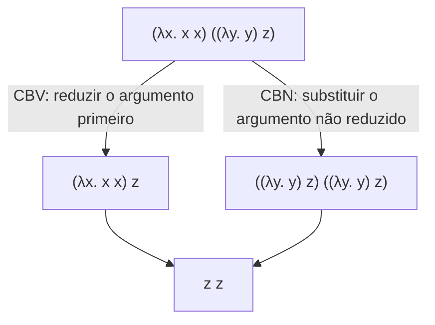

## Objetivos de Aprendizagem

- Enunciar a regra de redução beta precisamente: `(λx. t1) t2 → t1[x := t2]`, e explicar a substituição informalmente como "substituir toda ocorrência livre de x em t1 por t2".
- Explicar a captura de variável, a forma específica em que a substituição ingênua pode dar errado, e por que variáveis ligadas às vezes precisam ser renomeadas para evitá-la.
- Distinguir call-by-value (reduzir o argumento a um valor antes de substituir) de call-by-name (substituir o argumento não reduzido diretamente), e rastrear ambas as estratégias no mesmo termo onde elas se comportam de forma diferente.
- Enunciar a propriedade de Church-Rosser (confluência) informalmente: se um termo pode reduzir de duas formas diferentes, ambos os caminhos eventualmente alcançam a mesma forma normal, e explicar por que isso justifica chamar a computação do cálculo lambda de determinística na sua resposta final, mesmo que a ORDEM de redução intermediária não seja.
- Conectar a estratégia de avaliação diretamente a uma decisão de design de linguagem real e cotidiana: quais linguagens reais usam call-by-value por padrão e quais suportam laziness parecida com call-by-name.

## Contexto e Motivação

O conceito anterior deu ao cálculo lambda a sua gramática, variável, abstração, aplicação, mas uma gramática sozinha nada diz sobre computação. A redução beta é a única e exclusiva regra de computação do cálculo lambda: ela é bem literalmente o mecanismo de "chamada de função", a única regra que transforma uma peça estática de sintaxe em algo que de fato computa um resultado. Toda avaliação que acontece no cálculo lambda, não importa quão grande o termo, em última instância chega ao fundo em aplicações repetidas desta única regra.

Mas a redução beta sozinha subespecifica a avaliação, exatamente no sentido que o arcabouço de passo pequeno do conceito anterior sinalizou: dado um termo com MÚLTIPLOS lugares onde uma redução poderia acontecer, qual acontece primeiro? Este não é um detalhe de implementação menor, é uma decisão de design real e consequente que toda linguagem de programação de fato faz, quer os seus projetistas a chamem pelo nome ou não. Call-by-value (reduzir os argumentos a valores antes de substituí-los, o que quase toda linguagem imperativa e funcional mainstream faz por padrão) e call-by-name (substituir o argumento como está, não reduzido, e só avaliá-lo se e quando de fato for usado) são as duas respostas clássicas, e elas produzem comportamento genuinamente diferente em termos onde o argumento ou diverge (nunca termina) ou tem um efeito colateral observável.

Por que esta disciplina introduz a estratégia de avaliação tão cedo, antes mesmo de construir um interpretador? Porque a função `eval` do interpretador, construída depois nesta disciplina, tem de fazer exatamente esta escolha, e fazê-la conscientemente, com o vocabulário para nomear a escolha, é muito diferente de acidentalmente escolher uma estratégia por como o código por acaso está estruturado.

## Teoria Central

### Redução beta e substituição

A única regra de computação do cálculo lambda:

```text
(λx. t1) t2  →  t1[x := t2]              (E-AppAbs, "redução beta")
```

Leia isto como: aplicar uma função `λx. t1` a um argumento `t2` dá um passo para o corpo da função `t1`, com toda ocorrência livre de `x` dentro dele substituída por `t2`. `t1[x := t2]` é a notação de substituição, "em `t1`, substitua `t2` por `x`".

Duas regras de congruência deixam a avaliação fazer progresso dentro de termos maiores, exatamente como E-If fazia para a linguagem de brinquedo:

```text
t1 → t1'
─────────────                          (E-App1: reduzir a posição de função primeiro)
t1 t2 → t1' t2

t2 → t2'
─────────────                          (E-App2: uma vez que t1 é um valor, reduzir o argumento)
v1 t2 → v1 t2'
```

A ORDEM em que E-App1, E-App2 e E-AppAbs têm permissão de disparar, que é exatamente sobre o que call-by-value vs. call-by-name discordam, é o conteúdo inteiro da próxima seção.

### Captura de variável e por que a substituição ingênua pode dar errado

A substituição tem de ser feita cuidadosamente. Considere substituir `x` por `y` no termo `λx. y` (isto é, computar `(λx. y)[y := x]`), uma substituição textual descuidada produziria `λx. x`, que está ERRADO: o `x` livre sendo substituído foi acidentalmente CAPTURADO pela própria variável ligada da abstração, transformando um termo que se referia a algum `x` externo na função identidade em vez disso, um significado completamente diferente. O conserto (usado silenciosamente por toda implementação real) é a renomeação alfa: renomear a variável ligada para algo fresco antes de substituir, por exemplo reescrever `λx. y` para o equivalente `λz. y` primeiro, para que substituir `x` por `y` corretamente dê `λz. x`, sem captura. É exatamente por isso que a distinção livre/ligado do conceito anterior importa operacionalmente, não só como terminologia.

### Call-by-value vs. call-by-name

Dado `(λx. t1) t2`, quando `t2` tem permissão de ser substituído?

- **Call-by-value (CBV).** `t2` tem de primeiro ser totalmente reduzido a um VALOR antes de E-AppAbs poder disparar. E-App2 (reduzir o argumento) roda antes de E-AppAbs. É o que quase toda linguagem mainstream, C, Java, Python, o padrão do OCaml, de fato faz: argumentos são avaliados antes de uma função ser adentrada.
- **Call-by-name (CBN).** `t2` é substituído no corpo COMO ESTÁ, não avaliado; ele só é reduzido depois, se e quando a cópia substituída de fato for usada dentro do corpo. E-AppAbs pode disparar imediatamente, sem exigência de que `t2` seja um valor primeiro.

As duas estratégias produzem respostas finais IDÊNTICAS quando ambas terminam (uma consequência da confluência, próxima seção), a diferença só aparece em termos onde o argumento ou nunca termina ou é usado zero ou múltiplas vezes.

### Confluência (o teorema de Church-Rosser)

O cálculo lambda tem uma propriedade real e provada chamada CONFLUÊNCIA (ou o teorema de Church-Rosser): se um termo `t` pode reduzir a dois termos diferentes `t1` e `t2` por escolhas de redução diferentes, existe algum termo adicional `t3` ao qual tanto `t1` quanto `t2` conseguem eventualmente reduzir. Informalmente: qualquer que seja a forma como você escolha reduzir ao longo do caminho, se o processo termina de todo, ele termina na MESMA resposta final (a sua forma normal). É exatamente por isso que faz sentido dizer "o cálculo lambda computa um resultado determinístico", mesmo que qual redução específica acontece primeiro seja genuinamente uma escolha de estratégia, não fixada pelo próprio cálculo.



## Exemplos Resolvidos

### Exemplo 1: Uma redução beta básica, passo a passo

```text
(λx. x x) (λy. y)
  → { E-AppAbs, substituir (λy. y) por x em "x x" }
(λy. y) (λy. y)
  → { E-AppAbs, substituir (λy. y) por y em "y" }
λy. y
```

Dois passos, nenhuma ambiguidade aqui já que há só uma posição reduzível de cada vez, este termo alcança a forma normal `λy. y` (a função identidade) independentemente da estratégia.

### Exemplo 2: CBV vs. CBN divergindo em comportamento observável

Considere um termo onde o argumento laçaria para sempre se avaliado, mas a função nunca de fato usa o seu argumento: `(λx. λy. y) Ω`, onde `Ω ≡ (λz. z z) (λz. z z)` é o termo não terminante clássico (`Ω → Ω → Ω → ...` para sempre, já que aplicar `λz. z z` a si mesmo sempre produz o exato mesmo termo de novo).

- **Sob CBV**: E-App2 exige reduzir o argumento `Ω` a um valor PRIMEIRO, antes de a redução beta sequer ter permissão de disparar. Já que `Ω` nunca reduz a um valor, a avaliação nunca termina, o programa inteiro diverge, mesmo que o corpo da função nunca use o seu argumento.
- **Sob CBN**: `Ω` é substituído não avaliado: `(λx. λy. y) Ω → λy. y` imediatamente, por redução beta sozinha. Já que o corpo `λy. y` nunca de fato usa `x`, `Ω` é simplesmente descartado, substituído mas nunca forçado a reduzir, o programa termina de forma limpa com a função identidade como a sua resposta.

Esta é a diferença comportamental real e observável que a escolha de estratégia produz, não meramente uma diferença de desempenho, mas uma diferença de terminação.

### Exemplo 3: Linguagens reais e a sua estratégia padrão

```text
Linguagem                 Estratégia padrão
------------------------  ------------------------------------------
C, Java, Python, OCaml    Call-by-value (argumentos avaliados avidamente, antes da chamada)
Haskell                   Call-by-need (um refinamento memoizado do call-by-name: avaliar
                          preguiçosamente, mas cachear o resultado para que usos repetidos não sejam reavaliados)
```

A laziness de Haskell é exatamente a ideia de CBN, refinada: o call-by-name ingênuo reavaliaria `t2` toda única vez que fosse usado dentro do corpo (desperdício se é usado mais de uma vez); o call-by-need adiciona memoização para que um argumento seja avaliado no máximo uma vez, a primeira vez em que de fato é necessário, e todo uso subsequente reusa esse resultado cacheado.

## Equívocos Comuns e Armadilhas

- **"Call-by-value e call-by-name sempre dão respostas finais diferentes."** Para termos onde AMBAS as estratégias terminam, a confluência garante que elas alcançam a forma normal idêntica, elas só divergem em comportamento observável em termos envolvendo não terminação ou, em linguagens reais, efeitos colaterais (um argumento avaliado uma vez sob CBV vs. potencialmente nunca ou múltiplas vezes sob CBN ingênuo).
- **"Substituir `t2` por `x` em `t1` é só find-and-replace textual."** A substituição textual ingênua pode acidentalmente capturar uma variável livre em `t2` sob uma variável ligada já presente em `t1`, a substituição real exige renomeação alfa (escolher um nome de variável ligada fresco) exatamente para prevenir isto, como mostrado no exemplo de captura acima.
- **"Confluência significa que a ordem de redução não importa de forma alguma."** Ela significa que a resposta FINAL (se alcançada) não depende da ordem, mas se uma resposta final é alcançada de todo (terminação) muito bem pode depender da ordem, como o exemplo de divergência CBV-vs-CBN mostra diretamente.
- **"Avaliação preguiçosa (Haskell) é só call-by-name."** É call-by-name MAIS memoização (call-by-need), o call-by-name puro refaria o trabalho de avaliar um argumento toda vez que fosse referenciado no corpo; o call-by-need cacheia a primeira avaliação para que usos posteriores sejam gratuitos.

## Resumo

A redução beta, `(λx. t1) t2 → t1[x := t2]`, é a única regra de computação do cálculo lambda, com a substituição exigindo cuidado (renomeação alfa) para evitar acidentalmente capturar uma variável livre sob uma ligada não relacionada com o mesmo nome. Call-by-value (reduzir o argumento a um valor primeiro) e call-by-name (substituir o argumento não avaliado, forçá-lo só quando usado) são as duas estratégias de avaliação clássicas escolhendo QUANDO a redução beta tem permissão de disparar em relação à redução do argumento, elas concordam na resposta final sempre que ambas terminam (uma consequência da propriedade de confluência do cálculo) mas podem genuinamente divergir na própria terminação, como o exemplo de argumento `Ω` mostra. Quase toda linguagem mainstream usa call-by-value por padrão; a laziness de Haskell é call-by-name refinada com memoização em call-by-need. O próximo conceito constrói sobre esta exata maquinaria para mostrar o poder computacional real do cálculo lambda: codificar booleanos, números e recursão usando nada além dos três construtos e desta única regra de redução.

## Documentation Links

- [Pierce — Types and Programming Languages, Ch. 5 (The Untyped Lambda-Calculus)](https://www.cis.upenn.edu/~bcpierce/tapl/contents.pdf): a apresentação canônica de redução beta, substituição e estratégias de avaliação.
- [Stanford CS242 — Programming Languages](https://web.stanford.edu/class/cs242/): cobre a estratégia de avaliação como uma decisão de design de linguagem real, não só um detalhe teórico.
