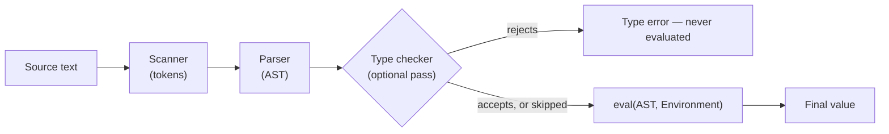

## Learning Objectives

- Assemble every piece built across this discipline — scanner, parser, environment, evaluator, and a minimal type checker — into one complete, working interpreter for a small language.
- Trace a single, non-trivial program (a recursive function, computing a real result) all the way from raw source text to its final value, naming which concept implemented each stage of the pipeline.
- Explain, with concrete evidence gathered across this discipline, why the tree-walking strategy chosen throughout is honestly the right teaching vehicle but not the right production strategy — restating both this discipline's own cost findings (redundant dispatch, doubled call-stack usage) precisely.
- State this discipline's real, evidence-based boundary against its two siblings — `programming-paradigms` (features, not implementation) and the still-empty `compilers` (real machine-code generation, not a tree-walking `eval`) — one final time, now that the whole pipeline is visible at once.
- Identify, honestly, what a genuinely complete language implementation would still need beyond what this discipline built (a standard library, proper error messages with source locations, performance optimization) — signposting further study rather than claiming false completeness.

## Context & Motivation

Every concept in this discipline has built one piece of a working language implementation, each introduced with the specific new idea it contributes and connected explicitly, wherever a genuine link existed, to material already published elsewhere in this curriculum: formal semantics gave a precise, on-paper definition of meaning; the lambda calculus showed that minimal core is nonetheless Turing-complete; scanning, parsing, and evaluation built a complete pipeline from raw text to a computed value; environments and closures gave that pipeline real, correctly-scoped variables and functions; type checking showed how an entirely separate pass can catch a whole class of error before any of it runs; automatic memory management closed the loop back to the manual heap-management bugs `c-and-assembly` demonstrated. This capstone's job is not to introduce anything new, but to assemble all of it — literally wire the pieces together into one program — and to trace a single real example through the ENTIRE pipeline at once, the way `digital-logic-computer-organization`'s own capstone assembled gates, an ALU, and a control unit into one working CPU.

## Core Theory

### The complete pipeline, assembled

```python
def run(source_text, global_env):
    tokens = scan(source_text)                    # Lexical Analysis
    ast = parse(tokens)                            # Parsing (recursive descent)
    check_type(ast, initial_typing_context)        # Type Checking (optional pass —
                                                    #   this discipline's interpreter can
                                                    #   run with or without it, since it
                                                    #   was built as SEPARATE from eval)
    result = eval(ast, global_env)                 # Evaluation (tree-walking)
    return result
```

Notice this pipeline directly embodies a real design point this discipline established early: type checking is a SEPARATE PASS from evaluation, not interleaved with it — exactly the static-typing discipline covered two concepts ago, where the whole point was catching errors BEFORE any evaluation begins, not during it. A dynamically-typed variant of this same interpreter would simply skip the `check_type` line entirely and go straight from AST to `eval` — both are legitimate, complete configurations of the exact same underlying pipeline.



### Why tree-walking was the right teaching choice, restated with evidence

This discipline was explicit, from its opening concept, that tree-walking is the simplest complete execution strategy — not the fastest, and not what most production systems ultimately ship. Two concrete costs were demonstrated directly, not merely asserted: repeated, uncached dispatch work on every single re-evaluation of the same expression (shown numerically when `eval` was first introduced), and a doubled, lockstep growth of two separate call stacks — the interpreted program's `Environment` chain and the interpreter's own host-language recursion — that can cause a moderately recursive interpreted program to exhaust the host language's stack limit at a depth a compiled program would find completely unremarkable (shown concretely with the 2000-deep factorial example). Both costs are real and were shown with numbers, not hand-waved — exactly the honesty this discipline committed to from its first concept onward.

### The final boundary check, now that the whole pipeline is visible

- **vs. `programming-paradigms`**: that discipline asked what a language lets a programmer SAY (OOP, functional, logic, concurrent styles, compared); this discipline asked how a machine makes what was said actually HAPPEN. Both are now complete, and neither repeated the other's material — `programming-paradigms`'s closures-as-a-feature and this discipline's closures-as-a-`(code, env)`-pair are the clearest single example of the two disciplines' genuinely different angles on the identical underlying concept.
- **vs. `compilers`** (still empty): this discipline stopped at a tree-walking `eval` — no intermediate representation, no optimization pass, no real machine-code generation. `compilers`'s full pipeline (lexer → parser → AST → semantic analysis → IR → optimization → machine code) reuses this discipline's scanning and parsing stages nearly verbatim, but continues into everything genuinely NEW past evaluation: compiling to an intermediate representation, optimizing it, and generating real machine code (reusing the ISA-level material already covered in `digital-logic-computer-organization` and `c-and-assembly` as its actual TARGET).

## Worked Examples

### Example 1: Tracing a recursive factorial function through the entire pipeline

Source: `let factorial = λn. if (n == 0) then 1 else n * factorial(n - 1) in factorial(3)`

```text
1. Scanning: produces tokens [LET, IDENTIFIER("factorial"), EQUALS, LAMBDA,
   IDENTIFIER("n"), DOT, IF, ...] — every keyword, identifier, and operator
   correctly separated (Lexical Analysis concept).

2. Parsing: builds an AST — a LetExpr binding "factorial" to a LambdaExpr,
   whose body is an IfExpr comparing n to 0, with a recursive CallExpr in its
   else-branch (Parsing concept).

3. Type checking (if enabled): infers or checks that factorial : Nat → Nat,
   confirming every branch of the internal if-expression agrees in type, and
   that the recursive call's argument type matches (Type Systems concepts).

4. Evaluation: eval() on the LetExpr creates a Closure for factorial, capturing
   the environment where "factorial" itself will be defined — the SAME
   self-reference challenge the Y combinator concept raised abstractly, here
   handled concretely by binding "factorial" into the environment BEFORE
   evaluating the closure's own body, so recursive calls can find it
   (Environments/Closures concepts). Calling factorial(3) recurses through
   eval() three times, building three Environment frames AND three real host
   eval() call frames simultaneously (Functions/Call Stack concept), each
   time multiplying n by the recursive result of factorial(n-1), bottoming
   out at factorial(0) = 1.

Final result: 6
```

Every single stage of this trace names the specific concept in this discipline responsible for it — nothing in this trace required anything not already built, piece by piece, across the discipline.

### Example 2: The same program, but with a genuine type error introduced

```text
let factorial = λn. if (n == 0) then 1 else "oops" * factorial(n - 1) in factorial(3)
```

With type checking enabled, this is rejected BEFORE `eval` ever runs — the `else`-branch's `"oops" * factorial(n - 1)` requires `"oops"` to have type `Nat` (for `*` to type-check), but it's a string literal — exactly the same category of rejection the Type Checking concepts demonstrated abstractly, now caught concretely on a program that otherwise looks nearly identical to a correct one, with only `n * ...` changed to `"oops" * ...`.

### Example 3: Honestly listing what a genuinely production-ready implementation still needs

```text
Built in this discipline:            Still needed for a REAL, shippable language:
  - Scanning, parsing                  - Better error messages (source line/column,
  - Tree-walking evaluation               not just "type error somewhere")
  - Environments, closures              - A standard library (I/O, collections,
  - A minimal type checker,               string manipulation — none of which this
    with inference                        discipline's toy language has)
  - Reference counting / tracing GC     - Performance: bytecode compilation or JIT
    (conceptually)                        (this discipline's `compilers` sibling,
                                           still empty, is where that begins)
```

This list is included deliberately, as this discipline's honest closing statement: what was built here is a real, complete, CONCEPTUALLY correct interpreter — not a toy with hidden gaps in its reasoning — but it is also not, and was never claimed to be, a production-grade language implementation ready to ship.

## Common Misconceptions & Pitfalls

- **"A capstone concept is where genuinely new material gets introduced."** This one deliberately introduces nothing new — its entire value is in ASSEMBLY and TRACING, showing that the pieces built separately across many concepts actually fit together into one coherent, working system, exactly the role `digital-logic-computer-organization`'s own capstone played for its CPU.
- **"Since this discipline built a complete interpreter, it's equivalent to a real production language implementation."** Example 3's honest gap list is the direct rebuttal — a real language needs a standard library, production-quality error reporting, and serious performance work this discipline's scope never claimed to cover.
- **"Type checking must happen interleaved with evaluation, checking each expression right before it's evaluated."** The assembled pipeline shows the opposite, deliberately: type checking is a SEPARATE, complete pass over the whole AST, finished entirely before `eval` is ever called — exactly what makes it possible to reject Example 2's program without ever running a single step of it.
- **"This discipline and `compilers` cover overlapping, redundant material."** Scanning and parsing genuinely ARE shared groundwork (and `compilers`, when written, should cross-link back rather than re-derive them) — but everything from evaluation onward diverges completely: this discipline stops at a tree-walking `eval`, while `compilers` continues into intermediate representations, optimization, and real machine-code generation that this discipline never attempted.

## Summary

This capstone wires together every piece built across this discipline — scanner, parser, environment, tree-walking evaluator, and an optional type-checking pass — into one complete, working interpreter, traced end-to-end on a real recursive factorial program (Example 1) and shown correctly rejecting a genuinely ill-typed variant before ever evaluating it (Example 2). The tree-walking strategy chosen throughout was the right teaching vehicle specifically because it could be built COMPLETELY within this discipline's scope, at the honestly-disclosed cost of redundant dispatch and doubled call-stack growth demonstrated with real numbers earlier in this discipline — not the strategy a production system would ultimately choose, which is exactly why `compilers`, still empty, exists as a separate, further discipline rather than this one simply going further on its own. What's built here is conceptually complete and correct; what's still needed for a genuinely shippable language — a standard library, real error diagnostics, and serious performance work — is named honestly rather than glossed over, closing this discipline the same way every prior discipline in this curriculum has closed: with an honest accounting of scope, not an inflated claim of completeness.

## Documentation Links

- [Nystrom — Crafting Interpreters, Part II (A Tree-Walk Interpreter)](https://craftinginterpreters.com/a-tree-walk-interpreter.html) — the complete, real reference implementation this discipline's pipeline follows in structure.
- [ACM/IEEE CS2013 — Programming Languages Knowledge Area](https://csed.acm.org/knowledge-areas-programming-languages-pl-cs2013-version/) — the curriculum source whose core/elective split framed this discipline's entire scope from its first concept to this final one.
