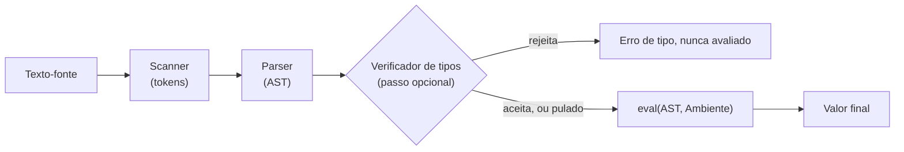

## Objetivos de Aprendizagem

- Montar cada peça construída por toda esta disciplina, scanner, parser, ambiente, avaliador e um verificador de tipos mínimo, num interpretador completo e funcional para uma pequena linguagem.
- Rastrear um único programa não trivial (uma função recursiva, computando um resultado real) desde o texto-fonte bruto até o seu valor final, nomeando qual conceito implementou cada estágio do pipeline.
- Explicar, com evidência concreta reunida por toda esta disciplina, por que a estratégia tree-walking escolhida o tempo todo é honestamente o veículo de ensino certo mas não a estratégia de produção certa, reafirmando com precisão ambos os achados de custo desta disciplina (despacho redundante, uso dobrado da pilha de chamadas).
- Enunciar o limite real, baseado em evidência, desta disciplina contra os seus dois irmãos, `programming-paradigms` (recursos, não implementação) e a ainda vazia `compilers` (geração de código de máquina real, não um `eval` tree-walking), uma última vez, agora que o pipeline inteiro está visível de uma vez.
- Identificar, honestamente, o que uma implementação de linguagem genuinamente completa ainda precisaria além do que esta disciplina construiu (uma biblioteca padrão, mensagens de erro apropriadas com localizações de fonte, otimização de desempenho), sinalizando estudo adicional em vez de reivindicar falsa completude.

## Contexto e Motivação

Cada conceito nesta disciplina construiu uma peça de uma implementação de linguagem funcional, cada um introduzido com a ideia nova específica que contribui e conectado explicitamente, sempre que um vínculo genuíno existia, a material já publicado em outro lugar deste currículo: a semântica formal deu uma definição precisa, no papel, de significado; o cálculo lambda mostrou que esse núcleo mínimo é, ainda assim, Turing-completo; scanning, parsing e avaliação construíram um pipeline completo do texto bruto a um valor computado; ambientes e closures deram a esse pipeline variáveis e funções reais e corretamente escopadas; a verificação de tipos mostrou como um passo inteiramente separado pode pegar uma classe inteira de erro antes de qualquer parte rodar; o gerenciamento automático de memória fechou o laço de volta aos bugs de gerenciamento manual de heap que `c-and-assembly` demonstrou. O trabalho deste capstone não é introduzir nada novo, mas montar tudo isso, literalmente ligar as peças em conjunto num programa, e rastrear um único exemplo real pelo pipeline INTEIRO de uma vez, da forma como o próprio capstone de `digital-logic-computer-organization` montou portas lógicas, uma ALU e uma unidade de controle numa CPU funcional.

## Teoria Central

### O pipeline completo, montado

```python
def run(source_text, global_env):
    tokens = scan(source_text)                    # Análise Léxica
    ast = parse(tokens)                            # Parsing (descida recursiva)
    check_type(ast, initial_typing_context)        # Verificação de Tipos (passo opcional:
                                                    #   o interpretador desta disciplina pode
                                                    #   rodar com ou sem ela, já que foi
                                                    #   construída SEPARADA de eval)
    result = eval(ast, global_env)                 # Avaliação (tree-walking)
    return result
```

Repare que este pipeline encarna diretamente um ponto de design real que esta disciplina estabeleceu cedo: a verificação de tipos é um PASSO SEPARADO da avaliação, não intercalado com ela, exatamente a disciplina de tipagem estática coberta dois conceitos atrás, onde o ponto inteiro era pegar erros ANTES de qualquer avaliação começar, não durante ela. Uma variante dinamicamente tipada deste mesmo interpretador simplesmente pularia a linha `check_type` inteiramente e iria direto da AST para `eval`, ambas sendo configurações legítimas e completas do exato mesmo pipeline subjacente.



### Por que tree-walking foi a escolha de ensino certa, reafirmada com evidência

Esta disciplina foi explícita, desde o seu conceito de abertura, de que tree-walking é a estratégia de execução completa mais simples, não a mais rápida, e não o que a maioria dos sistemas de produção acaba por entregar. Dois custos concretos foram demonstrados diretamente, não meramente afirmados: trabalho de despacho repetido e sem cache em toda única reavaliação da mesma expressão (mostrado numericamente quando `eval` foi introduzido pela primeira vez), e um crescimento dobrado e em passo-de-trava de duas pilhas de chamadas separadas, a cadeia de `Ambiente` do programa interpretado e a própria recursão da linguagem hospedeira do interpretador, que pode fazer um programa interpretado moderadamente recursivo esgotar o limite de pilha da linguagem hospedeira numa profundidade que um programa compilado acharia completamente banal (mostrado concretamente com o exemplo de fatorial de 2000 de profundidade). Ambos os custos são reais e foram mostrados com números, não acenados com a mão, exatamente a honestidade com a qual esta disciplina se comprometeu desde o seu primeiro conceito em diante.

### A checagem final de limite, agora que o pipeline inteiro está visível

- **vs. `programming-paradigms`**: aquela disciplina perguntou o que uma linguagem deixa um programador DIZER (estilos OOP, funcional, lógico, concorrente, comparados); esta disciplina perguntou como uma máquina faz o que foi dito de fato ACONTECER. Ambas estão agora completas, e nenhuma repetiu o material da outra, as closures-como-recurso de `programming-paradigms` e as closures-como-par-`(código, ambiente)` desta disciplina sendo o exemplo único mais claro dos ângulos genuinamente diferentes das duas disciplinas sobre o conceito subjacente idêntico.
- **vs. `compilers`** (ainda vazia): esta disciplina parou num `eval` tree-walking, sem representação intermediária, sem passo de otimização, sem geração de código de máquina real. O pipeline completo de `compilers` (lexer → parser → AST → análise semântica → IR → otimização → código de máquina) reusa os estágios de scanning e parsing desta disciplina quase ao pé da letra, mas continua para tudo que é genuinamente NOVO depois da avaliação: compilar para uma representação intermediária, otimizá-la e gerar código de máquina real (reusando o material de nível de ISA já coberto em `digital-logic-computer-organization` e `c-and-assembly` como o seu ALVO de fato).

## Exemplos Resolvidos

### Exemplo 1: Rastreando uma função fatorial recursiva pelo pipeline inteiro

Fonte: `let factorial = λn. if (n == 0) then 1 else n * factorial(n - 1) in factorial(3)`

```text
1. Scanning: produz tokens [LET, IDENTIFIER("factorial"), EQUALS, LAMBDA,
   IDENTIFIER("n"), DOT, IF, ...], cada palavra-chave, identificador e operador
   corretamente separado (conceito de Análise Léxica).

2. Parsing: constrói uma AST, um LetExpr ligando "factorial" a um LambdaExpr,
   cujo corpo é um IfExpr comparando n a 0, com um CallExpr recursivo no seu
   ramo else (conceito de Parsing).

3. Verificação de tipos (se habilitada): infere ou verifica que factorial : Nat → Nat,
   confirmando que todo ramo da if-expression interna concorda em tipo, e
   que o tipo do argumento da chamada recursiva corresponde (conceitos de Sistemas de Tipos).

4. Avaliação: eval() no LetExpr cria uma Closure para factorial, capturando
   o ambiente onde "factorial" ele mesmo será definido, o MESMO
   desafio de autorreferência que o conceito do combinador Y levantou abstratamente, aqui
   tratado concretamente ligando "factorial" ao ambiente ANTES de
   avaliar o próprio corpo da closure, para que chamadas recursivas possam encontrá-lo
   (conceitos de Ambientes/Closures). Chamar factorial(3) recursa por
   eval() três vezes, construindo três quadros de Ambiente E três quadros reais de
   chamada eval() hospedeira simultaneamente (conceito de Funções/Pilha de Chamadas), cada
   vez multiplicando n pelo resultado recursivo de factorial(n-1), chegando ao
   fundo em factorial(0) = 1.

Resultado final: 6
```

Todo único estágio deste rastreamento nomeia o conceito específico desta disciplina responsável por ele, nada neste rastreamento exigiu algo não já construído, peça por peça, por toda a disciplina.

### Exemplo 2: O mesmo programa, mas com um erro de tipo genuíno introduzido

```text
let factorial = λn. if (n == 0) then 1 else "oops" * factorial(n - 1) in factorial(3)
```

Com a verificação de tipos habilitada, isto é rejeitado ANTES de `eval` sequer rodar, o `"oops" * factorial(n - 1)` do ramo `else` exige que `"oops"` tenha tipo `Nat` (para `*` verificar o tipo), mas é um literal de string, exatamente a mesma categoria de rejeição que os conceitos de Verificação de Tipos demonstraram abstratamente, agora pega concretamente num programa que de outra forma parece quase idêntico a um correto, com apenas `n * ...` mudado para `"oops" * ...`.

### Exemplo 3: Listando honestamente o que uma implementação genuinamente pronta para produção ainda precisa

```text
Construído nesta disciplina:          Ainda necessário para uma linguagem REAL, entregável:
  - Scanning, parsing                  - Mensagens de erro melhores (linha/coluna de fonte,
  - Avaliação tree-walking                não só "erro de tipo em algum lugar")
  - Ambientes, closures                 - Uma biblioteca padrão (I/O, coleções,
  - Um verificador de tipos mínimo,       manipulação de string, nenhuma das quais a
    com inferência                        linguagem de brinquedo desta disciplina tem)
  - Contagem de referências / GC por    - Desempenho: compilação para bytecode ou JIT
    rastreamento (conceitualmente)        (a irmã `compilers` desta disciplina,
                                           ainda vazia, é onde isso começa)
```

Esta lista é incluída deliberadamente, como a declaração de encerramento honesta desta disciplina: o que foi construído aqui é um interpretador real, completo e CONCEITUALMENTE correto, não um brinquedo com lacunas ocultas no seu raciocínio, mas também não é, e nunca foi reivindicado ser, uma implementação de linguagem de nível de produção pronta para entregar.

## Equívocos Comuns e Armadilhas

- **"Um conceito capstone é onde material genuinamente novo é introduzido."** Este deliberadamente não introduz nada novo, o seu valor inteiro está na MONTAGEM e no RASTREAMENTO, mostrando que as peças construídas separadamente por muitos conceitos de fato se encaixam num sistema único, coerente e funcional, exatamente o papel que o próprio capstone de `digital-logic-computer-organization` cumpriu para a sua CPU.
- **"Já que esta disciplina construiu um interpretador completo, é equivalente a uma implementação de linguagem de produção real."** A lista honesta de lacunas do Exemplo 3 é a refutação direta, uma linguagem real precisa de uma biblioteca padrão, relato de erro de qualidade de produção, e trabalho sério de desempenho que o escopo desta disciplina nunca reivindicou cobrir.
- **"A verificação de tipos tem de acontecer intercalada com a avaliação, checando cada expressão logo antes de ela ser avaliada."** O pipeline montado mostra o oposto, deliberadamente: a verificação de tipos é um passo SEPARADO e completo sobre a AST inteira, terminado inteiramente antes de `eval` ser jamais chamado, exatamente o que torna possível rejeitar o programa do Exemplo 2 sem jamais rodar um único passo dele.
- **"Esta disciplina e `compilers` cobrem material sobreposto e redundante."** Scanning e parsing genuinamente SÃO trabalho de base compartilhado (e `compilers`, quando escrita, deveria fazer referência cruzada de volta em vez de rederivá-los), mas tudo da avaliação em diante diverge completamente: esta disciplina para num `eval` tree-walking, enquanto `compilers` continua para representações intermediárias, otimização e geração de código de máquina real que esta disciplina nunca tentou.

## Resumo

Este capstone liga em conjunto cada peça construída por toda esta disciplina, scanner, parser, ambiente, avaliador tree-walking e um passo opcional de verificação de tipos, num interpretador completo e funcional, rastreado de ponta a ponta num programa fatorial recursivo real (Exemplo 1) e mostrado rejeitando corretamente uma variante genuinamente mal tipada antes de sequer avaliá-la (Exemplo 2). A estratégia tree-walking escolhida o tempo todo foi o veículo de ensino certo especificamente porque podia ser construída COMPLETAMENTE dentro do escopo desta disciplina, ao custo honestamente revelado de despacho redundante e crescimento dobrado da pilha de chamadas demonstrado com números reais mais cedo nesta disciplina, não a estratégia que um sistema de produção acabaria por escolher, que é exatamente por que `compilers`, ainda vazia, existe como uma disciplina separada e adicional em vez de esta simplesmente ir mais longe por conta própria. O que é construído aqui é conceitualmente completo e correto; o que ainda é necessário para uma linguagem genuinamente entregável, uma biblioteca padrão, diagnósticos de erro reais e trabalho sério de desempenho, é nomeado honestamente em vez de encoberto, encerrando esta disciplina da mesma forma que toda disciplina anterior neste currículo encerrou: com uma prestação de contas honesta de escopo, não uma reivindicação inflada de completude.

## Documentation Links

- [Nystrom — Crafting Interpreters, Part II (A Tree-Walk Interpreter)](https://craftinginterpreters.com/a-tree-walk-interpreter.html): a implementação de referência completa e real cuja estrutura o pipeline desta disciplina segue.
- [ACM/IEEE CS2013 — Programming Languages Knowledge Area](https://csed.acm.org/knowledge-areas-programming-languages-pl-cs2013-version/): a fonte de currículo cuja divisão núcleo/eletiva emoldurou o escopo inteiro desta disciplina do seu primeiro conceito a este final.
