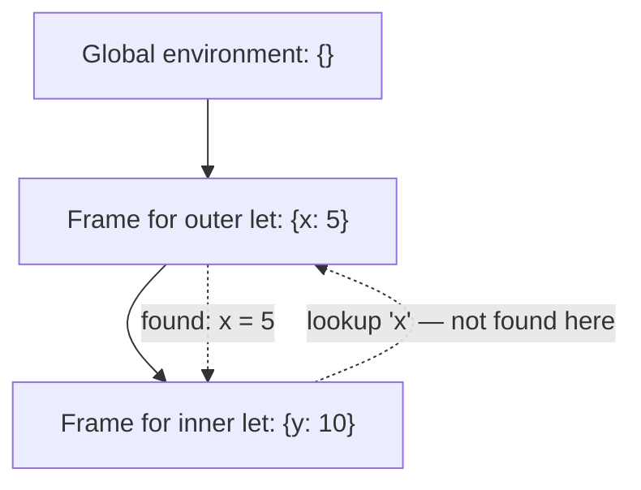

## Learning Objectives

- Define an environment as a runtime data structure mapping variable names to values, and explain why a plain single dictionary is insufficient once nested scopes exist.
- Implement an environment as a chain of frames, each with a pointer to its enclosing (parent) environment, and a lookup procedure that walks the chain outward.
- Distinguish lexical scope (a variable resolves against the environment where it was WRITTEN) from dynamic scope (it resolves against the environment where it was CALLED), and trace a concrete example where the two give different answers.
- Extend `eval` to take an environment parameter and correctly evaluate variable references and `let`-style bindings.
- State which of the two scoping disciplines nearly every modern language actually uses, and why.

## Context & Motivation

The `eval` function built in the previous concept can evaluate numbers, booleans, and `if` expressions — but has no way to make sense of a bare variable reference like `x`, because it has nowhere to look up what `x` currently refers to. An ENVIRONMENT is exactly that missing piece: a runtime data structure that maps variable names to their current values, consulted every time `eval` encounters a variable node.

Why can't a single flat mapping (one dictionary for the whole program) work? Because real programs nest scopes — a variable bound inside one function body should not be visible outside it, and two different calls to the same function need their OWN separate copies of that function's local variables, even though both calls share the identical AST. A chain of environment FRAMES, each pointing to its enclosing frame, solves both problems at once: a lookup walks outward through the chain until it finds the variable, naturally respecting nesting, and each function call can create a fresh frame without disturbing any other call's frame.

This concept also introduces a genuinely consequential design decision that a plain features-level description of "variables" (as covered in `programming-computational-thinking`) never had to make explicit: lexical vs. dynamic scope — which environment a variable resolves against when it's actually used. The choice, once made concrete with a real example, turns out to be one where nearly every modern language has converged on the same answer, for good reason.

## Core Theory

### Environments as a chain of frames

```python
class Environment:
    def __init__(self, parent=None):
        self.bindings = {}
        self.parent = parent

    def define(self, name, value):
        self.bindings[name] = value

    def lookup(self, name):
        if name in self.bindings:
            return self.bindings[name]
        elif self.parent is not None:
            return self.parent.lookup(name)          # walk outward
        else:
            raise NameError(f"undefined variable '{name}'")
```

Each `Environment` object is one FRAME: a flat dictionary for the variables introduced directly at this level, plus a `parent` pointer to the enclosing environment. `lookup` checks the current frame first, and only if the name isn't found there, recurses outward to the parent — repeating until either the variable is found or the outermost (global) environment is reached with no parent left to check, which is exactly when an "undefined variable" error is correctly raised.

### Extending `eval` with an environment parameter

```python
def eval(node, env):
    match node:
        case NumExpr(value):
            return value
        case VarExpr(name):
            return env.lookup(name)
        case LetExpr(name, value_expr, body):
            new_env = Environment(parent=env)
            new_env.define(name, eval(value_expr, env))   # evaluated in the OUTER env
            return eval(body, new_env)                     # body sees the NEW binding
        case IfExpr(cond, then_branch, else_branch):
            if eval(cond, env):
                return eval(then_branch, env)
            else:
                return eval(else_branch, env)
```

Note carefully where each sub-expression is evaluated: the bound value in a `let` is evaluated in the OUTER environment (it shouldn't be able to see its own name yet, since it hasn't been defined), while the `let`'s body is evaluated in the NEW environment (an extra frame, chained to the outer one) that does have the fresh binding visible.



### Lexical scope vs. dynamic scope

**Lexical scope** (also called static scope): a variable reference resolves against the environment chain that reflects where the code was WRITTEN — specifically, the chain of environments active at the point in the SOURCE TEXT where the reference appears, regardless of how or from where the enclosing function was eventually called.

**Dynamic scope**: a variable reference resolves against whatever environment happens to be active at the moment of the CALL — meaning the same variable reference could resolve to a completely different value depending on the call chain that led to it, not on where it sits in the source.

Nearly every modern language — Python, JavaScript, Java, C, OCaml — uses lexical scope. It is the far more common choice because it makes a variable's meaning determinable by reading the source code ALONE, with no need to trace every possible call path at runtime — a property essential for both human reasoning about code and for static analysis tools (including the type checkers covered later in this discipline).

## Worked Examples

### Example 1: A `let`-nesting trace with shadowing

```text
let x = 5 in
  let x = x + 1 in
    x
```

```text
eval(outer_let, global_env):
  eval(5, global_env) = 5
  new_env1 = Environment(parent=global_env); new_env1.define("x", 5)
  eval(inner_let, new_env1):
    eval(x + 1, new_env1) = lookup("x") + 1 = 5 + 1 = 6
    new_env2 = Environment(parent=new_env1); new_env2.define("x", 6)
    eval(x, new_env2) = lookup("x") in new_env2 = 6     # found immediately, doesn't need to walk outward

Final result: 6
```

The inner `x` SHADOWS the outer one — `new_env2`'s own frame has an `x` binding, so `lookup` never even has to walk out to `new_env1` to find it. This is exactly why `x + 1` in the middle line must be evaluated using the OUTER environment's `x` (5), not the not-yet-defined inner one — matching the rule in the `eval` code above precisely.

### Example 2: Lexical vs. dynamic scope giving genuinely different answers

```text
let x = 1 in
  let f = () => x in       // f is defined here, where x = 1 is in scope
    let x = 2 in
      f()                   // f is CALLED here, where x = 2 is in scope
```

- **Under lexical scope** (what every language above actually does): `f`'s body `x` resolves against the environment chain active where `f` was DEFINED — the frame with `x = 1` — so `f()` returns `1`, regardless of what `x` is bound to at the call site.
- **Under (hypothetical) dynamic scope**: `f`'s body `x` would resolve against whatever's active at the CALL site instead — the frame with `x = 2` — so `f()` would return `2`.

This is precisely the mechanism that makes closures (the next concept, and already covered as a feature in `programming-paradigms`) behave predictably: lexical scope is what guarantees `f` keeps referring to the `x` from where it was defined, not wherever it happens to get called from later.

### Example 3: Undefined-variable error propagating correctly through the chain

```text
Environment chain: frame3 → frame2 → frame1 → global (parent=None)
lookup("z") on frame3:
  not in frame3.bindings → check frame3.parent (frame2)
  not in frame2.bindings → check frame2.parent (frame1)
  not in frame1.bindings → check frame1.parent (global)
  not in global.bindings → global.parent is None → raise NameError
```

Four frames checked, each correctly deferring to its parent only after failing to find the name locally — exactly the recursive-lookup structure the `lookup` method implements, terminating cleanly (with a real error, not an infinite loop or a crash) once the outermost frame is reached with nothing left to check.

## Common Misconceptions & Pitfalls

- **"An environment is just a synonym for 'a dictionary.'"** A single flat dictionary cannot represent NESTED scopes with shadowing correctly — the chain-of-frames structure, with each frame pointing to its parent, is what makes nesting, shadowing, and per-call-instance separation all work correctly at once.
- **"Lexical and dynamic scope are two names for the same idea, just described differently."** They give provably different answers on a term like Example 2's — the difference is not cosmetic, it directly determines whether a closure's captured variable is fixed at definition time (lexical) or can be silently reassigned by whatever happens to call it later (dynamic).
- **"Dynamic scope is an obscure academic idea no real language ever used."** A few real languages and features have genuinely used dynamic-scope-like mechanisms historically (early Lisps, and some special-variable mechanisms in later ones) — it's a real, if now rare, design point, not a purely hypothetical one; nearly every mainstream language today has still converged on lexical scope specifically for the reasoning benefits described above.
- **"Shadowing a variable name is an error or a bug."** It's a normal, intentional feature — Example 1's inner `x` correctly shadowing the outer `x` is exactly how nested scopes are SUPPOSED to behave, and the frame-chain structure handles it automatically with no special-casing required.

## Summary

An environment is a chain of frames, each mapping names to values with a pointer to its enclosing (parent) frame; looking up a variable walks outward through this chain until the name is found or the chain is exhausted. Lexical scope (resolve against the environment active where code was WRITTEN) is what nearly every modern language uses, in contrast to dynamic scope (resolve against the environment active where code is CALLED) — a genuinely different discipline that produces observably different answers on a term where a variable is shadowed between a function's definition site and its call site. `eval`, extended with an environment parameter, correctly threads the right environment through variable lookups and `let`-style bindings — laying the exact groundwork the next concept needs to implement closures: functions whose environment travels WITH them, not just with the point in the source where they're eventually called.

## Documentation Links

- [Nystrom — Crafting Interpreters, Ch. 8 (Statements and State)](https://craftinginterpreters.com/statements-and-state.html) — a complete, real environment-chain implementation following this exact structure.
- [ACM/IEEE CS2013 — Programming Languages Knowledge Area](https://csed.acm.org/knowledge-areas-programming-languages-pl-cs2013-version/) — covers scoping discipline as core runtime-systems material.
