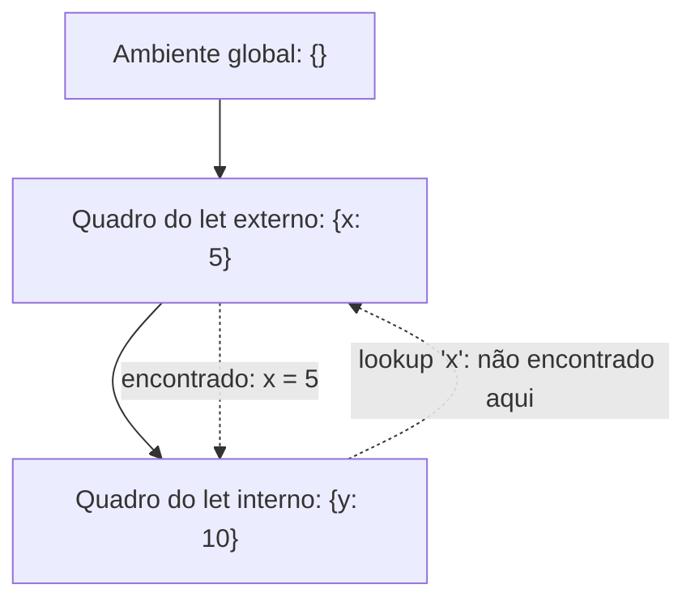

## Objetivos de Aprendizagem

- Definir um ambiente como uma estrutura de dados de tempo de execução mapeando nomes de variáveis a valores, e explicar por que um único dicionário simples é insuficiente uma vez que escopos aninhados existem.
- Implementar um ambiente como uma cadeia de quadros, cada um com um ponteiro para o seu ambiente envolvente (pai), e um procedimento de busca que percorre a cadeia para fora.
- Distinguir escopo léxico (uma variável resolve contra o ambiente onde foi ESCRITA) de escopo dinâmico (resolve contra o ambiente onde foi CHAMADA), e rastrear um exemplo concreto onde os dois dão respostas diferentes.
- Estender `eval` para receber um parâmetro de ambiente e avaliar corretamente referências de variáveis e ligações estilo `let`.
- Enunciar qual das duas disciplinas de escopo quase toda linguagem moderna de fato usa, e por quê.

## Contexto e Motivação

A função `eval` construída no conceito anterior consegue avaliar números, booleanos e expressões `if`, mas não tem como dar sentido a uma referência de variável nua como `x`, porque não tem onde buscar a que `x` atualmente se refere. Um AMBIENTE é exatamente essa peça faltante: uma estrutura de dados de tempo de execução que mapeia nomes de variáveis aos seus valores atuais, consultada toda vez que `eval` encontra um nó de variável.

Por que um único mapeamento plano (um dicionário para o programa inteiro) não pode funcionar? Porque programas reais aninham escopos, uma variável ligada dentro de um corpo de função não deveria ser visível fora dele, e duas chamadas diferentes à mesma função precisam das SUAS PRÓPRIAS cópias separadas das variáveis locais daquela função, mesmo que ambas as chamadas compartilhem a AST idêntica. Uma cadeia de QUADROS de ambiente, cada um apontando para o seu quadro envolvente, resolve ambos os problemas de uma vez: uma busca percorre para fora pela cadeia até encontrar a variável, respeitando naturalmente o aninhamento, e cada chamada de função pode criar um quadro fresco sem perturbar o quadro de nenhuma outra chamada.

Este conceito também introduz uma decisão de design genuinamente consequente que uma descrição de nível de recursos simples de "variáveis" (como coberta em `programming-computational-thinking`) nunca teve de tornar explícita: escopo léxico vs. dinâmico, contra qual ambiente uma variável resolve quando de fato é usada. A escolha, uma vez tornada concreta com um exemplo real, acaba por ser uma onde quase toda linguagem moderna convergiu para a mesma resposta, por boa razão.

## Teoria Central

### Ambientes como uma cadeia de quadros

```python
class Environment:
    def __init__(self, parent=None):
        self.bindings = {}
        self.parent = parent

    def define(self, name, value):
        self.bindings[name] = value

    def lookup(self, name):
        if name in self.bindings:
            return self.bindings[name]
        elif self.parent is not None:
            return self.parent.lookup(name)          # percorre para fora
        else:
            raise NameError(f"undefined variable '{name}'")
```

Cada objeto `Environment` é um QUADRO: um dicionário plano para as variáveis introduzidas diretamente neste nível, mais um ponteiro `parent` para o ambiente envolvente. `lookup` checa o quadro atual primeiro, e só se o nome não for encontrado ali, recursa para fora ao pai, repetindo até ou a variável ser encontrada ou o ambiente mais externo (global) ser alcançado sem pai restante para checar, que é exatamente quando um erro de "variável indefinida" é corretamente levantado.

### Estendendo `eval` com um parâmetro de ambiente

```python
def eval(node, env):
    match node:
        case NumExpr(value):
            return value
        case VarExpr(name):
            return env.lookup(name)
        case LetExpr(name, value_expr, body):
            new_env = Environment(parent=env)
            new_env.define(name, eval(value_expr, env))   # avaliado no ambiente EXTERNO
            return eval(body, new_env)                     # corpo vê a NOVA ligação
        case IfExpr(cond, then_branch, else_branch):
            if eval(cond, env):
                return eval(then_branch, env)
            else:
                return eval(else_branch, env)
```

Note cuidadosamente onde cada sub-expressão é avaliada: o valor ligado num `let` é avaliado no ambiente EXTERNO (ele não deveria poder ver o seu próprio nome ainda, já que não foi definido), enquanto o corpo do `let` é avaliado no NOVO ambiente (um quadro extra, encadeado ao externo) que tem a ligação fresca visível.



### Escopo léxico vs. escopo dinâmico

**Escopo léxico** (também chamado escopo estático): uma referência de variável resolve contra a cadeia de ambiente que reflete onde o código foi ESCRITO, especificamente, a cadeia de ambientes ativa no ponto no TEXTO-FONTE onde a referência aparece, independentemente de como ou de onde a função envolvente foi eventualmente chamada.

**Escopo dinâmico**: uma referência de variável resolve contra qualquer que seja o ambiente que por acaso está ativo no momento da CHAMADA, significando que a mesma referência de variável poderia resolver para um valor completamente diferente dependendo da cadeia de chamadas que levou a ela, não de onde ela se situa na fonte.

Quase toda linguagem moderna, Python, JavaScript, Java, C, OCaml, usa escopo léxico. É a escolha de longe mais comum porque torna o significado de uma variável determinável lendo o código-fonte SOZINHO, sem necessidade de rastrear todo caminho de chamada possível em tempo de execução, uma propriedade essencial tanto para o raciocínio humano sobre código quanto para ferramentas de análise estática (incluindo os verificadores de tipo cobertos mais adiante nesta disciplina).

## Exemplos Resolvidos

### Exemplo 1: Um rastreamento de aninhamento de `let` com sombreamento

```text
let x = 5 in
  let x = x + 1 in
    x
```

```text
eval(outer_let, global_env):
  eval(5, global_env) = 5
  new_env1 = Environment(parent=global_env); new_env1.define("x", 5)
  eval(inner_let, new_env1):
    eval(x + 1, new_env1) = lookup("x") + 1 = 5 + 1 = 6
    new_env2 = Environment(parent=new_env1); new_env2.define("x", 6)
    eval(x, new_env2) = lookup("x") em new_env2 = 6     # encontrado imediatamente, não precisa percorrer para fora

Resultado final: 6
```

O `x` interno SOMBREIA o externo, o próprio quadro de `new_env2` tem uma ligação `x`, então `lookup` nunca sequer tem de percorrer até `new_env1` para encontrá-lo. É exatamente por isso que `x + 1` na linha do meio tem de ser avaliado usando o `x` do ambiente EXTERNO (5), não o interno ainda não definido, correspondendo precisamente à regra no código `eval` acima.

### Exemplo 2: Escopo léxico vs. dinâmico dando respostas genuinamente diferentes

```text
let x = 1 in
  let f = () => x in       // f é definido aqui, onde x = 1 está em escopo
    let x = 2 in
      f()                   // f é CHAMADO aqui, onde x = 2 está em escopo
```

- **Sob escopo léxico** (o que toda linguagem acima de fato faz): o `x` do corpo de `f` resolve contra a cadeia de ambiente ativa onde `f` foi DEFINIDO, o quadro com `x = 1`, então `f()` retorna `1`, independentemente do que `x` está ligado no local de chamada.
- **Sob escopo dinâmico** (hipotético): o `x` do corpo de `f` resolveria contra qualquer que esteja ativo no local da CHAMADA em vez disso, o quadro com `x = 2`, então `f()` retornaria `2`.

Este é precisamente o mecanismo que faz closures (o próximo conceito, e já coberto como um recurso em `programming-paradigms`) se comportarem previsivelmente: o escopo léxico é o que garante que `f` continua se referindo ao `x` de onde foi definido, não de onde quer que por acaso seja chamado depois.

### Exemplo 3: Erro de variável indefinida propagando corretamente pela cadeia

```text
Cadeia de ambiente: frame3 → frame2 → frame1 → global (parent=None)
lookup("z") em frame3:
  não em frame3.bindings → checar frame3.parent (frame2)
  não em frame2.bindings → checar frame2.parent (frame1)
  não em frame1.bindings → checar frame1.parent (global)
  não em global.bindings → global.parent é None → raise NameError
```

Quatro quadros checados, cada um corretamente deferindo ao seu pai só depois de falhar em encontrar o nome localmente, exatamente a estrutura de busca recursiva que o método `lookup` implementa, terminando de forma limpa (com um erro real, não um laço infinito ou um crash) uma vez que o quadro mais externo é alcançado sem nada restante para checar.

## Equívocos Comuns e Armadilhas

- **"Um ambiente é só um sinônimo de 'um dicionário'."** Um único dicionário plano não consegue representar escopos ANINHADOS com sombreamento corretamente, a estrutura de cadeia-de-quadros, com cada quadro apontando para o seu pai, é o que faz aninhamento, sombreamento e separação por-instância-de-chamada todos funcionarem corretamente de uma vez.
- **"Escopo léxico e dinâmico são dois nomes para a mesma ideia, só descritos de forma diferente."** Eles dão respostas comprovadamente diferentes num termo como o do Exemplo 2, a diferença não é cosmética, ela determina diretamente se a variável capturada de uma closure é fixada no tempo de definição (léxico) ou pode ser silenciosamente reatribuída por qualquer coisa que por acaso a chame depois (dinâmico).
- **"Escopo dinâmico é uma ideia acadêmica obscura que nenhuma linguagem real jamais usou."** Algumas linguagens e recursos reais genuinamente usaram mecanismos parecidos com escopo dinâmico historicamente (Lisps iniciais, e alguns mecanismos de variáveis especiais em posteriores), é um ponto de design real, se agora raro, não um puramente hipotético; quase toda linguagem mainstream hoje ainda convergiu para escopo léxico especificamente pelos benefícios de raciocínio descritos acima.
- **"Sombrear um nome de variável é um erro ou um bug."** É um recurso normal e intencional, o `x` interno do Exemplo 1 sombreando corretamente o `x` externo é exatamente como escopos aninhados DEVEM se comportar, e a estrutura de cadeia de quadros o trata automaticamente sem nenhum tratamento especial exigido.

## Resumo

Um ambiente é uma cadeia de quadros, cada um mapeando nomes a valores com um ponteiro para o seu quadro envolvente (pai); buscar uma variável percorre para fora por esta cadeia até o nome ser encontrado ou a cadeia ser esgotada. Escopo léxico (resolver contra o ambiente ativo onde o código foi ESCRITO) é o que quase toda linguagem moderna usa, em contraste com escopo dinâmico (resolver contra o ambiente ativo onde o código é CHAMADO), uma disciplina genuinamente diferente que produz respostas observavelmente diferentes num termo onde uma variável é sombreada entre o local de definição de uma função e o seu local de chamada. `eval`, estendido com um parâmetro de ambiente, passa corretamente o ambiente certo por buscas de variáveis e ligações estilo `let`, assentando exatamente o trabalho de base de que o próximo conceito precisa para implementar closures: funções cujo ambiente viaja COM elas, não só com o ponto na fonte onde elas são eventualmente chamadas.

## Documentation Links

- [Nystrom — Crafting Interpreters, Ch. 8 (Statements and State)](https://craftinginterpreters.com/statements-and-state.html): uma implementação de cadeia-de-ambiente completa e real seguindo esta exata estrutura.
- [ACM/IEEE CS2013 — Programming Languages Knowledge Area](https://csed.acm.org/knowledge-areas-programming-languages-pl-cs2013-version/): cobre disciplina de escopo como material central de sistemas de tempo de execução.
