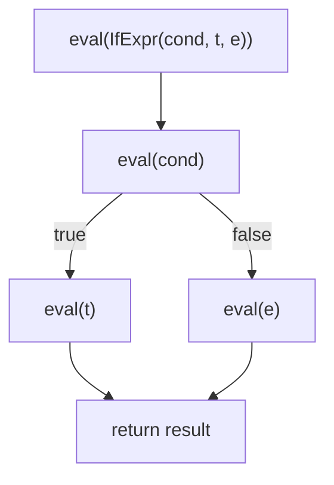

## Learning Objectives

- Implement an `eval` function that recurses over an AST, with one case per node type, matching the small-step semantics rules already covered.
- Explain the correspondence between an operational-semantics rule and its corresponding branch in the `eval` function, precisely.
- Distinguish a tree-walking interpreter's evaluation strategy (recompute meaning by recursing over the tree every time) from compilation's (translate once, run the translated form repeatedly).
- Trace a full `eval` call for a concrete AST, showing the recursive call structure explicitly.
- Explain, honestly, the real performance cost of tree-walking relative to other strategies, and why this discipline still chooses it as its practical throughline.

## Context & Motivation

Every piece has now been assembled: operational semantics gave a precise, on-paper definition of what each construct means; scanning and parsing turned raw source text into an AST — a tree data structure whose shape mirrors the grammar's own nesting. This concept connects the two: an `eval` function that recurses over the AST is small-step operational semantics MADE RUNNABLE. This is not a loose analogy — it is close to a direct, mechanical translation: every inference rule from the semantics concept becomes one `match`/`case` branch in `eval`, handling exactly the AST node shape that rule's premise describes.

Why is this correspondence worth dwelling on explicitly, rather than just writing an interpreter directly from intuition? Because it is exactly what makes an interpreter's correctness a meaningful, checkable claim rather than an act of faith: if every branch of `eval` can be pointed to a specific semantics rule it implements, then the interpreter is provably faithful to the language's formal definition — a genuinely different, stronger guarantee than "it seems to produce the right answers on the test cases I tried."

## Core Theory

### The tree-walking `eval` function

A tree-walking interpreter's `eval` function takes an AST node and (for now, before environments are introduced in the next concept) returns a value, calling itself recursively on child nodes exactly where the semantics rules said evaluation should happen:

```python
def eval(node):
    match node:
        case NumExpr(value):
            return value                                    # a number is already a value
        case TrueExpr():
            return True
        case FalseExpr():
            return False
        case BinaryExpr("+", left, right):
            return eval(left) + eval(right)                 # E-App2-like: evaluate both operands
        case IfExpr(cond, then_branch, else_branch):
            if eval(cond):                                  # E-IfTrue / E-IfFalse, made runnable
                return eval(then_branch)
            else:
                return eval(else_branch)
        case IsZeroExpr(operand):
            return eval(operand) == 0                       # E-IsZeroZero / E-IsZeroSucc
```

Compare this directly to the toy language's rules from the operational-semantics concept: `if true then t2 else t3 → t2` becomes, almost verbatim, `if eval(cond): return eval(then_branch)`. The correspondence is not a coincidence — it is the entire design intention behind introducing the semantics first.

### Why "tree-walking"

The name describes exactly what happens at runtime: for EVERY evaluation of the program (or a sub-expression within it), `eval` walks the tree from the root down, following whichever branches the specific values encountered along the way dictate. If the same expression is evaluated a second time (inside a loop, or because a function containing it is called twice), `eval` walks the same shape of tree again from scratch — no work from the first walk is reused or cached. This is the most direct, simplest-to-implement evaluation strategy, and exactly why this discipline chooses it as its practical throughline; it is also the strategy with the most repeated, redundant work per execution, which is precisely why real production language implementations layer additional strategies (bytecode compilation, JIT compilation) on TOP of this same conceptual foundation rather than replacing it outright.



### Interpretation vs. the alternative, revisited concretely

Recall from the discipline's opening concept: compilation translates source into another form ONCE, then executes that form (possibly repeatedly) without re-doing the translation work. A tree-walking interpreter does the opposite — there is no separate "translated form" at all; the AST itself is both the representation of the program AND what gets directly, repeatedly walked at each execution. This is precisely why a tree-walking interpreter, while simple to build completely (achievable within a single discipline, as this one does), is also the slowest of the common execution strategies in practice — every single evaluation re-does the work of figuring out "what kind of node is this" via the `match` dispatch, over and over.

## Worked Examples

### Example 1: A full `eval` trace with explicit recursive calls

Evaluate `IfExpr(IsZeroExpr(NumExpr(0)), NumExpr(1), NumExpr(2))` — corresponding to `if (iszero 0) then 1 else 2`:

```text
eval(IfExpr(IsZeroExpr(NumExpr(0)), NumExpr(1), NumExpr(2)))
  → matches IfExpr(cond, then_branch, else_branch)
  → must first compute eval(cond) = eval(IsZeroExpr(NumExpr(0)))
      → matches IsZeroExpr(operand)
      → must first compute eval(operand) = eval(NumExpr(0)) = 0
      → return 0 == 0  →  True
  → eval(cond) = True
  → since True: return eval(then_branch) = eval(NumExpr(1)) = 1

Final result: 1
```

Three nested `eval` calls, each one waiting on the result of the call beneath it before it can proceed — exactly the call-stack-based recursive structure `c-and-assembly`'s stack-frame material already showed for any recursive function, applied here specifically to tree evaluation.

### Example 2: Redundant work on repeated evaluation

```python
expr = BinaryExpr("+", NumExpr(2), NumExpr(3))

for _ in range(1000):
    result = eval(expr)   # walks the SAME three-node tree, 1000 separate times
```

Each of the 1000 calls to `eval` re-dispatches on `BinaryExpr`, re-dispatches on `NumExpr(2)`, re-dispatches on `NumExpr(3)`, and re-adds — none of this repeated dispatch work is cached or reused between iterations. A bytecode-compiling implementation would instead translate this expression ONCE into a few bytecode instructions, then execute those same instructions 1000 times without re-doing the tree-shape analysis each time — the real, honest performance cost this discipline's chosen strategy accepts in exchange for being dramatically simpler to build completely.

### Example 3: Pointing a branch back to its semantics rule

```text
Semantics rule (from the operational-semantics concept):
  iszero 0 → true                                    (E-IsZeroZero)

Corresponding eval branch:
  case IsZeroExpr(operand):
      return eval(operand) == 0

Correspondence: "eval(operand) == 0" is checking exactly the condition E-IsZeroZero's
premise assumes (the operand IS the numeral 0), and returning True (the language's "true"
value) is exactly what the rule's conclusion says should happen.
```

This kind of explicit rule-to-branch mapping is the real, checkable sense in which "the interpreter implements the semantics" — every branch traces back to a specific, previously-stated rule, not to ad hoc intuition about what the code "should" do.

## Common Misconceptions & Pitfalls

- **"Writing an interpreter and defining a semantics are really the same activity, done twice."** They are genuinely different: the semantics is a mathematical specification, checkable and reasoned about independently of any code; the interpreter is one particular, executable REALIZATION of that specification. Having both lets each be checked against the other — the interpreter's correctness is meaningful precisely because there's an independent standard (the semantics) it's supposed to match.
- **"Tree-walking is a naive, wrong way to build an interpreter that real systems never use."** Real systems (many scripting-language prototypes, and the first, simplest phase of several production interpreters historically) do use exactly this strategy, and even production systems that add bytecode compilation or JIT compilation on top still conceptually tree-walk during their initial, simplest execution phase or interpreter mode.
- **"`eval`'s recursive structure is unrelated to the recursion already covered in `programming-computational-thinking`."** It is the identical technique, applied to a tree data structure instead of, say, computing a factorial — `eval` calling itself on child nodes is structural recursion on the AST, exactly the pattern `recursion-on-structural-data` already covers generally.
- **"Since `eval` can compute the right answer, performance doesn't matter for a 'real' interpreter."** Tree-walking's redundant, uncached dispatch work on every single evaluation is a genuine, measurable cost — it is exactly why this discipline is honest about the tradeoff rather than presenting tree-walking as free of any downside; the cost is accepted here specifically because completeness and simplicity, not maximum speed, are this discipline's teaching priorities.

## Summary

An `eval` function that recurses over an AST, one case per node type, is small-step operational semantics made directly runnable — each branch corresponds, close to one-to-one, to a specific inference rule from the semantics already covered, which is exactly what makes the interpreter's correctness a checkable claim rather than an assumption. "Tree-walking" names the strategy honestly: every execution re-walks the same tree shape from scratch, with no caching or pre-translation, which is the simplest strategy to build completely but also the slowest in practice — a real, acknowledged tradeoff this discipline accepts for the sake of completing a working interpreter within its scope, while leaving faster strategies (bytecode compilation, JIT) to more advanced treatments. The next concept extends this bare `eval` with environments, so variables — not just literal numbers and booleans — can finally be evaluated correctly.

## Documentation Links

- [Nystrom — Crafting Interpreters, Ch. 7 (Evaluating Expressions)](https://craftinginterpreters.com/evaluating-expressions.html) — a complete, real tree-walking `eval` implementation following this exact structure.
- [Pierce — Types and Programming Languages, Ch. 4 (An ML Implementation of Arithmetic Expressions)](https://www.cis.upenn.edu/~bcpierce/tapl/contents.pdf) — shows the rule-to-code correspondence explicitly, on the same toy language used for this discipline's semantics concept.
