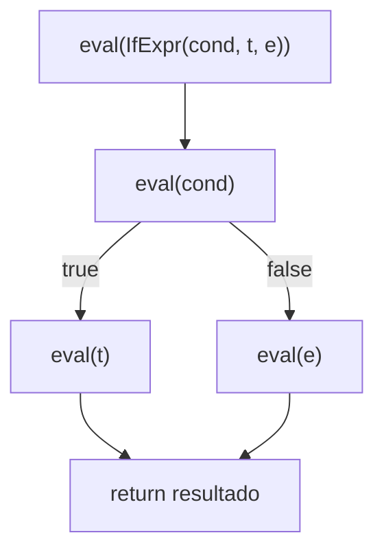

## Objetivos de Aprendizagem

- Implementar uma função `eval` que recursa sobre uma AST, com um caso por tipo de nó, correspondendo às regras de semântica de passo pequeno já cobertas.
- Explicar a correspondência entre uma regra de semântica operacional e o seu ramo correspondente na função `eval`, precisamente.
- Distinguir a estratégia de avaliação de um interpretador tree-walking (recomputar significado recursando sobre a árvore toda vez) da da compilação (traduzir uma vez, rodar a forma traduzida repetidamente).
- Rastrear uma chamada `eval` completa para uma AST concreta, mostrando a estrutura de chamada recursiva explicitamente.
- Explicar, honestamente, o custo de desempenho real do tree-walking relativo a outras estratégias, e por que esta disciplina ainda o escolhe como o seu fio condutor prático.

## Contexto e Motivação

Cada peça agora foi montada: a semântica operacional deu uma definição precisa, no papel, do que cada construto significa; scanning e parsing transformaram texto-fonte bruto numa AST, uma estrutura de dados em árvore cujo formato espelha o próprio aninhamento da gramática. Este conceito conecta os dois: uma função `eval` que recursa sobre a AST é semântica operacional de passo pequeno TORNADA EXECUTÁVEL. Esta não é uma analogia frouxa, está perto de uma tradução direta e mecânica: toda regra de inferência do conceito de semântica vira um ramo `match`/`case` em `eval`, tratando exatamente o formato de nó de AST que a premissa daquela regra descreve.

Por que esta correspondência vale a pena deter-se sobre explicitamente, em vez de só escrever um interpretador diretamente da intuição? Porque é exatamente o que torna a correção de um interpretador uma afirmação significativa e checável em vez de um ato de fé: se todo ramo de `eval` pode ser apontado a uma regra de semântica específica que ele implementa, então o interpretador é comprovadamente fiel à definição formal da linguagem, uma garantia genuinamente diferente e mais forte do que "parece produzir as respostas certas nos casos de teste que tentei".

## Teoria Central

### A função `eval` tree-walking

A função `eval` de um interpretador tree-walking recebe um nó de AST e (por ora, antes de ambientes serem introduzidos no próximo conceito) retorna um valor, chamando a si mesma recursivamente em nós filhos exatamente onde as regras de semântica disseram que a avaliação deveria acontecer:

```python
def eval(node):
    match node:
        case NumExpr(value):
            return value                                    # um número já é um valor
        case TrueExpr():
            return True
        case FalseExpr():
            return False
        case BinaryExpr("+", left, right):
            return eval(left) + eval(right)                 # tipo E-App2: avaliar ambos os operandos
        case IfExpr(cond, then_branch, else_branch):
            if eval(cond):                                  # E-IfTrue / E-IfFalse, tornadas executáveis
                return eval(then_branch)
            else:
                return eval(else_branch)
        case IsZeroExpr(operand):
            return eval(operand) == 0                       # E-IsZeroZero / E-IsZeroSucc
```

Compare isto diretamente com as regras da linguagem de brinquedo do conceito de semântica operacional: `if true then t2 else t3 → t2` vira, quase ao pé da letra, `if eval(cond): return eval(then_branch)`. A correspondência não é coincidência, é a intenção de design inteira por trás de introduzir a semântica primeiro.

### Por que "tree-walking"

O nome descreve exatamente o que acontece em tempo de execução: para TODA avaliação do programa (ou de uma sub-expressão dentro dele), `eval` percorre a árvore da raiz para baixo, seguindo quaisquer ramos que os valores específicos encontrados ao longo do caminho ditem. Se a mesma expressão é avaliada uma segunda vez (dentro de um laço, ou porque uma função que a contém é chamada duas vezes), `eval` percorre o mesmo formato de árvore de novo do zero, nenhum trabalho da primeira caminhada é reusado ou cacheado. Esta é a estratégia de avaliação mais direta e simples de implementar, e exatamente por que esta disciplina a escolhe como o seu fio condutor prático; é também a estratégia com o mais repetido e redundante trabalho por execução, que é precisamente por que implementações de linguagem de produção reais camadam estratégias adicionais (compilação para bytecode, compilação JIT) EM CIMA desta mesma fundação conceitual em vez de substituí-la por completo.



### Interpretação vs. a alternativa, revisitada concretamente

Lembre do conceito de abertura da disciplina: a compilação traduz a fonte para outra forma UMA VEZ, depois executa essa forma (possivelmente repetidamente) sem refazer o trabalho de tradução. Um interpretador tree-walking faz o oposto, não há nenhuma "forma traduzida" separada de forma alguma; a própria AST é tanto a representação do programa QUANTO o que é diretamente, repetidamente percorrido a cada execução. É precisamente por isso que um interpretador tree-walking, embora simples de construir completamente (alcançável dentro de uma única disciplina, como esta faz), é também o mais lento das estratégias de execução comuns na prática, toda única avaliação refaz o trabalho de descobrir "que tipo de nó é este" via o despacho `match`, repetidas vezes.

## Exemplos Resolvidos

### Exemplo 1: Um rastreamento `eval` completo com chamadas recursivas explícitas

Avaliar `IfExpr(IsZeroExpr(NumExpr(0)), NumExpr(1), NumExpr(2))`, correspondendo a `if (iszero 0) then 1 else 2`:

```text
eval(IfExpr(IsZeroExpr(NumExpr(0)), NumExpr(1), NumExpr(2)))
  → corresponde a IfExpr(cond, then_branch, else_branch)
  → deve primeiro computar eval(cond) = eval(IsZeroExpr(NumExpr(0)))
      → corresponde a IsZeroExpr(operand)
      → deve primeiro computar eval(operand) = eval(NumExpr(0)) = 0
      → return 0 == 0  →  True
  → eval(cond) = True
  → já que True: return eval(then_branch) = eval(NumExpr(1)) = 1

Resultado final: 1
```

Três chamadas `eval` aninhadas, cada uma esperando pelo resultado da chamada abaixo dela antes de poder prosseguir, exatamente a estrutura recursiva baseada em pilha de chamadas que o material de quadro de pilha de `c-and-assembly` já mostrou para qualquer função recursiva, aplicada aqui especificamente à avaliação de árvore.

### Exemplo 2: Trabalho redundante na avaliação repetida

```python
expr = BinaryExpr("+", NumExpr(2), NumExpr(3))

for _ in range(1000):
    result = eval(expr)   # percorre a MESMA árvore de três nós, 1000 vezes separadas
```

Cada uma das 1000 chamadas a `eval` redespacha sobre `BinaryExpr`, redespacha sobre `NumExpr(2)`, redespacha sobre `NumExpr(3)`, e readiciona, nada deste trabalho de despacho repetido é cacheado ou reusado entre iterações. Uma implementação que compila para bytecode em vez disso traduziria esta expressão UMA VEZ para umas poucas instruções de bytecode, depois executaria essas mesmas instruções 1000 vezes sem refazer a análise de formato de árvore a cada vez, o custo de desempenho real e honesto que a estratégia escolhida desta disciplina aceita em troca de ser dramaticamente mais simples de construir completamente.

### Exemplo 3: Apontando um ramo de volta à sua regra de semântica

```text
Regra de semântica (do conceito de semântica operacional):
  iszero 0 → true                                    (E-IsZeroZero)

Ramo eval correspondente:
  case IsZeroExpr(operand):
      return eval(operand) == 0

Correspondência: "eval(operand) == 0" está checando exatamente a condição que a
premissa de E-IsZeroZero assume (o operando É o numeral 0), e retornar True (o valor
"true" da linguagem) é exatamente o que a conclusão da regra diz que deveria acontecer.
```

Este tipo de mapeamento explícito de regra-para-ramo é o sentido real e checável no qual "o interpretador implementa a semântica", todo ramo rastreia de volta a uma regra específica e previamente enunciada, não a intuição ad hoc sobre o que o código "deveria" fazer.

## Equívocos Comuns e Armadilhas

- **"Escrever um interpretador e definir uma semântica são realmente a mesma atividade, feita duas vezes."** São genuinamente diferentes: a semântica é uma especificação matemática, checável e raciocinável independentemente de qualquer código; o interpretador é uma REALIZAÇÃO particular e executável dessa especificação. Ter ambos deixa cada um ser checado contra o outro, a correção do interpretador é significativa precisamente porque há um padrão independente (a semântica) que ele deveria corresponder.
- **"Tree-walking é uma forma ingênua e errada de construir um interpretador que sistemas reais nunca usam."** Sistemas reais (muitos protótipos de linguagem de script, e a primeira e mais simples fase de vários interpretadores de produção historicamente) de fato usam exatamente esta estratégia, e mesmo sistemas de produção que adicionam compilação para bytecode ou compilação JIT em cima ainda conceitualmente fazem tree-walking durante a sua fase de execução inicial e mais simples ou modo interpretador.
- **"A estrutura recursiva de `eval` não tem relação com a recursão já coberta em `programming-computational-thinking`."** É a técnica idêntica, aplicada a uma estrutura de dados em árvore em vez de, digamos, computar um fatorial, `eval` chamando a si mesma em nós filhos é recursão estrutural sobre a AST, exatamente o padrão que `recursion-on-structural-data` já cobre em geral.
- **"Já que `eval` consegue computar a resposta certa, o desempenho não importa para um interpretador 'real'."** O trabalho de despacho redundante e sem cache do tree-walking em toda única avaliação é um custo genuíno e mensurável, é exatamente por que esta disciplina é honesta sobre o trade-off em vez de apresentar tree-walking como livre de qualquer desvantagem; o custo é aceito aqui especificamente porque completude e simplicidade, não velocidade máxima, são as prioridades de ensino desta disciplina.

## Resumo

Uma função `eval` que recursa sobre uma AST, um caso por tipo de nó, é semântica operacional de passo pequeno tornada diretamente executável, cada ramo corresponde, perto de um-para-um, a uma regra de inferência específica da semântica já coberta, que é exatamente o que torna a correção do interpretador uma afirmação checável em vez de uma suposição. "Tree-walking" nomeia a estratégia honestamente: toda execução repercorre o mesmo formato de árvore do zero, sem cache ou pré-tradução, que é a estratégia mais simples de construir completamente mas também a mais lenta na prática, um trade-off real e reconhecido que esta disciplina aceita em prol de completar um interpretador funcional dentro do seu escopo, enquanto deixa estratégias mais rápidas (compilação para bytecode, JIT) para tratamentos mais avançados. O próximo conceito estende este `eval` nu com ambientes, para que variáveis, não só números e booleanos literais, possam finalmente ser avaliadas corretamente.

## Documentation Links

- [Nystrom — Crafting Interpreters, Ch. 7 (Evaluating Expressions)](https://craftinginterpreters.com/evaluating-expressions.html): uma implementação `eval` tree-walking completa e real seguindo esta exata estrutura.
- [Pierce — Types and Programming Languages, Ch. 4 (An ML Implementation of Arithmetic Expressions)](https://www.cis.upenn.edu/~bcpierce/tapl/contents.pdf): mostra a correspondência de regra-para-código explicitamente, na mesma linguagem de brinquedo usada para o conceito de semântica desta disciplina.
