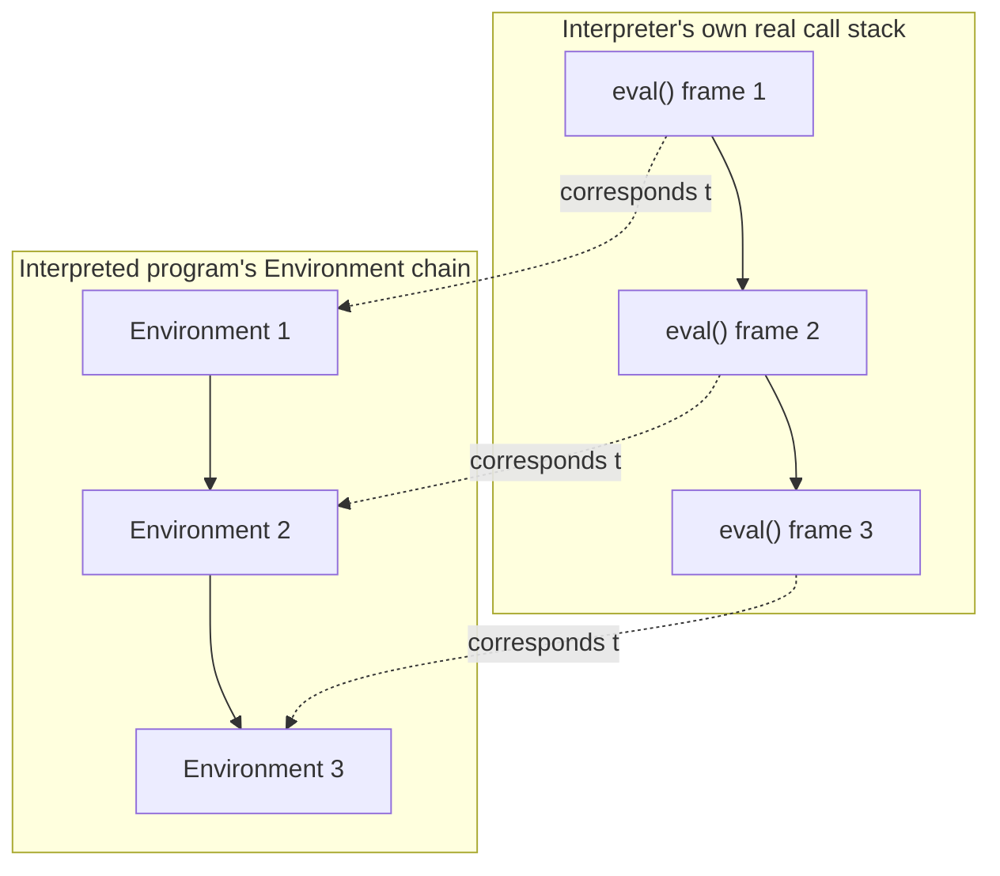

## Learning Objectives

- Explain the correspondence between the tree-walking interpreter's own recursive `eval` calls (for a function call) and a real, hardware call stack — one frame per active call, in both cases.
- Trace a nested function call in this discipline's interpreter, showing exactly which host-language (Python) call frames are pushed and popped, and connect each one to an interpreter-level "call frame" (the `Environment` created for that call).
- Distinguish the interpreter's OWN call stack (real Python/host-language stack frames, running the `eval` function itself) from the INTERPRETED PROGRAM's call stack (the chain of `Environment` objects this interpreter builds to track ITS program's function calls).
- State concretely why a tree-walking interpreter's recursion depth is bounded by both stacks at once, and what that means for how deep a recursive program it can actually run.
- Connect this two-level picture back to the real hardware mechanism (prologue/epilogue, stack frames) already covered in `c-and-assembly`.

## Context & Motivation

`c-and-assembly` already covered, in full hardware detail, what a function call actually does at the machine level: a prologue that pushes a new stack frame, a call instruction that transfers control, an epilogue that pops the frame back off on return. This concept asks the natural follow-up question for a language IMPLEMENTATION: when this discipline's tree-walking interpreter evaluates a function call in the language IT is interpreting, what happens to ITS OWN call stack — the real stack of the host language (Python, in this discipline's running examples) that the interpreter itself is written in?

The answer reveals something genuinely worth making explicit: there are actually TWO separate call stacks in play simultaneously, and conflating them is a common source of confusion. There is the call stack of the PROGRAM BEING INTERPRETED — which, in this discipline's tree-walking design, is represented not by real hardware stack frames but by the chain of `Environment` objects built up by nested `CallExpr` evaluations (already introduced when closures were covered). And there is the call stack of the INTERPRETER ITSELF — real, genuine stack frames in whatever language (Python here) the interpreter's own `eval` function is written in, since `eval` calling itself recursively (to evaluate a function's body, which might itself contain another function call) is ordinary host-language recursion, subject to the host language's own stack-depth limits.

## Core Theory

### Two call stacks, not one

```text
Interpreted program's call stack:
  Represented by: the chain of Environment objects (parent pointers), one new
  Environment per CallExpr evaluated. This is a DATA STRUCTURE the interpreter
  builds and manages explicitly — not the host language's real stack.

Interpreter's OWN call stack:
  Real host-language (Python) stack frames, one per active call to eval() itself.
  Evaluating a function call means eval() recursively calls eval() again (on the
  function's body) — this recursive call is a REAL frame on the actual machine
  stack the Python interpreter (or whatever runs this discipline's interpreter)
  is using.
```

Both stacks grow together whenever the interpreted program makes a function call: one more `Environment` object is chained on (tracking the interpreted program's variable scoping), AND one more real `eval()` call frame is pushed on the host language's actual stack (tracking the interpreter's own recursive descent into evaluating that call). They are not the same object, but in this discipline's tree-walking design, they grow in lockstep — a fact worth stating explicitly because it explains a genuinely surprising practical limitation covered in the next section.



### Why a recursive interpreted program can crash the interpreter itself

Because the two stacks grow together, a deeply recursive function in the INTERPRETED program (say, a naive recursive factorial called on a very large number) causes the INTERPRETER's own `eval` function to recurse just as deeply — meaning it's possible to exhaust the HOST language's real stack limit (Python's default recursion limit, commonly around 1000) purely because the interpreted program recursed "only" a few hundred times deep, an amount that would be completely unremarkable for a compiled program running directly on real hardware (where `c-and-assembly`'s stack frames are typically much smaller and the OS-provided stack is typically megabytes deep).

This is a genuine, well-known limitation of the simplest tree-walking design, not a bug specific to this discipline's implementation — and it is exactly the kind of concrete, practical consequence that falls out of taking seriously the fact that there are two stacks, not one, whenever a tree-walking interpreter is itself written in a language that also uses a call stack.

### The correspondence to `c-and-assembly`'s hardware picture

`c-and-assembly` showed a REAL stack frame: return address, saved registers, local variables, all explicit bytes at explicit addresses, pushed by a prologue and popped by an epilogue. This concept's two-stack picture is the same IDEA — one frame per active call, torn down on return — realized at two removes: the interpreted program's "frames" are `Environment` objects (a data structure, not raw memory), and the interpreter's own frames are real machine stack frames, but belonging to the HOST language runtime executing `eval`, not to the interpreted program directly. Both are legitimate implementations of "keep track of what's still in progress, one layer per active call" — exactly the same problem `c-and-assembly` solved directly in hardware, now solved one level of indirection up.

## Worked Examples

### Example 1: Tracing both stacks growing together for a 2-deep call

Interpreted-language source: a function `f` that calls a function `g`.

```text
eval(CallExpr(f, []), outer_env)          [Host stack: eval frame #1 — for f's call]
  call_env_f = Environment(parent=f.closure.env)     [Environment chain: outer_env → call_env_f]
  eval(f.body, call_env_f)                 [Host stack: eval frame #2 — evaluating f's body]
    ... f's body contains: eval(CallExpr(g, []), call_env_f)
    call_env_g = Environment(parent=g.closure.env)   [Environment chain: ... → call_env_g]
    eval(g.body, call_env_g)               [Host stack: eval frame #3 — evaluating g's body]
      return some_value
    [Host stack: eval frame #3 pops]       [Environment chain: call_env_g becomes garbage
                                             once nothing references it any longer]
  [Host stack: eval frame #2 pops]
[Host stack: eval frame #1 pops]
```

Three levels deep on BOTH the host `eval` call stack and the interpreted-program's `Environment` chain, growing and shrinking in exact lockstep — precisely the correspondence this concept's core theory describes.

### Example 2: A concrete recursion-depth failure

```text
A recursive factorial in the interpreted language, computing factorial(2000):

  factorial(n) calls factorial(n-1), which calls factorial(n-2), ... 2000 levels deep.

Under this discipline's tree-walking interpreter: this means roughly 2000 nested
eval() calls on the HOST language's own real stack — likely exceeding Python's
default recursion limit (commonly ~1000) and crashing with a RecursionError,
even though "computing factorial of 2000" is a completely unremarkable, small
computation for a compiled program running directly on hardware.
```

This is a real, demonstrable limitation — not a hypothetical one — of tree-walking's specific way of implementing function calls (host-language recursion all the way down), and it is exactly the kind of cost this discipline's earlier honest discussion of tree-walking's tradeoffs anticipated.

### Example 3: Contrasting frame COST at the two levels

```text
c-and-assembly's real stack frame (per call): a handful of machine words — return
address, a few saved registers, maybe some local variables — typically tens of
bytes, and a typical OS thread stack is megabytes, supporting many thousands of
frames comfortably.

This interpreter's per-call cost: one Environment OBJECT (a Python dictionary plus
a parent pointer — much larger in memory than a raw hardware frame) AND one host
Python stack frame for the recursive eval() call — a real, measurably heavier cost
per interpreted-program call than the equivalent compiled call would cost directly.
```

This concrete size comparison makes tangible exactly why tree-walking interpreters, chosen here for their simplicity and completeness within this discipline's scope, are a genuinely more expensive way to run a program than direct compilation to machine code — the cost isn't just "slower dispatch" (already discussed when `eval` itself was introduced), it's also a heavier, doubled bookkeeping cost per function call specifically.

## Common Misconceptions & Pitfalls

- **"The interpreted program's call stack and the interpreter's own call stack are the same thing."** They are two genuinely distinct structures that merely happen to grow together in this discipline's tree-walking design: one is a data structure (the `Environment` chain) the interpreter builds explicitly; the other is the host language's real stack, used because `eval` calls itself recursively.
- **"A tree-walking interpreter can run any recursive program a compiled version could, just slower."** Not quite — as Example 2 shows, a tree-walking interpreter can fail on a recursion depth a compiled program would handle easily, specifically because the interpreter's OWN stack usage (not just the interpreted program's logical recursion) grows with the interpreted program's call depth.
- **"Since `c-and-assembly` already covered stack frames, there's nothing new about this concept."** The mechanism here is genuinely different — a data-structure-based `Environment` chain plus host-language recursion, not raw hardware push/pop — even though the underlying PROBLEM being solved (track what's in progress, one frame per active call) is the same one `c-and-assembly` solved directly in silicon.
- **"Interpreter overhead is only about speed, never about correctness or capability."** Example 2 shows a genuine CAPABILITY limitation (a program that would run correctly if compiled can crash under this style of interpreter), not merely a performance difference — a real, worth-knowing consequence of choosing tree-walking as an implementation strategy.

## Summary

A tree-walking interpreter's function calls involve two distinct call stacks growing together: the interpreted program's own call stack, represented as a chain of `Environment` objects (a data structure, not raw hardware memory), and the interpreter's own call stack — real host-language stack frames, pushed each time `eval` recursively calls itself to evaluate a function's body. Because these two stacks grow in lockstep in this discipline's design, a deeply recursive INTERPRETED program can exhaust the HOST language's own stack limit at a much shallower depth than an equivalent compiled program (already covered in `c-and-assembly`) would ever notice — a genuine, demonstrable capability cost, not just a performance one, that this discipline's honest treatment of tree-walking's tradeoffs anticipated from the start. The next concepts turn to type systems — a genuinely different concern (catching errors before running the program at all) that doesn't depend on either stack directly.

## Documentation Links

- [Nystrom — Crafting Interpreters, Ch. 10 (Functions)](https://craftinginterpreters.com/functions.html) — covers function-call implementation in a tree-walking interpreter, including its real stack-depth implications.
- [ACM/IEEE CS2013 — Programming Languages Knowledge Area](https://csed.acm.org/knowledge-areas-programming-languages-pl-cs2013-version/) — lists Runtime Systems as elective material this discipline's call-stack treatment covers.
