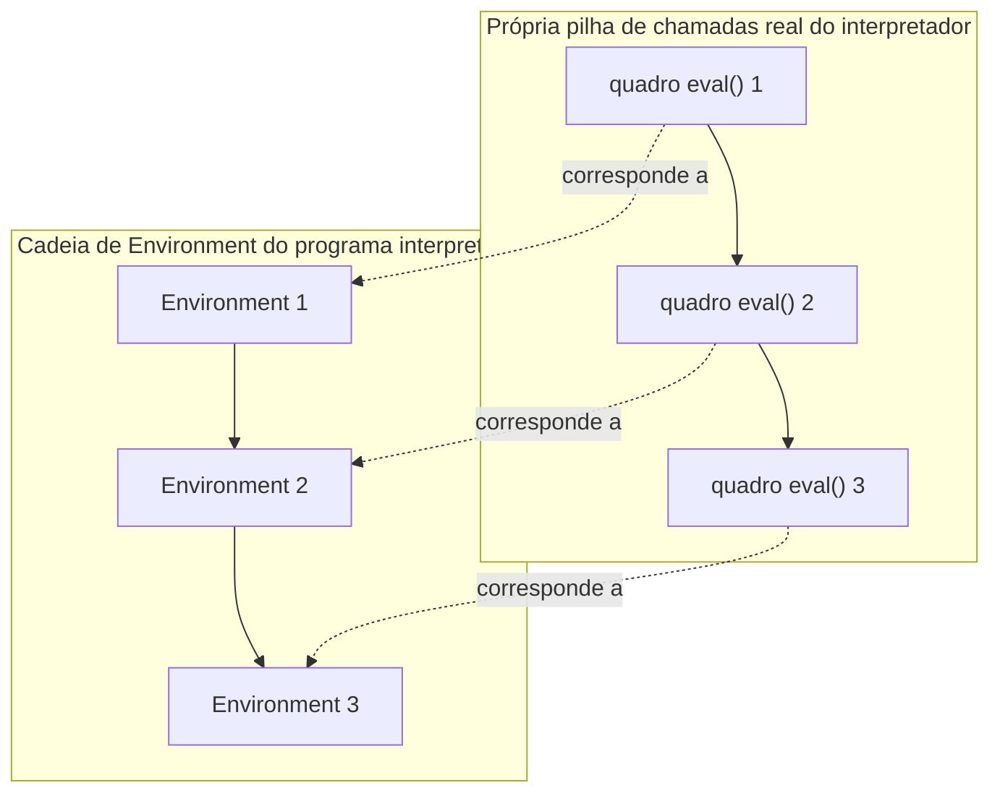

## Objetivos de Aprendizagem

- Explicar a correspondência entre as próprias chamadas recursivas de `eval` do interpretador tree-walking (para uma chamada de função) e uma pilha de chamadas real de hardware, um quadro por chamada ativa, em ambos os casos.
- Rastrear uma chamada de função aninhada no interpretador desta disciplina, mostrando exatamente quais quadros de chamada da linguagem hospedeira (Python) são empilhados e desempilhados, e conectar cada um a um "quadro de chamada" de nível de interpretador (o `Environment` criado para aquela chamada).
- Distinguir a PRÓPRIA pilha de chamadas do interpretador (quadros reais de pilha Python/da linguagem hospedeira, rodando a função `eval` ela mesma) da pilha de chamadas do PROGRAMA INTERPRETADO (a cadeia de objetos `Environment` que este interpretador constrói para rastrear as chamadas de função do SEU programa).
- Enunciar concretamente por que a profundidade de recursão de um interpretador tree-walking é limitada por ambas as pilhas de uma vez, e o que isso significa para quão profundo um programa recursivo ele consegue de fato rodar.
- Conectar este quadro de dois níveis de volta ao mecanismo real de hardware (prólogo/epílogo, quadros de pilha) já coberto em `c-and-assembly`.

## Contexto e Motivação

`c-and-assembly` já cobriu, em detalhe completo de hardware, o que uma chamada de função de fato faz no nível de máquina: um prólogo que empilha um novo quadro de pilha, uma instrução de chamada que transfere controle, um epílogo que desempilha o quadro de volta no retorno. Este conceito faz a pergunta de acompanhamento natural para uma IMPLEMENTAÇÃO de linguagem: quando o interpretador tree-walking desta disciplina avalia uma chamada de função na linguagem que ELE está interpretando, o que acontece com a SUA PRÓPRIA pilha de chamadas, a pilha real da linguagem hospedeira (Python, nos exemplos correntes desta disciplina) na qual o próprio interpretador é escrito?

A resposta revela algo genuinamente digno de tornar explícito: há de fato DUAS pilhas de chamadas separadas em jogo simultaneamente, e conflatá-las é uma fonte comum de confusão. Há a pilha de chamadas do PROGRAMA SENDO INTERPRETADO, que, no design tree-walking desta disciplina, é representada não por quadros reais de pilha de hardware mas pela cadeia de objetos `Environment` construída por avaliações aninhadas de `CallExpr` (já introduzida quando closures foram cobertas). E há a pilha de chamadas do PRÓPRIO INTERPRETADOR, quadros de pilha reais e genuínos em qualquer que seja a linguagem (Python aqui) na qual a própria função `eval` do interpretador é escrita, já que `eval` chamando a si mesma recursivamente (para avaliar o corpo de uma função, que pode ele mesmo conter outra chamada de função) é recursão comum da linguagem hospedeira, sujeita aos próprios limites de profundidade de pilha da linguagem hospedeira.

## Teoria Central

### Duas pilhas de chamadas, não uma

```text
Pilha de chamadas do programa interpretado:
  Representada por: a cadeia de objetos Environment (ponteiros de pai), um novo
  Environment por CallExpr avaliado. Esta é uma ESTRUTURA DE DADOS que o interpretador
  constrói e gerencia explicitamente, não a pilha real da linguagem hospedeira.

PRÓPRIA pilha de chamadas do interpretador:
  Quadros de pilha reais da linguagem hospedeira (Python), um por chamada ativa a eval() ela mesma.
  Avaliar uma chamada de função significa que eval() chama eval() de novo recursivamente (sobre o
  corpo da função), esta chamada recursiva é um quadro REAL na pilha de máquina de fato que o
  interpretador Python (ou o que quer que rode o interpretador desta disciplina)
  está usando.
```

Ambas as pilhas crescem juntas sempre que o programa interpretado faz uma chamada de função: mais um objeto `Environment` é encadeado (rastreando o escopo de variável do programa interpretado), E mais um quadro de chamada `eval()` real é empilhado na pilha de fato da linguagem hospedeira (rastreando a própria descida recursiva do interpretador na avaliação daquela chamada). Elas não são o mesmo objeto, mas no design tree-walking desta disciplina, crescem em passo de trava, um fato digno de enunciar explicitamente porque explica uma limitação prática genuinamente surpreendente coberta na próxima seção.



### Por que um programa interpretado recursivo pode travar o próprio interpretador

Porque as duas pilhas crescem juntas, uma função profundamente recursiva no programa INTERPRETADO (digamos, um fatorial recursivo ingênuo chamado num número muito grande) faz a própria função `eval` do INTERPRETADOR recursar exatamente tão profundamente, significando que é possível esgotar o limite de pilha real da linguagem HOSPEDEIRA (o limite de recursão padrão do Python, comumente em torno de 1000) puramente porque o programa interpretado recursou "apenas" umas poucas centenas de níveis de profundidade, uma quantidade que seria completamente banal para um programa compilado rodando diretamente em hardware real (onde os quadros de pilha de `c-and-assembly` são tipicamente muito menores e a pilha fornecida pelo SO é tipicamente de megabytes de profundidade).

Esta é uma limitação genuína e bem conhecida do design tree-walking mais simples, não um bug específico da implementação desta disciplina, e é exatamente o tipo de consequência concreta e prática que decorre de levar a sério o fato de que há duas pilhas, não uma, sempre que um interpretador tree-walking é ele mesmo escrito numa linguagem que também usa uma pilha de chamadas.

### A correspondência ao quadro de hardware de `c-and-assembly`

`c-and-assembly` mostrou um quadro de pilha REAL: endereço de retorno, registradores salvos, variáveis locais, todos bytes explícitos em endereços explícitos, empilhados por um prólogo e desempilhados por um epílogo. O quadro de duas pilhas deste conceito é a mesma IDEIA, um quadro por chamada ativa, desmontado no retorno, realizada a dois graus de distância: os "quadros" do programa interpretado são objetos `Environment` (uma estrutura de dados, não memória bruta), e os próprios quadros do interpretador são quadros de pilha de máquina reais, mas pertencendo ao runtime da linguagem HOSPEDEIRA executando `eval`, não ao programa interpretado diretamente. Ambos são implementações legítimas de "manter registro do que ainda está em progresso, uma camada por chamada ativa", exatamente o mesmo problema que `c-and-assembly` resolveu diretamente em hardware, agora resolvido um nível de indireção acima.

## Exemplos Resolvidos

### Exemplo 1: Rastreando ambas as pilhas crescendo juntas para uma chamada de 2 de profundidade

Fonte da linguagem interpretada: uma função `f` que chama uma função `g`.

```text
eval(CallExpr(f, []), outer_env)          [Pilha hospedeira: quadro eval #1, para a chamada de f]
  call_env_f = Environment(parent=f.closure.env)     [Cadeia de Environment: outer_env → call_env_f]
  eval(f.body, call_env_f)                 [Pilha hospedeira: quadro eval #2, avaliando o corpo de f]
    ... o corpo de f contém: eval(CallExpr(g, []), call_env_f)
    call_env_g = Environment(parent=g.closure.env)   [Cadeia de Environment: ... → call_env_g]
    eval(g.body, call_env_g)               [Pilha hospedeira: quadro eval #3, avaliando o corpo de g]
      return some_value
    [Pilha hospedeira: quadro eval #3 desempilha]  [Cadeia de Environment: call_env_g vira lixo
                                             uma vez que nada mais o referencia]
  [Pilha hospedeira: quadro eval #2 desempilha]
[Pilha hospedeira: quadro eval #1 desempilha]
```

Três níveis de profundidade em AMBAS a pilha de chamadas `eval` hospedeira e a cadeia de `Environment` do programa interpretado, crescendo e encolhendo em passo de trava exato, precisamente a correspondência que a teoria central deste conceito descreve.

### Exemplo 2: Uma falha concreta de profundidade de recursão

```text
Um fatorial recursivo na linguagem interpretada, computando factorial(2000):

  factorial(n) chama factorial(n-1), que chama factorial(n-2), ... 2000 níveis de profundidade.

Sob o interpretador tree-walking desta disciplina: isto significa aproximadamente 2000 chamadas
eval() aninhadas na própria pilha real da linguagem HOSPEDEIRA, provavelmente excedendo o
limite de recursão padrão do Python (comumente ~1000) e travando com um RecursionError,
mesmo que "computar fatorial de 2000" seja uma computação completamente banal e pequena
para um programa compilado rodando diretamente em hardware.
```

Esta é uma limitação real e demonstrável, não uma hipotética, da forma específica do tree-walking de implementar chamadas de função (recursão da linguagem hospedeira por todo o caminho), e é exatamente o tipo de custo que a discussão honesta anterior desta disciplina sobre os trade-offs do tree-walking antecipou.

### Exemplo 3: Contrastando o CUSTO de quadro nos dois níveis

```text
Quadro de pilha real de c-and-assembly (por chamada): um punhado de palavras de máquina,
endereço de retorno, uns poucos registradores salvos, talvez algumas variáveis locais, tipicamente
dezenas de bytes, e uma pilha de thread de SO típica é de megabytes, suportando muitos milhares de
quadros confortavelmente.

Custo por chamada deste interpretador: um OBJETO Environment (um dicionário Python mais
um ponteiro de pai, muito maior em memória do que um quadro de hardware bruto) E um quadro
de pilha Python hospedeiro para a chamada eval() recursiva, um custo real e mensuravelmente mais pesado
por chamada do programa interpretado do que a chamada compilada equivalente custaria diretamente.
```

Esta comparação concreta de tamanho torna tangível exatamente por que interpretadores tree-walking, escolhidos aqui pela sua simplicidade e completude dentro do escopo desta disciplina, são uma forma genuinamente mais cara de rodar um programa do que compilação direta para código de máquina, o custo não é só "despacho mais lento" (já discutido quando `eval` ela mesma foi introduzida), é também um custo de contabilidade mais pesado e dobrado por chamada de função especificamente.

## Equívocos Comuns e Armadilhas

- **"A pilha de chamadas do programa interpretado e a própria pilha de chamadas do interpretador são a mesma coisa."** São duas estruturas genuinamente distintas que meramente por acaso crescem juntas no design tree-walking desta disciplina: uma é uma estrutura de dados (a cadeia de `Environment`) que o interpretador constrói explicitamente; a outra é a pilha real da linguagem hospedeira, usada porque `eval` chama a si mesma recursivamente.
- **"Um interpretador tree-walking consegue rodar qualquer programa recursivo que uma versão compilada conseguiria, só mais lento."** Não exatamente, como o Exemplo 2 mostra, um interpretador tree-walking pode falhar numa profundidade de recursão que um programa compilado trataria facilmente, especificamente porque o próprio uso de pilha do interpretador (não só a recursão lógica do programa interpretado) cresce com a profundidade de chamada do programa interpretado.
- **"Já que `c-and-assembly` já cobriu quadros de pilha, não há nada novo sobre este conceito."** O mecanismo aqui é genuinamente diferente, uma cadeia de `Environment` baseada em estrutura de dados mais recursão da linguagem hospedeira, não push/pop de hardware bruto, mesmo que o PROBLEMA subjacente sendo resolvido (rastrear o que está em progresso, um quadro por chamada ativa) seja o mesmo que `c-and-assembly` resolveu diretamente em silício.
- **"A sobrecarga do interpretador é só sobre velocidade, nunca sobre correção ou capacidade."** O Exemplo 2 mostra uma limitação genuína de CAPACIDADE (um programa que rodaria corretamente se compilado pode travar sob este estilo de interpretador), não meramente uma diferença de desempenho, uma consequência real e digna de saber de escolher tree-walking como estratégia de implementação.

## Resumo

As chamadas de função de um interpretador tree-walking envolvem duas pilhas de chamadas distintas crescendo juntas: a própria pilha de chamadas do programa interpretado, representada como uma cadeia de objetos `Environment` (uma estrutura de dados, não memória de hardware bruta), e a própria pilha de chamadas do interpretador, quadros de pilha reais da linguagem hospedeira, empilhados cada vez que `eval` chama a si mesma recursivamente para avaliar o corpo de uma função. Porque estas duas pilhas crescem em passo de trava no design desta disciplina, um programa INTERPRETADO profundamente recursivo pode esgotar o próprio limite de pilha da linguagem HOSPEDEIRA numa profundidade muito mais rasa do que um programa compilado equivalente (já coberto em `c-and-assembly`) jamais notaria, um custo de capacidade genuíno e demonstrável, não só de desempenho, que o tratamento honesto desta disciplina dos trade-offs do tree-walking antecipou desde o início. Os próximos conceitos voltam-se para sistemas de tipos, uma preocupação genuinamente diferente (pegar erros antes de rodar o programa de todo) que não depende de nenhuma das pilhas diretamente.

## Documentation Links

- [Nystrom — Crafting Interpreters, Ch. 10 (Functions)](https://craftinginterpreters.com/functions.html): cobre a implementação de chamada de função num interpretador tree-walking, incluindo as suas implicações reais de profundidade de pilha.
- [ACM/IEEE CS2013 — Programming Languages Knowledge Area](https://csed.acm.org/knowledge-areas-programming-languages-pl-cs2013-version/): lista Sistemas de Tempo de Execução como material eletivo que o tratamento de pilha de chamadas desta disciplina cobre.
