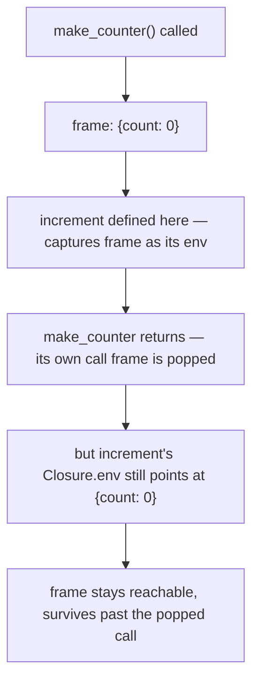

## Learning Objectives

- Define a closure, at the implementation level, as a pair of (function code, the environment active where the function was defined).
- Implement function values and closures in a tree-walking interpreter, extending the `eval`/environment machinery from the previous two concepts.
- Explain concretely why a closure's captured environment is NOT reclaimed when the enclosing call returns, in terms of references rather than garbage collection mechanics (covered fully later in this discipline).
- Contrast this implementation-level view of a closure with the features-level description already given in `programming-paradigms`, and state precisely what's new here.
- Trace two separately created closures from the same function definition and confirm their captured environments are genuinely independent.

## Context & Motivation

`programming-paradigms` already introduced closures as a FEATURE: "a function that keeps working correctly even after the scope it was defined in has returned," demonstrated with a Python counter-factory example. That description is complete and correct from a programmer's point of view — but it deliberately said nothing about HOW a runtime actually makes this true, since that question belonged to a different discipline. This concept is that missing implementation: given the environment-chain machinery from the previous concept, what does a function VALUE actually look like at runtime, and why does its captured environment survive past the point an ordinary local frame would normally be discarded?

The answer turns out to be almost embarrassingly direct once environments are already in place: a closure is simply a pair — the function's code (its parameter list and body, straight from the AST) and a REFERENCE to the environment that was active at the exact point the function was defined. Nothing more elaborate is required. The environment survives specifically because the closure holds a reference to it — and as long as anything holds a reference to an object, nothing (in a language with automatic memory management, covered later) is going to reclaim it out from under that reference.

## Core Theory

### A closure as a (code, environment) pair

```python
class Closure:
    def __init__(self, params, body, env):
        self.params = params      # e.g. ["x"]
        self.body = body          # the function's AST body
        self.env = env            # the environment active WHERE the function was defined
```

Evaluating a lambda/function-literal AST node does not run the function's body at all — it simply PACKAGES the current environment together with the function's code into a `Closure` value:

```python
def eval(node, env):
    match node:
        # ... previous cases ...
        case LambdaExpr(params, body):
            return Closure(params, body, env)     # capture env NOW, at definition time
        case CallExpr(func_expr, arg_exprs):
            closure = eval(func_expr, env)
            arg_values = [eval(a, env) for a in arg_exprs]
            call_env = Environment(parent=closure.env)      # NOT parent=env!
            for param, value in zip(closure.params, arg_values):
                call_env.define(param, value)
            return eval(closure.body, call_env)
```

The single most consequential line here is `Environment(parent=closure.env)` — the new call frame's parent is the environment CAPTURED inside the closure, not the environment active at the CALL site. This one line is the entire mechanism that makes lexical scope (from the previous concept) actually hold for function calls: a function's free variables always resolve against where it was DEFINED, because that's literally the parent pointer baked into its closure.

### Why the captured environment survives

In a language without closures (or in a naive implementation that used the caller's environment instead), a function's local environment would ordinarily become garbage the moment the function returns — nothing left in the program refers to it anymore. A closure changes this specific fact: as long as the `Closure` object itself is reachable (returned from a function, stored in a data structure, passed around), its `.env` field keeps a live reference to the captured environment, which in turn keeps THAT environment's own bindings alive. The environment isn't given any special "survive longer" treatment by the language — it survives for the same ordinary reason any object survives: something still holds a reference to it.



### Comparing to the features-level description

`programming-paradigms`'s closures concept asked "what does a closure DO?" and answered with observable behavior: state that persists across calls, independent copies per creation. This concept asks "what IS a closure, as a runtime value?" and answers with a concrete data structure: a `(code, env)` pair, plus one crucial detail in how function calls build their new frame. Both descriptions are correct and consistent — the features-level one is what a programmer needs to use closures correctly; the implementation-level one, covered here, is what's needed to build a language that supports them at all, or to reason precisely about their memory behavior.

## Worked Examples

### Example 1: Building and calling a counter closure, traced through the model above

Source (in this discipline's toy syntax): `let make_counter = λ(). let count = 0 in λ(). count`. Simplified trace for creating one counter and calling it:

```text
eval(LambdaExpr([], let_count_body), global_env)
  → Closure(params=[], body=let_count_body, env=global_env)     # captured at definition

call it:
eval(CallExpr(make_counter, []), global_env)
  call_env = Environment(parent=global_env)                      # closure.env was global_env
  eval(let_count_body, call_env):
    new_env = Environment(parent=call_env); new_env.define("count", 0)
    eval(LambdaExpr([], VarExpr("count")), new_env)
      → Closure(params=[], body=VarExpr("count"), env=new_env)   # captures new_env, WITH count=0

Result: a Closure whose .env has "count" bound to 0
```

The inner closure's `.env` is `new_env` — the frame that has `count` — not `global_env` and not the outer call's `call_env`. This is exactly why calling this returned closure later can still see `count`, even though `make_counter`'s own call has long since returned.

### Example 2: Two independently created closures don't interfere

```python
counter_a = make_counter()   # creates its OWN new_env, with its own "count" binding
counter_b = make_counter()   # creates a DIFFERENT new_env, with a DIFFERENT "count" binding

counter_a.call()  # increments counter_a's captured count
counter_a.call()  # counter_a's count is now 2
counter_b.call()  # counter_b's count is unaffected — its OWN captured env, still starts fresh
```

Every call to `make_counter` creates a brand-new `Environment` object for `count` — closures created by separate calls never share the same frame object, even though they were built by evaluating the exact same AST twice. This is precisely why closures behave as INDEPENDENT stateful objects, exactly as `programming-paradigms`'s features-level example demonstrated, now explained in terms of concrete object identity rather than taken on faith.

### Example 3: The bug a wrong implementation would introduce

```text
INCORRECT version: call_env = Environment(parent=env)   # using the CALLER's env, not closure.env

If this "bug" were introduced, calling a closure from a DIFFERENT lexical context than where
it was defined would let it see variables from the CALLER's scope instead of its own defining
scope — this is exactly dynamic scope creeping back in through a implementation mistake,
even in a language whose semantics were supposed to be lexically scoped throughout.
```

This concrete failure mode is exactly why the single line `Environment(parent=closure.env)` matters as much as it does — it is the one implementation detail standing between "this interpreter correctly implements lexical scope" and "this interpreter silently behaves like dynamic scope for function calls specifically."

## Common Misconceptions & Pitfalls

- **"A closure is a special kind of object, fundamentally different from an ordinary function."** At the implementation level shown here, EVERY function value in a language with closures is a `(code, env)` pair — there's no separate "ordinary function" category; a function that happens not to reference any variable from its enclosing scope is simply a closure whose captured environment happens not to matter for its behavior.
- **"The captured environment is kept alive by some special closure-specific mechanism."** It survives for the same ordinary reason any reachable object survives in a language with automatic memory management — the closure object holds a live reference to it, nothing more exotic than that; garbage collection (covered fully later in this discipline) is what actually decides WHEN an environment with no remaining references gets reclaimed.
- **"Since `programming-paradigms` already covered closures, this concept is redundant."** It answers a different question at a different level — features (what a closure lets a programmer do) vs. implementation (what data structure and which specific line of interpreter code make that behavior actually happen). Both are real, separate pieces of understanding.
- **"Any environment used when building a call frame will work the same."** The specific choice — `parent=closure.env`, not `parent=(the caller's environment)` — is the entire mechanism that makes lexical scope hold for function calls; picking the wrong one is a real, subtle bug that silently reintroduces dynamic-scope-like behavior.

## Summary

A closure, at the implementation level, is a `(code, environment)` pair — the function's AST body plus a reference to whatever environment was active exactly where the function was defined. Building a new call frame with `parent=closure.env` (not the caller's environment) is the single mechanism that makes lexical scope actually hold for function calls in a tree-walking interpreter, and it is exactly why a closure's captured bindings survive past the point its enclosing call returns: something (the closure itself) still holds a live reference to that environment. This concept completes the picture `programming-paradigms` started at the features level, replacing "a closure keeps working after its scope returns" with a concrete, traceable mechanism for exactly why and how.

## Documentation Links

- [Nystrom — Crafting Interpreters, Ch. 10 (Functions)](https://craftinginterpreters.com/functions.html) — a complete, real closure implementation following this exact `(code, env)` structure.
- [Stanford CS242 — Programming Languages](https://web.stanford.edu/class/cs242/) — covers closures and environment capture as core language-implementation material.
