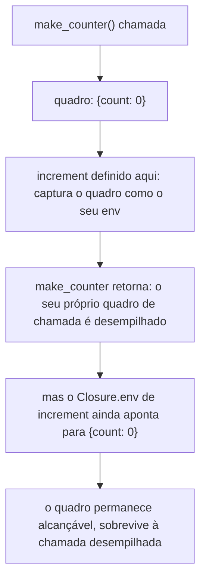

## Objetivos de Aprendizagem

- Definir uma closure, no nível de implementação, como um par de (código da função, o ambiente ativo onde a função foi definida).
- Implementar valores de função e closures num interpretador tree-walking, estendendo a maquinaria de `eval`/ambiente dos dois conceitos anteriores.
- Explicar concretamente por que o ambiente capturado de uma closure NÃO é recuperado quando a chamada envolvente retorna, em termos de referências em vez de mecânica de coleta de lixo (coberta por completo mais adiante nesta disciplina).
- Contrastar esta visão de nível de implementação de uma closure com a descrição de nível de recursos já dada em `programming-paradigms`, e enunciar precisamente o que é novo aqui.
- Rastrear duas closures criadas separadamente a partir da mesma definição de função e confirmar que os seus ambientes capturados são genuinamente independentes.

## Contexto e Motivação

`programming-paradigms` já introduziu closures como um RECURSO: "uma função que continua funcionando corretamente mesmo depois de o escopo no qual foi definida ter retornado", demonstrada com um exemplo de fábrica de contadores em Python. Essa descrição é completa e correta do ponto de vista de um programador, mas ela deliberadamente nada disse sobre COMO um runtime de fato torna isto verdadeiro, já que essa questão pertencia a uma disciplina diferente. Este conceito é essa implementação faltante: dada a maquinaria de cadeia de ambiente do conceito anterior, como é que um VALOR de função de fato se parece em tempo de execução, e por que o seu ambiente capturado sobrevive além do ponto em que um quadro local comum seria normalmente descartado?

A resposta acaba por ser quase constrangedoramente direta uma vez que ambientes já estão no lugar: uma closure é simplesmente um par, o código da função (a sua lista de parâmetros e corpo, direto da AST) e uma REFERÊNCIA ao ambiente que estava ativo no exato ponto em que a função foi definida. Nada mais elaborado é exigido. O ambiente sobrevive especificamente porque a closure guarda uma referência a ele, e enquanto qualquer coisa guardar uma referência a um objeto, nada (numa linguagem com gerenciamento automático de memória, coberto depois) vai recuperá-lo por baixo dessa referência.

## Teoria Central

### Uma closure como um par (código, ambiente)

```python
class Closure:
    def __init__(self, params, body, env):
        self.params = params      # por exemplo ["x"]
        self.body = body          # o corpo de AST da função
        self.env = env            # o ambiente ativo ONDE a função foi definida
```

Avaliar um nó de AST de lambda/literal-de-função não roda o corpo da função de forma alguma, ele simplesmente EMPACOTA o ambiente atual junto com o código da função num valor `Closure`:

```python
def eval(node, env):
    match node:
        # ... casos anteriores ...
        case LambdaExpr(params, body):
            return Closure(params, body, env)     # captura env AGORA, no tempo de definição
        case CallExpr(func_expr, arg_exprs):
            closure = eval(func_expr, env)
            arg_values = [eval(a, env) for a in arg_exprs]
            call_env = Environment(parent=closure.env)      # NÃO parent=env!
            for param, value in zip(closure.params, arg_values):
                call_env.define(param, value)
            return eval(closure.body, call_env)
```

A linha única mais consequente aqui é `Environment(parent=closure.env)`, o pai do novo quadro de chamada é o ambiente CAPTURADO dentro da closure, não o ambiente ativo no local da CHAMADA. Esta única linha é o mecanismo inteiro que faz o escopo léxico (do conceito anterior) de fato valer para chamadas de função: as variáveis livres de uma função sempre resolvem contra onde ela foi DEFINIDA, porque esse é literalmente o ponteiro de pai assado na sua closure.

### Por que o ambiente capturado sobrevive

Numa linguagem sem closures (ou numa implementação ingênua que usasse o ambiente do chamador em vez disso), o ambiente local de uma função ordinariamente viraria lixo no momento em que a função retorna, nada restante no programa se refere a ele mais. Uma closure muda este fato específico: enquanto o próprio objeto `Closure` for alcançável (retornado de uma função, armazenado numa estrutura de dados, passado adiante), o seu campo `.env` mantém uma referência viva ao ambiente capturado, que por sua vez mantém as próprias ligações DAQUELE ambiente vivas. O ambiente não recebe nenhum tratamento especial de "sobreviver mais" pela linguagem, ele sobrevive pela mesma razão comum que qualquer objeto sobrevive: algo ainda guarda uma referência a ele.



### Comparando com a descrição de nível de recursos

O conceito de closures de `programming-paradigms` perguntou "o que uma closure FAZ?" e respondeu com comportamento observável: estado que persiste por entre chamadas, cópias independentes por criação. Este conceito pergunta "o que É uma closure, como um valor de tempo de execução?" e responde com uma estrutura de dados concreta: um par `(código, env)`, mais um detalhe crucial em como chamadas de função constroem o seu novo quadro. Ambas as descrições são corretas e consistentes, a de nível de recursos é o que um programador precisa para usar closures corretamente; a de nível de implementação, coberta aqui, é o que é necessário para construir uma linguagem que as suporte de todo, ou para raciocinar precisamente sobre o seu comportamento de memória.

## Exemplos Resolvidos

### Exemplo 1: Construindo e chamando uma closure de contador, rastreada pelo modelo acima

Fonte (na sintaxe de brinquedo desta disciplina): `let make_counter = λ(). let count = 0 in λ(). count`. Rastreamento simplificado para criar um contador e chamá-lo:

```text
eval(LambdaExpr([], let_count_body), global_env)
  → Closure(params=[], body=let_count_body, env=global_env)     # capturado na definição

chamá-lo:
eval(CallExpr(make_counter, []), global_env)
  call_env = Environment(parent=global_env)                      # closure.env era global_env
  eval(let_count_body, call_env):
    new_env = Environment(parent=call_env); new_env.define("count", 0)
    eval(LambdaExpr([], VarExpr("count")), new_env)
      → Closure(params=[], body=VarExpr("count"), env=new_env)   # captura new_env, COM count=0

Resultado: uma Closure cujo .env tem "count" ligado a 0
```

O `.env` da closure interna é `new_env`, o quadro que tem `count`, não `global_env` e não o `call_env` da chamada externa. É exatamente por isso que chamar esta closure retornada depois ainda consegue ver `count`, mesmo que a própria chamada de `make_counter` há muito já tenha retornado.

### Exemplo 2: Duas closures criadas independentemente não interferem

```python
counter_a = make_counter()   # cria o SEU PRÓPRIO new_env, com a sua própria ligação "count"
counter_b = make_counter()   # cria um new_env DIFERENTE, com uma ligação "count" DIFERENTE

counter_a.call()  # incrementa o count capturado de counter_a
counter_a.call()  # o count de counter_a agora é 2
counter_b.call()  # o count de counter_b não é afetado: o SEU PRÓPRIO env capturado, ainda começa fresco
```

Toda chamada a `make_counter` cria um objeto `Environment` novinho em folha para `count`, closures criadas por chamadas separadas nunca compartilham o mesmo objeto de quadro, mesmo que tenham sido construídas avaliando a exata mesma AST duas vezes. É precisamente por isso que closures se comportam como objetos com estado INDEPENDENTES, exatamente como o exemplo de nível de recursos de `programming-paradigms` demonstrou, agora explicado em termos de identidade de objeto concreta em vez de tomado por fé.

### Exemplo 3: O bug que uma implementação errada introduziria

```text
Versão INCORRETA: call_env = Environment(parent=env)   # usando o env do CHAMADOR, não closure.env

Se este "bug" fosse introduzido, chamar uma closure de um contexto léxico DIFERENTE de onde ela
foi definida a deixaria ver variáveis do escopo do CHAMADOR em vez do seu próprio escopo
definidor, isto é exatamente escopo dinâmico voltando sorrateiramente por um erro de implementação,
mesmo numa linguagem cuja semântica deveria ser lexicamente escopada por toda parte.
```

Este modo de falha concreto é exatamente por que a linha única `Environment(parent=closure.env)` importa tanto quanto importa, é o único detalhe de implementação entre "este interpretador implementa corretamente escopo léxico" e "este interpretador silenciosamente se comporta como escopo dinâmico para chamadas de função especificamente".

## Equívocos Comuns e Armadilhas

- **"Uma closure é um tipo especial de objeto, fundamentalmente diferente de uma função comum."** No nível de implementação mostrado aqui, TODO valor de função numa linguagem com closures é um par `(código, env)`, não há categoria separada de "função comum"; uma função que por acaso não referencia nenhuma variável do seu escopo envolvente é simplesmente uma closure cujo ambiente capturado por acaso não importa para o seu comportamento.
- **"O ambiente capturado é mantido vivo por algum mecanismo especial específico de closure."** Ele sobrevive pela mesma razão comum que qualquer objeto alcançável sobrevive numa linguagem com gerenciamento automático de memória, o objeto closure guarda uma referência viva a ele, nada mais exótico do que isso; a coleta de lixo (coberta por completo depois nesta disciplina) é o que de fato decide QUANDO um ambiente sem referências restantes é recuperado.
- **"Já que `programming-paradigms` já cobriu closures, este conceito é redundante."** Ele responde uma pergunta diferente num nível diferente, recursos (o que uma closure deixa um programador fazer) vs. implementação (que estrutura de dados e qual linha específica de código de interpretador fazem esse comportamento de fato acontecer). Ambos são pedaços reais e separados de entendimento.
- **"Qualquer ambiente usado ao construir um quadro de chamada funcionará da mesma forma."** A escolha específica, `parent=closure.env`, não `parent=(o ambiente do chamador)`, é o mecanismo inteiro que faz escopo léxico valer para chamadas de função; escolher o errado é um bug real e sutil que silenciosamente reintroduz comportamento parecido com escopo dinâmico.

## Resumo

Uma closure, no nível de implementação, é um par `(código, ambiente)`, o corpo de AST da função mais uma referência a qualquer que fosse o ambiente ativo exatamente onde a função foi definida. Construir um novo quadro de chamada com `parent=closure.env` (não o ambiente do chamador) é o mecanismo único que faz escopo léxico de fato valer para chamadas de função num interpretador tree-walking, e é exatamente por que as ligações capturadas de uma closure sobrevivem além do ponto em que a sua chamada envolvente retorna: algo (a própria closure) ainda guarda uma referência viva àquele ambiente. Este conceito completa o quadro que `programming-paradigms` começou no nível de recursos, substituindo "uma closure continua funcionando depois de o seu escopo retornar" por um mecanismo concreto e rastreável de exatamente por que e como.

## Documentation Links

- [Nystrom — Crafting Interpreters, Ch. 10 (Functions)](https://craftinginterpreters.com/functions.html): uma implementação de closure completa e real seguindo esta exata estrutura `(código, env)`.
- [Stanford CS242 — Programming Languages](https://web.stanford.edu/class/cs242/): cobre closures e captura de ambiente como material central de implementação de linguagem.
