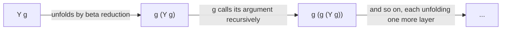

## Learning Objectives

- Define Church encodings as a technique for representing data (booleans, natural numbers) as pure lambda terms, with no built-in support for either.
- Construct the Church booleans `true` and `false` and verify that a Church conditional built from them reduces correctly on both branches.
- Construct at least the first two Church numerals and explain the general pattern (a numeral applies its function argument n times).
- Explain the Y combinator's role: expressing recursion — a function that refers to itself — without the language needing a built-in named-recursion construct at all.
- State the Church-Turing thesis's real evidentiary structure (already covered in `computability-complexity`) and explain how the lambda calculus's proven equivalence to the Turing machine is exactly one instance of that evidence.

## Context & Motivation

The lambda calculus's grammar has no numbers, no booleans, no `if`, and no named recursion — three constructs and one reduction rule, nothing else. This concept asks the natural follow-up question: can something this minimal actually compute anything interesting, or is it a cute toy incapable of doing real work? The answer, discovered by Church himself in the 1930s, is that it is fully capable — booleans, natural numbers, arithmetic operations, and even self-referential recursion can ALL be encoded as ordinary lambda terms, using nothing beyond the three constructs already covered.

This matters for a reason well beyond mathematical curiosity. The Church-Turing thesis — already covered in `computability-complexity` — claims that every reasonable notion of "mechanically computable" coincides with what a Turing machine can compute, and its real evidence is not a single proof (the thesis, being a bridge between an informal and a formal notion, cannot be proved outright) but the fact that several INDEPENDENTLY invented formal models — Turing machines, the lambda calculus, general recursive functions, and others — were later PROVEN mathematically equivalent to each other, each capturing exactly the same class of computable functions despite looking nothing alike on the surface. The Church encodings developed in this concept are the concrete demonstration that the lambda calculus really does belong on that list: showing that arithmetic and control flow can be built from three bare constructs is exactly the kind of evidence that makes "the lambda calculus is Turing-complete" a substantiated claim rather than an assertion.

## Core Theory

### Church booleans

Represent `true` and `false` as functions that choose between two arguments:

```text
tru  ≡  λt. λf. t          (given two arguments, return the first)
fls  ≡  λt. λf. f          (given two arguments, return the second)
```

A conditional is then just direct application — no special `if` syntax needed at all:

```text
test ≡ λl. λm. λn. l m n
```

`test tru a b` reduces (by three beta reductions) to `a`; `test fls a b` reduces to `b` — the Church boolean literally IS the choosing behavior an `if` needs, with no separate conditional construct required.

### Church numerals

Represent the natural number `n` as a function that applies its first argument to its second argument exactly `n` times:

```text
c0  ≡  λs. λz. z                        (apply s zero times — just return z)
c1  ≡  λs. λz. s z                      (apply s once)
c2  ≡  λs. λz. s (s z)                  (apply s twice)
c3  ≡  λs. λz. s (s (s z))              (apply s three times)
```

Successor (`+1`) is a function on Church numerals that adds one more application of `s`:

```text
scc ≡ λn. λs. λz. s (n s z)
```

Verify `scc c0` reduces to (something equivalent to) `c1`: `scc c0 = λs. λz. s (c0 s z) = λs. λz. s ((λs. λz. z) s z) = λs. λz. s z = c1`. Addition, multiplication, and eventually predecessor (genuinely trickier, requiring a pair-based encoding trick) all follow the same pattern: arithmetic operations become functions that compose or nest applications of `s` the right number of times.

### The Y combinator: recursion without named recursion

The lambda calculus's grammar has no way to write "a function that refers to itself by name" directly — `λx. ... f ... ` cannot refer to its own definition as `f`, because at the point the abstraction is written, there is no name yet to refer to. The Y combinator solves this with a genuinely clever construction:

```text
Y ≡ λf. (λx. f (x x)) (λx. f (x x))
```

The defining property: `Y g` reduces (in as many steps as needed) to `g (Y g)` — applying `Y` to any function `g` produces a term that, when unfolded, calls `g` with "itself, already tied into a loop" as an argument. This lets `g` receive a working copy of "the whole recursive computation so far" as a plain argument, with no named self-reference required anywhere in the grammar — recursion, a control-flow feature that looks like it should need special syntax, turns out to be expressible as an ordinary application of an ordinary (if slightly mind-bending) lambda term.



## Worked Examples

### Example 1: Church conditional reducing on both branches

```text
test tru a b
= (λl. λm. λn. l m n) tru a b
→ (λm. λn. tru m n) a b            (substitute tru for l)
→ (λn. tru a n) b                  (substitute a for m)
→ tru a b                          (substitute b for n)
= (λt. λf. t) a b
→ (λf. a) b                        (substitute a for t)
→ a                                (substitute b for f — but f doesn't occur, so nothing changes)
```

`test tru a b` really does reduce all the way to `a`, exactly matching what an `if true then a else b` ought to do — with the entire "choose a branch" behavior implemented purely by which of two bound variables the Church boolean happens to return first.

### Example 2: Computing `scc c1` and confirming it behaves like `c2`

```text
scc c1
= (λn. λs. λz. s (n s z)) c1
→ λs. λz. s (c1 s z)
= λs. λz. s ((λs. λz. s z) s z)
→ λs. λz. s (s z)
```

The result, `λs. λz. s (s z)`, is exactly `c2` as originally defined — applying `s` twice to `z`. `scc` on a Church numeral genuinely produces the "next" Church numeral, confirming the encoding really does behave like successor, not merely resemble it superficially.

### Example 3: Why arithmetic-on-encodings is the real evidence for Turing-completeness

```text
Claim to substantiate: the lambda calculus can compute anything a Turing machine can.

Evidence built in this concept alone:
  - Booleans and conditionals    → Church booleans + test          (control flow)
  - Natural numbers + arithmetic → Church numerals + scc (and,     (data + computation)
                                    with more work, addition/mult)
  - Self-reference / loops       → the Y combinator                (recursion)

Each of these is a piece a Turing machine also needs (a way to branch, a way to represent
data, a way to repeat computation indefinitely) — and each has just been shown constructible
from nothing but variables, abstraction, and application.
```

This is exactly the kind of concrete demonstration that turns "the lambda calculus is one of the models behind the Church-Turing thesis" from an assertion into a substantiated claim: the thesis's real evidentiary weight comes from independently-designed models like this one converging on the same computational power, and Church encodings are the constructive proof that the convergence, for the lambda calculus specifically, actually holds.

## Common Misconceptions & Pitfalls

- **"Church encodings are just a cute trick with no practical relevance."** They are the historical origin of a real, still-used idea: representing control flow and data purely through functions rather than built-in primitives shows up directly in real functional-programming idioms (algebraic data types compiled to function-based representations, continuation-passing style), and understanding the encoding is what makes "the lambda calculus is Turing-complete" a demonstrated fact rather than a claim taken on faith.
- **"The Y combinator is how real language implementations actually implement recursive functions."** It is not — real implementations give recursive functions genuine self-reference at the implementation level (an environment that can refer to itself, covered later in this discipline's closures material) rather than the Y combinator's pure-lambda trick. The Y combinator matters because it PROVES recursion doesn't require adding new syntax to the calculus, not because production interpreters actually build recursion this way.
- **"Since the lambda calculus can encode numbers, it therefore has numbers built in."** The whole point is the opposite: the grammar never changes — no numeral literal, no arithmetic operator was added to the language. The Church numerals are ordinary lambda terms that happen to behave the way numbers should when combined with functions like `scc` — the encoding lives entirely at the level of "which specific terms we choose to interpret as representing which numbers," not in the grammar itself.
- **"Proving the lambda calculus Turing-complete is the same as proving the Church-Turing thesis."** It is one piece of evidence FOR the thesis, not a proof of it — the thesis itself, being a claim that bridges an informal notion ("mechanically computable") to a formal one, cannot be proved outright, exactly as already established in `computability-complexity`.

## Summary

Church encodings represent booleans (`tru`, `fls`, choosing functions) and natural numbers (numerals as "apply this function n times") as ordinary lambda terms, with arithmetic operations like successor (`scc`) provably behaving correctly on these encodings by beta reduction alone. The Y combinator (`λf. (λx. f (x x)) (λx. f (x x))`) shows that even self-referential recursion is expressible without any named-recursion construct in the grammar, since `Y g` reduces to `g (Y g)` for any function `g`. Together these constructions are the concrete demonstration that the lambda calculus, despite its extreme minimality, is Turing-complete — exactly the kind of evidence, independently arrived at from a completely different direction than Turing's own machine model, that makes the Church-Turing thesis's convergence claim substantiated rather than merely asserted.

## Documentation Links

- [Pierce — Types and Programming Languages, Ch. 5 (The Untyped Lambda-Calculus)](https://www.cis.upenn.edu/~bcpierce/tapl/contents.pdf) — the canonical presentation of Church booleans, numerals, and the Y combinator.
- [ACM/IEEE CS2013 — Programming Languages Knowledge Area](https://csed.acm.org/knowledge-areas-programming-languages-pl-cs2013-version/) — situates the lambda calculus as foundational theory underlying real language semantics.
