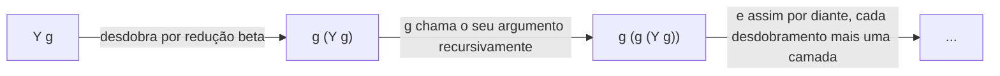

## Objetivos de Aprendizagem

- Definir codificações de Church como uma técnica para representar dados (booleanos, números naturais) como termos lambda puros, sem nenhum suporte embutido para qualquer um deles.
- Construir os booleanos de Church `true` e `false` e verificar que um condicional de Church construído a partir deles reduz corretamente em ambos os ramos.
- Construir pelo menos os primeiros dois numerais de Church e explicar o padrão geral (um numeral aplica o seu argumento de função n vezes).
- Explicar o papel do combinador Y: expressar recursão, uma função que se refere a si mesma, sem a linguagem precisar de nenhum construto de recursão-nomeada embutido de forma alguma.
- Enunciar a estrutura de evidência real da tese de Church-Turing (já coberta em `computability-complexity`) e explicar como a equivalência comprovada do cálculo lambda à máquina de Turing é exatamente uma instância dessa evidência.

## Contexto e Motivação

A gramática do cálculo lambda não tem números, nem booleanos, nem `if`, nem recursão nomeada, três construtos e uma regra de redução, nada mais. Este conceito faz a pergunta de acompanhamento natural: algo tão mínimo consegue de fato computar algo interessante, ou é um brinquedo fofo incapaz de fazer trabalho real? A resposta, descoberta pelo próprio Church nos anos 1930, é que é plenamente capaz, booleanos, números naturais, operações aritméticas e até recursão autorreferencial podem TODOS ser codificados como termos lambda comuns, usando nada além dos três construtos já cobertos.

Isto importa por uma razão bem além da curiosidade matemática. A tese de Church-Turing, já coberta em `computability-complexity`, afirma que toda noção razoável de "mecanicamente computável" coincide com o que uma máquina de Turing consegue computar, e a sua evidência real não é uma única prova (a tese, sendo uma ponte entre uma noção informal e uma formal, não pode ser provada de imediato) mas o fato de que vários modelos formais INVENTADOS INDEPENDENTEMENTE, máquinas de Turing, o cálculo lambda, funções recursivas gerais e outros, foram depois PROVADOS matematicamente equivalentes uns aos outros, cada um capturando exatamente a mesma classe de funções computáveis apesar de não se parecerem em nada na superfície. As codificações de Church desenvolvidas neste conceito são a demonstração concreta de que o cálculo lambda de fato pertence a essa lista: mostrar que aritmética e fluxo de controle podem ser construídos a partir de três construtos nus é exatamente o tipo de evidência que torna "o cálculo lambda é Turing-completo" uma afirmação substanciada em vez de uma asserção.

## Teoria Central

### Booleanos de Church

Represente `true` e `false` como funções que escolhem entre dois argumentos:

```text
tru  ≡  λt. λf. t          (dados dois argumentos, retorna o primeiro)
fls  ≡  λt. λf. f          (dados dois argumentos, retorna o segundo)
```

Um condicional é então só aplicação direta, nenhuma sintaxe `if` especial necessária de forma alguma:

```text
test ≡ λl. λm. λn. l m n
```

`test tru a b` reduz (por três reduções beta) a `a`; `test fls a b` reduz a `b`, o booleano de Church literalmente É o comportamento de escolha que um `if` precisa, sem nenhum construto condicional separado exigido.

### Numerais de Church

Represente o número natural `n` como uma função que aplica o seu primeiro argumento ao seu segundo argumento exatamente `n` vezes:

```text
c0  ≡  λs. λz. z                        (aplica s zero vezes: só retorna z)
c1  ≡  λs. λz. s z                      (aplica s uma vez)
c2  ≡  λs. λz. s (s z)                  (aplica s duas vezes)
c3  ≡  λs. λz. s (s (s z))              (aplica s três vezes)
```

O sucessor (`+1`) é uma função sobre numerais de Church que adiciona mais uma aplicação de `s`:

```text
scc ≡ λn. λs. λz. s (n s z)
```

Verifique que `scc c0` reduz a (algo equivalente a) `c1`: `scc c0 = λs. λz. s (c0 s z) = λs. λz. s ((λs. λz. z) s z) = λs. λz. s z = c1`. Adição, multiplicação e, eventualmente, predecessor (genuinamente mais complicado, exigindo um truque de codificação baseado em par) todos seguem o mesmo padrão: operações aritméticas viram funções que compõem ou aninham aplicações de `s` o número certo de vezes.

### O combinador Y: recursão sem recursão nomeada

A gramática do cálculo lambda não tem como escrever "uma função que se refere a si mesma por nome" diretamente, `λx. ... f ... ` não consegue se referir à sua própria definição como `f`, porque no ponto em que a abstração é escrita, não há nome ainda a que se referir. O combinador Y resolve isto com uma construção genuinamente engenhosa:

```text
Y ≡ λf. (λx. f (x x)) (λx. f (x x))
```

A propriedade definidora: `Y g` reduz (em quantos passos forem necessários) a `g (Y g)`, aplicar `Y` a qualquer função `g` produz um termo que, quando desdobrado, chama `g` com "ele mesmo, já atado num laço" como argumento. Isto deixa `g` receber uma cópia funcional de "a computação recursiva inteira até agora" como um argumento simples, sem nenhuma autorreferência nomeada exigida em nenhum lugar na gramática, recursão, um recurso de fluxo de controle que parece que deveria precisar de sintaxe especial, acaba por ser expressável como uma aplicação comum de um termo lambda comum (se levemente alucinante).



## Exemplos Resolvidos

### Exemplo 1: Condicional de Church reduzindo em ambos os ramos

```text
test tru a b
= (λl. λm. λn. l m n) tru a b
→ (λm. λn. tru m n) a b            (substitui tru por l)
→ (λn. tru a n) b                  (substitui a por m)
→ tru a b                          (substitui b por n)
= (λt. λf. t) a b
→ (λf. a) b                        (substitui a por t)
→ a                                (substitui b por f: mas f não ocorre, então nada muda)
```

`test tru a b` de fato reduz por todo o caminho até `a`, correspondendo exatamente ao que um `if true then a else b` deveria fazer, com o comportamento inteiro de "escolher um ramo" implementado puramente por qual de duas variáveis ligadas o booleano de Church por acaso retorna primeiro.

### Exemplo 2: Computando `scc c1` e confirmando que se comporta como `c2`

```text
scc c1
= (λn. λs. λz. s (n s z)) c1
→ λs. λz. s (c1 s z)
= λs. λz. s ((λs. λz. s z) s z)
→ λs. λz. s (s z)
```

O resultado, `λs. λz. s (s z)`, é exatamente `c2` como originalmente definido, aplicando `s` duas vezes a `z`. `scc` num numeral de Church genuinamente produz o numeral de Church "seguinte", confirmando que a codificação de fato se comporta como sucessor, não meramente o parece superficialmente.

### Exemplo 3: Por que aritmética-sobre-codificações é a evidência real de Turing-completude

```text
Afirmação a substanciar: o cálculo lambda consegue computar qualquer coisa que uma máquina de Turing consiga.

Evidência construída só neste conceito:
  - Booleanos e condicionais      → booleanos de Church + test        (fluxo de controle)
  - Números naturais + aritmética → numerais de Church + scc (e,      (dados + computação)
                                     com mais trabalho, adição/mult)
  - Autorreferência / laços       → o combinador Y                    (recursão)

Cada um destes é uma peça de que uma máquina de Turing também precisa (uma forma de ramificar, uma
forma de representar dados, uma forma de repetir computação indefinidamente), e cada uma acabou de
ser mostrada construtível de nada além de variáveis, abstração e aplicação.
```

Este é exatamente o tipo de demonstração concreta que transforma "o cálculo lambda é um dos modelos por trás da tese de Church-Turing" de uma asserção numa afirmação substanciada: o peso de evidência real da tese vem de modelos projetados independentemente como este convergindo para o mesmo poder computacional, e as codificações de Church são a prova construtiva de que a convergência, para o cálculo lambda especificamente, de fato se mantém.

## Equívocos Comuns e Armadilhas

- **"Codificações de Church são só um truque fofo sem relevância prática."** Elas são a origem histórica de uma ideia real, ainda em uso: representar fluxo de controle e dados puramente por meio de funções em vez de primitivos embutidos aparece diretamente em idiomas reais de programação funcional (tipos de dados algébricos compilados para representações baseadas em função, estilo de passagem de continuações), e entender a codificação é o que torna "o cálculo lambda é Turing-completo" um fato demonstrado em vez de uma afirmação tomada por fé.
- **"O combinador Y é como implementações de linguagem reais de fato implementam funções recursivas."** Não é, implementações reais dão a funções recursivas autorreferência genuína no nível de implementação (um ambiente que pode se referir a si mesmo, coberto depois no material de closures desta disciplina) em vez do truque de lambda-puro do combinador Y. O combinador Y importa porque PROVA que recursão não exige adicionar nova sintaxe ao cálculo, não porque interpretadores de produção de fato constroem recursão desta forma.
- **"Já que o cálculo lambda consegue codificar números, ele portanto tem números embutidos."** O ponto inteiro é o oposto: a gramática nunca muda, nenhum literal de numeral, nenhum operador aritmético foi adicionado à linguagem. Os numerais de Church são termos lambda comuns que por acaso se comportam da forma que números deveriam quando combinados com funções como `scc`, a codificação vive inteiramente no nível de "quais termos específicos escolhemos interpretar como representando quais números", não na gramática ela mesma.
- **"Provar o cálculo lambda Turing-completo é o mesmo que provar a tese de Church-Turing."** É um pedaço de evidência A FAVOR da tese, não uma prova dela, a tese ela mesma, sendo uma afirmação que faz ponte entre uma noção informal ("mecanicamente computável") e uma formal, não pode ser provada de imediato, exatamente como já estabelecido em `computability-complexity`.

## Resumo

Codificações de Church representam booleanos (`tru`, `fls`, funções de escolha) e números naturais (numerais como "aplique esta função n vezes") como termos lambda comuns, com operações aritméticas como sucessor (`scc`) comprovadamente se comportando corretamente sobre estas codificações por redução beta sozinha. O combinador Y (`λf. (λx. f (x x)) (λx. f (x x))`) mostra que até recursão autorreferencial é expressável sem nenhum construto de recursão-nomeada na gramática, já que `Y g` reduz a `g (Y g)` para qualquer função `g`. Juntas estas construções são a demonstração concreta de que o cálculo lambda, apesar da sua minimalidade extrema, é Turing-completo, exatamente o tipo de evidência, chegada independentemente de uma direção completamente diferente do próprio modelo de máquina de Turing, que torna a afirmação de convergência da tese de Church-Turing substanciada em vez de meramente asserida.

## Documentation Links

- [Pierce — Types and Programming Languages, Ch. 5 (The Untyped Lambda-Calculus)](https://www.cis.upenn.edu/~bcpierce/tapl/contents.pdf): a apresentação canônica de booleanos de Church, numerais e o combinador Y.
- [ACM/IEEE CS2013 — Programming Languages Knowledge Area](https://csed.acm.org/knowledge-areas-programming-languages-pl-cs2013-version/): situa o cálculo lambda como teoria fundacional subjacente à semântica de linguagem real.
