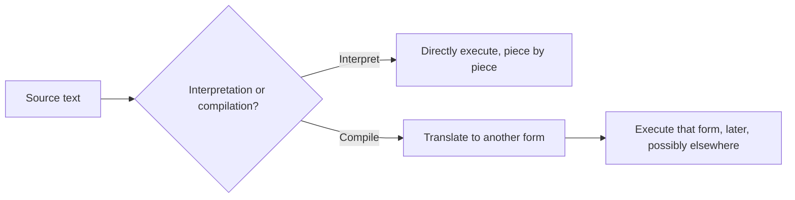

## Learning Objectives

- Distinguish a language's FEATURES (what it lets a programmer say) from its IMPLEMENTATION (how a machine makes what was said actually happen).
- Explain, with a concrete example, why the same feature (say, a closure) can be described completely from the programmer's side while leaving open an entirely separate question of how a runtime actually represents it.
- State this discipline's scope in relation to two already-covered siblings: `programming-paradigms` (features, comparatively, across six paradigms) and the still-to-come `compilers` discipline (a full pipeline reaching real machine code).
- Identify interpretation and compilation as the two basic strategies for making a program run, and name a real language associated with each (with the caveat that most real languages blend both).
- Preview the four areas this discipline actually covers: formal semantics, building an interpreter, type systems, and runtime systems (memory management).

## Context & Motivation

`programming-paradigms` already asked and answered a real question: what different ways are there to think about a computation, and what language constructs embody each way? Object-oriented programming bundles data and behavior; functional programming keeps functions pure and treats them as values; logic programming states facts and rules and lets a solver find answers. All of that is a features-level question — it can be answered entirely by looking at programs written in a language and describing what they're allowed to say, without ever asking how any of it actually runs on a computer.

This discipline asks a different, harder question. Once a language exists on paper — its syntax specified, its constructs named — a program written in it is still just text. Somebody has to turn that text into behavior: numbers computed, branches taken, functions called and returned from. That "somebody" is a language implementation, and the specific mechanisms it uses — how source becomes tokens, how tokens become a tree, how that tree becomes an executing program, what a variable actually IS at runtime, how a type system catches an error before the program even starts — are a completely different body of knowledge from paradigm comparison. The ACM/IEEE CS2013 Programming Languages Knowledge Area itself draws this exact line: it marks Object-Oriented Programming, Functional Programming, and Basic Type Systems as CORE material (already covered, comparatively, in `programming-paradigms`), while marking Syntax Analysis, Language Translation and Execution, Runtime Systems, deeper Type Systems, and Formal Semantics as ELECTIVE, more specialized material — precisely the material this discipline exists to cover.

Why does this split matter pedagogically, not just administratively? Because a programmer who only ever learns paradigms can describe what a closure does but has no model of what happens in memory when one is created; a programmer who learns implementation gains the ability to reason about performance, to debug a stack overflow or a memory leak in terms of what a runtime is actually doing, and — most importantly for a computer science curriculum — to eventually build a language, or a domain-specific sublanguage, themselves.

## Core Theory

### Features vs. implementation: a worked contrast

Take a single feature already covered in `programming-paradigms`: closures. From the FEATURES side, a closure is simply "a function that keeps working correctly even after the scope it was defined in has returned" — that's a complete, correct, and useful description for a programmer using the feature. It says nothing about memory, environments, or garbage collection.

From the IMPLEMENTATION side — the question this discipline actually answers — a closure is a concrete runtime value: a pair of (the function's code, a reference to the environment it was created in). The environment has to be kept alive past the point where an ordinary stack-allocated frame would normally be reclaimed, which has real consequences for how memory is managed. Two languages can offer the identical closure FEATURE while implementing it in very different ways (heap-allocated environment records vs. a more optimized "closure conversion" that only captures the specific variables actually used) — that difference is invisible at the features level and is exactly this discipline's subject matter.

### Interpretation vs. compilation

There are two basic strategies for making a program written in some language actually execute, and most real systems blend them:

- **Interpretation.** A program (the interpreter) reads the source (or an intermediate representation of it) and directly carries out its meaning, one piece at a time, without ever producing a separate machine-code file. Python's reference implementation, at its core, is an interpreter.
- **Compilation.** A program (the compiler) translates the source into a different representation — often real machine code for a specific CPU, but sometimes a portable intermediate form — which is then executed separately, later, possibly by different hardware entirely. C compiled by GCC to x86-64 machine code (the exact target ISA already covered in `digital-logic-computer-organization` and `c-and-assembly`) is the clearest example.

In practice the line blurs: Java compiles to JVM bytecode, which is then interpreted (or further compiled just-in-time) by the JVM; CPython compiles Python source to its own bytecode before interpreting that. This discipline builds a tree-walking INTERPRETER as its practical throughline — the simplest strategy to build completely, end to end, within a single discipline's scope. The still-empty sibling discipline `compilers` picks up compilation properly: intermediate representations, optimization passes, and real machine-code generation are explicitly its job, not this one's.



### What this discipline actually covers

Four areas, in the order this discipline teaches them:

1. **Formal semantics.** A precise, on-paper definition of what a program means, before any code is written to execute it — small-step operational semantics, and the lambda calculus as the minimal language these semantics are first practiced on.
2. **Building an interpreter.** Scanning source into tokens, parsing tokens into an abstract syntax tree (reusing the context-free grammar material from `formal-languages-automata`), and evaluating that tree — literally turning the semantics rules from part one into a runnable function.
3. **Type systems.** Static vs. dynamic typing, and — going further than `programming-paradigms`'s brief mention — the actual typing rules and the progress/preservation properties that make "well-typed programs don't go wrong" a provable statement, not a slogan.
4. **Runtime systems.** How a call stack is actually represented at the interpreter level (connecting back to the real hardware stack already covered in `c-and-assembly`), and automatic memory management — reference counting and tracing garbage collection — as the runtime-level answer to the manual memory bugs already seen there.

## Worked Examples

### Example 1: The same closure feature, two different implementation questions

Programmer-visible feature (paradigms-level, already covered):

```python
def make_counter():
    count = 0
    def increment():
        nonlocal count
        count += 1
        return count
    return increment

c1 = make_counter()
c1()  # 1
c1()  # 2
```

Implementation-level questions this discipline asks about the exact same code: What data structure holds `count` after `make_counter` returns? Is it heap-allocated, and if so, when is it freed? If `make_counter` is called twice, are the two `count` variables in genuinely separate memory, or could they alias by mistake? None of these questions have anything to do with what the FEATURE lets a programmer say — they are entirely about what a correct implementation must do underneath.

### Example 2: One program, two execution strategies

```c
int square(int x) { return x * x; }
```

Under compilation (the strategy `c-and-assembly` already assumed, without naming it as a choice): this becomes real x86-64 instructions — a function prologue, a multiply instruction, an epilogue — sitting in an executable file, run directly by the CPU with no translation step left to do at run time.

Under interpretation: an interpreter for a C-like language would instead read the AST for `square`, and every time `square` is called, walk that AST again — look up `x`, multiply it by itself, return the result — redoing the "what does this mean" work on every single call, trading a slower per-call cost for never needing a separate compile step at all.

### Example 3: Classifying a language by its dominant strategy (with the honest caveat)

```text
Language      Dominant strategy in its most common implementation
------------  -----------------------------------------------------
C (via GCC)   Compilation to native machine code
Python (CPython) Compilation to bytecode, then that bytecode is interpreted
Java          Compilation to JVM bytecode, then interpreted / JIT-compiled
JavaScript (V8) Compilation to bytecode, then JIT-compiled to native code for hot paths
```

The pattern to notice: almost no real, modern language implementation is purely one or the other. "Interpreted language" and "compiled language" are folk categories that describe a language's most common implementation strategy, not an intrinsic property of the language itself — the same source language could, in principle, be given either kind of implementation.

## Common Misconceptions & Pitfalls

- **"Some languages ARE interpreted and others ARE compiled, as an intrinsic property."** Interpretation and compilation are properties of an IMPLEMENTATION, not a language. The same language (Python, Scheme, even C) has real implementations of both kinds; calling "Python is an interpreted language" a fact about Python itself, rather than about CPython specifically, is a category error worth unlearning early.
- **"Knowing paradigm features (from `programming-paradigms`) is the same as knowing how a language works."** They answer different questions. A programmer can use closures, pattern matching, and higher-order functions fluently while having zero model of environments, ASTs, or type-checking — this discipline is what fills that specific gap.
- **"Building a toy interpreter is unrelated to real, production language implementations."** The tree-walking interpreter built across this discipline uses the exact same conceptual pieces (scanner, parser, AST, environment, evaluator) that real production interpreters use; production systems add optimizations (bytecode compilation, JIT) on top of, not instead of, this same foundation.
- **"Type systems and formal semantics are only useful for people building compilers."** Progress and preservation (covered later in this discipline) are the theoretical basis for the everyday guarantee "if it type-checks, it won't crash with a type error at runtime" — a guarantee every user of a statically-typed language relies on, whether or not they ever build a language themselves.

## Summary

`programming-paradigms` answered "what can a language let you say?" as a features-level, comparative question across six paradigms. This discipline answers a different question: once a language exists, how does a machine actually make a program written in it run? It picks up exactly where CS2013's Programming Languages Knowledge Area marks the CORE material (OOP, functional, basic type systems) as done and the ELECTIVE material (syntax analysis, formal semantics, deeper type systems, runtime systems) as this discipline's real subject. It builds a tree-walking interpreter as its practical throughline — the simplest complete execution strategy — while explicitly leaving full compilation (intermediate representations, optimization, real machine-code generation) to the still-empty sibling discipline `compilers`. Four areas follow: formal semantics, building an interpreter, type systems, and runtime systems.

## Documentation Links

- [ACM/IEEE CS2013 — Programming Languages Knowledge Area](https://csed.acm.org/knowledge-areas-programming-languages-pl-cs2013-version/) — the curriculum source drawing the exact core/elective line this discipline's scope follows.
- [Stanford CS242 — Programming Languages](https://web.stanford.edu/class/cs242/) — a real course covering this discipline's material (semantics, type systems, language implementation) as a genuinely separate unit from paradigm comparison.
