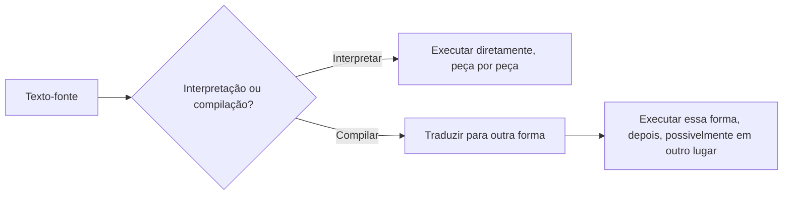

## Objetivos de Aprendizagem

- Distinguir os RECURSOS de uma linguagem (o que ela deixa um programador dizer) da sua IMPLEMENTAÇÃO (como uma máquina faz o que foi dito de fato acontecer).
- Explicar, com um exemplo concreto, por que o mesmo recurso (digamos, uma closure) pode ser descrito completamente do lado do programador enquanto deixa em aberto uma questão inteiramente separada de como um runtime de fato o representa.
- Enunciar o escopo desta disciplina em relação a duas irmãs já cobertas: `programming-paradigms` (recursos, comparativamente, por seis paradigmas) e a ainda por vir disciplina `compilers` (um pipeline completo alcançando código de máquina real).
- Identificar interpretação e compilação como as duas estratégias básicas para fazer um programa rodar, e nomear uma linguagem real associada a cada uma (com a ressalva de que a maioria das linguagens reais mescla ambas).
- Prever as quatro áreas que esta disciplina de fato cobre: semântica formal, construir um interpretador, sistemas de tipos e sistemas de tempo de execução (gerenciamento de memória).

## Contexto e Motivação

`programming-paradigms` já perguntou e respondeu uma questão real: que formas diferentes há de pensar sobre uma computação, e que construtos de linguagem encarnam cada forma? A programação orientada a objetos agrupa dados e comportamento; a programação funcional mantém funções puras e as trata como valores; a programação lógica enuncia fatos e regras e deixa um solucionador encontrar respostas. Tudo isso é uma questão de nível de recursos, pode ser respondida inteiramente olhando programas escritos numa linguagem e descrevendo o que eles têm permissão de dizer, sem jamais perguntar como qualquer parte disso de fato roda num computador.

Esta disciplina faz uma questão diferente e mais difícil. Uma vez que uma linguagem existe no papel, a sua sintaxe especificada, os seus construtos nomeados, um programa escrito nela ainda é só texto. Alguém tem de transformar esse texto em comportamento: números computados, ramos tomados, funções chamadas e retornadas. Esse "alguém" é uma implementação de linguagem, e os mecanismos específicos que ela usa, como a fonte vira tokens, como tokens viram uma árvore, como essa árvore vira um programa em execução, o que uma variável de fato É em tempo de execução, como um sistema de tipos pega um erro antes de o programa sequer começar, são um corpo de conhecimento completamente diferente da comparação de paradigmas. A própria Área de Conhecimento de Linguagens de Programação do ACM/IEEE CS2013 traça esta exata linha: ela marca Programação Orientada a Objetos, Programação Funcional e Sistemas de Tipos Básicos como material CENTRAL (já coberto, comparativamente, em `programming-paradigms`), enquanto marca Análise de Sintaxe, Tradução e Execução de Linguagem, Sistemas de Tempo de Execução, Sistemas de Tipos mais profundos e Semântica Formal como material ELETIVO, mais especializado, precisamente o material que esta disciplina existe para cobrir.

Por que esta divisão importa pedagogicamente, não só administrativamente? Porque um programador que só aprende paradigmas consegue descrever o que uma closure faz mas não tem modelo do que acontece na memória quando uma é criada; um programador que aprende implementação ganha a habilidade de raciocinar sobre desempenho, de depurar um estouro de pilha ou um vazamento de memória em termos do que um runtime de fato está fazendo, e, mais importante para um currículo de ciência da computação, de eventualmente construir uma linguagem, ou uma sublinguagem de domínio específico, ele mesmo.

## Teoria Central

### Recursos vs. implementação: um contraste resolvido

Tome um único recurso já coberto em `programming-paradigms`: closures. Do lado dos RECURSOS, uma closure é simplesmente "uma função que continua funcionando corretamente mesmo depois de o escopo no qual foi definida ter retornado", essa é uma descrição completa, correta e útil para um programador usando o recurso. Ela nada diz sobre memória, ambientes ou coleta de lixo.

Do lado da IMPLEMENTAÇÃO, a questão que esta disciplina de fato responde, uma closure é um valor concreto de tempo de execução: um par de (o código da função, uma referência ao ambiente no qual foi criada). O ambiente tem de ser mantido vivo além do ponto em que um quadro comum alocado na pilha seria normalmente recuperado, o que tem consequências reais para como a memória é gerenciada. Duas linguagens podem oferecer o RECURSO de closure idêntico enquanto o implementam de formas muito diferentes (registros de ambiente alocados no heap vs. uma "conversão de closure" mais otimizada que só captura as variáveis específicas de fato usadas), essa diferença é invisível no nível de recursos e é exatamente o assunto desta disciplina.

### Interpretação vs. compilação

Há duas estratégias básicas para fazer um programa escrito em alguma linguagem de fato executar, e a maioria dos sistemas reais as mescla:

- **Interpretação.** Um programa (o interpretador) lê a fonte (ou uma representação intermediária dela) e diretamente realiza o seu significado, uma peça por vez, sem jamais produzir um arquivo de código de máquina separado. A implementação de referência do Python, no seu cerne, é um interpretador.
- **Compilação.** Um programa (o compilador) traduz a fonte numa representação diferente, frequentemente código de máquina real para uma CPU específica, mas às vezes uma forma intermediária portável, que é então executada separadamente, depois, possivelmente por hardware inteiramente diferente. C compilado pelo GCC para código de máquina x86-64 (a exata ISA alvo já coberta em `digital-logic-computer-organization` e `c-and-assembly`) é o exemplo mais claro.

Na prática a linha se borra: Java compila para bytecode da JVM, que é então interpretado (ou mais compilado just-in-time) pela JVM; o CPython compila a fonte Python para o seu próprio bytecode antes de interpretar esse. Esta disciplina constrói um INTERPRETADOR tree-walking como o seu fio condutor prático, a estratégia mais simples de construir completamente, de ponta a ponta, dentro do escopo de uma única disciplina. A disciplina irmã ainda vazia `compilers` retoma a compilação apropriadamente: representações intermediárias, passos de otimização e geração de código de máquina real são explicitamente o trabalho dela, não desta.



### O que esta disciplina de fato cobre

Quatro áreas, na ordem em que esta disciplina as ensina:

1. **Semântica formal.** Uma definição precisa, no papel, do que um programa significa, antes de qualquer código ser escrito para executá-lo, semântica operacional de passo pequeno, e o cálculo lambda como a linguagem mínima na qual estas semânticas são primeiro praticadas.
2. **Construir um interpretador.** Scanning da fonte em tokens, parsing de tokens numa árvore de sintaxe abstrata (reusando o material de gramática livre de contexto de `formal-languages-automata`), e avaliar essa árvore, literalmente transformando as regras de semântica da parte um numa função executável.
3. **Sistemas de tipos.** Tipagem estática vs. dinâmica, e, indo mais longe do que a menção breve de `programming-paradigms`, as regras de tipagem de fato e as propriedades de progresso/preservação que tornam "programas bem tipados não dão errado" uma declaração provável, não um slogan.
4. **Sistemas de tempo de execução.** Como uma pilha de chamadas é de fato representada no nível de interpretador (conectando de volta à pilha de hardware real já coberta em `c-and-assembly`), e gerenciamento automático de memória, contagem de referências e coleta de lixo por rastreamento, como a resposta de nível de runtime aos bugs de memória manual já vistos ali.

## Exemplos Resolvidos

### Exemplo 1: O mesmo recurso de closure, duas questões de implementação diferentes

Recurso visível ao programador (nível de paradigmas, já coberto):

```python
def make_counter():
    count = 0
    def increment():
        nonlocal count
        count += 1
        return count
    return increment

c1 = make_counter()
c1()  # 1
c1()  # 2
```

Questões de nível de implementação que esta disciplina faz sobre o exato mesmo código: Que estrutura de dados guarda `count` depois de `make_counter` retornar? É alocada no heap, e se sim, quando é liberada? Se `make_counter` é chamada duas vezes, as duas variáveis `count` estão em memória genuinamente separada, ou poderiam fazer alias por engano? Nenhuma destas questões tem nada a ver com o que o RECURSO deixa um programador dizer, elas são inteiramente sobre o que uma implementação correta tem de fazer por baixo.

### Exemplo 2: Um programa, duas estratégias de execução

```c
int square(int x) { return x * x; }
```

Sob compilação (a estratégia que `c-and-assembly` já assumiu, sem nomeá-la como uma escolha): isto vira instruções x86-64 reais, um prólogo de função, uma instrução de multiplicação, um epílogo, sentadas num arquivo executável, rodadas diretamente pela CPU sem nenhum passo de tradução restante a fazer em tempo de execução.

Sob interpretação: um interpretador para uma linguagem parecida com C em vez disso leria a AST de `square`, e toda vez que `square` é chamado, percorreria essa AST de novo, buscar `x`, multiplicá-lo por si mesmo, retornar o resultado, refazendo o trabalho de "o que isto significa" em toda única chamada, trocando um custo mais lento por chamada por nunca precisar de um passo de compilação separado de todo.

### Exemplo 3: Classificando uma linguagem pela sua estratégia dominante (com a ressalva honesta)

```text
Linguagem      Estratégia dominante na sua implementação mais comum
------------  -----------------------------------------------------
C (via GCC)   Compilação para código de máquina nativo
Python (CPython) Compilação para bytecode, depois esse bytecode é interpretado
Java          Compilação para bytecode da JVM, depois interpretado / compilado JIT
JavaScript (V8) Compilação para bytecode, depois compilado JIT para código nativo em caminhos quentes
```

O padrão a notar: quase nenhuma implementação de linguagem real e moderna é puramente uma ou a outra. "Linguagem interpretada" e "linguagem compilada" são categorias populares que descrevem a estratégia de implementação mais comum de uma linguagem, não uma propriedade intrínseca da própria linguagem, a mesma linguagem fonte poderia, em princípio, receber qualquer um dos tipos de implementação.

## Equívocos Comuns e Armadilhas

- **"Algumas linguagens SÃO interpretadas e outras SÃO compiladas, como uma propriedade intrínseca."** Interpretação e compilação são propriedades de uma IMPLEMENTAÇÃO, não de uma linguagem. A mesma linguagem (Python, Scheme, até C) tem implementações reais de ambos os tipos; chamar "Python é uma linguagem interpretada" de fato sobre o próprio Python, em vez de sobre o CPython especificamente, é um erro de categoria que vale desaprender cedo.
- **"Conhecer recursos de paradigma (de `programming-paradigms`) é o mesmo que conhecer como uma linguagem funciona."** Eles respondem questões diferentes. Um programador pode usar closures, casamento de padrões e funções de ordem superior com fluência enquanto tem zero modelo de ambientes, ASTs ou verificação de tipos, esta disciplina é o que preenche essa lacuna específica.
- **"Construir um interpretador de brinquedo não tem relação com implementações de linguagem reais e de produção."** O interpretador tree-walking construído por toda esta disciplina usa as exatas mesmas peças conceituais (scanner, parser, AST, ambiente, avaliador) que interpretadores de produção reais usam; sistemas de produção adicionam otimizações (compilação para bytecode, JIT) em cima de, não em vez de, esta mesma fundação.
- **"Sistemas de tipos e semântica formal só são úteis para pessoas construindo compiladores."** Progresso e preservação (cobertos depois nesta disciplina) são a base teórica para a garantia cotidiana "se verifica o tipo, não vai travar com um erro de tipo em tempo de execução", uma garantia na qual todo usuário de uma linguagem estaticamente tipada confia, quer construa uma linguagem ele mesmo ou não.

## Resumo

`programming-paradigms` respondeu "o que uma linguagem pode deixar você dizer?" como uma questão de nível de recursos, comparativa, por seis paradigmas. Esta disciplina responde uma questão diferente: uma vez que uma linguagem existe, como é que uma máquina de fato faz um programa escrito nela rodar? Ela retoma exatamente onde a Área de Conhecimento de Linguagens de Programação do CS2013 marca o material CENTRAL (OOP, funcional, sistemas de tipos básicos) como feito e o material ELETIVO (análise de sintaxe, semântica formal, sistemas de tipos mais profundos, sistemas de tempo de execução) como o assunto real desta disciplina. Ela constrói um interpretador tree-walking como o seu fio condutor prático, a estratégia de execução completa mais simples, enquanto deixa explicitamente a compilação completa (representações intermediárias, otimização, geração de código de máquina real) para a disciplina irmã ainda vazia `compilers`. Quatro áreas seguem: semântica formal, construir um interpretador, sistemas de tipos e sistemas de tempo de execução.

## Documentation Links

- [ACM/IEEE CS2013 — Programming Languages Knowledge Area](https://csed.acm.org/knowledge-areas-programming-languages-pl-cs2013-version/): a fonte de currículo que traça a exata linha central/eletiva que o escopo desta disciplina segue.
- [Stanford CS242 — Programming Languages](https://web.stanford.edu/class/cs242/): um curso real cobrindo o material desta disciplina (semântica, sistemas de tipos, implementação de linguagem) como uma unidade genuinamente separada da comparação de paradigmas.
