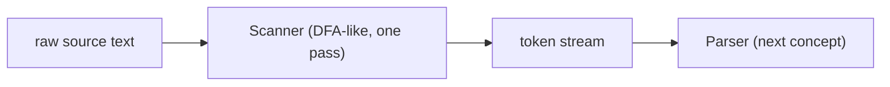

## Learning Objectives

- Define a token as the smallest meaningful unit a scanner produces from raw source characters, and list the common token categories (identifiers, keywords, numbers, operators, punctuation).
- Implement a scanner (by hand, on a small language) that consumes a character stream left to right and produces a list of tokens with no lookahead beyond what's strictly necessary.
- Explain the maximal-munch rule for resolving ambiguity between short and long tokens (e.g. `<` vs. `<=`).
- Distinguish lexical errors (an illegal character) from syntax errors (an illegal sequence of otherwise-valid tokens), and explain why a scanner can only ever catch the first kind.
- Connect scanning forward to parsing: a token stream, not raw characters, is what a parser actually consumes next.

## Context & Motivation

Every concept so far in this discipline's "Building an Interpreter" section has worked with lambda terms and AST-shaped values written directly as data structures — `IfTerm(cond, t2, t3)`, `λx. t` — never as raw text a human actually types into a file. Real source code arrives as a flat stream of characters: `if (iszero (pred x)) then y else z`, with no structure at all as far as the machine is concerned until something imposes it. Lexical analysis (scanning) is the first step that imposes ANY structure: grouping characters into tokens — `if`, `(`, `iszero`, `(`, `pred`, `x`, `)`, `)`, `then`, `y`, `else`, `z`, `)` — the smallest units a parser (the very next concept) is willing to work with.

Why separate scanning from parsing at all, rather than having one component do both in a single pass? Because the two jobs are genuinely different in kind: scanning is a REGULAR-language problem (recognizing tokens like identifiers or numbers is exactly the kind of pattern a DFA, already covered in `formal-languages-automata`, can recognize), while parsing is a CONTEXT-FREE problem (recognizing nested, recursive structure like matching parentheses requires a pushdown automaton's extra memory, also already covered there). Keeping them separate lets each stage use the simplest tool actually adequate for its job, and it is exactly what every real compiler and interpreter front end — from `javac` to CPython's own tokenizer — does in practice.

## Core Theory

### What a token is

A token is a pair: a TYPE (what kind of thing this is — identifier, number, keyword, operator) and a LEXEME (the actual substring of source text it was built from). Scanning `x123 + 45` produces tokens like `IDENTIFIER("x123")`, `PLUS("+")`, `NUMBER("45")` — the scanner has thrown away whitespace between tokens entirely (it carried no meaning) and has recognized that `x123` is one identifier, not five separate characters.

### The scanning algorithm: one pass, left to right

A scanner is, in its simplest form, a loop: look at the current character, decide what KIND of token is starting here based on that one character (a letter starts an identifier or keyword, a digit starts a number, `"` starts a string), then consume as many following characters as belong to that same token, using exactly the recognition power a DFA has (a state per "how far into recognizing this token type am I").

```python
def scan(source):
    tokens = []
    i = 0
    while i < len(source):
        c = source[i]
        if c.isspace():
            i += 1
        elif c.isdigit():
            start = i
            while i < len(source) and source[i].isdigit():
                i += 1
            tokens.append(Token("NUMBER", source[start:i]))
        elif c.isalpha():
            start = i
            while i < len(source) and source[i].isalnum():
                i += 1
            lexeme = source[start:i]
            kind = "IF" if lexeme == "if" else "IDENTIFIER"
            tokens.append(Token(kind, lexeme))
        elif c == "<":
            if i + 1 < len(source) and source[i+1] == "=":
                tokens.append(Token("LESS_EQUAL", "<="))
                i += 2
            else:
                tokens.append(Token("LESS", "<"))
                i += 1
        else:
            raise LexError(f"unexpected character '{c}' at position {i}")
    return tokens
```

Note how keywords (`if`) are recognized by first scanning a full identifier-shaped lexeme and then checking it against a fixed keyword list — this is simpler and more robust than trying to special-case each keyword's individual characters during the scan.

### Maximal munch

When a character could start more than one valid token (`<` could be the complete token `LESS`, or the first character of `<=`), the standard rule is MAXIMAL MUNCH: always consume the LONGEST possible valid token starting at the current position, never the shorter one, even if the shorter one would also be individually valid. This is exactly what the `<` branch above does — it checks for the longer `<=` possibility BEFORE settling for the shorter `<`.



### Lexical errors vs. syntax errors

A scanner can only detect one specific kind of problem: an ILLEGAL CHARACTER — one that doesn't fit the start of any valid token at all (e.g. `#` in a language where `#` isn't a meaningful symbol). It has no ability to detect a SYNTAX error — a sequence of individually-valid tokens in an invalid arrangement, like `) (` where a well-formed expression was expected. That detection is entirely the parser's job, one layer up, since it requires understanding nested STRUCTURE, which a scanner (a single linear pass with no memory of what came many tokens earlier) fundamentally cannot track.

## Worked Examples

### Example 1: Scanning a small expression by hand

Scan `if x <= 10 then y else 0` using the algorithm above:

```text
Position 0-1:   "if"    → IF
Position 3:     "x"     → IDENTIFIER("x")
Position 5-6:   "<="    → LESS_EQUAL   (maximal munch: "<" alone would also be valid, but "<=" is longer)
Position 8-9:   "10"    → NUMBER("10")
Position 11-14: "then"  → THEN
Position 16:    "y"     → IDENTIFIER("y")
Position 18-21: "else"  → ELSE
Position 23:    "0"     → NUMBER("0")

Resulting token stream:
[IF, IDENTIFIER("x"), LESS_EQUAL, NUMBER("10"), THEN, IDENTIFIER("y"), ELSE, NUMBER("0")]
```

Whitespace between tokens is entirely absent from the output — it did its job (separating tokens) and carries no further meaning.

### Example 2: A lexical error the scanner CAN catch

```text
Input:  x @ y
```

Scanning `x` succeeds (`IDENTIFIER("x")`), then whitespace is skipped, then `@` is reached: if `@` isn't the start of any valid token in this language's grammar, the scanner raises a lexical error immediately — right there, at that specific character, without needing to look at anything else in the file.

### Example 3: A syntax error the scanner CANNOT catch

```text
Input:  if x then
```

Every individual token here is perfectly legal: `IF`, `IDENTIFIER("x")`, `THEN` — the scanner produces this token stream with no complaint at all, since each of these three tokens, in isolation, is completely well-formed. The problem — a missing `then`-branch expression and a missing `else` clause — only becomes visible once the PARSER tries to build a structured tree out of this stream and finds it incomplete; this is exactly the boundary between what scanning can and cannot detect.

## Common Misconceptions & Pitfalls

- **"Scanning and parsing are basically the same job, just done in one combined pass for simplicity."** They're often IMPLEMENTED close together for convenience, but they solve genuinely different classes of problem — scanning is regular (a DFA suffices), parsing is context-free (needs a pushdown automaton's extra stack memory) — and keeping the distinction clear in one's mental model matters even when the code is interleaved.
- **"Whitespace is a kind of token, just an invisible one."** Whitespace is consumed and discarded by the scanner — it never becomes part of the token stream at all. It matters only insofar as it separates two tokens that would otherwise run together (`x y` vs. `xy`).
- **"If the scanner didn't raise an error, the program has no lexical or syntax problems at all."** The scanner only rules out lexical errors (illegal characters). A token stream with no lexical errors can still be completely nonsensical structurally (`) ( if if if`), which the parser — not the scanner — is responsible for catching.
- **"Maximal munch is an arbitrary convention that could just as easily go the other way."** It is a deliberate, near-universal choice because the alternative (always prefer the SHORTEST valid token) would make `<=` unscannable as a single token — it would always stop at `<` and treat the following `=` as a separate token, breaking every language that uses multi-character operators.

## Summary

Lexical analysis converts a flat character stream into a stream of tokens (type + lexeme pairs), using a single left-to-right pass whose recognition power matches exactly what a DFA provides for each token category — mirroring the regular-language machinery already covered in `formal-languages-automata`. Maximal munch resolves ambiguity between a short token and a longer one starting with the same characters by always preferring the longer valid token. A scanner can only detect lexical errors (illegal characters); syntax errors (illegal sequences of otherwise-valid tokens) require the structural understanding only a parser — built next — can provide. Scanning and parsing are kept as genuinely separate stages specifically because they solve different classes of formal-language problem, each with the simplest tool actually adequate to it.

## Documentation Links

- [Nystrom — Crafting Interpreters, Ch. 4 (Scanning)](https://craftinginterpreters.com/scanning.html) — a complete, real scanner implementation following this exact structure.
- [ACM/IEEE CS2013 — Programming Languages Knowledge Area](https://csed.acm.org/knowledge-areas-programming-languages-pl-cs2013-version/) — lists Syntax Analysis (which begins with lexical analysis) as elective material this discipline covers.
