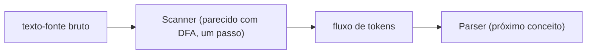

## Objetivos de Aprendizagem

- Definir um token como a menor unidade significativa que um scanner produz de caracteres-fonte brutos, e listar as categorias comuns de token (identificadores, palavras-chave, números, operadores, pontuação).
- Implementar um scanner (à mão, numa pequena linguagem) que consome um fluxo de caracteres da esquerda para a direita e produz uma lista de tokens sem nenhum lookahead além do estritamente necessário.
- Explicar a regra de maximal munch para resolver ambiguidade entre tokens curtos e longos (por exemplo `<` vs. `<=`).
- Distinguir erros léxicos (um caractere ilegal) de erros de sintaxe (uma sequência ilegal de tokens de outra forma válidos), e explicar por que um scanner só consegue pegar o primeiro tipo.
- Conectar o scanning adiante ao parsing: um fluxo de tokens, não caracteres brutos, é o que um parser de fato consome em seguida.

## Contexto e Motivação

Todo conceito até agora na seção "Construir um Interpretador" desta disciplina trabalhou com termos lambda e valores em formato de AST escritos diretamente como estruturas de dados, `IfTerm(cond, t2, t3)`, `λx. t`, nunca como texto bruto que um humano de fato digita num arquivo. Código-fonte real chega como um fluxo plano de caracteres: `if (iszero (pred x)) then y else z`, sem nenhuma estrutura de forma alguma no que diz respeito à máquina até algo a impor. A análise léxica (scanning) é o primeiro passo que impõe QUALQUER estrutura: agrupar caracteres em tokens, `if`, `(`, `iszero`, `(`, `pred`, `x`, `)`, `)`, `then`, `y`, `else`, `z`, `)`, as menores unidades com as quais um parser (o próximo conceito) está disposto a trabalhar.

Por que separar scanning de parsing de todo, em vez de ter um componente fazendo ambos num único passo? Porque os dois trabalhos são genuinamente diferentes em espécie: scanning é um problema de linguagem REGULAR (reconhecer tokens como identificadores ou números é exatamente o tipo de padrão que um DFA, já coberto em `formal-languages-automata`, consegue reconhecer), enquanto parsing é um problema LIVRE DE CONTEXTO (reconhecer estrutura aninhada e recursiva como parênteses balanceados exige a memória extra de um autômato de pilha, também já coberto ali). Mantê-los separados deixa cada estágio usar a ferramenta mais simples de fato adequada para o seu trabalho, e é exatamente o que todo front end de compilador e interpretador real, do `javac` ao próprio tokenizer do CPython, faz na prática.

## Teoria Central

### O que é um token

Um token é um par: um TIPO (que tipo de coisa isto é, identificador, número, palavra-chave, operador) e um LEXEMA (a substring de fato do texto-fonte da qual foi construído). Fazer scanning de `x123 + 45` produz tokens como `IDENTIFIER("x123")`, `PLUS("+")`, `NUMBER("45")`, o scanner jogou fora o espaço em branco entre tokens inteiramente (ele não carregava significado) e reconheceu que `x123` é um identificador, não cinco caracteres separados.

### O algoritmo de scanning: um passo, da esquerda para a direita

Um scanner é, na sua forma mais simples, um laço: olhe para o caractere atual, decida que TIPO de token está começando aqui com base nesse único caractere (uma letra começa um identificador ou palavra-chave, um dígito começa um número, `"` começa uma string), depois consuma tantos caracteres seguintes quanto pertençam àquele mesmo token, usando exatamente o poder de reconhecimento que um DFA tem (um estado por "quão longe no reconhecimento deste tipo de token estou").

```python
def scan(source):
    tokens = []
    i = 0
    while i < len(source):
        c = source[i]
        if c.isspace():
            i += 1
        elif c.isdigit():
            start = i
            while i < len(source) and source[i].isdigit():
                i += 1
            tokens.append(Token("NUMBER", source[start:i]))
        elif c.isalpha():
            start = i
            while i < len(source) and source[i].isalnum():
                i += 1
            lexeme = source[start:i]
            kind = "IF" if lexeme == "if" else "IDENTIFIER"
            tokens.append(Token(kind, lexeme))
        elif c == "<":
            if i + 1 < len(source) and source[i+1] == "=":
                tokens.append(Token("LESS_EQUAL", "<="))
                i += 2
            else:
                tokens.append(Token("LESS", "<"))
                i += 1
        else:
            raise LexError(f"unexpected character '{c}' at position {i}")
    return tokens
```

Note como palavras-chave (`if`) são reconhecidas primeiro fazendo scanning de um lexema completo em formato de identificador e depois checando-o contra uma lista fixa de palavras-chave, isto é mais simples e mais robusto do que tentar tratar como caso especial os caracteres individuais de cada palavra-chave durante o scan.

### Maximal munch

Quando um caractere poderia começar mais de um token válido (`<` poderia ser o token completo `LESS`, ou o primeiro caractere de `<=`), a regra padrão é MAXIMAL MUNCH: sempre consuma o token válido mais LONGO possível começando na posição atual, nunca o mais curto, mesmo se o mais curto também fosse individualmente válido. Isto é exatamente o que o ramo `<` acima faz, ele checa a possibilidade mais longa `<=` ANTES de se contentar com o mais curto `<`.



### Erros léxicos vs. erros de sintaxe

Um scanner só consegue detectar um tipo específico de problema: um CARACTERE ILEGAL, um que não encaixa no início de nenhum token válido de forma alguma (por exemplo `#` numa linguagem onde `#` não é um símbolo significativo). Ele não tem habilidade de detectar um erro de SINTAXE, uma sequência de tokens individualmente válidos num arranjo inválido, como `) (` onde uma expressão bem formada era esperada. Essa detecção é inteiramente o trabalho do parser, uma camada acima, já que exige entender ESTRUTURA aninhada, que um scanner (um único passo linear sem memória do que veio muitos tokens antes) fundamentalmente não consegue rastrear.

## Exemplos Resolvidos

### Exemplo 1: Fazendo scanning de uma pequena expressão à mão

Faça scanning de `if x <= 10 then y else 0` usando o algoritmo acima:

```text
Posição 0-1:   "if"    → IF
Posição 3:     "x"     → IDENTIFIER("x")
Posição 5-6:   "<="    → LESS_EQUAL   (maximal munch: "<" sozinho também seria válido, mas "<=" é mais longo)
Posição 8-9:   "10"    → NUMBER("10")
Posição 11-14: "then"  → THEN
Posição 16:    "y"     → IDENTIFIER("y")
Posição 18-21: "else"  → ELSE
Posição 23:    "0"     → NUMBER("0")

Fluxo de tokens resultante:
[IF, IDENTIFIER("x"), LESS_EQUAL, NUMBER("10"), THEN, IDENTIFIER("y"), ELSE, NUMBER("0")]
```

O espaço em branco entre tokens está inteiramente ausente da saída, ele fez o seu trabalho (separar tokens) e não carrega nenhum significado adicional.

### Exemplo 2: Um erro léxico que o scanner CONSEGUE pegar

```text
Entrada:  x @ y
```

O scanning de `x` tem sucesso (`IDENTIFIER("x")`), depois o espaço em branco é pulado, depois `@` é alcançado: se `@` não é o início de nenhum token válido na gramática desta linguagem, o scanner levanta um erro léxico imediatamente, ali mesmo, naquele caractere específico, sem precisar olhar para nada mais no arquivo.

### Exemplo 3: Um erro de sintaxe que o scanner NÃO CONSEGUE pegar

```text
Entrada:  if x then
```

Todo token individual aqui é perfeitamente legal: `IF`, `IDENTIFIER("x")`, `THEN`, o scanner produz este fluxo de tokens sem nenhuma reclamação de forma alguma, já que cada um destes três tokens, isoladamente, é completamente bem formado. O problema, uma expressão de ramo `then` faltante e uma cláusula `else` faltante, só se torna visível uma vez que o PARSER tenta construir uma árvore estruturada deste fluxo e a acha incompleta; este é exatamente o limite entre o que o scanning consegue e não consegue detectar.

## Equívocos Comuns e Armadilhas

- **"Scanning e parsing são basicamente o mesmo trabalho, só feito num passo combinado por simplicidade."** Eles são frequentemente IMPLEMENTADOS perto um do outro por conveniência, mas resolvem classes genuinamente diferentes de problema, scanning é regular (um DFA basta), parsing é livre de contexto (precisa da memória de pilha extra de um autômato de pilha), e manter a distinção clara no modelo mental importa mesmo quando o código é intercalado.
- **"Espaço em branco é um tipo de token, só um invisível."** Espaço em branco é consumido e descartado pelo scanner, ele nunca vira parte do fluxo de tokens de forma alguma. Ele importa só na medida em que separa dois tokens que de outra forma se juntariam (`x y` vs. `xy`).
- **"Se o scanner não levantou um erro, o programa não tem problemas léxicos ou de sintaxe de forma alguma."** O scanner só descarta erros léxicos (caracteres ilegais). Um fluxo de tokens sem erros léxicos ainda pode ser completamente sem sentido estruturalmente (`) ( if if if`), o que o parser, não o scanner, é responsável por pegar.
- **"Maximal munch é uma convenção arbitrária que poderia tão facilmente ir pelo outro lado."** É uma escolha deliberada e quase universal porque a alternativa (sempre preferir o token válido mais CURTO) tornaria `<=` não escaneável como um único token, ele sempre pararia em `<` e trataria o `=` seguinte como um token separado, quebrando toda linguagem que usa operadores de múltiplos caracteres.

## Resumo

A análise léxica converte um fluxo plano de caracteres num fluxo de tokens (pares de tipo + lexema), usando um único passo da esquerda para a direita cujo poder de reconhecimento corresponde exatamente ao que um DFA fornece para cada categoria de token, espelhando a maquinaria de linguagem regular já coberta em `formal-languages-automata`. Maximal munch resolve ambiguidade entre um token curto e um mais longo começando com os mesmos caracteres sempre preferindo o token válido mais longo. Um scanner só consegue detectar erros léxicos (caracteres ilegais); erros de sintaxe (sequências ilegais de tokens de outra forma válidos) exigem o entendimento estrutural que só um parser, construído em seguida, consegue fornecer. Scanning e parsing são mantidos como estágios genuinamente separados especificamente porque resolvem classes diferentes de problema de linguagem formal, cada um com a ferramenta mais simples de fato adequada a ele.

## Documentation Links

- [Nystrom — Crafting Interpreters, Ch. 4 (Scanning)](https://craftinginterpreters.com/scanning.html): uma implementação de scanner completa e real seguindo esta exata estrutura.
- [ACM/IEEE CS2013 — Programming Languages Knowledge Area](https://csed.acm.org/knowledge-areas-programming-languages-pl-cs2013-version/): lista Análise de Sintaxe (que começa com análise léxica) como material eletivo que esta disciplina cobre.
