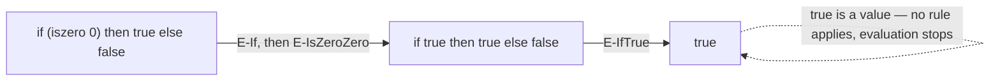

## Learning Objectives

- Define small-step operational semantics as a set of inference rules, each specifying how one term steps to another term, written `t → t'`.
- Distinguish a VALUE (a term that cannot step any further) from a term that still has evaluation left to do.
- Trace a full evaluation sequence for a concrete arithmetic expression, one small step at a time, citing which rule licenses each step.
- Explain why "small-step" (one reduction at a time) is a genuinely different design choice from "big-step" (jumping straight to a final value), and why small-step is the better fit for reasoning about a language's evaluation order.
- Connect small-step semantics forward to the tree-walking interpreter this discipline builds: an `eval` function is exactly these same rules made runnable.

## Context & Motivation

Before any interpreter can be built, a language needs something more precise than an English description of what its constructs do — it needs a mathematical definition, written down once, that settles every question of "what does this expression evaluate to?" without ambiguity. This is what operational semantics provides, and it is the first tool this discipline introduces, deliberately before any code is written, because a formal semantics is what an interpreter is an IMPLEMENTATION OF — writing the interpreter first, without the semantics, would leave no independent standard to check the interpreter's correctness against.

Pierce's *Types and Programming Languages* introduces this idea on the smallest possible language: booleans and arithmetic on natural numbers, with `if`, `true`, `false`, `succ` (successor), and no variables or functions at all yet. The deliberate smallness is the point — every single evaluation rule for this entire language fits on one page, which makes it possible to see the whole technique (states, rules, one step at a time) with nothing else competing for attention. The lambda calculus, introduced in the very next concept, reuses this exact same small-step technique on a richer language that finally does have functions and variables.

Why does the discipline insist on SMALL steps rather than jumping straight from an expression to its final answer (so-called "big-step" semantics, which some other traditions use instead)? Because a small step exposes the evaluation ORDER — which sub-expression gets reduced first when there's a choice — and evaluation order turns out to be a genuine, consequential design decision (the next concept's call-by-value vs. call-by-name distinction depends entirely on being able to talk about individual steps). A big-step definition that only says "this expression evaluates to this final value" cannot even express that distinction.

## Core Theory

### The pieces of a small-step semantics

A small-step operational semantics for a language consists of:

1. **A grammar of terms.** What counts as a syntactically valid expression in this language — for the toy language, `true`, `false`, `if t then t else t`, `0`, `succ t`, `pred t`, `iszero t`.
2. **A definition of values.** The subset of terms considered "done" — no further evaluation possible. For the toy language: `true`, `false`, and numeric values (`0`, `succ 0`, `succ succ 0`, ...).
3. **A step relation `t → t'`**, defined by a set of inference rules, each saying: if the term has this particular shape, it steps to this other term.

### The toy language's evaluation rules

Following Pierce's presentation, a representative subset of the rules:

```text
if true then t2 else t3  →  t2                              (E-IfTrue)
if false then t2 else t3 →  t3                               (E-IfFalse)

t1 → t1'
──────────────────────────────────────                       (E-If)
if t1 then t2 else t3 → if t1' then t2 else t3

iszero 0        →  true                                      (E-IsZeroZero)
iszero (succ nv) →  false      (nv a numeric value)           (E-IsZeroSucc)

t1 → t1'
────────────────────                                         (E-IsZero)
iszero t1 → iszero t1'
```

Read `t1 → t1'` above a horizontal line, with a conclusion below it, as: "IF the premise above the line holds, THEN the conclusion below the line holds." E-If and E-IsZero are congruence rules — they say how to make progress inside a sub-term (the condition of an `if`, or the argument of `iszero`) when that sub-term isn't a value yet. E-IfTrue, E-IfFalse, E-IsZeroZero, and E-IsZeroSucc are the actual computation rules — they fire only once their operand has already become a value.

### Multi-step evaluation and termination

A single application of `→` is one step. The reflexive-transitive closure of `→`, written `→*`, means "zero or more steps" — the relation actually used to state "this term eventually evaluates to this value." A term is said to be STUCK if it is not a value and no rule applies to it at all (for example, `iszero true` — `iszero` is only defined for numeric values, and `true` is a value of the wrong kind). A well-designed type system, covered later in this discipline, exists specifically to rule out reaching a stuck term — that is exactly what "progress," one of the two central type-safety properties, guarantees.



## Worked Examples

### Example 1: A full evaluation trace

Evaluate `if (iszero (pred (succ 0))) then (succ 0) else 0` step by step:

```text
if (iszero (pred (succ 0))) then (succ 0) else 0
  → { E-If, using: pred (succ nv) → nv }
if (iszero 0) then (succ 0) else 0
  → { E-If, using: E-IsZeroZero }
if true then (succ 0) else 0
  → { E-IfTrue }
succ 0
```

Three steps, each licensed by a named rule, arriving at `succ 0` — a value, so evaluation stops. Every one of these steps is forced; there is no other rule that applies at each point, so the entire evaluation sequence is fully determined by the semantics with no ambiguity left over.

### Example 2: A stuck term

```text
if 0 then true else false
```

No rule applies here: E-IfTrue and E-IfFalse both require the condition to ALREADY be `true` or `false`; `0` is a value (so E-If, which only fires when the condition isn't a value yet, doesn't apply either). This term is stuck — a real example of what a type system is designed to reject before the program is ever run, since no real program should reach a state with no defined next step.

### Example 3: From rules to code — the shape of things to come

Every rule above corresponds, almost one-to-one, to one branch of a future `eval` function (built explicitly in a later concept in this discipline):

```python
def eval_step(term):
    match term:
        case IfTerm(TrueTerm(), t2, t3):
            return t2                          # E-IfTrue
        case IfTerm(FalseTerm(), t2, t3):
            return t3                          # E-IfFalse
        case IfTerm(cond, t2, t3):
            return IfTerm(eval_step(cond), t2, t3)  # E-If
        # ... one case per remaining rule
```

This is not a coincidence or a loose analogy — it is the entire point of introducing operational semantics before writing any interpreter code: the semantics IS the specification the interpreter's `eval` function is required to implement correctly.

## Common Misconceptions & Pitfalls

- **"Operational semantics is just a fussy, unnecessary formality before the 'real' work of coding an interpreter."** It is the opposite: without it, there is no independent standard to check an interpreter against, and no way to even state precisely what a language construct is supposed to mean. The semantics comes first because the interpreter is defined AS an implementation of it.
- **"Small-step and big-step semantics always agree, so the choice doesn't matter."** For a deterministic, terminating language they agree on the final value, but small-step additionally exposes evaluation ORDER — which sub-expression gets reduced when there's a choice — information big-step semantics doesn't even have a way to express. That distinction becomes essential the moment evaluation strategy (call-by-value vs. call-by-name, next concept) is on the table.
- **"A stuck term and a value are the same thing — both are 'terms with no next step.'"** They are opposites in effect but structurally different: a value is a term the language INTENDS to be a final answer (like `true` or a number); a stuck term is one where evaluation has nowhere left to go despite not being a legitimate final answer (like `iszero true`) — exactly the case a sound type system rules out in advance.
- **"Congruence rules (like E-If) are somehow less important than computation rules (like E-IfTrue)."** Without congruence rules, evaluation could never make progress inside a sub-expression that isn't already reduced — `if (iszero (pred (succ 0))) then ... else ...` could never even get its condition evaluated without E-If.

## Summary

Small-step operational semantics defines a language's meaning as a step relation `t → t'`, given by inference rules — congruence rules that make progress inside sub-terms, and computation rules that fire once an operand becomes a value. A value is a term with no further step available; a stuck term is a non-value with no rule that applies, and a real language's type system exists to make stuck terms provably unreachable. This entire toolkit — states, rules, one step at a time — is introduced here on the smallest possible toy language specifically so the technique itself, not the language's size, is what gets learned; it is reused immediately on the richer lambda calculus next, and it is, almost rule-for-rule, the specification that this discipline's tree-walking interpreter is later built to implement correctly.

## Documentation Links

- [Pierce — Types and Programming Languages, Ch. 3-4 (Untyped Arithmetic Expressions)](https://www.cis.upenn.edu/~bcpierce/tapl/contents.pdf) — the canonical presentation of small-step operational semantics on exactly this toy language.
- [ACM/IEEE CS2013 — Programming Languages Knowledge Area](https://csed.acm.org/knowledge-areas-programming-languages-pl-cs2013-version/) — lists Formal Semantics as elective material this discipline's foundation section covers.
