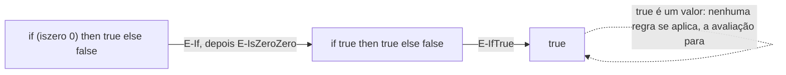

## Objetivos de Aprendizagem

- Definir a semântica operacional de passo pequeno como um conjunto de regras de inferência, cada uma especificando como um termo dá um passo para outro termo, escrito `t → t'`.
- Distinguir um VALOR (um termo que não consegue dar mais nenhum passo) de um termo que ainda tem avaliação a fazer.
- Rastrear uma sequência de avaliação completa para uma expressão aritmética concreta, um passo pequeno por vez, citando qual regra licencia cada passo.
- Explicar por que "passo pequeno" (uma redução por vez) é uma escolha de design genuinamente diferente de "passo grande" (saltar direto para um valor final), e por que passo pequeno é o encaixe melhor para raciocinar sobre a ordem de avaliação de uma linguagem.
- Conectar a semântica de passo pequeno adiante ao interpretador tree-walking que esta disciplina constrói: uma função `eval` é exatamente essas mesmas regras tornadas executáveis.

## Contexto e Motivação

Antes de qualquer interpretador poder ser construído, uma linguagem precisa de algo mais preciso do que uma descrição em inglês do que os seus construtos fazem, ela precisa de uma definição matemática, escrita uma vez, que resolva toda questão de "para o que esta expressão avalia?" sem ambiguidade. Isto é o que a semântica operacional fornece, e é a primeira ferramenta que esta disciplina introduz, deliberadamente antes de qualquer código ser escrito, porque uma semântica formal é aquilo de que um interpretador é uma IMPLEMENTAÇÃO, escrever o interpretador primeiro, sem a semântica, deixaria nenhum padrão independente contra o qual checar a correção do interpretador.

O *Types and Programming Languages* de Pierce introduz esta ideia na menor linguagem possível: booleanos e aritmética sobre números naturais, com `if`, `true`, `false`, `succ` (sucessor), e nenhuma variável ou função de forma alguma ainda. A pequenez deliberada é o ponto, toda única regra de avaliação para esta linguagem inteira cabe numa página, o que torna possível ver a técnica inteira (estados, regras, um passo por vez) com nada mais competindo por atenção. O cálculo lambda, introduzido no próximo conceito, reusa esta exata mesma técnica de passo pequeno numa linguagem mais rica que finalmente de fato tem funções e variáveis.

Por que a disciplina insiste em passos PEQUENOS em vez de saltar direto de uma expressão para a sua resposta final (semântica dita "de passo grande", que algumas outras tradições usam em vez disso)? Porque um passo pequeno expõe a ORDEM de avaliação, qual sub-expressão é reduzida primeiro quando há uma escolha, e a ordem de avaliação acaba por ser uma decisão de design genuína e consequente (a distinção call-by-value vs. call-by-name do próximo conceito depende inteiramente de poder falar sobre passos individuais). Uma definição de passo grande que só diz "esta expressão avalia para este valor final" não consegue sequer expressar essa distinção.

## Teoria Central

### As peças de uma semântica de passo pequeno

Uma semântica operacional de passo pequeno para uma linguagem consiste em:

1. **Uma gramática de termos.** O que conta como uma expressão sintaticamente válida nesta linguagem, para a linguagem de brinquedo, `true`, `false`, `if t then t else t`, `0`, `succ t`, `pred t`, `iszero t`.
2. **Uma definição de valores.** O subconjunto de termos considerados "prontos", nenhuma avaliação adicional possível. Para a linguagem de brinquedo: `true`, `false` e valores numéricos (`0`, `succ 0`, `succ succ 0`, ...).
3. **Uma relação de passo `t → t'`**, definida por um conjunto de regras de inferência, cada uma dizendo: se o termo tem este formato particular, ele dá um passo para este outro termo.

### As regras de avaliação da linguagem de brinquedo

Seguindo a apresentação de Pierce, um subconjunto representativo das regras:

```text
if true then t2 else t3  →  t2                              (E-IfTrue)
if false then t2 else t3 →  t3                               (E-IfFalse)

t1 → t1'
──────────────────────────────────────                       (E-If)
if t1 then t2 else t3 → if t1' then t2 else t3

iszero 0        →  true                                      (E-IsZeroZero)
iszero (succ nv) →  false      (nv um valor numérico)         (E-IsZeroSucc)

t1 → t1'
────────────────────                                         (E-IsZero)
iszero t1 → iszero t1'
```

Leia `t1 → t1'` acima de uma linha horizontal, com uma conclusão abaixo dela, como: "SE a premissa acima da linha se mantém, ENTÃO a conclusão abaixo da linha se mantém." E-If e E-IsZero são regras de congruência, elas dizem como fazer progresso dentro de um sub-termo (a condição de um `if`, ou o argumento de `iszero`) quando esse sub-termo ainda não é um valor. E-IfTrue, E-IfFalse, E-IsZeroZero e E-IsZeroSucc são as regras de computação de fato, elas disparam só uma vez que o seu operando já virou um valor.

### Avaliação de múltiplos passos e terminação

Uma única aplicação de `→` é um passo. O fecho reflexivo-transitivo de `→`, escrito `→*`, significa "zero ou mais passos", a relação de fato usada para enunciar "este termo eventualmente avalia para este valor". Um termo é dito EMPERRADO (stuck) se não é um valor e nenhuma regra se aplica a ele de forma alguma (por exemplo, `iszero true`, `iszero` só é definido para valores numéricos, e `true` é um valor do tipo errado). Um sistema de tipos bem projetado, coberto depois nesta disciplina, existe especificamente para descartar alcançar um termo emperrado, isso é exatamente o que "progresso", uma das duas propriedades centrais de segurança de tipos, garante.



## Exemplos Resolvidos

### Exemplo 1: Um rastreamento de avaliação completo

Avaliar `if (iszero (pred (succ 0))) then (succ 0) else 0` passo a passo:

```text
if (iszero (pred (succ 0))) then (succ 0) else 0
  → { E-If, usando: pred (succ nv) → nv }
if (iszero 0) then (succ 0) else 0
  → { E-If, usando: E-IsZeroZero }
if true then (succ 0) else 0
  → { E-IfTrue }
succ 0
```

Três passos, cada um licenciado por uma regra nomeada, chegando a `succ 0`, um valor, então a avaliação para. Cada um destes passos é forçado; não há outra regra que se aplique a cada ponto, então a sequência de avaliação inteira é totalmente determinada pela semântica sem nenhuma ambiguidade sobrando.

### Exemplo 2: Um termo emperrado

```text
if 0 then true else false
```

Nenhuma regra se aplica aqui: E-IfTrue e E-IfFalse ambas exigem que a condição JÁ seja `true` ou `false`; `0` é um valor (então E-If, que só dispara quando a condição ainda não é um valor, também não se aplica). Este termo está emperrado, um exemplo real do que um sistema de tipos é projetado para rejeitar antes de o programa ser jamais rodado, já que nenhum programa real deveria alcançar um estado sem nenhum próximo passo definido.

### Exemplo 3: Das regras ao código, o formato das coisas por vir

Toda regra acima corresponde, quase um-para-um, a um ramo de uma futura função `eval` (construída explicitamente num conceito posterior nesta disciplina):

```python
def eval_step(term):
    match term:
        case IfTerm(TrueTerm(), t2, t3):
            return t2                          # E-IfTrue
        case IfTerm(FalseTerm(), t2, t3):
            return t3                          # E-IfFalse
        case IfTerm(cond, t2, t3):
            return IfTerm(eval_step(cond), t2, t3)  # E-If
        # ... um caso por regra restante
```

Isto não é uma coincidência ou uma analogia frouxa, é o ponto inteiro de introduzir a semântica operacional antes de escrever qualquer código de interpretador: a semântica É a especificação que a função `eval` do interpretador é obrigada a implementar corretamente.

## Equívocos Comuns e Armadilhas

- **"Semântica operacional é só uma formalidade exigente e desnecessária antes do trabalho 'real' de codificar um interpretador."** É o oposto: sem ela, não há padrão independente contra o qual checar um interpretador, e nenhuma forma de sequer enunciar precisamente o que um construto de linguagem deveria significar. A semântica vem primeiro porque o interpretador é definido COMO uma implementação dela.
- **"Semântica de passo pequeno e de passo grande sempre concordam, então a escolha não importa."** Para uma linguagem determinística e terminante elas concordam no valor final, mas passo pequeno adicionalmente expõe a ORDEM de avaliação, qual sub-expressão é reduzida quando há uma escolha, informação que a semântica de passo grande nem sequer tem uma forma de expressar. Essa distinção se torna essencial no momento em que a estratégia de avaliação (call-by-value vs. call-by-name, próximo conceito) está em jogo.
- **"Um termo emperrado e um valor são a mesma coisa, ambos são 'termos sem próximo passo'."** Eles são opostos em efeito mas estruturalmente diferentes: um valor é um termo que a linguagem PRETENDE ser uma resposta final (como `true` ou um número); um termo emperrado é um onde a avaliação não tem para onde ir apesar de não ser uma resposta final legítima (como `iszero true`), exatamente o caso que um sistema de tipos sólido descarta de antemão.
- **"Regras de congruência (como E-If) são de alguma forma menos importantes do que regras de computação (como E-IfTrue)."** Sem regras de congruência, a avaliação nunca poderia fazer progresso dentro de uma sub-expressão que ainda não está reduzida, `if (iszero (pred (succ 0))) then ... else ...` nunca poderia sequer ter a sua condição avaliada sem E-If.

## Resumo

A semântica operacional de passo pequeno define o significado de uma linguagem como uma relação de passo `t → t'`, dada por regras de inferência, regras de congruência que fazem progresso dentro de sub-termos, e regras de computação que disparam uma vez que um operando vira um valor. Um valor é um termo sem passo adicional disponível; um termo emperrado é um não-valor sem regra que se aplique, e o sistema de tipos de uma linguagem real existe para tornar termos emperrados comprovadamente inalcançáveis. Este kit de ferramentas inteiro, estados, regras, um passo por vez, é introduzido aqui na menor linguagem de brinquedo possível especificamente para que a própria técnica, não o tamanho da linguagem, seja o que é aprendido; ele é reusado imediatamente no cálculo lambda mais rico em seguida, e é, quase regra por regra, a especificação que o interpretador tree-walking desta disciplina é depois construído para implementar corretamente.

## Documentation Links

- [Pierce — Types and Programming Languages, Ch. 3-4 (Untyped Arithmetic Expressions)](https://www.cis.upenn.edu/~bcpierce/tapl/contents.pdf): a apresentação canônica de semântica operacional de passo pequeno exatamente nesta linguagem de brinquedo.
- [ACM/IEEE CS2013 — Programming Languages Knowledge Area](https://csed.acm.org/knowledge-areas-programming-languages-pl-cs2013-version/): lista Semântica Formal como material eletivo que a seção de fundação desta disciplina cobre.
