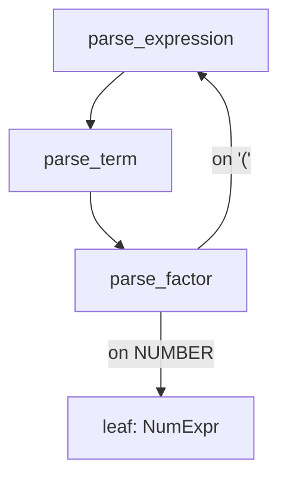

## Learning Objectives

- Define an abstract syntax tree (AST) as a data structure that captures a program's grammatical structure while discarding syntactic details (parentheses, keywords) that were only there to guide parsing.
- Write a context-free grammar for a small expression language with the correct precedence and associativity, using nested nonterminals as already covered in `formal-languages-automata`.
- Implement recursive-descent parsing: one function per nonterminal, calling each other in exactly the pattern the grammar's own production rules describe.
- Explain why left recursion breaks naive recursive descent, and describe the standard grammar-rewriting fix.
- Trace a full parse of a concrete expression, from token stream to the resulting AST.

## Context & Motivation

The previous concept produced a flat token stream — `[IF, IDENTIFIER("x"), LESS_EQUAL, NUMBER("10"), THEN, ...]` — with no structure beyond "these tokens appeared in this order." That flat sequence cannot, by itself, answer basic questions an interpreter needs answered: which tokens make up the condition of this `if`? Which make up the `then` branch? Parsing is exactly the step that recovers this structure, and an abstract syntax tree (AST) is the data structure it builds to represent it.

This is not new formal territory — `formal-languages-automata` already covered context-free grammars and their derivations in full rigor, including ambiguity and Chomsky normal form. What's new here is the PRACTICAL side of that same theory: given a real grammar for a real small language, how does an actual program (a parser) mechanically recover a derivation — and specifically, how does it build a TREE data structure rather than merely deciding accept-or-reject, which is all the automata-theoretic material needed to do. This is the parser's genuinely new contribution: recognizing a string as grammatical is necessary but not sufficient for an interpreter — the interpreter (the very next concept) needs an actual tree to recurse over.

## Core Theory

### From concrete syntax to abstract syntax

A CONCRETE syntax tree would record every token, including parentheses used purely to guide parsing and keywords like `then`/`else` that exist only to help a human (and the parser) read the structure. An ABSTRACT syntax tree throws all of that away, keeping only the structure that matters for MEANING:

```text
Concrete:  if ( x <= 10 ) then y else 0
Abstract:  IfExpr(condition=LessEqual(Var("x"), Num(10)), then_branch=Var("y"), else_branch=Num(0))
```

The parentheses, the keywords `if`/`then`/`else` themselves — none of them survive into the AST as data; their JOB was to tell the parser how to build the tree, and once the tree exists, that job is done.

### A grammar with precedence and associativity

A naive grammar for arithmetic expressions, written without care, is ambiguous (as already shown in `formal-languages-automata`'s ambiguity material) — `2 + 3 * 4` could parse as `(2 + 3) * 4` or `2 + (3 * 4)` depending on which derivation is chosen. The standard fix is to encode precedence directly into the grammar's STRUCTURE, using one nonterminal per precedence level, from loosest to tightest binding:

```text
expression → term ( ("+" | "-") term )*
term       → factor ( ("*" | "/") factor )*
factor     → NUMBER | "(" expression ")"
```

Because `expression` is defined in terms of `term`, and `term` in terms of `factor`, a `*` can never end up grouping more loosely than a `+` — the grammar's own nesting structure forces the correct precedence, with no separate precedence table needed at parse time. Left-associativity of `+` (so `1 - 2 - 3` parses as `(1 - 2) - 3`, not `1 - (2 - 3)`) comes from the `*` in the rule — repeatedly consuming more `term`s at the same level, building the tree left-to-right, rather than the rule calling itself recursively on the right.

### Recursive-descent parsing

Recursive-descent parsing translates a grammar like the one above almost mechanically into code: one function per nonterminal, and each function's body follows its production rule's shape exactly.

```python
def parse_expression(tokens):
    left = parse_term(tokens)
    while tokens.peek() in ("+", "-"):
        op = tokens.consume()
        right = parse_term(tokens)
        left = BinaryExpr(op, left, right)
    return left

def parse_term(tokens):
    left = parse_factor(tokens)
    while tokens.peek() in ("*", "/"):
        op = tokens.consume()
        right = parse_factor(tokens)
        left = BinaryExpr(op, left, right)
    return left

def parse_factor(tokens):
    if tokens.peek() == "NUMBER":
        return NumExpr(tokens.consume().lexeme)
    elif tokens.peek() == "(":
        tokens.consume()
        expr = parse_expression(tokens)
        tokens.expect(")")
        return expr
    else:
        raise ParseError(f"expected a factor, found {tokens.peek()}")
```

`parse_expression` calling `parse_term` calling `parse_factor` — which can in turn call BACK to `parse_expression` for a parenthesized sub-expression — is recursive descent: the call structure of the parser functions directly mirrors the nesting structure of the grammar, and recursion (already covered as a general technique in `programming-computational-thinking`) is what handles arbitrarily deep nesting (parentheses inside parentheses) with no extra machinery.



### Left recursion breaks recursive descent

A grammar rule like `expression → expression "+" term` (calling itself as the FIRST thing it does, with nothing consumed first) causes a recursive-descent parser to call itself infinitely without ever consuming a token, immediately overflowing the call stack. The standard fix is exactly the rewrite already used above: replace left recursion with a loop (`term ( "+" term )*`) — mathematically equivalent to the left-recursive rule, but implementable directly as iteration inside one function rather than infinite self-calls.

## Worked Examples

### Example 1: Parsing `2 + 3 * 4` and recovering correct precedence

```text
Tokens: [NUMBER(2), PLUS, NUMBER(3), STAR, NUMBER(4)]

parse_expression:
  left = parse_term() 
    parse_factor() → NumExpr(2)
    no "*"/"/" next → returns NumExpr(2)
  left = NumExpr(2)
  peek() == "+" → consume, op = "+"
  right = parse_term()
    parse_factor() → NumExpr(3)
    peek() == "*" → consume, op = "*"
    right' = parse_factor() → NumExpr(4)
    returns BinaryExpr("*", NumExpr(3), NumExpr(4))
  left = BinaryExpr("+", NumExpr(2), BinaryExpr("*", NumExpr(3), NumExpr(4)))

Result AST:  BinaryExpr("+", 2, BinaryExpr("*", 3, 4))
```

The tree correctly nests the multiplication INSIDE the addition's right operand — exactly `2 + (3 * 4)`, not `(2 + 3) * 4` — entirely because `term` (tighter-binding) sits below `expression` (looser-binding) in the grammar's own structure, with no separate precedence-checking code needed anywhere in the parser.

### Example 2: Left associativity from the `*`-loop, traced concretely

```text
Tokens for "1 - 2 - 3": [NUMBER(1), MINUS, NUMBER(2), MINUS, NUMBER(3)]

Iteration 1: left = NumExpr(1); see "-"; right = NumExpr(2)
             left = BinaryExpr("-", 1, 2)
Iteration 2: see "-" again; right = NumExpr(3)
             left = BinaryExpr("-", BinaryExpr("-", 1, 2), 3)
```

The result groups as `(1 - 2) - 3`, correctly left-associative — each loop iteration wraps the PREVIOUS result as the left operand of a new node, rather than recursing rightward, which is exactly what the `*`-repetition (rather than right-recursion) in the grammar rule encodes.

### Example 3: A parenthesized sub-expression triggering recursive descent

```text
Tokens for "(1 + 2) * 3": [LPAREN, NUMBER(1), PLUS, NUMBER(2), RPAREN, STAR, NUMBER(3)]

parse_expression → parse_term → parse_factor
  sees "(" → consume, recursively call parse_expression AGAIN (this is the "descent" back up)
    inner parse_expression parses "1 + 2" fully → BinaryExpr("+", 1, 2)
  expect ")" → consume
  parse_factor returns BinaryExpr("+", 1, 2)
back in outer parse_term: sees "*" → consume, right = parse_factor() → NumExpr(3)
  returns BinaryExpr("*", BinaryExpr("+", 1, 2), NumExpr(3))
```

This is recursive descent's defining behavior: `parse_factor`, on seeing `(`, calls all the way back up to `parse_expression` — the function at the TOP of the call chain — to parse whatever is inside the parentheses, before returning control back down. The call stack depth at any moment mirrors the current nesting depth of parentheses in the source exactly.

## Common Misconceptions & Pitfalls

- **"An AST should preserve everything from the source, including parentheses, for fidelity."** An AST deliberately discards syntax that exists only to guide parsing (parentheses, most keywords) — that information did its job during parsing and carries no further meaning for evaluation. A tool that needs to preserve exact source formatting (a code formatter, for instance) uses a different, richer structure (a concrete syntax tree), not an AST.
- **"Precedence has to be checked explicitly, with a table of operator priorities, during parsing."** The grammar-nesting technique shown here (looser-binding rules built from tighter-binding ones) encodes precedence directly into the grammar's STRUCTURE — no separate precedence table or special-casing is needed in a recursive-descent parser at all.
- **"Recursive descent can parse any context-free grammar directly."** It specifically CANNOT handle left-recursive rules without the rewrite shown here (replacing recursion with iteration) — this is a real, well-known limitation of the technique, not a minor edge case, and it's exactly why the grammar above is written with `*`-repetition rather than the more "natural"-looking left-recursive form.
- **"Once tokens parse without error, the program is guaranteed to be meaningful."** Parsing only confirms the token sequence is GRAMMATICALLY well-formed — it says nothing about whether the resulting program is semantically sensible (e.g. adding a number to a boolean might parse perfectly while still being meaningless) — that's exactly what evaluation, and later the type checker, are responsible for catching.

## Summary

Parsing recovers grammatical structure from a flat token stream, building an abstract syntax tree that keeps only what matters for meaning and discards syntax (parentheses, most keywords) that existed purely to guide the parse. Precedence and associativity are encoded directly into a grammar's nesting structure — one nonterminal per precedence level — rather than checked separately at parse time, and recursive-descent parsing translates that grammar almost mechanically into one function per nonterminal, with recursion naturally handling arbitrarily deep nesting. Left-recursive grammar rules break this technique and must be rewritten as iteration first. The AST this concept produces is exactly the data structure the next concept's `eval` function will recurse over — the tree IS the program, from the interpreter's point of view, from here on.

## Documentation Links

- [Nystrom — Crafting Interpreters, Ch. 5-6 (Representing Code, Parsing Expressions)](https://craftinginterpreters.com/parsing-expressions.html) — a complete, real recursive-descent parser built following this exact structure.
- [ACM/IEEE CS2013 — Programming Languages Knowledge Area](https://csed.acm.org/knowledge-areas-programming-languages-pl-cs2013-version/) — lists Syntax Analysis (parsing) as elective material this discipline covers.
