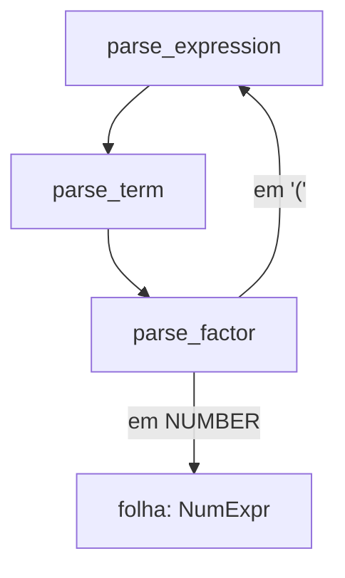

## Objetivos de Aprendizagem

- Definir uma árvore de sintaxe abstrata (AST) como uma estrutura de dados que captura a estrutura gramatical de um programa enquanto descarta detalhes sintáticos (parênteses, palavras-chave) que só estavam ali para guiar o parsing.
- Escrever uma gramática livre de contexto para uma pequena linguagem de expressões com a precedência e associatividade corretas, usando não-terminais aninhados como já coberto em `formal-languages-automata`.
- Implementar parsing de descida recursiva: uma função por não-terminal, chamando umas às outras exatamente no padrão que as próprias regras de produção da gramática descrevem.
- Explicar por que a recursão à esquerda quebra a descida recursiva ingênua, e descrever o conserto padrão de reescrita de gramática.
- Rastrear um parse completo de uma expressão concreta, do fluxo de tokens à AST resultante.

## Contexto e Motivação

O conceito anterior produziu um fluxo plano de tokens, `[IF, IDENTIFIER("x"), LESS_EQUAL, NUMBER("10"), THEN, ...]`, sem nenhuma estrutura além de "estes tokens apareceram nesta ordem". Essa sequência plana não consegue, por si só, responder questões básicas de que um interpretador precisa de resposta: quais tokens compõem a condição deste `if`? Quais compõem o ramo `then`? O parsing é exatamente o passo que recupera esta estrutura, e uma árvore de sintaxe abstrata (AST) é a estrutura de dados que ele constrói para representá-la.

Este não é território formal novo, `formal-languages-automata` já cobriu gramáticas livres de contexto e as suas derivações em rigor completo, incluindo ambiguidade e forma normal de Chomsky. O que é novo aqui é o lado PRÁTICO dessa mesma teoria: dada uma gramática real para uma linguagem pequena real, como é que um programa de fato (um parser) mecanicamente recupera uma derivação, e especificamente, como é que ele constrói uma estrutura de dados em ÁRVORE em vez de meramente decidir aceitar-ou-rejeitar, que é tudo que o material teórico de autômatos precisava fazer. Esta é a contribuição genuinamente nova do parser: reconhecer uma string como gramatical é necessário mas não suficiente para um interpretador, o interpretador (o próximo conceito) precisa de uma árvore de fato para recursar.

## Teoria Central

### Da sintaxe concreta à sintaxe abstrata

Uma árvore de sintaxe CONCRETA registraria todo token, incluindo parênteses usados puramente para guiar o parsing e palavras-chave como `then`/`else` que existem só para ajudar um humano (e o parser) a ler a estrutura. Uma árvore de sintaxe ABSTRATA joga tudo isso fora, mantendo só a estrutura que importa para o SIGNIFICADO:

```text
Concreta:  if ( x <= 10 ) then y else 0
Abstrata:  IfExpr(condition=LessEqual(Var("x"), Num(10)), then_branch=Var("y"), else_branch=Num(0))
```

Os parênteses, as próprias palavras-chave `if`/`then`/`else`, nenhum deles sobrevive na AST como dado; o seu TRABALHO era dizer ao parser como construir a árvore, e uma vez que a árvore existe, esse trabalho está feito.

### Uma gramática com precedência e associatividade

Uma gramática ingênua para expressões aritméticas, escrita sem cuidado, é ambígua (como já mostrado no material de ambiguidade de `formal-languages-automata`), `2 + 3 * 4` poderia dar parse como `(2 + 3) * 4` ou `2 + (3 * 4)` dependendo de qual derivação é escolhida. O conserto padrão é codificar a precedência diretamente na ESTRUTURA da gramática, usando um não-terminal por nível de precedência, da ligação mais frouxa à mais apertada:

```text
expression → term ( ("+" | "-") term )*
term       → factor ( ("*" | "/") factor )*
factor     → NUMBER | "(" expression ")"
```

Porque `expression` é definido em termos de `term`, e `term` em termos de `factor`, um `*` nunca pode acabar agrupando mais frouxamente do que um `+`, a própria estrutura de aninhamento da gramática força a precedência correta, sem nenhuma tabela de precedência separada necessária no tempo de parse. A associatividade à esquerda de `+` (para que `1 - 2 - 3` dê parse como `(1 - 2) - 3`, não `1 - (2 - 3)`) vem do `*` na regra, consumir repetidamente mais `term`s no mesmo nível, construindo a árvore da esquerda para a direita, em vez de a regra chamar a si mesma recursivamente à direita.

### Parsing de descida recursiva

O parsing de descida recursiva traduz uma gramática como a acima quase mecanicamente em código: uma função por não-terminal, e o corpo de cada função segue o formato da sua regra de produção exatamente.

```python
def parse_expression(tokens):
    left = parse_term(tokens)
    while tokens.peek() in ("+", "-"):
        op = tokens.consume()
        right = parse_term(tokens)
        left = BinaryExpr(op, left, right)
    return left

def parse_term(tokens):
    left = parse_factor(tokens)
    while tokens.peek() in ("*", "/"):
        op = tokens.consume()
        right = parse_factor(tokens)
        left = BinaryExpr(op, left, right)
    return left

def parse_factor(tokens):
    if tokens.peek() == "NUMBER":
        return NumExpr(tokens.consume().lexeme)
    elif tokens.peek() == "(":
        tokens.consume()
        expr = parse_expression(tokens)
        tokens.expect(")")
        return expr
    else:
        raise ParseError(f"expected a factor, found {tokens.peek()}")
```

`parse_expression` chamando `parse_term` chamando `parse_factor`, que pode por sua vez chamar DE VOLTA `parse_expression` para uma sub-expressão entre parênteses, é descida recursiva: a estrutura de chamadas das funções do parser espelha diretamente a estrutura de aninhamento da gramática, e a recursão (já coberta como técnica geral em `programming-computational-thinking`) é o que trata aninhamento arbitrariamente profundo (parênteses dentro de parênteses) sem nenhuma maquinaria extra.



### A recursão à esquerda quebra a descida recursiva

Uma regra de gramática como `expression → expression "+" term` (chamando a si mesma como a PRIMEIRA coisa que faz, com nada consumido antes) faz um parser de descida recursiva chamar a si mesmo infinitamente sem jamais consumir um token, imediatamente estourando a pilha de chamadas. O conserto padrão é exatamente a reescrita já usada acima: substituir a recursão à esquerda por um laço (`term ( "+" term )*`), matematicamente equivalente à regra recursiva à esquerda, mas implementável diretamente como iteração dentro de uma função em vez de autochamadas infinitas.

## Exemplos Resolvidos

### Exemplo 1: Parsing de `2 + 3 * 4` e recuperando a precedência correta

```text
Tokens: [NUMBER(2), PLUS, NUMBER(3), STAR, NUMBER(4)]

parse_expression:
  left = parse_term() 
    parse_factor() → NumExpr(2)
    sem "*"/"/" a seguir → retorna NumExpr(2)
  left = NumExpr(2)
  peek() == "+" → consome, op = "+"
  right = parse_term()
    parse_factor() → NumExpr(3)
    peek() == "*" → consome, op = "*"
    right' = parse_factor() → NumExpr(4)
    retorna BinaryExpr("*", NumExpr(3), NumExpr(4))
  left = BinaryExpr("+", NumExpr(2), BinaryExpr("*", NumExpr(3), NumExpr(4)))

AST resultante:  BinaryExpr("+", 2, BinaryExpr("*", 3, 4))
```

A árvore aninha corretamente a multiplicação DENTRO do operando direito da adição, exatamente `2 + (3 * 4)`, não `(2 + 3) * 4`, inteiramente porque `term` (ligação mais apertada) fica abaixo de `expression` (ligação mais frouxa) na própria estrutura da gramática, sem nenhum código separado de checagem de precedência necessário em lugar nenhum no parser.

### Exemplo 2: Associatividade à esquerda do laço-`*`, rastreada concretamente

```text
Tokens para "1 - 2 - 3": [NUMBER(1), MINUS, NUMBER(2), MINUS, NUMBER(3)]

Iteração 1: left = NumExpr(1); vê "-"; right = NumExpr(2)
            left = BinaryExpr("-", 1, 2)
Iteração 2: vê "-" de novo; right = NumExpr(3)
            left = BinaryExpr("-", BinaryExpr("-", 1, 2), 3)
```

O resultado agrupa como `(1 - 2) - 3`, corretamente associativo à esquerda, cada iteração do laço envolve o resultado ANTERIOR como o operando esquerdo de um novo nó, em vez de recursar para a direita, que é exatamente o que a repetição-`*` (em vez de recursão à direita) na regra da gramática codifica.

### Exemplo 3: Uma sub-expressão entre parênteses disparando a descida recursiva

```text
Tokens para "(1 + 2) * 3": [LPAREN, NUMBER(1), PLUS, NUMBER(2), RPAREN, STAR, NUMBER(3)]

parse_expression → parse_term → parse_factor
  vê "(" → consome, chama recursivamente parse_expression DE NOVO (esta é a "descida" de volta ao topo)
    o parse_expression interno dá parse em "1 + 2" por completo → BinaryExpr("+", 1, 2)
  expect ")" → consome
  parse_factor retorna BinaryExpr("+", 1, 2)
de volta no parse_term externo: vê "*" → consome, right = parse_factor() → NumExpr(3)
  retorna BinaryExpr("*", BinaryExpr("+", 1, 2), NumExpr(3))
```

Este é o comportamento definidor da descida recursiva: `parse_factor`, ao ver `(`, chama por todo o caminho de volta a `parse_expression`, a função no TOPO da cadeia de chamadas, para dar parse em qualquer coisa que esteja dentro dos parênteses, antes de devolver o controle para baixo. A profundidade da pilha de chamadas em qualquer momento espelha a profundidade de aninhamento atual de parênteses na fonte exatamente.

## Equívocos Comuns e Armadilhas

- **"Uma AST deveria preservar tudo da fonte, incluindo parênteses, por fidelidade."** Uma AST deliberadamente descarta sintaxe que existe só para guiar o parsing (parênteses, a maioria das palavras-chave), essa informação fez o seu trabalho durante o parsing e não carrega nenhum significado adicional para a avaliação. Uma ferramenta que precisa preservar a formatação exata da fonte (um formatador de código, por exemplo) usa uma estrutura diferente e mais rica (uma árvore de sintaxe concreta), não uma AST.
- **"A precedência tem de ser checada explicitamente, com uma tabela de prioridades de operador, durante o parsing."** A técnica de aninhamento de gramática mostrada aqui (regras de ligação mais frouxa construídas a partir de regras de ligação mais apertada) codifica a precedência diretamente na ESTRUTURA da gramática, nenhuma tabela de precedência separada ou tratamento especial é necessário num parser de descida recursiva de forma alguma.
- **"A descida recursiva consegue dar parse em qualquer gramática livre de contexto diretamente."** Ela especificamente NÃO CONSEGUE tratar regras recursivas à esquerda sem a reescrita mostrada aqui (substituir recursão por iteração), esta é uma limitação real e bem conhecida da técnica, não um caso de borda menor, e é exatamente por que a gramática acima é escrita com repetição-`*` em vez da forma recursiva à esquerda de aparência mais "natural".
- **"Uma vez que os tokens dão parse sem erro, o programa está garantido de ser significativo."** O parsing só confirma que a sequência de tokens é GRAMATICALMENTE bem formada, ele nada diz sobre se o programa resultante é semanticamente sensato (por exemplo, adicionar um número a um booleano pode dar parse perfeitamente enquanto ainda é sem sentido), isso é exatamente o que a avaliação, e depois o verificador de tipos, são responsáveis por pegar.

## Resumo

O parsing recupera a estrutura gramatical de um fluxo plano de tokens, construindo uma árvore de sintaxe abstrata que mantém só o que importa para o significado e descarta sintaxe (parênteses, a maioria das palavras-chave) que existia puramente para guiar o parse. Precedência e associatividade são codificadas diretamente na estrutura de aninhamento de uma gramática, um não-terminal por nível de precedência, em vez de checadas separadamente no tempo de parse, e o parsing de descida recursiva traduz essa gramática quase mecanicamente em uma função por não-terminal, com a recursão naturalmente tratando aninhamento arbitrariamente profundo. Regras de gramática recursivas à esquerda quebram esta técnica e têm de ser reescritas como iteração primeiro. A AST que este conceito produz é exatamente a estrutura de dados sobre a qual a função `eval` do próximo conceito vai recursar, a árvore É o programa, do ponto de vista do interpretador, daqui em diante.

## Documentation Links

- [Nystrom — Crafting Interpreters, Ch. 5-6 (Representing Code, Parsing Expressions)](https://craftinginterpreters.com/parsing-expressions.html): um parser de descida recursiva completo e real construído seguindo esta exata estrutura.
- [ACM/IEEE CS2013 — Programming Languages Knowledge Area](https://csed.acm.org/knowledge-areas-programming-languages-pl-cs2013-version/): lista Análise de Sintaxe (parsing) como material eletivo que esta disciplina cobre.
