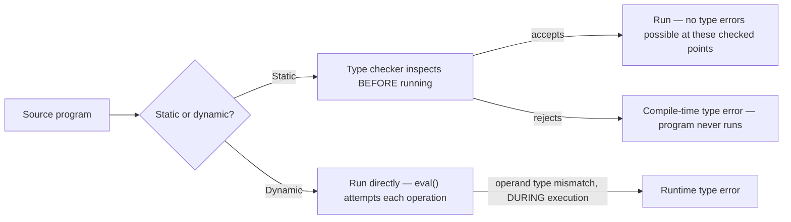

## Learning Objectives

- Define static typing (type errors caught before the program runs, by a separate type-checking pass) and dynamic typing (type errors caught at the moment they occur, during execution).
- Trace a concrete term that a static type checker rejects before any evaluation happens, versus the same category of error surfacing only at runtime under dynamic typing.
- Explain why this is a genuine design tradeoff (earlier error detection vs. more runtime flexibility), not a case of one approach being strictly better.
- Identify which typing discipline the interpreter built so far in this discipline currently has (dynamic, by default, since `eval` has performed no type checking at all up to this point).
- Preview what a type CHECKER would need to add to catch a type error before evaluation, motivating the next two concepts.

## Context & Motivation

Every interpreter concept so far in this discipline has quietly used DYNAMIC typing without ever naming it: `eval` simply attempts to compute a result, and if an operation is applied to a value of the wrong kind (adding a number to a boolean, say), the failure — however it manifests — only becomes visible at the exact moment `eval` tries to perform that specific operation, during execution. This concept names that choice explicitly, for the first time, and introduces its alternative: STATIC typing, where a separate pass — the type CHECKER, built over the next three concepts — inspects the program's structure before it ever runs and rejects certain categories of program outright, without ever executing a single step of them.

Why does this distinction deserve its own concept, rather than folding type-checking directly into the discussion of `eval`? Because it is a genuinely separate DESIGN QUESTION with two real, still-actively-used-today answers, not a settled matter with one obviously correct choice. Static typing (C, Java, OCaml, Rust) catches an entire class of error before a single line runs, at the cost of sometimes rejecting programs that would actually have run correctly. Dynamic typing (Python, JavaScript, Ruby) defers that check to runtime, offering more flexibility (a function can genuinely accept different kinds of arguments interchangeably) at the cost of some errors only surfacing after the program has already been running — potentially in production, on a code path that happened not to be exercised during testing.

## Core Theory

### The core distinction

```text
Static typing:   A type CHECKER inspects the program's source (or AST) BEFORE
                 execution and either accepts it (proceeding to run) or rejects
                 it with a type error — without ever running a single step.

Dynamic typing:  No separate checking pass exists. eval() simply attempts each
                 operation as it's reached; if the operands are the wrong kind,
                 the failure (a runtime type error) surfaces AT THAT POINT,
                 potentially after the program has already done other, unrelated
                 work.
```

Crucially, this is orthogonal to a completely different distinction sometimes confused with it: strong vs. weak typing (whether a language allows implicit, silent coercions between types — e.g. `"5" + 3` silently becoming `"53"` or `8` depending on the language). A language can be dynamically AND strongly typed (Python: type errors happen at runtime, but there's little silent coercion) or statically AND weakly typed (older C: type-checked at compile time, but pointers and integers can be implicitly, sometimes dangerously, converted). This discipline's focus is specifically the static/dynamic axis — WHEN a type error is caught, not how permissive the language is about implicit conversions.

### A concrete term illustrating the difference

```text
if condition then 5 else "hello"
```

- **Under dynamic typing** (this discipline's interpreter, as built so far): this evaluates FINE — if `condition` is true, the whole expression evaluates to `5`; if false, to `"hello"`. Nothing ever complains, because nothing ever inspected the TYPES of both branches together — only the branch that actually gets taken is ever evaluated.
- **Under static typing**: a type checker would need to assign ONE type to the entire `if`-expression, and doing so requires the THEN-branch and the ELSE-branch to have the SAME type — `5` (a number) and `"hello"` (a string) don't match, so a static checker rejects this term outright, before either branch is ever evaluated, regardless of what `condition` would have evaluated to.

This single example is the clearest illustration of the real tradeoff: the static checker's rejection here is arguably too conservative (maybe `condition` is always false in practice, so the mismatched `5` branch would never actually execute) — but the checker cannot know that without actually running the program, which is exactly the guarantee it's trying to provide WITHOUT running the program.



### The real tradeoff, stated honestly

Static typing's genuine advantage: an entire CATEGORY of bug (using a value as the wrong kind of thing) is caught once, for the whole program, before any of it runs — including on code paths that might not be exercised by any particular test run, exactly the kind of bug that's cheapest to fix the earlier it's found. Its genuine cost: it can reject programs that would, in fact, run correctly (the `if`-example above), and it requires the type-checking machinery (developed over the next three concepts) to exist and be correct in the first place. Dynamic typing's genuine advantage: maximum flexibility — a function genuinely CAN accept wildly different argument types and dispatch on them at runtime, no static structure required in advance. Its genuine cost: a type error on a rarely-exercised code path can lie dormant until exactly the wrong moment, in production, on real user input.

## Worked Examples

### Example 1: A dynamic-typing failure surfacing mid-execution

```python
def eval(node, env):
    match node:
        case BinaryExpr("+", left, right):
            return eval(left, env) + eval(right, env)
        # ...

# Given: eval(BinaryExpr("+", NumExpr(5), TrueExpr()), env)
#   eval(NumExpr(5), env) = 5
#   eval(TrueExpr(), env) = True
#   return 5 + True   →   TypeError in the HOST language (Python happens to allow
#                          this specific case since bool is a subtype of int there,
#                          but a language without that quirk would raise cleanly here)
```

The failure — if it happens at all — only becomes visible at the moment `eval` actually tries to add these two specific values, which could be arbitrarily deep into a long-running program's execution, well after many other, unrelated parts of the program have already run successfully.

### Example 2: What a static checker would need to reject this BEFORE running

```text
A type checker would need to assign types to each sub-expression WITHOUT evaluating
them:
  typeof(NumExpr(5))   = Number
  typeof(TrueExpr())    = Boolean
  typeof(BinaryExpr("+", left, right)) requires: typeof(left) = Number
                                                  AND typeof(right) = Number
  Since typeof(TrueExpr()) = Boolean ≠ Number, REJECT this term — a type error,
  reported before any evaluation of this expression (or anything else in the
  program) ever begins.
```

This is exactly the kind of typing JUDGMENT the next two concepts (progress/preservation, and the simply typed lambda calculus) make fully precise and formal.

### Example 3: The genuine tradeoff on a realistic function

```python
def describe(x):
    if isinstance(x, int):
        return f"a number: {x}"
    elif isinstance(x, str):
        return f"a string: {x}"
    else:
        return "something else"
```

Under DYNAMIC typing, this function genuinely works correctly for multiple, unrelated argument types, dispatching on the runtime type — flexibility a straightforward static type system would reject (a single function signature can't easily say "accepts an int OR a string and behaves differently for each" without more advanced type-system features like union types or ad hoc polymorphism, out of this discipline's scope). Under STATIC typing, this exact pattern would need to be expressed differently — perhaps as several separately-typed overloaded functions, or using richer type-system features this discipline doesn't cover — genuinely constraining what's easy to write, in exchange for the guarantee that no caller can ever pass a THIRD, truly incompatible type without a compile-time error.

## Common Misconceptions & Pitfalls

- **"Static and dynamic typing are the same distinction as strong and weak typing."** They are orthogonal axes: static/dynamic is about WHEN a type error is caught (before running vs. during running); strong/weak is about how permissive a language is about implicit coercions between types. Python is dynamic AND strong; older C is static AND comparatively weak (permitting many implicit conversions) — all four combinations exist among real languages.
- **"Static typing catches every possible bug before running."** It only catches TYPE errors specifically — using a value as the wrong kind of thing. Logic errors (an off-by-one loop bound, a wrong formula) are completely invisible to a type checker and require testing or other verification techniques regardless of typing discipline.
- **"Dynamic typing is objectively worse because it defers error detection."** It is a genuine, still-actively-chosen tradeoff, not an inferior fallback — the flexibility dynamic typing offers (Example 3's `describe` function) is a real capability advantage in situations where the input types genuinely vary and a static type system's constraints would be more cumbersome than helpful.
- **"This interpreter, since it has no type checker yet, is 'unfinished' or 'incorrect.'** It is a complete, correct DYNAMICALLY typed interpreter — dynamic typing is a legitimate, real design choice, not an unfinished version of a static one. The type checker built over the next two concepts is an ADDITIONAL, separate pass that could be layered on top, not a missing piece this interpreter was somehow required to have from the start.

## Summary

Static typing checks a program's types with a separate pass BEFORE it runs, rejecting some category of errors outright with no execution required, at the cost of sometimes rejecting programs (like the mismatched-branch `if`-expression) that would actually have run correctly; dynamic typing — what this discipline's interpreter has used all along, by default, since `eval` performs no separate check — defers that same category of error to the exact moment an ill-typed operation is actually attempted, offering more flexibility at the cost of some errors surfacing only at runtime, on whatever code path happens to trigger them. Neither is strictly superior; both are real, still-actively-used design points (C/Java/OCaml/Rust vs. Python/JavaScript/Ruby). The next two concepts develop what a static type CHECKER actually needs to do this rejection precisely and provably — the progress and preservation properties, and a concrete simply typed calculus built to satisfy them.

## Documentation Links

- [Pierce — Types and Programming Languages, Ch. 1 (Introduction)](https://www.cis.upenn.edu/~bcpierce/tapl/contents.pdf) — frames the static/dynamic distinction and its real tradeoffs precisely.
- [ACM/IEEE CS2013 — Programming Languages Knowledge Area](https://csed.acm.org/knowledge-areas-programming-languages-pl-cs2013-version/) — lists deeper Type Systems as elective material this discipline's type-systems cluster covers.
