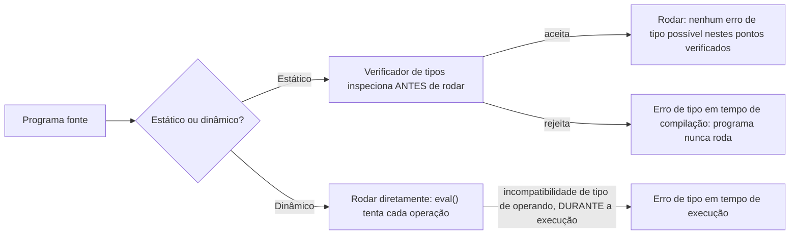

## Objetivos de Aprendizagem

- Definir tipagem estática (erros de tipo pegos antes de o programa rodar, por um passo separado de verificação de tipos) e tipagem dinâmica (erros de tipo pegos no momento em que ocorrem, durante a execução).
- Rastrear um termo concreto que um verificador de tipos estático rejeita antes de qualquer avaliação acontecer, versus a mesma categoria de erro surgindo só em tempo de execução sob tipagem dinâmica.
- Explicar por que este é um trade-off de design genuíno (detecção de erro mais cedo vs. mais flexibilidade em tempo de execução), não um caso de uma abordagem ser estritamente melhor.
- Identificar qual disciplina de tipagem o interpretador construído até agora nesta disciplina atualmente tem (dinâmica, por padrão, já que `eval` não realizou nenhuma verificação de tipos de forma alguma até este ponto).
- Prever o que um VERIFICADOR de tipos precisaria adicionar para pegar um erro de tipo antes da avaliação, motivando os próximos dois conceitos.

## Contexto e Motivação

Todo conceito de interpretador até agora nesta disciplina usou silenciosamente tipagem DINÂMICA sem jamais nomeá-la: `eval` simplesmente tenta computar um resultado, e se uma operação é aplicada a um valor do tipo errado (adicionar um número a um booleano, digamos), a falha, seja como se manifeste, só se torna visível no exato momento em que `eval` tenta realizar aquela operação específica, durante a execução. Este conceito nomeia essa escolha explicitamente, pela primeira vez, e introduz a sua alternativa: a tipagem ESTÁTICA, onde um passo separado, o VERIFICADOR de tipos, construído ao longo dos próximos três conceitos, inspeciona a estrutura do programa antes de ele jamais rodar e rejeita certas categorias de programa de imediato, sem jamais executar um único passo delas.

Por que esta distinção merece o seu próprio conceito, em vez de dobrar a verificação de tipos diretamente na discussão de `eval`? Porque é uma QUESTÃO DE DESIGN genuinamente separada com duas respostas reais, ainda em uso ativo hoje, não uma matéria resolvida com uma escolha obviamente correta. A tipagem estática (C, Java, OCaml, Rust) pega uma classe inteira de erro antes de uma única linha rodar, ao custo de às vezes rejeitar programas que de fato teriam rodado corretamente. A tipagem dinâmica (Python, JavaScript, Ruby) difere essa verificação ao tempo de execução, oferecendo mais flexibilidade (uma função pode genuinamente aceitar tipos diferentes de argumentos de forma intercambiável) ao custo de alguns erros só surgirem depois de o programa já estar rodando, potencialmente em produção, num caminho de código que por acaso não foi exercitado durante o teste.

## Teoria Central

### A distinção central

```text
Tipagem estática:  Um VERIFICADOR de tipos inspeciona a fonte do programa (ou AST) ANTES
                   da execução e ou o aceita (prosseguindo para rodar) ou o rejeita
                   com um erro de tipo, sem jamais rodar um único passo.

Tipagem dinâmica:  Nenhum passo de verificação separado existe. eval() simplesmente tenta cada
                   operação à medida que a alcança; se os operandos são do tipo errado,
                   a falha (um erro de tipo em tempo de execução) surge NAQUELE PONTO,
                   potencialmente depois de o programa já ter feito outro trabalho não
                   relacionado.
```

Crucialmente, isto é ortogonal a uma distinção completamente diferente às vezes confundida com ela: tipagem forte vs. fraca (se uma linguagem permite coerções implícitas e silenciosas entre tipos, por exemplo `"5" + 3` virando silenciosamente `"53"` ou `8` dependendo da linguagem). Uma linguagem pode ser dinamicamente E fortemente tipada (Python: erros de tipo acontecem em tempo de execução, mas há pouca coerção silenciosa) ou estaticamente E fracamente tipada (C mais antigo: verificado em tempo de compilação, mas ponteiros e inteiros podem ser implicitamente, às vezes perigosamente, convertidos). O foco desta disciplina é especificamente o eixo estático/dinâmico, QUANDO um erro de tipo é pego, não quão permissiva a linguagem é sobre conversões implícitas.

### Um termo concreto ilustrando a diferença

```text
if condition then 5 else "hello"
```

- **Sob tipagem dinâmica** (o interpretador desta disciplina, como construído até agora): isto avalia BEM, se `condition` é verdadeira, a expressão inteira avalia para `5`; se falsa, para `"hello"`. Nada jamais reclama, porque nada jamais inspecionou os TIPOS de ambos os ramos juntos, só o ramo que de fato é tomado é jamais avaliado.
- **Sob tipagem estática**: um verificador de tipos precisaria atribuir UM tipo à expressão `if` inteira, e fazer isso exige que o ramo THEN e o ramo ELSE tenham o MESMO tipo, `5` (um número) e `"hello"` (uma string) não correspondem, então um verificador estático rejeita este termo de imediato, antes de qualquer ramo ser jamais avaliado, independentemente do que `condition` teria avaliado.

Este único exemplo é a ilustração mais clara do trade-off real: a rejeição do verificador estático aqui é discutivelmente conservadora demais (talvez `condition` seja sempre falsa na prática, então o ramo `5` incompatível nunca de fato executaria), mas o verificador não consegue saber disso sem de fato rodar o programa, que é exatamente a garantia que ele está tentando fornecer SEM rodar o programa.



### O trade-off real, enunciado honestamente

A vantagem genuína da tipagem estática: uma CATEGORIA inteira de bug (usar um valor como o tipo errado de coisa) é pega uma vez, para o programa inteiro, antes de qualquer parte rodar, incluindo em caminhos de código que podem não ser exercitados por nenhuma execução de teste particular, exatamente o tipo de bug que é mais barato de consertar quanto mais cedo é encontrado. O seu custo genuíno: ela pode rejeitar programas que, de fato, rodariam corretamente (o exemplo-`if` acima), e exige que a maquinaria de verificação de tipos (desenvolvida ao longo dos próximos três conceitos) exista e seja correta em primeiro lugar. A vantagem genuína da tipagem dinâmica: flexibilidade máxima, uma função genuinamente PODE aceitar tipos de argumento muito diferentes e despachar sobre eles em tempo de execução, nenhuma estrutura estática exigida de antemão. O seu custo genuíno: um erro de tipo num caminho de código raramente exercitado pode ficar dormente até exatamente o momento errado, em produção, em entrada de usuário real.

## Exemplos Resolvidos

### Exemplo 1: Uma falha de tipagem dinâmica surgindo no meio da execução

```python
def eval(node, env):
    match node:
        case BinaryExpr("+", left, right):
            return eval(left, env) + eval(right, env)
        # ...

# Dado: eval(BinaryExpr("+", NumExpr(5), TrueExpr()), env)
#   eval(NumExpr(5), env) = 5
#   eval(TrueExpr(), env) = True
#   return 5 + True   →   TypeError na linguagem HOSPEDEIRA (Python por acaso permite
#                          este caso específico já que bool é um subtipo de int ali,
#                          mas uma linguagem sem essa peculiaridade levantaria limpamente aqui)
```

A falha, se acontecer de todo, só se torna visível no momento em que `eval` de fato tenta adicionar estes dois valores específicos, que poderia ser arbitrariamente profundo na execução de um programa de longa duração, bem depois de muitas outras partes não relacionadas do programa já terem rodado com sucesso.

### Exemplo 2: O que um verificador estático precisaria para rejeitar isto ANTES de rodar

```text
Um verificador de tipos precisaria atribuir tipos a cada sub-expressão SEM avaliá-las:
  typeof(NumExpr(5))   = Number
  typeof(TrueExpr())    = Boolean
  typeof(BinaryExpr("+", left, right)) exige: typeof(left) = Number
                                              E typeof(right) = Number
  Já que typeof(TrueExpr()) = Boolean ≠ Number, REJEITAR este termo, um erro de tipo,
  reportado antes de qualquer avaliação desta expressão (ou qualquer outra coisa no
  programa) jamais começar.
```

Este é exatamente o tipo de JULGAMENTO de tipagem que os próximos dois conceitos (progresso/preservação, e o cálculo lambda simplesmente tipado) tornam plenamente precisos e formais.

### Exemplo 3: O trade-off genuíno numa função realista

```python
def describe(x):
    if isinstance(x, int):
        return f"a number: {x}"
    elif isinstance(x, str):
        return f"a string: {x}"
    else:
        return "something else"
```

Sob tipagem DINÂMICA, esta função genuinamente funciona corretamente para múltiplos tipos de argumento não relacionados, despachando sobre o tipo em tempo de execução, flexibilidade que um sistema de tipos estático direto rejeitaria (uma única assinatura de função não consegue facilmente dizer "aceita um int OU uma string e se comporta diferente para cada" sem recursos de sistema de tipos mais avançados como tipos união ou polimorfismo ad hoc, fora do escopo desta disciplina). Sob tipagem ESTÁTICA, este exato padrão precisaria ser expresso de forma diferente, talvez como várias funções sobrecarregadas tipadas separadamente, ou usando recursos de sistema de tipos mais ricos que esta disciplina não cobre, genuinamente restringindo o que é fácil de escrever, em troca da garantia de que nenhum chamador pode jamais passar um TERCEIRO tipo, verdadeiramente incompatível, sem um erro em tempo de compilação.

## Equívocos Comuns e Armadilhas

- **"Tipagem estática e dinâmica são a mesma distinção que tipagem forte e fraca."** Elas são eixos ortogonais: estático/dinâmico é sobre QUANDO um erro de tipo é pego (antes de rodar vs. durante o rodar); forte/fraco é sobre quão permissiva uma linguagem é sobre coerções implícitas entre tipos. Python é dinâmico E forte; C mais antigo é estático E comparativamente fraco (permitindo muitas conversões implícitas), todas as quatro combinações existem entre linguagens reais.
- **"A tipagem estática pega todo bug possível antes de rodar."** Ela só pega erros de TIPO especificamente, usar um valor como o tipo errado de coisa. Erros de lógica (um limite de laço com erro de um, uma fórmula errada) são completamente invisíveis a um verificador de tipos e exigem teste ou outras técnicas de verificação independentemente da disciplina de tipagem.
- **"A tipagem dinâmica é objetivamente pior porque difere a detecção de erro."** É um trade-off genuíno, ainda ativamente escolhido, não um recurso de reserva inferior, a flexibilidade que a tipagem dinâmica oferece (a função `describe` do Exemplo 3) é uma vantagem de capacidade real em situações onde os tipos de entrada genuinamente variam e as restrições de um sistema de tipos estático seriam mais incômodas do que úteis.
- **"Este interpretador, já que não tem verificador de tipos ainda, está 'incompleto' ou 'incorreto'."** Ele é um interpretador DINAMICAMENTE tipado completo e correto, a tipagem dinâmica é uma escolha de design real e legítima, não uma versão incompleta de uma estática. O verificador de tipos construído ao longo dos próximos dois conceitos é um passo ADICIONAL e separado que poderia ser camadado em cima, não uma peça faltante que este interpretador de alguma forma era obrigado a ter desde o início.

## Resumo

A tipagem estática verifica os tipos de um programa com um passo separado ANTES de ele rodar, rejeitando certa categoria de erros de imediato sem nenhuma execução exigida, ao custo de às vezes rejeitar programas (como a expressão `if` de ramos incompatíveis) que de fato teriam rodado corretamente; a tipagem dinâmica, o que o interpretador desta disciplina usou o tempo todo, por padrão, já que `eval` não realiza nenhuma verificação separada, difere essa mesma categoria de erro ao exato momento em que uma operação mal tipada é de fato tentada, oferecendo mais flexibilidade ao custo de alguns erros surgirem só em tempo de execução, em qualquer que seja o caminho de código que por acaso os dispare. Nenhuma é estritamente superior; ambas são pontos de design reais, ainda em uso ativo (C/Java/OCaml/Rust vs. Python/JavaScript/Ruby). Os próximos dois conceitos desenvolvem o que um VERIFICADOR de tipos estático de fato precisa para fazer esta rejeição precisa e provavelmente, as propriedades de progresso e preservação, e um cálculo simplesmente tipado concreto construído para satisfazê-las.

## Documentation Links

- [Pierce — Types and Programming Languages, Ch. 1 (Introduction)](https://www.cis.upenn.edu/~bcpierce/tapl/contents.pdf): emoldura a distinção estático/dinâmico e os seus trade-offs reais precisamente.
- [ACM/IEEE CS2013 — Programming Languages Knowledge Area](https://csed.acm.org/knowledge-areas-programming-languages-pl-cs2013-version/): lista Sistemas de Tipos mais profundos como material eletivo que o agrupamento de sistemas de tipos desta disciplina cobre.
