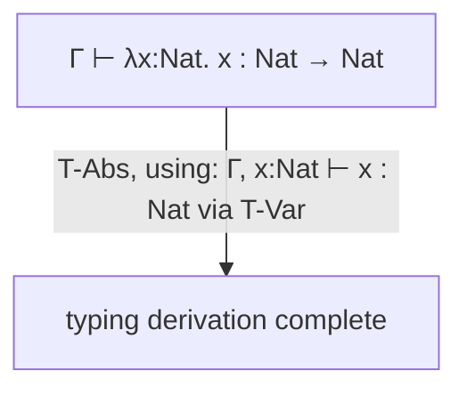

## Learning Objectives

- Extend the untyped lambda calculus's grammar with a base type and function types (`τ → τ`), and require every abstraction to annotate its parameter's type.
- Read and construct typing judgments of the form `Γ ⊢ t : τ` ("in context Γ, term t has type τ"), including the typing context Γ as a mapping from variables to their assumed types.
- State the typing rules for variables, abstraction, and application, and use them to derive a complete typing judgment for a concrete term, step by step.
- Explain concretely why the simply typed lambda calculus is strictly LESS powerful than the untyped one — specifically, why it cannot type the Y combinator, and why that's a feature, not a limitation.
- Connect this concept directly to progress and preservation: state, informally, why these particular typing rules are exactly shaped to make both properties provable.

## Context & Motivation

The untyped lambda calculus, covered earlier in this discipline, has three constructs and no restrictions at all on which terms are well-formed — `(λx. x x) (λx. x x)` (the term `Ω`, which never terminates) is a perfectly legal untyped lambda term, exactly as legal as the identity function. The simply typed lambda calculus (STLC) asks: what is the SMALLEST possible addition to this grammar that lets a type checker reject SOME terms — specifically, terms that would otherwise get stuck — while still keeping the language's core computational shape (variables, abstraction, application) intact?

The answer, developed by Church alongside the untyped calculus itself, adds exactly two things: a base type (call it `Nat`, or `Bool` — some starting point with no internal structure) and FUNCTION TYPES, written `τ1 → τ2` ("a function from something of type τ1 to something of type τ2"). Every abstraction must now be annotated with its parameter's type: `λx:τ. t`, rather than the untyped calculus's bare `λx. t`. This one change is enough to build a complete, provably type-safe (progress + preservation both hold, exactly as the previous concept defined them) calculus — at the direct cost of losing some genuine expressive power, made concrete in this concept's discussion of the Y combinator.

## Core Theory

### Extended grammar and typing judgments

```text
Types:   τ ::= Nat | τ → τ
Terms:   t ::= x | λx:τ. t | t t | ... (plus Nat-specific terms: 0, succ t, etc.)
```

A TYPING JUDGMENT has the form `Γ ⊢ t : τ`, read "in typing context Γ, term t has type τ." The context `Γ` is a mapping from variable names to their assumed types (exactly parallel in structure to the runtime ENVIRONMENT already covered — but mapping names to TYPES here, at check time, rather than to VALUES at run time; the parallel is genuine and worth noticing).

### The three core typing rules

```text
x : τ ∈ Γ
──────────────                                          (T-Var)
Γ ⊢ x : τ

Γ, x:τ1 ⊢ t : τ2
─────────────────────────                                (T-Abs)
Γ ⊢ λx:τ1. t : τ1 → τ2

Γ ⊢ t1 : τ1 → τ2      Γ ⊢ t2 : τ1
───────────────────────────────────                      (T-App)
Γ ⊢ t1 t2 : τ2
```

- **T-Var**: a variable's type is whatever the context `Γ` already says it is — a direct lookup, exactly parallel to the runtime `Environment.lookup` already built.
- **T-Abs**: an abstraction `λx:τ1. t` has a function type `τ1 → τ2`, where `τ2` is whatever type the BODY `t` has, checked in an EXTENDED context `Γ, x:τ1` (the parameter added to the context with its annotated type) — again, directly parallel to how evaluating a function body used an environment extended with the parameter's VALUE.
- **T-App**: applying `t1` to `t2` is only well-typed if `t1`'s type is a function type `τ1 → τ2` AND `t2`'s type matches the function's expected ARGUMENT type `τ1` exactly — this single rule is precisely what rejects a term like applying a number to an argument (numbers aren't function types, so T-App simply has no way to apply here).



### Why this rejects stuck terms, concretely

Recall the running example of a stuck term: `iszero true`. With `iszero : Nat → Bool` fixed as a typing rule requiring its argument to have type `Nat`, and `true : Bool` (not `Nat`), T-App-style reasoning for `iszero true` fails immediately — there is no valid typing derivation for this term at all, meaning a type checker built on these rules rejects it OUTRIGHT, before any evaluation is attempted. This is exactly the concrete mechanism that realizes the progress guarantee from the previous concept: by construction, these typing rules never assign a type to a term that COULD get stuck.

### The real cost: the Y combinator is not typable

The untyped calculus's Y combinator, `Y ≡ λf. (λx. f (x x)) (λx. f (x x))`, relies essentially on applying a term `x` TO ITSELF: `x x`. But under T-App, if `x : τ1 → τ2`, then applying `x` to itself requires `x`'s OWN type to ALSO be the argument type — i.e., `τ1 → τ2` would need to equal `τ1`, which would require an infinitely nested type (`τ1 → τ2` containing `τ1` containing `τ1 → τ2` containing ...) that simply doesn't exist in this grammar of types. The Y combinator, and therefore unrestricted recursion via self-application, is genuinely NOT expressible in the simply typed lambda calculus — a real, structural limitation, not a minor technicality.

## Worked Examples

### Example 1: A complete typing derivation for the identity function

Derive `⊢ λx:Nat. x : Nat → Nat` (empty context, since this term has no free variables):

```text
Step 1: apply T-Var inside the extended context.
  x:Nat ∈ {x:Nat}
  ──────────────────                (T-Var)
  x:Nat ⊢ x : Nat

Step 2: apply T-Abs, using Step 1 as the premise.
  x:Nat ⊢ x : Nat
  ──────────────────────────                (T-Abs)
  ⊢ λx:Nat. x : Nat → Nat
```

A complete, two-step derivation, with every premise justified by a specific named rule — exactly the same discipline as a mathematical proof, applied here to assigning a type rather than proving a theorem.

### Example 2: A term T-App correctly rejects

```text
Attempt to type: (λx:Nat. x) true

By T-App, this requires:
  Γ ⊢ (λx:Nat. x) : τ1 → τ2     — from Example 1: τ1 = Nat, τ2 = Nat
  Γ ⊢ true : τ1                  — requires true : Nat

But true : Bool, not Nat — the SECOND premise of T-App fails. There is no valid
typing derivation for this term at all — it is REJECTED, before any evaluation
step is attempted, exactly the static-typing behavior the earlier concept in
this discipline introduced only informally.
```

### Example 3: Confirming the Y combinator's self-application genuinely fails to type

```text
Y's core sub-term: x x    (inside λx. f (x x))

For T-App to type "x x", x's type must simultaneously be:
  - some function type τ1 → τ2  (since x is being used as the FUNCTION being applied)
  - τ1                           (since x is ALSO being used as the ARGUMENT)

This requires τ1 → τ2 = τ1 — a type equal to a function type built partly FROM
itself. No finite type in this grammar (τ ::= Nat | τ → τ) satisfies this; the
grammar simply has no way to write such a type. "x x" cannot be typed, so
nothing built using it — including the entire Y combinator — can be typed
either, in the simply typed lambda calculus as given here.
```

This concrete failure is the honest, structural reason richer real type systems (recursive types, or a dedicated `fix` primitive added directly to the language, both beyond this discipline's scope) exist specifically to restore controlled recursion without reopening the door to arbitrary, possibly-nonterminating self-application.

## Common Misconceptions & Pitfalls

- **"Adding types to the lambda calculus just restricts syntax — it doesn't change what's computable."** It genuinely does change what's expressible WITHIN the calculus itself — the Y combinator, and unrestricted self-application generally, is provably untypable here, a real loss of expressive power (though real languages recover controlled recursion through other means, like a dedicated `fix` construct or recursive type annotations, outside this concept's scope).
- **"The typing context Γ and the runtime environment are unrelated data structures that happen to look similar."** They are genuinely parallel by design — Γ maps variables to TYPES at check time exactly as the environment maps them to VALUES at run time, and T-Abs extending Γ with `x:τ1` mirrors function-call evaluation extending the environment with `x`'s argument VALUE — the same underlying idea (track what a variable name currently means, in a nested, shadowable way) applied to two different questions.
- **"A term that fails to type-check is always a 'real' error in the program's logic."** The rejected `if condition then 5 else "hello"` from the static-vs-dynamic-typing concept, and the Y combinator here, are both REJECTED despite potentially representing something a programmer might have legitimately wanted to express — type-checking's conservatism (rejecting some correct-in-practice programs, as already flagged) is a real, acknowledged cost of the safety guarantee, not evidence the checker is malfunctioning.
- **"These typing rules are somehow arbitrary — a different set of rules would work just as well."** They are specifically SHAPED to make progress and preservation provable, as this concept's closing point states — T-App's requirement that the argument's type match exactly is precisely what rules out the `iszero true`-style stuck term; a looser rule set might type more terms but would risk breaking one of those two safety properties.

## Summary

The simply typed lambda calculus extends the untyped calculus with a base type and function types (`τ → τ`), requiring every abstraction to be annotated with its parameter's type, and introduces typing judgments `Γ ⊢ t : τ` derived by three core rules (T-Var, T-Abs, T-App) that closely parallel the runtime environment/evaluation machinery already built, now operating on types instead of values. These specific rules are shaped exactly to make progress and preservation (the previous concept's two central properties) provable — concretely realized in how T-App rejects a term like `iszero true` outright, with no valid derivation possible. The real cost of this safety is a genuine loss of expressive power: the Y combinator's self-application `x x` cannot be typed in this grammar at all, a structural limitation (not a minor syntactic one) that real, richer type systems address through separate mechanisms outside this discipline's scope.

## Documentation Links

- [Pierce — Types and Programming Languages, Ch. 9 (Simply Typed Lambda-Calculus)](https://www.cis.upenn.edu/~bcpierce/tapl/contents.pdf) — the canonical presentation of STLC's grammar, typing rules, and the Y combinator's untypability.
- [Stanford CS242 — Programming Languages](https://web.stanford.edu/class/cs242/) — covers typed lambda calculi as the theoretical core of real statically-typed language design.
