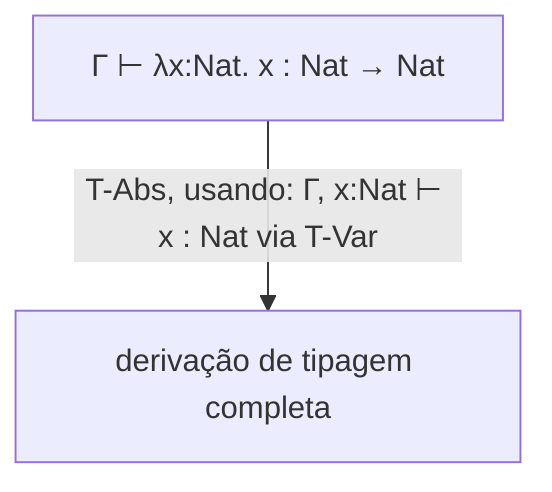

## Objetivos de Aprendizagem

- Estender a gramática do cálculo lambda não tipado com um tipo base e tipos de função (`τ → τ`), e exigir que toda abstração anote o tipo do seu parâmetro.
- Ler e construir julgamentos de tipagem da forma `Γ ⊢ t : τ` ("no contexto Γ, o termo t tem tipo τ"), incluindo o contexto de tipagem Γ como um mapeamento de variáveis para os seus tipos assumidos.
- Enunciar as regras de tipagem para variáveis, abstração e aplicação, e usá-las para derivar um julgamento de tipagem completo para um termo concreto, passo a passo.
- Explicar concretamente por que o cálculo lambda simplesmente tipado é estritamente MENOS poderoso do que o não tipado, especificamente, por que não consegue tipar o combinador Y, e por que isso é um recurso, não uma limitação.
- Conectar este conceito diretamente a progresso e preservação: enunciar, informalmente, por que estas regras de tipagem em particular têm o formato exato para tornar ambas as propriedades prováveis.

## Contexto e Motivação

O cálculo lambda não tipado, coberto mais cedo nesta disciplina, tem três construtos e nenhuma restrição de forma alguma sobre quais termos são bem formados, `(λx. x x) (λx. x x)` (o termo `Ω`, que nunca termina) é um termo lambda não tipado perfeitamente legal, exatamente tão legal quanto a função identidade. O cálculo lambda simplesmente tipado (STLC) pergunta: qual é a MENOR adição possível a esta gramática que deixa um verificador de tipos rejeitar ALGUNS termos, especificamente, termos que de outra forma ficariam emperrados, enquanto ainda mantém o formato computacional central da linguagem (variáveis, abstração, aplicação) intacto?

A resposta, desenvolvida por Church junto ao próprio cálculo não tipado, adiciona exatamente duas coisas: um tipo base (chame-o de `Nat`, ou `Bool`, algum ponto de partida sem estrutura interna) e TIPOS DE FUNÇÃO, escritos `τ1 → τ2` ("uma função de algo de tipo τ1 para algo de tipo τ2"). Toda abstração agora tem de ser anotada com o tipo do seu parâmetro: `λx:τ. t`, em vez do `λx. t` nu do cálculo não tipado. Esta única mudança é o bastante para construir um cálculo completo, comprovadamente seguro em tipos (progresso + preservação ambos se mantêm, exatamente como o conceito anterior os definiu), ao custo direto de perder algum poder expressivo genuíno, tornado concreto na discussão deste conceito sobre o combinador Y.

## Teoria Central

### Gramática estendida e julgamentos de tipagem

```text
Tipos:   τ ::= Nat | τ → τ
Termos:  t ::= x | λx:τ. t | t t | ... (mais termos específicos de Nat: 0, succ t, etc.)
```

Um JULGAMENTO DE TIPAGEM tem a forma `Γ ⊢ t : τ`, lido "no contexto de tipagem Γ, o termo t tem tipo τ." O contexto `Γ` é um mapeamento de nomes de variáveis para os seus tipos assumidos (exatamente paralelo em estrutura ao AMBIENTE de tempo de execução já coberto, mas mapeando nomes para TIPOS aqui, no tempo de verificação, em vez de para VALORES no tempo de execução; o paralelo é genuíno e vale notar).

### As três regras de tipagem centrais

```text
x : τ ∈ Γ
──────────────                                          (T-Var)
Γ ⊢ x : τ

Γ, x:τ1 ⊢ t : τ2
─────────────────────────                                (T-Abs)
Γ ⊢ λx:τ1. t : τ1 → τ2

Γ ⊢ t1 : τ1 → τ2      Γ ⊢ t2 : τ1
───────────────────────────────────                      (T-App)
Γ ⊢ t1 t2 : τ2
```

- **T-Var**: o tipo de uma variável é qualquer que o contexto `Γ` já diga que é, uma busca direta, exatamente paralela ao `Environment.lookup` de tempo de execução já construído.
- **T-Abs**: uma abstração `λx:τ1. t` tem um tipo de função `τ1 → τ2`, onde `τ2` é qualquer que seja o tipo que o CORPO `t` tem, verificado num contexto ESTENDIDO `Γ, x:τ1` (o parâmetro adicionado ao contexto com o seu tipo anotado), de novo, diretamente paralelo a como avaliar um corpo de função usou um ambiente estendido com o VALOR do parâmetro.
- **T-App**: aplicar `t1` a `t2` só é bem tipado se o tipo de `t1` é um tipo de função `τ1 → τ2` E o tipo de `t2` corresponde exatamente ao tipo de ARGUMENTO esperado da função `τ1`, esta única regra é precisamente o que rejeita um termo como aplicar um número a um argumento (números não são tipos de função, então T-App simplesmente não tem como se aplicar aqui).



### Por que isto rejeita termos emperrados, concretamente

Lembre do exemplo corrente de um termo emperrado: `iszero true`. Com `iszero : Nat → Bool` fixado como uma regra de tipagem exigindo que o seu argumento tenha tipo `Nat`, e `true : Bool` (não `Nat`), o raciocínio estilo T-App para `iszero true` falha imediatamente, não há nenhuma derivação de tipagem válida para este termo de forma alguma, significando que um verificador de tipos construído sobre estas regras o rejeita DE IMEDIATO, antes de qualquer avaliação ser tentada. Este é exatamente o mecanismo concreto que realiza a garantia de progresso do conceito anterior: por construção, estas regras de tipagem nunca atribuem um tipo a um termo que PODERIA ficar emperrado.

### O custo real: o combinador Y não é tipável

O combinador Y do cálculo não tipado, `Y ≡ λf. (λx. f (x x)) (λx. f (x x))`, depende essencialmente de aplicar um termo `x` A SI MESMO: `x x`. Mas sob T-App, se `x : τ1 → τ2`, então aplicar `x` a si mesmo exige que o PRÓPRIO tipo de `x` seja TAMBÉM o tipo de argumento, isto é, `τ1 → τ2` precisaria igualar `τ1`, o que exigiria um tipo infinitamente aninhado (`τ1 → τ2` contendo `τ1` contendo `τ1 → τ2` contendo ...) que simplesmente não existe nesta gramática de tipos. O combinador Y, e portanto recursão irrestrita via autoaplicação, é genuinamente NÃO expressável no cálculo lambda simplesmente tipado, uma limitação real e estrutural, não uma tecnicalidade menor.

## Exemplos Resolvidos

### Exemplo 1: Uma derivação de tipagem completa para a função identidade

Derive `⊢ λx:Nat. x : Nat → Nat` (contexto vazio, já que este termo não tem variáveis livres):

```text
Passo 1: aplicar T-Var dentro do contexto estendido.
  x:Nat ∈ {x:Nat}
  ──────────────────                (T-Var)
  x:Nat ⊢ x : Nat

Passo 2: aplicar T-Abs, usando o Passo 1 como a premissa.
  x:Nat ⊢ x : Nat
  ──────────────────────────                (T-Abs)
  ⊢ λx:Nat. x : Nat → Nat
```

Uma derivação completa de dois passos, com toda premissa justificada por uma regra nomeada específica, exatamente a mesma disciplina de uma prova matemática, aplicada aqui a atribuir um tipo em vez de provar um teorema.

### Exemplo 2: Um termo que T-App corretamente rejeita

```text
Tentativa de tipar: (λx:Nat. x) true

Por T-App, isto exige:
  Γ ⊢ (λx:Nat. x) : τ1 → τ2     — do Exemplo 1: τ1 = Nat, τ2 = Nat
  Γ ⊢ true : τ1                  — exige true : Nat

Mas true : Bool, não Nat, a SEGUNDA premissa de T-App falha. Não há nenhuma derivação
de tipagem válida para este termo de forma alguma, ele é REJEITADO, antes de qualquer passo
de avaliação ser tentado, exatamente o comportamento de tipagem estática que o conceito anterior
nesta disciplina introduziu só informalmente.
```

### Exemplo 3: Confirmando que a autoaplicação do combinador Y genuinamente falha em tipar

```text
Sub-termo central de Y: x x    (dentro de λx. f (x x))

Para T-App tipar "x x", o tipo de x tem de ser simultaneamente:
  - algum tipo de função τ1 → τ2  (já que x está sendo usado como a FUNÇÃO sendo aplicada)
  - τ1                             (já que x está TAMBÉM sendo usado como o ARGUMENTO)

Isto exige τ1 → τ2 = τ1, um tipo igual a um tipo de função construído em parte A PARTIR
de si mesmo. Nenhum tipo finito nesta gramática (τ ::= Nat | τ → τ) satisfaz isto; a
gramática simplesmente não tem como escrever tal tipo. "x x" não consegue ser tipado, então
nada construído usando-o, incluindo o combinador Y inteiro, consegue ser tipado
tampouco, no cálculo lambda simplesmente tipado como dado aqui.
```

Esta falha concreta é a razão honesta e estrutural pela qual sistemas de tipos reais mais ricos (tipos recursivos, ou um primitivo `fix` dedicado adicionado diretamente à linguagem, ambos além do escopo desta disciplina) existem especificamente para restaurar recursão controlada sem reabrir a porta à autoaplicação arbitrária e possivelmente não terminante.

## Equívocos Comuns e Armadilhas

- **"Adicionar tipos ao cálculo lambda só restringe a sintaxe, não muda o que é computável."** Ele genuinamente de fato muda o que é expressável DENTRO do próprio cálculo, o combinador Y, e a autoaplicação irrestrita em geral, é comprovadamente não tipável aqui, uma perda real de poder expressivo (embora linguagens reais recuperem recursão controlada por outros meios, como um construto `fix` dedicado ou anotações de tipo recursivo, fora do escopo deste conceito).
- **"O contexto de tipagem Γ e o ambiente de tempo de execução são estruturas de dados não relacionadas que por acaso parecem similares."** Elas são genuinamente paralelas por design, Γ mapeia variáveis para TIPOS no tempo de verificação exatamente como o ambiente as mapeia para VALORES no tempo de execução, e T-Abs estendendo Γ com `x:τ1` espelha a avaliação de chamada de função estendendo o ambiente com o VALOR do argumento de `x`, a mesma ideia subjacente (rastrear o que um nome de variável atualmente significa, de forma aninhada e sombreável) aplicada a duas questões diferentes.
- **"Um termo que falha em verificar o tipo é sempre um erro 'real' na lógica do programa."** O `if condition then 5 else "hello"` rejeitado do conceito de tipagem estática vs. dinâmica, e o combinador Y aqui, são ambos REJEITADOS apesar de potencialmente representarem algo que um programador poderia ter legitimamente querido expressar, o conservadorismo da verificação de tipos (rejeitar alguns programas corretos na prática, como já sinalizado) é um custo real e reconhecido da garantia de segurança, não evidência de que o verificador está funcionando mal.
- **"Estas regras de tipagem são de alguma forma arbitrárias, um conjunto diferente de regras funcionaria igualmente bem."** Elas têm o formato específico para tornar progresso e preservação prováveis, como o ponto de encerramento deste conceito enuncia, a exigência de T-App de que o tipo do argumento corresponda exatamente é precisamente o que descarta o termo emperrado estilo `iszero true`; um conjunto de regras mais frouxo poderia tipar mais termos mas arriscaria quebrar uma dessas duas propriedades de segurança.

## Resumo

O cálculo lambda simplesmente tipado estende o cálculo não tipado com um tipo base e tipos de função (`τ → τ`), exigindo que toda abstração seja anotada com o tipo do seu parâmetro, e introduz julgamentos de tipagem `Γ ⊢ t : τ` derivados por três regras centrais (T-Var, T-Abs, T-App) que espelham de perto a maquinaria de ambiente/avaliação de tempo de execução já construída, agora operando sobre tipos em vez de valores. Estas regras específicas têm o formato exato para tornar progresso e preservação (as duas propriedades centrais do conceito anterior) prováveis, concretamente realizado em como T-App rejeita um termo como `iszero true` de imediato, sem nenhuma derivação válida possível. O custo real desta segurança é uma perda genuína de poder expressivo: a autoaplicação `x x` do combinador Y não consegue ser tipada nesta gramática de forma alguma, uma limitação estrutural (não uma sintática menor) que sistemas de tipos reais e mais ricos enfrentam por meio de mecanismos separados fora do escopo desta disciplina.

## Documentation Links

- [Pierce — Types and Programming Languages, Ch. 9 (Simply Typed Lambda-Calculus)](https://www.cis.upenn.edu/~bcpierce/tapl/contents.pdf): a apresentação canônica da gramática do STLC, regras de tipagem, e a não tipabilidade do combinador Y.
- [Stanford CS242 — Programming Languages](https://web.stanford.edu/class/cs242/): cobre cálculos lambda tipados como o núcleo teórico do design de linguagem estaticamente tipada real.
