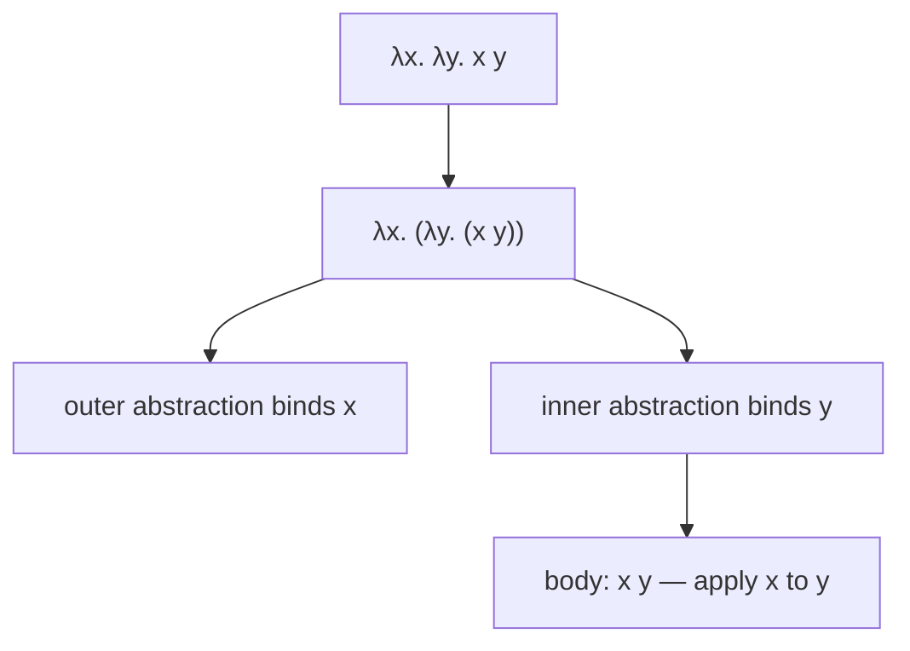

## Learning Objectives

- State the complete grammar of the untyped lambda calculus: a variable, an abstraction (function definition), and an application (function call) — nothing else.
- Distinguish free variables from bound variables in a lambda term, and explain why this distinction matters for substitution.
- Explain why such a minimal language is nonetheless capable of expressing every computable function (previewed here, developed fully two concepts later).
- Parse a multi-part lambda expression using the standard conventions (application is left-associative, abstraction bodies extend as far right as possible).
- Connect the lambda calculus's three-part grammar back to the toy arithmetic language's grammar from the previous concept, as the same technique (grammar + small-step rules) applied to a richer language.

## Context & Motivation

The toy arithmetic language from the previous concept had no variables and no functions — every term was a fixed piece of syntax (`true`, `succ 0`, an `if`) with no way to abstract over a pattern and reuse it. Real languages need exactly that: the ability to define a function once and apply it to many different arguments. The lambda calculus, introduced by Alonzo Church in the 1930s as part of his own answer to Hilbert's decision problem (the same historical moment the Church-Turing thesis, already covered, grew out of), is the minimal language that adds exactly this ability — and nothing more.

The radical claim, developed fully in two concepts, is that three constructs — a variable, a function definition (an abstraction), and a function call (an application) — turn out to be enough to build every computable function that exists, including things that look nothing like functions on the surface: booleans, natural numbers, even recursion itself, all encoded as pure lambda terms with no built-in support for any of them. This is not a curiosity; it is the reason the lambda calculus functions as one of the several independently-invented, later-proven-equivalent formal models of computation that make up the real evidence for the Church-Turing thesis.

Why study a language this minimal at all, rather than jumping straight to a language with real integers, real booleans, and real recursion built in? Because minimality makes the theory tractable — every property proved about the lambda calculus (confluence, normalization, the type-safety results covered later in this discipline) is proved once, about three constructs, rather than needing to be re-proved separately for every built-in feature a fuller language might add. Real languages' actual type systems and semantics are very often lambda calculus PLUS a pile of built-in extensions layered on top of this same tiny core.

## Core Theory

### The grammar: three constructs, nothing else

```text
t ::=  x                  (variable)
     | λx. t               (abstraction — a function of one argument, x, with body t)
     | t t                 (application — calling one term with another as its argument)
```

That is the entire grammar. There are no numbers, no booleans, no `if`, no built-in operators — those all get encoded IN TERMS OF this grammar two concepts later. A term like `λx. x` is the identity function — take an argument, return it unchanged. A term like `λx. λy. x` is a function that takes two arguments (via nested abstraction — this is how the lambda calculus, which only has one-argument functions syntactically, expresses multi-argument functions) and returns the first one, ignoring the second.

### Free and bound variables

In `λx. x`, the `x` inside the body is BOUND by the `λx.` in front of it — it refers to whatever value the function is eventually applied to. In `λx. y`, the `y` is FREE — it is not bound by any enclosing `λ`, and its meaning has to come from somewhere else (an outer context). This distinction matters directly for substitution (developed in the next concept): substituting a value for a bound variable must never accidentally capture — change the meaning of — a variable that was free in the value being substituted in. A term with no free variables at all is called CLOSED; the toy language's terms in the previous concept were all trivially closed, since that language had no variables to begin with.

### Notational conventions

Two standard conventions make lambda terms readable without excessive parentheses:

1. **Application is left-associative.** `t1 t2 t3` means `(t1 t2) t3` — apply `t1` to `t2` first, then apply the result to `t3`.
2. **Abstraction bodies extend as far to the right as possible.** `λx. t1 t2` means `λx. (t1 t2)` — the body of the abstraction is the whole rest of the expression, not just `t1`.



### Multi-argument functions via currying

Since the grammar only has single-argument abstractions, a function that conceptually takes two arguments is written as a function that takes one argument and RETURNS a function that takes the second — `λx. λy. body`. Applying it to two arguments looks like `(λx. λy. body) a b`, which by left-associativity of application is `((λx. λy. body) a) b` — apply to `a` first (producing `λy. body[x := a]`, a new one-argument function), then apply that result to `b`. This technique — representing multi-argument functions as nested single-argument functions — is named CURRYING, after the logician Haskell Curry, and shows up directly in real functional languages (Haskell's own function syntax is curried by default).

## Worked Examples

### Example 1: Reading a compound term

Parse `λx. x y` using the conventions above:

```text
λx. x y
= λx. (x y)          (abstraction body extends as far right as possible)
```

Here `x` is bound (by the outer `λx.`) and `y` is free — this term is NOT closed. If this term appeared inside a larger closed program, `y` would need to be bound by some enclosing abstraction further out.

### Example 2: Currying a two-argument function by hand

A function that returns its first argument, conceptually `first(a, b) = a`:

```text
first ≡ λx. λy. x
```

Applying it: `first a b = ((λx. λy. x) a) b`. Step 1 substitutes `a` for `x` in the body `λy. x`, giving `λy. a` (a new function that ignores its argument and always returns `a`). Step 2 applies `λy. a` to `b`, substituting `b` for `y` in the body `a` — but `y` doesn't appear free in `a`, so nothing changes, and the result is `a`. `first a b` does correctly reduce to `a`, exactly as intended, entirely through the single-argument abstraction/application mechanism.

### Example 3: Free vs. bound in a nested term

```text
λx. (λy. y x) x
```

Working from the inside out: in `λy. y x`, `y` is bound (by `λy.`) and `x` is free (relative to this inner abstraction alone). But zooming out to the whole term, that same `x` IS bound — by the outer `λx.` that encloses everything. This is the general rule: whether a variable occurrence is free or bound is always relative to which abstraction, if any, it sits inside; the outer `λx.` here does bind both occurrences of `x` in the full term, even though the inner sub-term `λy. y x` looked, on its own, like it had a free `x`.

## Common Misconceptions & Pitfalls

- **"The lambda calculus needs numbers and booleans built in to be useful."** It deliberately has neither — the entire point, developed fully two concepts later, is that numbers, booleans, and even recursion can all be ENCODED using nothing but variables, abstraction, and application. Built-in numbers and booleans are a convenience real languages add on top, not a requirement of the underlying model.
- **"Currying and multi-argument functions are fundamentally different things."** They're the same computation, two syntactic views of it: `λx. λy. body` (curried, nested single-argument functions) and a hypothetical `λ(x, y). body` (multi-argument, if the grammar had it) compute identically — the lambda calculus's minimal grammar simply doesn't include the second form, so currying is how it's always expressed.
- **"A free variable is a mistake or an error in a term."** A free variable is not an error — it just means the term's meaning depends on an outer context that supplies a value for that variable. Only a program intended to run standalone needs to be CLOSED (no free variables); a sub-term inside a larger program is expected to have variables free relative to itself that get bound further out.
- **"λx. y and λy. y are the same function, since they're both 'a function that returns something.'"** They are very different: `λy. y` is the identity function (returns whatever it's given); `λx. y` ignores its argument entirely and always returns the free variable `y`, whatever that resolves to in context.

## Summary

The untyped lambda calculus's entire grammar is three constructs — a variable, an abstraction `λx. t`, and an application `t t` — with free variables (unbound by any enclosing `λ`) distinguished from bound ones, and multi-argument functions expressed via currying (nested single-argument abstractions). This extreme minimality is deliberate: rather than a limitation, it is what makes the lambda calculus tractable to study completely and — as the next two concepts show — powerful enough to encode arithmetic, booleans, and recursion from nothing but these three pieces, functioning as one of the real, independently-discovered formal models of computation behind the Church-Turing thesis.

## Documentation Links

- [Pierce — Types and Programming Languages, Ch. 5 (The Untyped Lambda-Calculus)](https://www.cis.upenn.edu/~bcpierce/tapl/contents.pdf) — the canonical presentation of this grammar and its conventions.
- [Stanford CS242 — Programming Languages](https://web.stanford.edu/class/cs242/) — a real course opening its core-theory unit with exactly this material.
