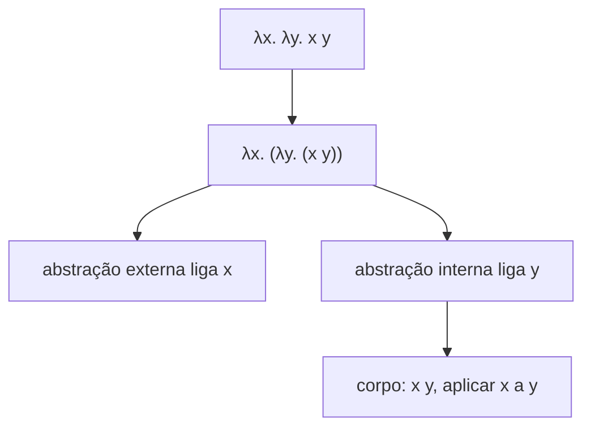

## Objetivos de Aprendizagem

- Enunciar a gramática completa do cálculo lambda não tipado: uma variável, uma abstração (definição de função) e uma aplicação (chamada de função), nada mais.
- Distinguir variáveis livres de variáveis ligadas num termo lambda, e explicar por que esta distinção importa para a substituição.
- Explicar por que uma linguagem tão mínima é, ainda assim, capaz de expressar toda função computável (previsto aqui, desenvolvido por completo dois conceitos depois).
- Dar parse numa expressão lambda de múltiplas partes usando as convenções padrão (a aplicação é associativa à esquerda, os corpos de abstração se estendem tão à direita quanto possível).
- Conectar a gramática de três partes do cálculo lambda de volta à gramática da linguagem aritmética de brinquedo do conceito anterior, como a mesma técnica (gramática + regras de passo pequeno) aplicada a uma linguagem mais rica.

## Contexto e Motivação

A linguagem aritmética de brinquedo do conceito anterior não tinha variáveis nem funções, todo termo era uma peça fixa de sintaxe (`true`, `succ 0`, um `if`) sem nenhuma forma de abstrair sobre um padrão e reusá-lo. Linguagens reais precisam exatamente disso: a habilidade de definir uma função uma vez e aplicá-la a muitos argumentos diferentes. O cálculo lambda, introduzido por Alonzo Church nos anos 1930 como parte da sua própria resposta ao problema da decisão de Hilbert (o mesmo momento histórico do qual a tese de Church-Turing, já coberta, cresceu), é a linguagem mínima que adiciona exatamente esta habilidade, e nada mais.

A afirmação radical, desenvolvida por completo em dois conceitos, é que três construtos, uma variável, uma definição de função (uma abstração) e uma chamada de função (uma aplicação), acabam por ser o bastante para construir toda função computável que existe, incluindo coisas que não parecem em nada funções na superfície: booleanos, números naturais, até a própria recursão, todos codificados como termos lambda puros sem nenhum suporte embutido para qualquer um deles. Isto não é uma curiosidade; é a razão pela qual o cálculo lambda funciona como um dos vários modelos formais de computação inventados independentemente e depois provados equivalentes que compõem a evidência real da tese de Church-Turing.

Por que estudar uma linguagem tão mínima de todo, em vez de saltar direto para uma linguagem com inteiros reais, booleanos reais e recursão real embutidos? Porque a minimalidade torna a teoria tratável, toda propriedade provada sobre o cálculo lambda (confluência, normalização, os resultados de segurança de tipos cobertos depois nesta disciplina) é provada uma vez, sobre três construtos, em vez de precisar ser reprovada separadamente para todo recurso embutido que uma linguagem mais completa poderia adicionar. Os sistemas de tipos e semânticas de fato de linguagens reais são muito frequentemente cálculo lambda MAIS uma pilha de extensões embutidas camadadas em cima deste mesmo núcleo minúsculo.

## Teoria Central

### A gramática: três construtos, nada mais

```text
t ::=  x                  (variável)
     | λx. t               (abstração: uma função de um argumento, x, com corpo t)
     | t t                 (aplicação: chamar um termo com outro como seu argumento)
```

Essa é a gramática inteira. Não há números, nem booleanos, nem `if`, nem operadores embutidos, esses todos são codificados EM TERMOS desta gramática dois conceitos depois. Um termo como `λx. x` é a função identidade, receba um argumento, retorne-o inalterado. Um termo como `λx. λy. x` é uma função que recebe dois argumentos (via abstração aninhada, é assim que o cálculo lambda, que só tem funções de um argumento sintaticamente, expressa funções de múltiplos argumentos) e retorna o primeiro, ignorando o segundo.

### Variáveis livres e ligadas

Em `λx. x`, o `x` dentro do corpo é LIGADO pelo `λx.` na frente dele, ele se refere a qualquer valor ao qual a função é eventualmente aplicada. Em `λx. y`, o `y` é LIVRE, ele não é ligado por nenhum `λ` envolvente, e o seu significado tem de vir de outro lugar (um contexto externo). Esta distinção importa diretamente para a substituição (desenvolvida no próximo conceito): substituir um valor por uma variável ligada nunca deve acidentalmente capturar, mudar o significado de, uma variável que era livre no valor sendo substituído. Um termo sem nenhuma variável livre de forma alguma é chamado FECHADO; os termos da linguagem de brinquedo no conceito anterior eram todos trivialmente fechados, já que aquela linguagem não tinha variáveis para começar.

### Convenções notacionais

Duas convenções padrão tornam termos lambda legíveis sem parênteses excessivos:

1. **A aplicação é associativa à esquerda.** `t1 t2 t3` significa `(t1 t2) t3`, aplicar `t1` a `t2` primeiro, depois aplicar o resultado a `t3`.
2. **Os corpos de abstração se estendem tão à direita quanto possível.** `λx. t1 t2` significa `λx. (t1 t2)`, o corpo da abstração é todo o resto da expressão, não só `t1`.



### Funções de múltiplos argumentos via currying

Já que a gramática só tem abstrações de um único argumento, uma função que conceitualmente recebe dois argumentos é escrita como uma função que recebe um argumento e RETORNA uma função que recebe o segundo, `λx. λy. body`. Aplicá-la a dois argumentos parece `(λx. λy. body) a b`, que pela associatividade à esquerda da aplicação é `((λx. λy. body) a) b`, aplicar a `a` primeiro (produzindo `λy. body[x := a]`, uma nova função de um argumento), depois aplicar esse resultado a `b`. Esta técnica, representar funções de múltiplos argumentos como funções aninhadas de um único argumento, é chamada CURRYING, em homenagem ao lógico Haskell Curry, e aparece diretamente em linguagens funcionais reais (a própria sintaxe de função de Haskell é currificada por padrão).

## Exemplos Resolvidos

### Exemplo 1: Lendo um termo composto

Dê parse em `λx. x y` usando as convenções acima:

```text
λx. x y
= λx. (x y)          (o corpo da abstração se estende tão à direita quanto possível)
```

Aqui `x` é ligado (pelo `λx.` externo) e `y` é livre, este termo NÃO é fechado. Se este termo aparecesse dentro de um programa fechado maior, `y` precisaria ser ligado por alguma abstração envolvente mais externa.

### Exemplo 2: Currificando uma função de dois argumentos à mão

Uma função que retorna o seu primeiro argumento, conceitualmente `first(a, b) = a`:

```text
first ≡ λx. λy. x
```

Aplicando-a: `first a b = ((λx. λy. x) a) b`. O Passo 1 substitui `a` por `x` no corpo `λy. x`, dando `λy. a` (uma nova função que ignora o seu argumento e sempre retorna `a`). O Passo 2 aplica `λy. a` a `b`, substituindo `b` por `y` no corpo `a`, mas `y` não aparece livre em `a`, então nada muda, e o resultado é `a`. `first a b` de fato reduz corretamente a `a`, exatamente como pretendido, inteiramente por meio do mecanismo de abstração/aplicação de um único argumento.

### Exemplo 3: Livre vs. ligado num termo aninhado

```text
λx. (λy. y x) x
```

Trabalhando de dentro para fora: em `λy. y x`, `y` é ligado (por `λy.`) e `x` é livre (relativamente a esta abstração interna sozinha). Mas afastando o zoom para o termo inteiro, esse mesmo `x` É ligado, pelo `λx.` externo que envolve tudo. Esta é a regra geral: se uma ocorrência de variável é livre ou ligada é sempre relativo a qual abstração, se houver, ela se situa dentro; o `λx.` externo aqui de fato liga ambas as ocorrências de `x` no termo completo, mesmo que o sub-termo interno `λy. y x` parecesse, por conta própria, ter um `x` livre.

## Equívocos Comuns e Armadilhas

- **"O cálculo lambda precisa de números e booleanos embutidos para ser útil."** Ele deliberadamente não tem nenhum dos dois, o ponto inteiro, desenvolvido por completo dois conceitos depois, é que números, booleanos e até recursão podem todos ser CODIFICADOS usando nada além de variáveis, abstração e aplicação. Números e booleanos embutidos são uma conveniência que linguagens reais adicionam em cima, não um requisito do modelo subjacente.
- **"Currying e funções de múltiplos argumentos são coisas fundamentalmente diferentes."** Elas são a mesma computação, duas visões sintáticas dela: `λx. λy. body` (currificada, funções aninhadas de um único argumento) e um hipotético `λ(x, y). body` (múltiplos argumentos, se a gramática o tivesse) computam identicamente, a gramática mínima do cálculo lambda simplesmente não inclui a segunda forma, então currying é como sempre é expresso.
- **"Uma variável livre é um engano ou um erro num termo."** Uma variável livre não é um erro, ela só significa que o significado do termo depende de um contexto externo que fornece um valor para aquela variável. Só um programa pretendido para rodar sozinho precisa ser FECHADO (sem variáveis livres); espera-se que um sub-termo dentro de um programa maior tenha variáveis livres relativamente a si mesmo que são ligadas mais externamente.
- **"λx. y e λy. y são a mesma função, já que ambas são 'uma função que retorna algo'."** Elas são muito diferentes: `λy. y` é a função identidade (retorna o que quer que seja dado); `λx. y` ignora o seu argumento inteiramente e sempre retorna a variável livre `y`, qualquer coisa que ela resolva no contexto.

## Resumo

A gramática inteira do cálculo lambda não tipado é três construtos, uma variável, uma abstração `λx. t` e uma aplicação `t t`, com variáveis livres (não ligadas por nenhum `λ` envolvente) distinguidas das ligadas, e funções de múltiplos argumentos expressas via currying (abstrações aninhadas de um único argumento). Esta minimalidade extrema é deliberada: em vez de uma limitação, é o que torna o cálculo lambda tratável de estudar completamente e, como os próximos dois conceitos mostram, poderoso o bastante para codificar aritmética, booleanos e recursão a partir de nada além destas três peças, funcionando como um dos modelos formais de computação reais e descobertos independentemente por trás da tese de Church-Turing.

## Documentation Links

- [Pierce — Types and Programming Languages, Ch. 5 (The Untyped Lambda-Calculus)](https://www.cis.upenn.edu/~bcpierce/tapl/contents.pdf): a apresentação canônica desta gramática e das suas convenções.
- [Stanford CS242 — Programming Languages](https://web.stanford.edu/class/cs242/): um curso real abrindo a sua unidade de teoria central com exatamente este material.
