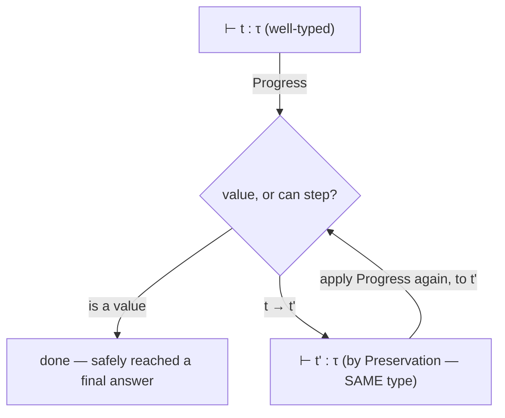

## Learning Objectives

- State the progress property precisely: a well-typed term is either already a value, or it can take at least one evaluation step.
- State the preservation property precisely: if a well-typed term takes a step, the resulting term has the SAME type as the original.
- Explain why progress and preservation TOGETHER constitute a formal proof of type safety ("well-typed programs don't get stuck"), and why neither one alone would be sufficient.
- Trace, on a small concrete example, how a term violating one of these two properties would correspond to a real, observable runtime failure.
- Connect this concept back to the stuck-term idea already introduced in the operational-semantics concept, closing the loop between semantics and type safety.

## Context & Motivation

The previous concept established static typing as catching type errors before a program runs — but stated that goal informally, as "the type checker rejects programs that would go wrong." This concept makes that informal goal mathematically precise, using exactly the small-step semantics machinery already introduced at the start of this discipline. The slogan "well-typed programs don't go wrong," often repeated casually, is not a vague aspiration — it decomposes into exactly two separate, provable properties, and this concept states both precisely and shows why proving them together is what actually delivers the guarantee.

Recall the STUCK TERM from the operational-semantics concept: a term that is not a value, and yet no evaluation rule applies to it (the canonical example was `iszero true` — `iszero` is only defined on numeric values). A stuck term represents exactly the kind of runtime failure a real language wants to prevent by construction, not merely by hoping the programmer never writes one. Progress and preservation, proved together, are precisely the formal statement that a well-typed program can NEVER reach a stuck term, no matter how many steps of evaluation it takes.

## Core Theory

### Progress

**Progress:** if `t` is a well-typed term (some type checker has assigned it a type `τ`, written `⊢ t : τ`), then either `t` is already a value, or there exists some `t'` such that `t → t'` (some evaluation rule applies, and `t` can take a step).

In plain language: progress rules out being STUCK right now. A well-typed term is never caught in the situation "not done yet, but nothing tells me what to do next" — it always either IS the final answer, or has a clear next move available.

### Preservation

**Preservation** (also called subject reduction): if `⊢ t : τ` and `t → t'`, then `⊢ t' : τ` — taking one evaluation step never changes a term's type.

In plain language: preservation rules out DRIFTING into a different, incompatible kind of value partway through evaluation. If a term was typed as "this will produce a number," every single intermediate step of its evaluation is STILL typed as "this will produce a number" — the type assigned at the start remains valid the whole way through, all the way to the final value.

### Why both together, and neither alone, deliver type safety

```text
Progress alone:      guarantees no single step gets stuck, but says NOTHING about
                      whether the type is preserved across that step — a term
                      could take a step to a WRONGLY-typed successor and progress
                      would have nothing to say about it.

Preservation alone:  guarantees type is preserved IF a step happens, but says
                      NOTHING about whether a step is even available — a term
                      could still get stuck, and preservation would have nothing
                      to say about that either.

Progress + Preservation, applied REPEATEDLY:
  t is well-typed (⊢ t : τ)
    → by Progress: t is a value, OR t → t' for some t'
    → if it stepped: by Preservation, ⊢ t' : τ  (still well-typed, same type!)
    → repeat Progress on t' : since t' is ALSO well-typed, it's either a value
      or it can step again
    → ... and so on, indefinitely

CONCLUSION: a well-typed term can NEVER get stuck, at ANY point during its
entire evaluation — type safety, proved by induction on the number of steps.
```

This inductive argument — apply Progress, then Preservation to justify applying Progress again on the result, repeated as many times as needed — is the actual mathematical content behind "well-typed programs don't go wrong." It is a real proof technique (mathematical induction, already covered in `discrete-math-logic`), applied here to a sequence of evaluation steps rather than to natural numbers.



## Worked Examples

### Example 1: Progress applied to a concrete well-typed term

```text
Term: if (iszero 0) then (succ 0) else 0
Type: Nat (assuming a type system, developed next, assigns this a "natural number" type)

Progress says: since this term is well-typed as Nat, either it's already a value
(it isn't — it's an if-expression, not a bare number) OR it can take a step.

Checking: E-If applies to its condition (iszero 0), which itself can step via
E-IsZeroZero to true. So YES — a step is available: 
  if (iszero 0) then (succ 0) else 0  →  if true then (succ 0) else 0
Progress is satisfied for this specific term, concretely, not just abstractly.
```

### Example 2: Preservation applied to the same step

```text
Before the step: if (iszero 0) then (succ 0) else 0    has type Nat
After the step:  if true then (succ 0) else 0            — what type does THIS have?

For preservation to hold, this intermediate term must ALSO have type Nat.
Checking: it's still an if-expression whose then-branch is (succ 0) : Nat and
else-branch is 0 : Nat — both branches Nat, so the whole if-expression is STILL
typed Nat, exactly matching the type before the step. Preservation holds here.
```

Notice this is precisely why the earlier concept's rejected term — `if condition then 5 else "hello"` — could never satisfy preservation even if it somehow passed initial type assignment: whichever branch executes, evaluating down to a bare `5` or a bare `"hello"`, changes what the RESULT'S type would be depending on which branch was taken, which is exactly the kind of type-changing evaluation a sound type system's typing rule for `if` (requiring both branches to match) is designed to rule out before evaluation even starts.

### Example 3: What a violation of progress would look like, concretely

```text
Term: iszero true

If some (broken) type-assignment procedure mistakenly assigned this a type
(say, Bool) DESPITE iszero being only defined on numeric values, then:
  - it is not a value
  - no evaluation rule applies to it (neither E-IsZeroZero nor E-IsZeroSucc
    matches, since true is not a numeric value at all)
  - it is STUCK

This is precisely a Progress VIOLATION — a term the (broken) checker called
well-typed, yet which cannot proceed. This is exactly why a CORRECT type system's
typing rule for iszero must require its argument to have type Nat specifically
(developed as part of the simply typed lambda calculus, next concept) — ruling
out "iszero true" from ever being assigned a type in the first place, rather
than assigning it one and then discovering, only via this proof, that doing so
would have broken progress.
```

## Common Misconceptions & Pitfalls

- **"Progress and preservation are just two names for the same basic idea."** They are genuinely separate properties, addressing separate failure modes — progress rules out getting stuck; preservation rules out silently changing type mid-evaluation. A type system could, in principle, satisfy one without the other (a broken one might), which is exactly why both must be proved, not just one.
- **"Type safety means a well-typed program always produces the CORRECT answer."** It means something narrower and more specific: a well-typed program never gets STUCK (reaches a state with no defined next step and isn't a value). It says nothing about whether the program's LOGIC is correct — a well-typed program can still compute the wrong answer for a given problem; type safety is about the absence of a specific class of failure, not about overall correctness.
- **"These properties only matter for language designers proving theorems, not for ordinary programmers."** The everyday, practical guarantee "if my program compiles [type-checks], it won't crash with a type error at runtime" that programmers in statically-typed languages rely on constantly IS progress and preservation, applied — this proof is exactly what makes that everyday trust justified rather than merely assumed.
- **"A term either satisfies progress or preservation, never both — they're mutually exclusive cases."** They are proved TOGETHER, about the SAME term, at the SAME time — Example 1 and Example 2 both concern the identical evaluation step, showing progress (a step exists) and preservation (the type is unchanged) both holding simultaneously for it.

## Summary

Progress states that a well-typed term is either a value or can take at least one evaluation step; preservation states that taking a step never changes a well-typed term's type. Proved together, by induction over however many steps a program's evaluation takes, they constitute a full formal proof of type safety: a well-typed program can never reach a stuck term — the exact failure mode a broken `iszero true` case illustrates concretely, and the exact class of failure the previous concept's static type checking exists to prevent, now made mathematically precise rather than merely described informally. This is the theoretical foundation the next concept's simply typed lambda calculus is built to actually satisfy, with explicit typing rules whose soundness is exactly the claim that progress and preservation both hold for every term the type system accepts.

## Documentation Links

- [Pierce — Types and Programming Languages, Ch. 8-9 (Typed Arithmetic Expressions, Simply Typed Lambda-Calculus)](https://www.cis.upenn.edu/~bcpierce/tapl/contents.pdf) — the canonical statement and proof technique for progress and preservation.
- [Stanford CS242 — Programming Languages](https://web.stanford.edu/class/cs242/) — covers type safety as core theoretical foundation for real language type-system design.
