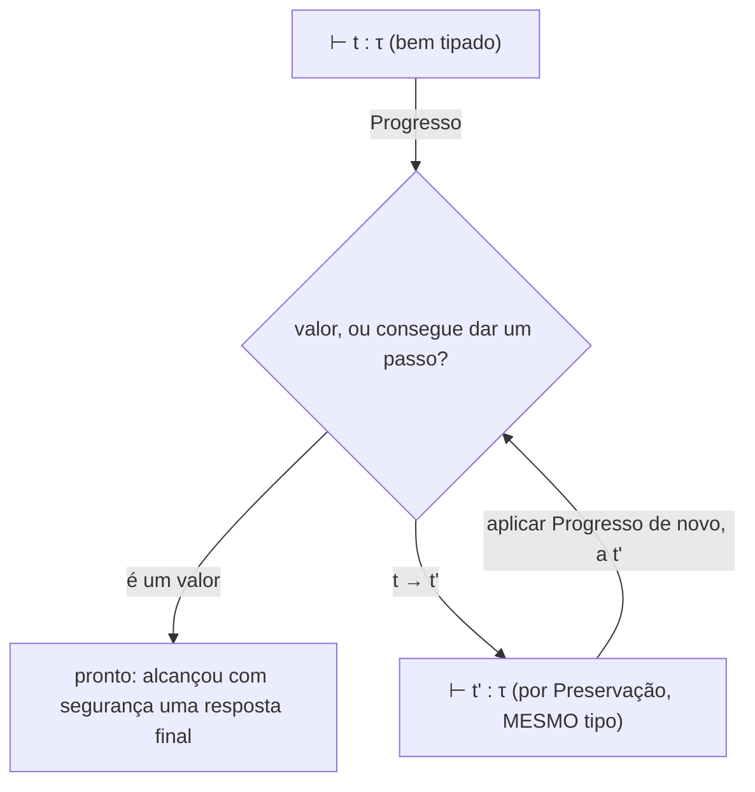

## Objetivos de Aprendizagem

- Enunciar a propriedade de progresso precisamente: um termo bem tipado ou já é um valor, ou consegue dar pelo menos um passo de avaliação.
- Enunciar a propriedade de preservação precisamente: se um termo bem tipado dá um passo, o termo resultante tem o MESMO tipo do original.
- Explicar por que progresso e preservação JUNTOS constituem uma prova formal de segurança de tipos ("programas bem tipados não ficam emperrados"), e por que nenhum dos dois sozinho seria suficiente.
- Rastrear, num pequeno exemplo concreto, como um termo violando uma destas duas propriedades corresponderia a uma falha real e observável em tempo de execução.
- Conectar este conceito de volta à ideia de termo emperrado já introduzida no conceito de semântica operacional, fechando o laço entre semântica e segurança de tipos.

## Contexto e Motivação

O conceito anterior estabeleceu a tipagem estática como pegar erros de tipo antes de um programa rodar, mas enunciou esse objetivo informalmente, como "o verificador de tipos rejeita programas que dariam errado". Este conceito torna esse objetivo informal matematicamente preciso, usando exatamente a maquinaria de semântica de passo pequeno já introduzida no início desta disciplina. O slogan "programas bem tipados não dão errado", frequentemente repetido casualmente, não é uma aspiração vaga, ele se decompõe em exatamente duas propriedades separadas e prováveis, e este conceito enuncia ambas precisamente e mostra por que prová-las juntas é o que de fato entrega a garantia.

Lembre do TERMO EMPERRADO do conceito de semântica operacional: um termo que não é um valor, e ainda assim nenhuma regra de avaliação se aplica a ele (o exemplo canônico era `iszero true`, `iszero` só é definido sobre valores numéricos). Um termo emperrado representa exatamente o tipo de falha em tempo de execução que uma linguagem real quer prevenir por construção, não meramente esperando que o programador nunca escreva um. Progresso e preservação, provadas juntas, são precisamente a declaração formal de que um programa bem tipado NUNCA consegue alcançar um termo emperrado, não importa quantos passos de avaliação ele dê.

## Teoria Central

### Progresso

**Progresso:** se `t` é um termo bem tipado (algum verificador de tipos atribuiu a ele um tipo `τ`, escrito `⊢ t : τ`), então ou `t` já é um valor, ou existe algum `t'` tal que `t → t'` (alguma regra de avaliação se aplica, e `t` consegue dar um passo).

Em linguagem simples: progresso descarta estar EMPERRADO agora mesmo. Um termo bem tipado nunca é pego na situação "ainda não pronto, mas nada me diz o que fazer em seguida", ele sempre ou É a resposta final, ou tem um próximo movimento claro disponível.

### Preservação

**Preservação** (também chamada redução do sujeito): se `⊢ t : τ` e `t → t'`, então `⊢ t' : τ`, dar um passo de avaliação nunca muda o tipo de um termo.

Em linguagem simples: preservação descarta DERIVAR para um tipo diferente e incompatível de valor no meio da avaliação. Se um termo foi tipado como "isto produzirá um número", todo único passo intermediário da sua avaliação é AINDA tipado como "isto produzirá um número", o tipo atribuído no início permanece válido por todo o caminho, até o valor final.

### Por que ambas juntas, e nenhuma sozinha, entregam segurança de tipos

```text
Progresso sozinho:    garante que nenhum passo único fica emperrado, mas NADA diz
                       sobre se o tipo é preservado por entre esse passo, um termo
                       poderia dar um passo para um sucessor ERRADAMENTE tipado e progresso
                       não teria nada a dizer sobre isso.

Preservação sozinha:  garante que o tipo é preservado SE um passo acontece, mas
                       NADA diz sobre se um passo está sequer disponível, um termo
                       ainda poderia ficar emperrado, e preservação não teria nada
                       a dizer sobre isso tampouco.

Progresso + Preservação, aplicados REPETIDAMENTE:
  t é bem tipado (⊢ t : τ)
    → por Progresso: t é um valor, OU t → t' para algum t'
    → se deu um passo: por Preservação, ⊢ t' : τ  (ainda bem tipado, mesmo tipo!)
    → repetir Progresso em t': já que t' é TAMBÉM bem tipado, ele ou é um valor
      ou consegue dar um passo de novo
    → ... e assim por diante, indefinidamente

CONCLUSÃO: um termo bem tipado NUNCA consegue ficar emperrado, em NENHUM ponto durante a sua
avaliação inteira, segurança de tipos, provada por indução sobre o número de passos.
```

Este argumento indutivo, aplicar Progresso, depois Preservação para justificar aplicar Progresso de novo sobre o resultado, repetido tantas vezes quanto necessário, é o conteúdo matemático de fato por trás de "programas bem tipados não dão errado". É uma técnica de prova real (indução matemática, já coberta em `discrete-math-logic`), aplicada aqui a uma sequência de passos de avaliação em vez de a números naturais.



## Exemplos Resolvidos

### Exemplo 1: Progresso aplicado a um termo bem tipado concreto

```text
Termo: if (iszero 0) then (succ 0) else 0
Tipo: Nat (assumindo um sistema de tipos, desenvolvido em seguida, atribui a isto um tipo "número natural")

Progresso diz: já que este termo é bem tipado como Nat, ou ele já é um valor
(não é, é uma if-expression, não um número nu) OU ele consegue dar um passo.

Checando: E-If se aplica à sua condição (iszero 0), que ela mesma consegue dar um passo via
E-IsZeroZero para true. Então SIM, um passo está disponível:
  if (iszero 0) then (succ 0) else 0  →  if true then (succ 0) else 0
Progresso é satisfeito para este termo específico, concretamente, não só abstratamente.
```

### Exemplo 2: Preservação aplicada ao mesmo passo

```text
Antes do passo: if (iszero 0) then (succ 0) else 0    tem tipo Nat
Depois do passo:  if true then (succ 0) else 0          — que tipo ISTO tem?

Para a preservação se manter, este termo intermediário tem de TAMBÉM ter tipo Nat.
Checando: ainda é uma if-expression cujo ramo then é (succ 0) : Nat e
ramo else é 0 : Nat, ambos os ramos Nat, então a if-expression inteira é AINDA
tipada Nat, correspondendo exatamente ao tipo antes do passo. Preservação se mantém aqui.
```

Repare que isto é precisamente por que o termo rejeitado do conceito anterior, `if condition then 5 else "hello"`, nunca poderia satisfazer preservação mesmo se de alguma forma passasse a atribuição inicial de tipo: qualquer que seja o ramo que executa, avaliando até um `5` nu ou um `"hello"` nu, muda qual seria o tipo do RESULTADO dependendo de qual ramo foi tomado, que é exatamente o tipo de avaliação que muda o tipo que a regra de tipagem de um sistema de tipos sólido para `if` (exigindo que ambos os ramos correspondam) é projetada para descartar antes de a avaliação sequer começar.

### Exemplo 3: Como seria uma violação de progresso, concretamente

```text
Termo: iszero true

Se algum procedimento (quebrado) de atribuição de tipo erroneamente atribuísse a isto um tipo
(digamos, Bool) APESAR de iszero ser só definido sobre valores numéricos, então:
  - ele não é um valor
  - nenhuma regra de avaliação se aplica a ele (nem E-IsZeroZero nem E-IsZeroSucc
    corresponde, já que true não é um valor numérico de forma alguma)
  - ele está EMPERRADO

Isto é precisamente uma VIOLAÇÃO de Progresso, um termo que o verificador (quebrado) chamou de
bem tipado, e ainda assim que não consegue prosseguir. Isto é exatamente por que a regra de tipagem de um
sistema de tipos CORRETO para iszero tem de exigir que o seu argumento tenha tipo Nat especificamente
(desenvolvido como parte do cálculo lambda simplesmente tipado, próximo conceito), descartando
"iszero true" de jamais receber um tipo em primeiro lugar, em vez de atribuir-lhe um e depois
descobrir, só via esta prova, que fazer isso teria quebrado progresso.
```

## Equívocos Comuns e Armadilhas

- **"Progresso e preservação são só dois nomes para a mesma ideia básica."** Elas são propriedades genuinamente separadas, enfrentando modos de falha separados, progresso descarta ficar emperrado; preservação descarta mudar silenciosamente de tipo no meio da avaliação. Um sistema de tipos poderia, em princípio, satisfazer uma sem a outra (um quebrado poderia), que é exatamente por que ambas têm de ser provadas, não só uma.
- **"Segurança de tipos significa que um programa bem tipado sempre produz a resposta CORRETA."** Ela significa algo mais estreito e mais específico: um programa bem tipado nunca fica EMPERRADO (alcança um estado sem próximo passo definido e não é um valor). Ela nada diz sobre se a LÓGICA do programa é correta, um programa bem tipado ainda pode computar a resposta errada para um dado problema; segurança de tipos é sobre a ausência de uma classe específica de falha, não sobre correção geral.
- **"Estas propriedades só importam para projetistas de linguagem provando teoremas, não para programadores comuns."** A garantia prática e cotidiana "se o meu programa compila [verifica o tipo], ele não vai travar com um erro de tipo em tempo de execução" na qual programadores em linguagens estaticamente tipadas confiam constantemente SÃO progresso e preservação, aplicadas, esta prova é exatamente o que torna essa confiança cotidiana justificada em vez de meramente assumida.
- **"Um termo ou satisfaz progresso ou preservação, nunca ambos, eles são casos mutuamente exclusivos."** Elas são provadas JUNTAS, sobre o MESMO termo, ao MESMO tempo, o Exemplo 1 e o Exemplo 2 ambos dizem respeito ao idêntico passo de avaliação, mostrando progresso (um passo existe) e preservação (o tipo é inalterado) ambos se mantendo simultaneamente para ele.

## Resumo

Progresso enuncia que um termo bem tipado ou é um valor ou consegue dar pelo menos um passo de avaliação; preservação enuncia que dar um passo nunca muda o tipo de um termo bem tipado. Provadas juntas, por indução sobre quantos passos a avaliação de um programa der, elas constituem uma prova formal completa de segurança de tipos: um programa bem tipado nunca consegue alcançar um termo emperrado, o exato modo de falha que um `iszero true` quebrado ilustra concretamente, e a exata classe de falha que a verificação de tipos estática do conceito anterior existe para prevenir, agora tornada matematicamente precisa em vez de meramente descrita informalmente. Esta é a fundação teórica que o cálculo lambda simplesmente tipado do próximo conceito é construído para de fato satisfazer, com regras de tipagem explícitas cuja solidez é exatamente a afirmação de que progresso e preservação ambos se mantêm para todo termo que o sistema de tipos aceita.

## Documentation Links

- [Pierce — Types and Programming Languages, Ch. 8-9 (Typed Arithmetic Expressions, Simply Typed Lambda-Calculus)](https://www.cis.upenn.edu/~bcpierce/tapl/contents.pdf): a declaração canônica e a técnica de prova para progresso e preservação.
- [Stanford CS242 — Programming Languages](https://web.stanford.edu/class/cs242/): cobre segurança de tipos como fundação teórica central para o design de sistema de tipos de linguagem real.
