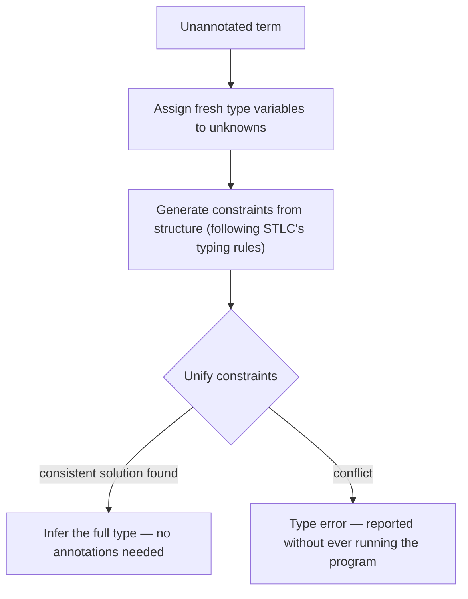

## Learning Objectives

- Explain what type inference recovers that explicit type annotations (as required by the simply typed lambda calculus so far) demand from the programmer directly.
- Generate type constraints from an unannotated term's structure, following the same shape as the STLC typing rules but with unknown type variables in place of annotations.
- Explain unification informally: solving a set of type-equality constraints by finding a substitution for unknown type variables that makes every constraint hold simultaneously.
- Trace a small, complete inference example: generate constraints for a concrete unannotated term, solve them by unification, and recover the same type a fully annotated version would have required by hand.
- State honestly what this discipline's treatment leaves out (a full, general Hindley-Milner algorithm with let-polymorphism) and why that's a reasonable scope boundary for an introductory treatment.

## Context & Motivation

The simply typed lambda calculus, as covered so far, requires every abstraction to carry an explicit type annotation: `λx:Nat. x`, never the untyped calculus's bare `λx. x`. In a language of any real size, writing out every parameter's type by hand everywhere gets tedious fast, and — more importantly — much of the time the type is entirely DETERMINABLE from how the parameter is actually used inside the function body, without a programmer needing to state it explicitly at all. Type inference is exactly the algorithmic process that recovers a term's type (or shows no consistent type exists) WITHOUT requiring every annotation to be written by hand.

The core technique behind essentially all practical type inference (used in real systems: OCaml, Haskell, and — for a more limited subset — even some of TypeScript's inference) is UNIFICATION: treat each missing type annotation as an unknown (a type VARIABLE, distinct from a program variable), generate a set of equality CONSTRAINTS between these unknowns based on how the term is structured, and then solve the resulting system of equations. This concept develops that technique on a small, complete example — deliberately NOT attempting the full generality of a real Hindley-Milner implementation (which additionally handles let-polymorphism — letting one definition be used at multiple, different types), a genuine scope boundary this discipline draws explicitly rather than glossing over.

## Core Theory

### Type variables and constraint generation

Given an unannotated term, assign a fresh TYPE VARIABLE (conventionally written `α`, `β`, `γ`, ...) to every position whose type isn't already known, then walk the term's structure generating one constraint per typing rule that would otherwise have needed an explicit annotation:

```text
Term: λx. x + 1

Assign: x : α    (unknown — no annotation given)
Since "+" requires both operands to be Nat (a fixed rule of this discipline's
Nat-arithmetic constructs, not something inference needs to discover):
  constraint:  α = Nat        (x must be Nat, since it's used as an operand of +)
Result type of the whole abstraction: α → Nat  (function from x's type to the
  result type of the body, which is Nat since "+" always produces Nat)

Substituting the solved constraint α = Nat back in:
  λx. x + 1  :  Nat → Nat
```

Notice this recovered EXACTLY the type a hand-annotated version, `λx:Nat. x + 1`, would have required the programmer to write explicitly — inference didn't invent anything new; it algorithmically DISCOVERED what the annotation would necessarily have had to say, purely from how `x` is used inside the body.

### Unification: solving a system of constraints

A more involved term generates MULTIPLE constraints, possibly relating several unknown type variables to each other, not just to a fixed known type like `Nat`. Unification is the algorithm that finds a SUBSTITUTION — an assignment of a concrete type (or another variable) to each unknown — that makes every constraint true simultaneously:

```text
Constraints:           Unification finds:
  α = β → γ              α = β → γ
  β = Nat                β = Nat
  γ = Nat                γ = Nat  (derived: since α = β → γ and β = Nat, γ must
                                   match wherever γ is also constrained elsewhere)

Substituting fully:    α = Nat → Nat
```

The general algorithm (Robinson's unification, the same core idea underlying Prolog's own unification, already covered in `programming-paradigms`'s logic-programming concept) repeatedly picks a constraint, and either directly satisfies it (both sides already identical), decomposes it (both sides are function types — unify their respective argument and result types separately), or substitutes an unknown variable throughout every remaining constraint once its value is pinned down — continuing until every constraint is resolved, or a genuine CONFLICT is found (e.g. some variable is forced to be both `Nat` and `Nat → Nat` simultaneously), which corresponds exactly to a real type error, reported without ever needing the programmer to have written an annotation in the first place.



## Worked Examples

### Example 1: Inferring the type of an unannotated identity function

```text
Term: λx. x

Assign: x : α
Body "x" has type α directly (T-Var, trivially — no constraint generated, since
nothing FORCES α to be any particular concrete type here).
Result: λx. x  :  α → α

This is a genuinely POLYMORPHIC result — α is left completely unconstrained,
meaning this function's inferred type says "works for ANY type, as long as
input and output match" — a real type-system feature (parametric polymorphism)
that this discipline's earlier STLC concept, requiring a FIXED concrete
annotation like Nat, could not express at all without this inference step.
```

### Example 2: A constraint conflict, corresponding to a genuine type error

```text
Term: λx. (x + 1) (x)          // treating x as BOTH a Nat (via +) and a function (via application)

Constraints generated:
  x : α
  "+" requires: α = Nat                (from x + 1)
  "applying x to an argument" requires: α = τ1 → τ2 for some τ1, τ2  (from x(x))

Unification must satisfy BOTH:  α = Nat   AND   α = τ1 → τ2
These cannot BOTH hold — Nat is not a function type in this grammar (τ ::= Nat | τ → τ).
CONFLICT — unification fails, and a type error is reported, entirely from
structural analysis, without ever evaluating this term even once.
```

This is precisely the same class of error the earlier, hand-derived `iszero true` rejection illustrated — but discovered here automatically, from usage alone, with no annotation ever required from the programmer.

### Example 3: Inference recovering a two-argument function's type

```text
Term: λx. λy. x + y

Assign: x : α,  y : β
"x + y" requires both operands Nat: α = Nat,  β = Nat
Result type of inner body: Nat
Result type of outer abstraction: α → (β → Nat)

Substituting: Nat → (Nat → Nat)
```

Matches exactly the type a fully hand-annotated `λx:Nat. λy:Nat. x + y` would have required — again, inference discovering, not inventing, the type that the term's structure already implied.

## Common Misconceptions & Pitfalls

- **"Type inference means a language has no type system, or a weaker one than an explicitly-annotated language."** Inference and the presence of a type system are orthogonal — an inferred type is exactly as strong a guarantee as an explicitly annotated one (Example 2's conflict is caught with exactly the same certainty as the STLC concept's hand-derived rejection); inference only changes who has to WRITE the annotation, not whether the guarantee holds.
- **"Type inference can figure out the type of literally any unannotated program."** It can only succeed when a CONSISTENT solution to the generated constraints actually exists — Example 2 shows a real, structural case where no solution exists, and unification correctly reports failure rather than guessing.
- **"This discipline's treatment covers the same territory as a full, real Hindley-Milner implementation."** It deliberately does not — genuine Hindley-Milner additionally handles LET-POLYMORPHISM (letting one `let`-bound definition be used at several DIFFERENT concrete types across different uses in the same program), a real additional complexity this introductory treatment sets aside explicitly, in favor of showing unification's core mechanism clearly on simpler examples.
- **"Unification here is a completely different algorithm from Prolog's unification, despite the shared name."** They are the SAME underlying algorithm (Robinson's unification) — solving a system of equality constraints by finding a substitution — applied to two different domains: type variables and types here, versus logical terms and variable bindings in `programming-paradigms`'s Prolog material.

## Summary

Type inference recovers a term's type without requiring every parameter to carry an explicit annotation, by assigning a fresh type variable to each unknown, generating equality constraints from how the term's structure uses each unknown (following the same shape as STLC's own typing rules), and solving those constraints via unification — the same core algorithm, Robinson's unification, that underlies Prolog's logical variable binding in `programming-paradigms`. A consistent solution recovers exactly the type a hand-annotated version would have required (Examples 1 and 3); a genuine structural conflict (Example 2) is reported as a type error with the same certainty as an explicitly-checked STLC rejection, entirely without ever running the program. This discipline's treatment deliberately stops short of full Hindley-Milner's let-polymorphism, a real additional complexity left for further study — a reasonable scope boundary for showing unification's essential mechanism clearly. The next, final area of this discipline turns from types to runtime systems: automatic memory management, picking up directly from the manual heap management already covered in `c-and-assembly`.

## Documentation Links

- [Pierce — Types and Programming Languages, Ch. 22 (Type Reconstruction)](https://www.cis.upenn.edu/~bcpierce/tapl/contents.pdf) — the canonical presentation of constraint generation and unification for type inference.
- [ACM/IEEE CS2013 — Programming Languages Knowledge Area](https://csed.acm.org/knowledge-areas-programming-languages-pl-cs2013-version/) — lists deeper Type Systems (including inference) as elective material this discipline covers.
