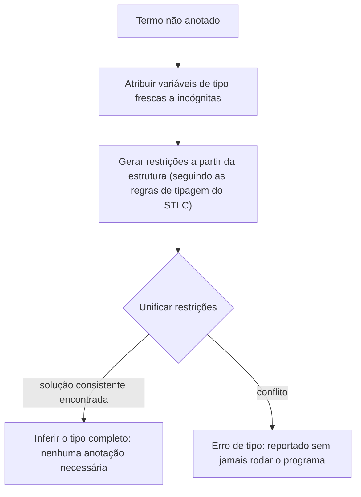

## Objetivos de Aprendizagem

- Explicar o que a inferência de tipos recupera que anotações de tipo explícitas (como exigidas pelo cálculo lambda simplesmente tipado até agora) demandam do programador diretamente.
- Gerar restrições de tipo a partir da estrutura de um termo não anotado, seguindo o mesmo formato das regras de tipagem do STLC mas com variáveis de tipo desconhecidas no lugar de anotações.
- Explicar a unificação informalmente: resolver um conjunto de restrições de igualdade de tipo encontrando uma substituição para variáveis de tipo desconhecidas que faça toda restrição se manter simultaneamente.
- Rastrear um exemplo de inferência pequeno e completo: gerar restrições para um termo não anotado concreto, resolvê-las por unificação, e recuperar o mesmo tipo que uma versão totalmente anotada teria exigido à mão.
- Enunciar honestamente o que o tratamento desta disciplina deixa de fora (um algoritmo de Hindley-Milner completo e geral com polimorfismo de let) e por que esse é um limite de escopo razoável para um tratamento introdutório.

## Contexto e Motivação

O cálculo lambda simplesmente tipado, como coberto até agora, exige que toda abstração carregue uma anotação de tipo explícita: `λx:Nat. x`, nunca o `λx. x` nu do cálculo não tipado. Numa linguagem de qualquer tamanho real, escrever o tipo de todo parâmetro à mão em todo lugar fica tedioso rápido, e, mais importante, na maior parte do tempo o tipo é inteiramente DETERMINÁVEL a partir de como o parâmetro é de fato usado dentro do corpo da função, sem um programador precisar enunciá-lo explicitamente de forma alguma. A inferência de tipos é exatamente o processo algorítmico que recupera o tipo de um termo (ou mostra que nenhum tipo consistente existe) SEM exigir que toda anotação seja escrita à mão.

A técnica central por trás de essencialmente toda inferência de tipos prática (usada em sistemas reais: OCaml, Haskell, e, para um subconjunto mais limitado, até parte da inferência de TypeScript) é a UNIFICAÇÃO: trate cada anotação de tipo faltante como uma incógnita (uma VARIÁVEL de tipo, distinta de uma variável de programa), gere um conjunto de RESTRIÇÕES de igualdade entre estas incógnitas com base em como o termo é estruturado, e então resolva o sistema de equações resultante. Este conceito desenvolve essa técnica num exemplo pequeno e completo, deliberadamente NÃO tentando a generalidade completa de uma implementação real de Hindley-Milner (que adicionalmente trata polimorfismo de let, deixar uma definição ser usada em múltiplos tipos diferentes), um limite de escopo genuíno que esta disciplina traça explicitamente em vez de encobrir.

## Teoria Central

### Variáveis de tipo e geração de restrições

Dado um termo não anotado, atribua uma VARIÁVEL DE TIPO fresca (convencionalmente escrita `α`, `β`, `γ`, ...) a toda posição cujo tipo ainda não é conhecido, depois percorra a estrutura do termo gerando uma restrição por regra de tipagem que de outra forma teria precisado de uma anotação explícita:

```text
Termo: λx. x + 1

Atribua: x : α    (desconhecido: nenhuma anotação dada)
Já que "+" exige que ambos os operandos sejam Nat (uma regra fixa dos construtos de
aritmética-Nat desta disciplina, não algo que a inferência precisa descobrir):
  restrição:  α = Nat        (x tem de ser Nat, já que é usado como um operando de +)
Tipo resultante da abstração inteira: α → Nat  (função do tipo de x para o
  tipo resultante do corpo, que é Nat já que "+" sempre produz Nat)

Substituindo a restrição resolvida α = Nat de volta:
  λx. x + 1  :  Nat → Nat
```

Repare que isto recuperou EXATAMENTE o tipo que uma versão anotada à mão, `λx:Nat. x + 1`, teria exigido que o programador escrevesse explicitamente, a inferência não inventou nada novo; ela algoritmicamente DESCOBRIU o que a anotação necessariamente teria de dizer, puramente a partir de como `x` é usado dentro do corpo.

### Unificação: resolvendo um sistema de restrições

Um termo mais envolvido gera MÚLTIPLAS restrições, possivelmente relacionando várias variáveis de tipo desconhecidas umas às outras, não só a um tipo conhecido fixo como `Nat`. A unificação é o algoritmo que encontra uma SUBSTITUIÇÃO, uma atribuição de um tipo concreto (ou outra variável) a cada incógnita, que faz toda restrição verdadeira simultaneamente:

```text
Restrições:            A unificação encontra:
  α = β → γ              α = β → γ
  β = Nat                β = Nat
  γ = Nat                γ = Nat  (derivado: já que α = β → γ e β = Nat, γ tem de
                                   corresponder onde quer que γ também seja restringido em outro lugar)

Substituindo por completo:  α = Nat → Nat
```

O algoritmo geral (unificação de Robinson, a mesma ideia central subjacente à própria unificação do Prolog, já coberta no conceito de programação lógica de `programming-paradigms`) repetidamente escolhe uma restrição, e ou a satisfaz diretamente (ambos os lados já idênticos), a decompõe (ambos os lados são tipos de função, unifique os seus respectivos tipos de argumento e resultado separadamente), ou substitui uma variável desconhecida por entre toda restrição restante uma vez que o seu valor é fixado, continuando até toda restrição ser resolvida, ou um CONFLITO genuíno ser encontrado (por exemplo, alguma variável é forçada a ser tanto `Nat` quanto `Nat → Nat` simultaneamente), que corresponde exatamente a um erro de tipo real, reportado sem jamais precisar que o programador tivesse escrito uma anotação em primeiro lugar.



## Exemplos Resolvidos

### Exemplo 1: Inferindo o tipo de uma função identidade não anotada

```text
Termo: λx. x

Atribua: x : α
O corpo "x" tem tipo α diretamente (T-Var, trivialmente, nenhuma restrição gerada, já que
nada FORÇA α a ser qualquer tipo concreto particular aqui).
Resultado: λx. x  :  α → α

Este é um resultado genuinamente POLIMÓRFICO, α é deixado completamente sem restrição,
significando que o tipo inferido desta função diz "funciona para QUALQUER tipo, desde que
entrada e saída correspondam", um recurso de sistema de tipos real (polimorfismo paramétrico)
que o conceito de STLC anterior desta disciplina, exigindo uma anotação concreta FIXA
como Nat, não conseguia expressar de forma alguma sem este passo de inferência.
```

### Exemplo 2: Um conflito de restrição, correspondendo a um erro de tipo genuíno

```text
Termo: λx. (x + 1) (x)          // tratando x como TANTO um Nat (via +) quanto uma função (via aplicação)

Restrições geradas:
  x : α
  "+" exige: α = Nat                (de x + 1)
  "aplicar x a um argumento" exige: α = τ1 → τ2 para algum τ1, τ2  (de x(x))

A unificação tem de satisfazer AMBAS:  α = Nat   E   α = τ1 → τ2
Estas não conseguem AMBAS se manter, Nat não é um tipo de função nesta gramática (τ ::= Nat | τ → τ).
CONFLITO, a unificação falha, e um erro de tipo é reportado, inteiramente a partir de
análise estrutural, sem jamais avaliar este termo sequer uma vez.
```

Esta é precisamente a mesma classe de erro que a rejeição anterior de `iszero true`, derivada à mão, ilustrou, mas descoberta aqui automaticamente, a partir do uso sozinho, sem nenhuma anotação jamais exigida do programador.

### Exemplo 3: Inferência recuperando o tipo de uma função de dois argumentos

```text
Termo: λx. λy. x + y

Atribua: x : α,  y : β
"x + y" exige ambos os operandos Nat: α = Nat,  β = Nat
Tipo resultante do corpo interno: Nat
Tipo resultante da abstração externa: α → (β → Nat)

Substituindo: Nat → (Nat → Nat)
```

Corresponde exatamente ao tipo que um `λx:Nat. λy:Nat. x + y` totalmente anotado à mão teria exigido, de novo, a inferência descobrindo, não inventando, o tipo que a estrutura do termo já implicava.

## Equívocos Comuns e Armadilhas

- **"Inferência de tipos significa que uma linguagem não tem sistema de tipos, ou um mais fraco do que uma linguagem explicitamente anotada."** Inferência e a presença de um sistema de tipos são ortogonais, um tipo inferido é exatamente uma garantia tão forte quanto um explicitamente anotado (o conflito do Exemplo 2 é pego com exatamente a mesma certeza que a rejeição derivada à mão do conceito de STLC); a inferência só muda quem tem de ESCREVER a anotação, não se a garantia se mantém.
- **"A inferência de tipos consegue descobrir o tipo de literalmente qualquer programa não anotado."** Ela só consegue ter sucesso quando uma solução CONSISTENTE para as restrições geradas de fato existe, o Exemplo 2 mostra um caso real e estrutural onde nenhuma solução existe, e a unificação corretamente reporta falha em vez de adivinhar.
- **"O tratamento desta disciplina cobre o mesmo território que uma implementação de Hindley-Milner completa e real."** Ele deliberadamente não cobre, o Hindley-Milner genuíno adicionalmente trata POLIMORFISMO DE LET (deixar uma definição ligada por `let` ser usada em vários tipos concretos DIFERENTES por entre usos diferentes no mesmo programa), uma complexidade adicional real que este tratamento introdutório põe de lado explicitamente, em favor de mostrar o mecanismo central da unificação claramente em exemplos mais simples.
- **"A unificação aqui é um algoritmo completamente diferente da unificação do Prolog, apesar do nome compartilhado."** Eles são o MESMO algoritmo subjacente (unificação de Robinson), resolver um sistema de restrições de igualdade encontrando uma substituição, aplicado a dois domínios diferentes: variáveis de tipo e tipos aqui, versus termos lógicos e ligações de variável no material de Prolog de `programming-paradigms`.

## Resumo

A inferência de tipos recupera o tipo de um termo sem exigir que todo parâmetro carregue uma anotação explícita, atribuindo uma variável de tipo fresca a cada incógnita, gerando restrições de igualdade a partir de como a estrutura do termo usa cada incógnita (seguindo o mesmo formato das próprias regras de tipagem do STLC), e resolvendo essas restrições via unificação, o mesmo algoritmo central, unificação de Robinson, que subjaz à ligação de variável lógica do Prolog em `programming-paradigms`. Uma solução consistente recupera exatamente o tipo que uma versão anotada à mão teria exigido (Exemplos 1 e 3); um conflito estrutural genuíno (Exemplo 2) é reportado como um erro de tipo com a mesma certeza que uma rejeição de STLC explicitamente verificada, inteiramente sem jamais rodar o programa. O tratamento desta disciplina deliberadamente para antes do polimorfismo de let do Hindley-Milner completo, uma complexidade adicional real deixada para estudo adicional, um limite de escopo razoável para mostrar o mecanismo essencial da unificação claramente. A próxima e final área desta disciplina volta-se dos tipos aos sistemas de tempo de execução: gerenciamento automático de memória, retomando diretamente do gerenciamento manual de heap já coberto em `c-and-assembly`.

## Documentation Links

- [Pierce — Types and Programming Languages, Ch. 22 (Type Reconstruction)](https://www.cis.upenn.edu/~bcpierce/tapl/contents.pdf): a apresentação canônica de geração de restrições e unificação para inferência de tipos.
- [ACM/IEEE CS2013 — Programming Languages Knowledge Area](https://csed.acm.org/knowledge-areas-programming-languages-pl-cs2013-version/): lista Sistemas de Tipos mais profundos (incluindo inferência) como material eletivo que esta disciplina cobre.
