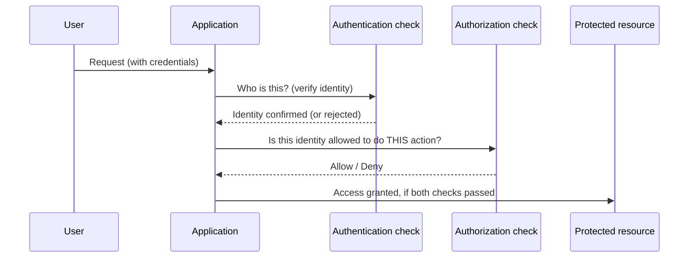

## Learning Objectives

- Define authentication and authorization precisely, and explain why conflating them is a common and consequential design mistake.
- Classify a set of concrete system behaviors as authentication failures, authorization failures, or both.
- Distinguish mandatory access control (MAC) from discretionary access control (DAC) as two different answers to who is allowed to grant permissions.
- Explain the "principle of least privilege" and why it is the default posture a well-designed authorization system should take.
- Trace how a typical web request touches both authentication and authorization as two separate, sequential checks.

## Context & Motivation

"Who are you?" and "what are you allowed to do?" sound almost like the same question, and in casual conversation about security they're often used interchangeably — but they are answered by different mechanisms, can fail independently of each other, and getting them confused is one of the most common sources of real, exploitable bugs in production systems. A system can authenticate a user perfectly (it knows exactly who is making the request) and still authorize incorrectly (it lets that correctly-identified user do something they should never be allowed to do) — and the reverse is equally possible: an authorization check can be written flawlessly against the wrong identity, because the authentication step that fed it was broken.

**Authentication** is the process of verifying that an entity is who it claims to be. A password check, a fingerprint scan, a cryptographic signature verification, and a TLS certificate check (covered later in this discipline) are all authentication mechanisms — different techniques answering the exact same question: is this really who they say they are?

**Authorization** is the process of deciding what an already-identified entity is permitted to do. A file's read/write/execute permissions, a database role that can `SELECT` but not `DELETE`, and an API key scoped to only one endpoint are all authorization mechanisms.

The ACM/IEEE CS2013 curriculum explicitly lists "authentication, authorization, access control" as a single cluster of foundational concepts precisely because they are so tightly related and so often confused in practice — a curriculum-level acknowledgment that this distinction deserves explicit, dedicated attention rather than being assumed obvious. This concept builds directly on the previous one: authentication and authorization together are the primary mechanism that decides who even gets a chance to threaten confidentiality or integrity in the first place — get either one wrong, and every cryptographic guarantee covered later in this discipline can be rendered irrelevant, because the attacker was simply let in through the front door as someone they aren't, or allowed to do something they were never supposed to do.

## Core Theory

### Authentication: verifying identity

Authentication mechanisms are conventionally grouped into three "factors":

1. **Something you know** — a password, a PIN, the answer to a security question.
2. **Something you have** — a physical hardware token, a phone receiving an SMS code, a smart card.
3. **Something you are** — a fingerprint, a face, an iris scan (biometrics).

**Multi-factor authentication (MFA)** combines two or more of these categories — not two instances of the *same* category. A password plus a security question is still single-factor in this sense (both are "something you know"), while a password plus a hardware token genuinely combines two independent factors, which is why compromising one (say, a leaked password database) doesn't automatically compromise the other.

### Authorization: deciding what's permitted

Once identity is established, authorization answers a completely separate question, and it is answered by a different kind of mechanism entirely: an **access control** system, which maps (identity, resource, action) triples to allow/deny decisions. Two broad philosophies govern who gets to define that mapping:

- **Discretionary Access Control (DAC)**: the *owner* of a resource decides who else can access it, and can change that decision at will. A user sharing a file with a specific set of collaborators, or a spreadsheet owner granting a colleague edit access, is exercising discretionary control — most personal-computing and consumer-cloud permission systems (a Unix file's owner-settable permission bits, a shared cloud document) work this way.
- **Mandatory Access Control (MAC)**: a *central policy*, not the resource owner, decides who can access what, and individual users cannot override it even if they wanted to. Military and government classification systems ("Top Secret" clearance) are the canonical example — an individual document owner cannot decide to share a Top Secret document with someone lacking that clearance, no matter how much they might want to; the policy is enforced above and independent of the owner's wishes.

The distinction matters because it changes who a security audit has to trust: under DAC, every individual resource owner is a potential point of failure (any one of them could grant access unwisely); under MAC, trust is concentrated in the central policy, which is more auditable but also less flexible.

### The principle of least privilege

A well-designed authorization system defaults every identity — human or automated — to the *minimum* set of permissions needed to do its job, and grants anything beyond that only deliberately and explicitly. This is the **principle of least privilege**, and it matters because authorization mistakes are asymmetric in their cost: granting too little access causes an inconvenient, usually quickly-noticed failure (a user complains they can't do their job); granting too much access causes a silent, often unnoticed vulnerability that may not surface until an attacker (or a compromised, over-privileged automated process) actually exploits it.



Notice the diagram's structure: authentication and authorization are drawn as two genuinely sequential, separable steps. A system that skips the second step — that assumes "if they got past login, they can do anything" — has collapsed authorization into authentication, which is exactly the class of bug the next section makes concrete.

## Worked Examples

### Example 1: Classifying failures as authentication, authorization, or both

```text
Scenario                                                  Failure type
---------------------------------------------------------  --------------------
An attacker guesses a weak password and logs in as         Authentication
  a real user.
A correctly logged-in regular user edits a URL from          Authorization
  /invoices/1002 to /invoices/1003 and views another
  customer's invoice, because the server never checks
  whose invoice it is (an "IDOR", insecure direct
  object reference).
An attacker steals a valid session cookie and replays        Authentication
  it, impersonating the original user.
A logged-in "read-only analyst" account is able to           Authorization
  successfully call an admin-only "delete all records"
  endpoint because that endpoint never checks the caller's
  role, only that they are logged in at all.
An attacker forges a JWT (a common web-authentication         Authentication
  token format) using a leaked signing key.
```

The second and fourth rows are the same underlying bug pattern, sometimes summarized as "authentication was checked, authorization was not" — the system correctly confirmed *who* the caller was, and then simply failed to check whether that identity was allowed to do what it asked. This is one of the single most common real vulnerability classes in production web applications, precisely because it's easy to write (and easy to code-review) a login check, and much easier to *forget* a separate per-action authorization check on every single endpoint.

### Example 2: DAC vs. MAC in the same organization

An engineering team uses a cloud document-sharing tool (DAC: any document's owner can invite anyone else to view or edit it) for day-to-day design documents, but the same organization's HR system enforces that salary records can only ever be viewed by a fixed, centrally-defined "HR" role, and no individual manager — regardless of whether they personally created a given record — can grant another employee access to it (MAC). The organization deliberately uses both models side by side, choosing DAC where flexibility matters more than centralized control, and MAC where a wrong access decision (an employee seeing another's salary) is unacceptable regardless of who made that decision.

### Example 3: Least privilege applied to an automated process

A backend job runs nightly to generate a sales report by reading from a `sales` table. Two designs are compared:

```text
Design A: The job runs with a database credential that has full read/write
          access to every table in the database (the same credential the
          main application server uses).
Design B: The job runs with a dedicated credential that can only run
          SELECT queries, and only against the `sales` table.

If the report-generation code has a bug (or is compromised via a supply-
chain attack in one of its dependencies):

  Design A: the bug/attacker can read or corrupt ANY table in the database.
  Design B: the bug/attacker can, at absolute worst, read the sales table —
            every other table and every write operation remains impossible.
```

Design B costs slightly more setup effort (a dedicated credential to provision and maintain) in exchange for turning a potentially catastrophic breach into a narrowly-bounded one — exactly the tradeoff the principle of least privilege asks a designer to make by default, not just when a threat is already known to be likely.

## Common Misconceptions & Pitfalls

- **"If a user is logged in, they've been authorized."** Login only establishes identity (authentication); a separate authorization check is required for every sensitive action, and skipping it — assuming "logged in" implies "allowed to do this" — is one of the most common real vulnerability classes (see Example 1's IDOR case).
- **"Multi-factor authentication means using two passwords, or a password plus a security question."** Both of those are the same factor category ("something you know") and provide much weaker protection than combining genuinely different categories, because a single class of compromise (a leaked password database, a phishing page) can defeat both simultaneously.
- **"DAC is just a worse, less secure version of MAC."** They solve different problems: DAC's flexibility is a feature, not a bug, in contexts (personal files, team documents) where the resource owner genuinely should decide who gets access; MAC's rigidity is the feature in contexts where no individual should be trusted to make that call alone.
- **"Least privilege only matters for human user accounts."** Automated processes, service accounts, and third-party integrations are just as much identities as human users are, and are in practice a more common source of over-privileged, under-audited access, because nobody experiences the day-to-day friction of an overly broad service-account permission the way a human user would notice their own excessive access.
- **"Authorization is a one-time check at login."** Authorization is properly re-checked on every sensitive action, not just once at the start of a session — a user's permissions can change mid-session (a role revoked, an account suspended), and a system that only checks authorization at login will not reflect that change until the user logs back in, if ever.

## Summary

Authentication (verifying identity — who are you?) and authorization (deciding permitted actions — what can you do?) are two distinct, sequential checks that are frequently confused, and the single most common resulting bug pattern is a system that authenticates correctly and then simply forgets to authorize a specific action, letting a correctly-identified but unauthorized user do something they shouldn't. Mandatory and discretionary access control are two different, both legitimate answers to who gets to grant permissions — central policy vs. resource owner — chosen based on how much flexibility versus centralized control a given context needs. The principle of least privilege — granting the minimum permission needed, by default, for every identity including automated ones — bounds the damage of any single mistake or compromise, which is why it is the default posture a well-designed authorization system takes rather than an optional hardening step. The next concept, threat modeling with STRIDE, gives a systematic vocabulary for reasoning about exactly which of these two checks (and others) an attacker is trying to defeat, and how.

## Documentation Links

- [ACM/IEEE CS2013 — Information Assurance and Security (Privacy and Security) Knowledge Area](https://csed.acm.org/knowledge-areas-privacy-and-security-ps-cs2013/) — lists authentication, authorization, and access control (including the MAC/DAC distinction) as core foundational concepts.
- [MIT 6.858 — Computer Systems Security (OCW, Fall 2014)](https://ocw.mit.edu/courses/6-858-computer-systems-security-fall-2014/) — covers access-control models and real authentication/authorization vulnerabilities in production systems.
