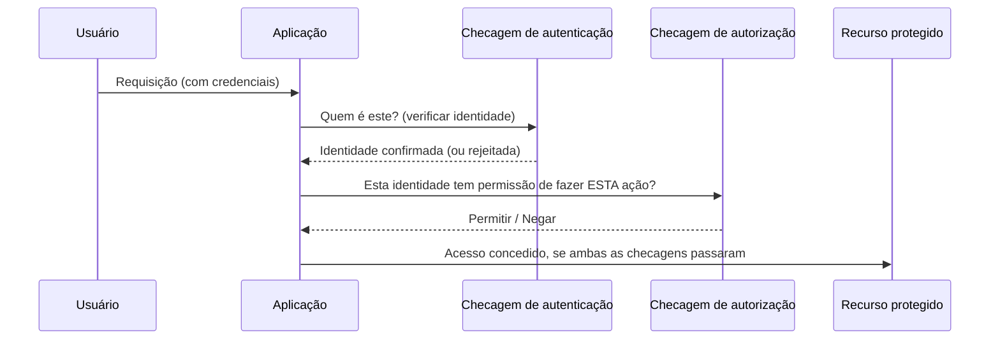

## Objetivos de Aprendizagem

- Definir autenticação e autorização precisamente, e explicar por que conflatá-las é um erro de design comum e consequente.
- Classificar um conjunto de comportamentos concretos de sistema como falhas de autenticação, falhas de autorização, ou ambos.
- Distinguir controle de acesso mandatório (MAC) de controle de acesso discricionário (DAC) como duas respostas diferentes a quem tem permissão de conceder permissões.
- Explicar o "princípio do menor privilégio" e por que ele é a postura padrão que um sistema de autorização bem projetado deveria tomar.
- Rastrear como uma requisição web típica toca tanto a autenticação quanto a autorização como duas checagens separadas e sequenciais.

## Contexto e Motivação

"Quem é você?" e "o que você tem permissão de fazer?" soam quase como a mesma pergunta, e em conversa casual sobre segurança são frequentemente usadas de forma intercambiável, mas são respondidas por mecanismos diferentes, podem falhar independentemente uma da outra, e confundi-las é uma das fontes mais comuns de bugs reais e exploráveis em sistemas de produção. Um sistema pode autenticar um usuário perfeitamente (ele sabe exatamente quem está fazendo a requisição) e ainda autorizar incorretamente (ele deixa esse usuário corretamente identificado fazer algo que nunca deveria ter permissão de fazer), e o reverso é igualmente possível: uma checagem de autorização pode ser escrita de forma impecável contra a identidade errada, porque o passo de autenticação que a alimentou estava quebrado.

**Autenticação** é o processo de verificar que uma entidade é quem ela afirma ser. Uma checagem de senha, uma varredura de impressão digital, uma verificação de assinatura criptográfica e uma checagem de certificado TLS (coberta depois nesta disciplina) são todos mecanismos de autenticação, técnicas diferentes respondendo a exata mesma pergunta: isto é realmente quem diz que é?

**Autorização** é o processo de decidir o que uma entidade já identificada tem permissão de fazer. As permissões de leitura/escrita/execução de um arquivo, um papel de banco de dados que pode fazer `SELECT` mas não `DELETE`, e uma chave de API com escopo a só um endpoint são todos mecanismos de autorização.

O currículo do ACM/IEEE CS2013 explicitamente lista "autenticação, autorização, controle de acesso" como um único agrupamento de conceitos fundamentais precisamente porque são tão estreitamente relacionados e tão frequentemente confundidos na prática, um reconhecimento de nível de currículo de que esta distinção merece atenção explícita e dedicada em vez de ser assumida óbvia. Este conceito constrói diretamente sobre o anterior: autenticação e autorização juntas são o mecanismo primário que decide quem sequer tem uma chance de ameaçar a confidencialidade ou a integridade em primeiro lugar, erre qualquer uma das duas, e toda garantia criptográfica coberta depois nesta disciplina pode ser tornada irrelevante, porque o atacante foi simplesmente deixado entrar pela porta da frente como alguém que não é, ou autorizado a fazer algo que nunca deveria.

## Teoria Central

### Autenticação: verificando identidade

Mecanismos de autenticação são convencionalmente agrupados em três "fatores":

1. **Algo que você sabe** — uma senha, um PIN, a resposta a uma pergunta de segurança.
2. **Algo que você tem** — um token de hardware físico, um telefone recebendo um código SMS, um cartão inteligente.
3. **Algo que você é** — uma impressão digital, um rosto, uma varredura de íris (biometria).

**Autenticação de múltiplos fatores (MFA)** combina dois ou mais destes grupos, não duas instâncias do *mesmo* grupo. Uma senha mais uma pergunta de segurança ainda é de fator único neste sentido (ambos são "algo que você sabe"), enquanto uma senha mais um token de hardware genuinamente combina dois fatores independentes, que é por que comprometer um (digamos, uma base de dados de senhas vazada) não compromete automaticamente o outro.

### Autorização: decidindo o que é permitido

Uma vez que a identidade é estabelecida, a autorização responde uma pergunta completamente separada, e ela é respondida por um tipo de mecanismo inteiramente diferente: um sistema de **controle de acesso**, que mapeia triplas (identidade, recurso, ação) para decisões de permitir/negar. Duas filosofias amplas governam quem tem permissão de definir esse mapeamento:

- **Controle de Acesso Discricionário (DAC)**: o *dono* de um recurso decide quem mais pode acessá-lo, e pode mudar essa decisão à vontade. Um usuário compartilhando um arquivo com um conjunto específico de colaboradores, ou o dono de uma planilha concedendo a um colega acesso de edição, está exercendo controle discricionário, a maioria dos sistemas de permissão de computação pessoal e nuvem de consumidor (os bits de permissão configuráveis pelo dono de um arquivo Unix, um documento de nuvem compartilhado) funcionam assim.
- **Controle de Acesso Mandatório (MAC)**: uma *política central*, não o dono do recurso, decide quem pode acessar o quê, e usuários individuais não conseguem sobrepô-la mesmo se quisessem. Sistemas militares e governamentais de classificação (liberação "Top Secret") são o exemplo canônico, um dono individual de documento não consegue decidir compartilhar um documento Top Secret com alguém sem aquela liberação, não importa o quanto possa querer; a política é imposta acima e independentemente dos desejos do dono.

A distinção importa porque muda em quem uma auditoria de segurança tem de confiar: sob DAC, todo dono individual de recurso é um ponto potencial de falha (qualquer um deles poderia conceder acesso de forma imprudente); sob MAC, a confiança é concentrada na política central, que é mais auditável mas também menos flexível.

### O princípio do menor privilégio

Um sistema de autorização bem projetado usa por padrão, para toda identidade, humana ou automatizada, o conjunto *mínimo* de permissões necessárias para fazer o seu trabalho, e concede qualquer coisa além disso só deliberada e explicitamente. Este é o **princípio do menor privilégio**, e ele importa porque erros de autorização são assimétricos no seu custo: conceder pouco acesso demais causa uma falha inconveniente, geralmente notada rapidamente (um usuário reclama que não consegue fazer o seu trabalho); conceder acesso demais causa uma vulnerabilidade silenciosa, frequentemente não notada, que pode não aparecer até um atacante (ou um processo automatizado comprometido e privilegiado em excesso) de fato explorá-la.



Repare na estrutura do diagrama: autenticação e autorização são desenhadas como dois passos genuinamente sequenciais e separáveis. Um sistema que pula o segundo passo, que assume "se passaram do login, podem fazer qualquer coisa", colapsou a autorização na autenticação, que é exatamente a classe de bug que a próxima seção torna concreta.

## Exemplos Resolvidos

### Exemplo 1: Classificando falhas como autenticação, autorização, ou ambos

```text
Cenário                                                   Tipo de falha
---------------------------------------------------------  --------------------
Um atacante adivinha uma senha fraca e faz login como       Autenticação
  um usuário real.
Um usuário comum corretamente logado edita uma URL de        Autorização
  /invoices/1002 para /invoices/1003 e vê a fatura de outro
  cliente, porque o servidor nunca checa de quem é a
  fatura (um "IDOR", referência direta insegura a objeto).
Um atacante rouba um cookie de sessão válido e o reproduz,   Autenticação
  personificando o usuário original.
Uma conta "analista somente-leitura" logada consegue         Autorização
  chamar com sucesso um endpoint "deletar todos os registros"
  só-admin porque esse endpoint nunca checa o papel do
  chamador, só que ele está logado de todo.
Um atacante forja um JWT (um formato comum de token           Autenticação
  de autenticação web) usando uma chave de assinatura vazada.
```

A segunda e a quarta linhas são o mesmo padrão de bug subjacente, às vezes resumido como "a autenticação foi checada, a autorização não foi", o sistema corretamente confirmou *quem* o chamador era, e então simplesmente falhou em checar se aquela identidade tinha permissão de fazer o que pediu. Esta é uma das classes de vulnerabilidade reais mais comuns em aplicações web de produção, precisamente porque é fácil escrever (e fácil revisar em code review) uma checagem de login, e muito mais fácil *esquecer* uma checagem de autorização por-ação separada em todo único endpoint.

### Exemplo 2: DAC vs. MAC na mesma organização

Uma equipe de engenharia usa uma ferramenta de compartilhamento de documentos em nuvem (DAC: o dono de qualquer documento pode convidar qualquer outra pessoa a ver ou editar) para documentos de design do dia a dia, mas o sistema de RH da mesma organização impõe que registros salariais só podem ser vistos por um papel "RH" fixo e definido centralmente, e nenhum gerente individual, independentemente de ter pessoalmente criado um dado registro, pode conceder a outro empregado acesso a ele (MAC). A organização deliberadamente usa ambos os modelos lado a lado, escolhendo DAC onde a flexibilidade importa mais do que o controle centralizado, e MAC onde uma decisão de acesso errada (um empregado vendo o salário de outro) é inaceitável independentemente de quem tomou essa decisão.

### Exemplo 3: Menor privilégio aplicado a um processo automatizado

Um job de backend roda toda noite para gerar um relatório de vendas lendo de uma tabela `sales`. Dois designs são comparados:

```text
Design A: O job roda com uma credencial de banco de dados que tem acesso completo de
          leitura/escrita a toda tabela no banco (a mesma credencial que o
          servidor de aplicação principal usa).
Design B: O job roda com uma credencial dedicada que só consegue rodar
          consultas SELECT, e só contra a tabela `sales`.

Se o código de geração de relatório tem um bug (ou é comprometido via um ataque
de cadeia de suprimentos numa das suas dependências):

  Design A: o bug/atacante consegue ler ou corromper QUALQUER tabela no banco.
  Design B: o bug/atacante consegue, no absoluto pior caso, ler a tabela sales,
            toda outra tabela e toda operação de escrita permanece impossível.
```

O Design B custa um esforço de configuração levemente maior (uma credencial dedicada a provisionar e manter) em troca de transformar uma brecha potencialmente catastrófica numa estreitamente limitada, exatamente o trade-off que o princípio do menor privilégio pede a um projetista para fazer por padrão, não só quando uma ameaça já é sabida ser provável.

## Equívocos Comuns e Armadilhas

- **"Se um usuário está logado, ele foi autorizado."** O login só estabelece identidade (autenticação); uma checagem de autorização separada é exigida para toda ação sensível, e pulá-la, assumindo que "logado" implica "com permissão de fazer isto", é uma das classes de vulnerabilidade reais mais comuns (veja o caso de IDOR do Exemplo 1).
- **"Autenticação de múltiplos fatores significa usar duas senhas, ou uma senha mais uma pergunta de segurança."** Ambos são o mesmo grupo de fator ("algo que você sabe") e fornecem proteção muito mais fraca do que combinar grupos genuinamente diferentes, porque uma única classe de comprometimento (uma base de dados de senhas vazada, uma página de phishing) pode derrotar ambos simultaneamente.
- **"DAC é só uma versão pior e menos segura de MAC."** Eles resolvem problemas diferentes: a flexibilidade do DAC é um recurso, não um bug, em contextos (arquivos pessoais, documentos de equipe) onde o dono do recurso genuinamente deveria decidir quem obtém acesso; a rigidez do MAC é o recurso em contextos onde nenhum indivíduo deveria ser confiado a tomar essa decisão sozinho.
- **"Menor privilégio só importa para contas de usuário humano."** Processos automatizados, contas de serviço e integrações de terceiros são tão identidades quanto usuários humanos são, e são na prática uma fonte mais comum de acesso privilegiado em excesso e sub-auditado, porque ninguém experimenta o atrito do dia a dia de uma permissão de conta de serviço ampla demais da forma que um usuário humano notaria o seu próprio acesso excessivo.
- **"Autorização é uma checagem única no login."** A autorização é apropriadamente rechecada em toda ação sensível, não só uma vez no início de uma sessão, as permissões de um usuário podem mudar no meio da sessão (um papel revogado, uma conta suspensa), e um sistema que só checa autorização no login não refletirá essa mudança até o usuário logar de novo, se é que faz.

## Resumo

Autenticação (verificar identidade, quem é você?) e autorização (decidir ações permitidas, o que você pode fazer?) são duas checagens distintas e sequenciais que são frequentemente confundidas, e o padrão de bug resultante mais comum é um sistema que autentica corretamente e então simplesmente esquece de autorizar uma ação específica, deixando um usuário corretamente identificado mas não autorizado fazer algo que não deveria. Controle de acesso mandatório e discricionário são duas respostas diferentes, ambas legítimas, a quem tem permissão de conceder permissões, política central vs. dono do recurso, escolhidas com base em quanta flexibilidade versus controle centralizado um dado contexto precisa. O princípio do menor privilégio, conceder a permissão mínima necessária, por padrão, para toda identidade incluindo as automatizadas, limita o dano de qualquer engano ou comprometimento único, que é por que é a postura padrão que um sistema de autorização bem projetado toma em vez de um passo de endurecimento opcional. O próximo conceito, modelagem de ameaças com STRIDE, dá um vocabulário sistemático para raciocinar sobre exatamente qual destas duas checagens (e outras) um atacante está tentando derrotar, e como.

## Documentation Links

- [ACM/IEEE CS2013 — Information Assurance and Security (Privacy and Security) Knowledge Area](https://csed.acm.org/knowledge-areas-privacy-and-security-ps-cs2013/): lista autenticação, autorização e controle de acesso (incluindo a distinção MAC/DAC) como conceitos fundamentais centrais.
- [MIT 6.858 — Computer Systems Security (OCW, Fall 2014)](https://ocw.mit.edu/courses/6-858-computer-systems-security-fall-2014/): cobre modelos de controle de acesso e vulnerabilidades reais de autenticação/autorização em sistemas de produção.
