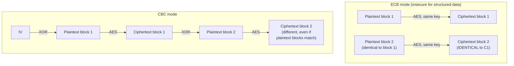

## Learning Objectives

- Distinguish a block cipher from a mode of operation, and explain why the two are separate, independently-chosen pieces of any real symmetric encryption scheme.
- Describe AES at the level of what it promises (a keyed, invertible permutation on fixed-size blocks), without needing to derive its internal round structure.
- Explain, with a concrete visual example, exactly why ECB mode leaks plaintext structure, and why that failure is a property of the mode, not of AES itself.
- Describe CBC and CTR modes at the level of their chaining/counter construction, and explain what property each one adds that ECB lacks.
- State why a mode of operation typically requires an IV or nonce, and what goes wrong if that value is reused.

## Context & Motivation

The one-time pad proved that perfect secrecy is achievable, but at a key-management cost that makes it impractical for essentially any real system. Every practical symmetric cipher in use today, AES foremost among them, deliberately gives up perfect secrecy in exchange for a much shorter, reusable key — accepting a weaker, *computational* security guarantee: not "unbreakable by any computer," but "unbreakable by any attacker with a realistic amount of computing power, given current mathematical understanding." This is the central engineering tradeoff of applied cryptography, and it is worth stating plainly rather than treating as an unexplained compromise: a 256-bit AES key is a fixed, small, reusable piece of secret data, not a random string as long as every message ever sent under it — and that difference alone is what makes real, practical encrypted communication possible at all.

**AES (the Advanced Encryption Standard)**, standardized by NIST in FIPS 197 after an open, multi-year public competition, is the block cipher nearly every modern system uses. But AES alone only defines how to encrypt exactly one 128-bit block — real messages are almost never exactly 128 bits long. The separate, additional question of how to encrypt a message of *arbitrary* length using a cipher that only knows how to handle one fixed-size block at a time is answered by a **mode of operation**, and — this is the point this concept exists to make unmistakably clear — a correctly-implemented block cipher combined with a poorly-chosen mode of operation can still catastrophically fail to protect confidentiality, even though the cipher itself has no flaw at all.

## Core Theory

### What a block cipher promises

A block cipher is a keyed, invertible transformation on fixed-size blocks: given a key `k` and a plaintext block `p` of a fixed size (128 bits, for AES), it produces a ciphertext block `c` of the same size, and given the same key and `c`, it recovers `p` exactly. Crucially, this transformation should behave, to anyone without the key, like a genuinely random permutation of that fixed-size block space — indistinguishable from random, given only oracle access to encrypt/decrypt under the unknown key. AES achieves this (as far as decades of intense public cryptanalysis have been able to determine — no full, practical break of AES itself is known) through multiple internal rounds of substitution and permutation operations, standardized precisely, byte-for-byte, in FIPS 197, with three key sizes (AES-128, AES-192, AES-256) trading a larger key for a larger security margin against future advances in cryptanalysis or in computing power (such as, eventually, large-scale quantum computers).

This discipline treats AES's internal round structure as outside its scope — the standard itself, and the security proof behind it, are the subject of dedicated cryptography courses — and instead focuses on what matters for using it correctly: AES is a black box that, given a 128-bit key (or 192- or 256-bit) and a 128-bit block, produces an indistinguishable-from-random 128-bit output, invertibly.

### The separate problem: encrypting more than one block

A mode of operation specifies how to apply a block cipher repeatedly to encrypt a message longer than one block. The naive approach — split the message into 128-bit blocks and encrypt each one independently under the same key — is called **ECB (Electronic Codebook)** mode, and it has a severe, structural flaw that has nothing to do with any weakness in AES itself: **identical plaintext blocks always produce identical ciphertext blocks**, because the same key applied to the same input always produces the same output. Any structure or repetition present in the plaintext — a repeated pattern, large regions of a single value, the block-level structure of an image — survives directly, visibly, into the ciphertext.

**CBC (Cipher Block Chaining)** mode fixes this by XOR-ing each plaintext block with the *previous ciphertext block* before encrypting it, so that identical plaintext blocks no longer produce identical ciphertext (because each block's encryption now depends on everything that came before it in the message):

```text
c₀ = AES_encrypt(k, p₀ ⊕ IV)
c₁ = AES_encrypt(k, p₁ ⊕ c₀)
c₂ = AES_encrypt(k, p₂ ⊕ c₁)
  ... and so on, chaining forward
```

The **IV (initialization vector)**, a random or unique value used only for the very first block, ensures that even encrypting the exact same message twice under the same key produces a completely different ciphertext each time — without it, the first block would suffer the exact same identical-input-identical-output problem ECB has, for every message that happens to start with the same plaintext.

**CTR (Counter)** mode takes a different approach entirely: rather than chaining encryption of the plaintext blocks, it encrypts a counter value (starting from a nonce and incrementing for each block) and XORs that keystream against the plaintext — structurally very similar to the one-time pad from the previous concept, but with the keystream generated from a short key and counter via AES rather than needing to be truly random and message-length. This makes CTR mode parallelizable (any block can be encrypted or decrypted independently, since the counter values are all computable in advance) and turns AES into something functionally like a stream cipher.



### Why nonce/IV reuse is dangerous

Both CBC's IV and CTR's nonce exist to prevent the exact identical-input problem ECB has at the level of the whole message, not just individual blocks within it. Reusing a nonce in CTR mode is especially catastrophic and structurally identical to reusing a one-time-pad key (the previous concept): the same keystream block gets XORed against two different plaintext blocks, and XOR-ing the two resulting ciphertexts cancels the keystream exactly as it canceled the one-time-pad key, recovering the XOR of the two plaintexts directly. This is not a hypothetical concern — nonce reuse has caused real, exploited vulnerabilities in deployed systems, which is exactly why modern authenticated modes (covered two concepts from now) are designed to make correct nonce handling as close to foolproof as the API can make it.

## Worked Examples

### Example 1: The "ECB penguin" — visualizing why ECB leaks structure

Consider encrypting a bitmap image, block by block, under ECB mode. A large solid-color region of the image (say, the background) consists of many identical 128-bit blocks of pixel data. Under ECB, every one of those identical plaintext blocks encrypts to the exact same ciphertext block:

```text
Plaintext image:  [background][background][background][penguin outline][background]...
ECB ciphertext:   [X........ ][X........ ][X........ ][Y..............][X........ ]...
                   ^ identical blocks produce identical ciphertext blocks

Result: the OUTLINE of the penguin (or any structured image) remains
clearly visible in the "encrypted" output, because block-level repetition
in the plaintext survives directly into block-level repetition in the
ciphertext.
```

This is a real, widely-cited illustration (informally called "the ECB penguin," after a famous demonstration using an image of a penguin logo) precisely because it makes the abstract claim "ECB leaks structure" immediately, visually undeniable — no cryptanalysis is even required to see that something is badly wrong with the confidentiality of an ECB-encrypted image.

### Example 2: Tracing a CBC encryption of a short, repeating message

Encrypt the message `"AA" "AA" "BB"` (three identical-length blocks, two of them identical) under CBC with IV = `V₀`:

```text
Block 0 ("AA"): c₀ = AES_encrypt(k, "AA" ⊕ V₀)
Block 1 ("AA"): c₁ = AES_encrypt(k, "AA" ⊕ c₀)    -- NOT the same input as block 0's
                                                       AES call, because it's XORed
                                                       with c₀, not V₀
Block 2 ("BB"): c₂ = AES_encrypt(k, "BB" ⊕ c₁)

Even though plaintext blocks 0 and 1 are IDENTICAL ("AA" == "AA"), c₀ ≠ c₁,
because block 1's AES input was XORed with c₀ (which depends on V₀ and the
key), not with V₀ directly. The chaining is exactly what breaks ECB's
identical-input-identical-output problem.
```

### Example 3: Why reusing a CTR nonce is as catastrophic as reusing a one-time-pad key

```text
Message 1, block 0: c₁ = m₁ ⊕ AES_encrypt(k, nonce || counter=0)
Message 2, block 0: c₂ = m₂ ⊕ AES_encrypt(k, nonce || counter=0)   -- SAME nonce, reused!

c₁ ⊕ c₂ = (m₁ ⊕ keystream) ⊕ (m₂ ⊕ keystream) = m₁ ⊕ m₂

The keystream (AES_encrypt(k, nonce || counter=0), identical in both cases
because the nonce and counter are identical) cancels out completely — the
attacker recovers m₁ ⊕ m₂ without ever learning the key, exactly as in the
one-time-pad reuse attack from the previous concept.
```

This example is placed deliberately alongside the one-time-pad reuse attack: the underlying algebra (`c₁ ⊕ c₂ = m₁ ⊕ m₂` whenever the exact same keystream is used twice) is identical in both cases, which is the whole point — the lesson from the simplest possible cipher transfers directly and exactly to a mode built on the strongest standardized block cipher available.

## Common Misconceptions & Pitfalls

- **"If AES is used, the data is safely encrypted."** AES only defines the transformation of a single block; the mode of operation determines the security of the overall scheme for messages of realistic length, and a poor mode choice (ECB) can leak substantial structure even with a perfectly secure underlying cipher, as the ECB penguin example shows directly.
- **"ECB is just a slightly weaker version of CBC, fine for non-image data."** ECB's identical-block-identical-output flaw applies to any structured data with repeated blocks, not only images — repeated headers, padding, or common substrings in text or structured records can all leak the same way; ECB should essentially never be used for messages longer than one block.
- **"An IV or nonce needs to be kept secret, like a key."** An IV/nonce for CBC or CTR is typically transmitted in the clear alongside the ciphertext — its role is uniqueness (and unpredictability, for CBC's IV specifically), not secrecy; what must never happen is *reuse* of the same nonce with the same key, not disclosure of the nonce's value.
- **"CTR mode is inherently less secure than CBC because it's 'just XOR.'** CTR mode is a well-analyzed, standard, widely-deployed mode precisely because turning a block cipher into a keystream generator via a counter is a sound construction, given a never-reused nonce — its parallelizability is a genuine practical advantage over CBC's inherently sequential chaining.
- **"A mode of operation alone is enough for a secure encrypted channel."** None of the modes covered here (ECB, CBC, CTR) provide any integrity guarantee — an attacker who cannot read the plaintext may still be able to flip bits in the ciphertext and cause predictable, sometimes exploitable changes in the decrypted plaintext, which is exactly the gap message authentication codes and authenticated encryption (two concepts ahead) are built to close.

## Summary

A block cipher (AES, standardized in NIST FIPS 197) and a mode of operation are two separate, independently chosen pieces of any real symmetric encryption scheme: AES defines a secure, keyed, invertible transformation on a single fixed-size block, while the mode defines how to apply that transformation across an entire message of arbitrary length. ECB mode, the naive choice, encrypts each block independently and thereby leaks identical-plaintext-block structure directly into the ciphertext — vividly illustrated by the "ECB penguin" — which is exactly why it should essentially never be used. CBC mode fixes this by chaining each block's encryption to the previous ciphertext block via XOR, starting from a random IV; CTR mode instead turns the block cipher into a keystream generator over a nonce-plus-counter, structurally similar to the one-time pad but with a short, reusable key. Both modes depend critically on never reusing an IV or nonce under the same key — doing so reproduces, exactly, the catastrophic `c₁ ⊕ c₂ = m₁ ⊕ m₂` break already proven for one-time-pad key reuse. None of these modes alone protect integrity, which sets up the next several concepts: cryptographic hash functions, then message authentication and authenticated encryption, which close that gap.

## Documentation Links

- [NIST FIPS 197 — Advanced Encryption Standard (AES)](https://csrc.nist.gov/pubs/fips/197/final) — the official standard specifying AES itself.
- [Stanford CS255 — Introduction to Cryptography, Course Syllabus](https://cs255.stanford.edu/syllabus.html) — covers block ciphers, PRPs/PRFs, and modes of operation in exactly this sequence.
